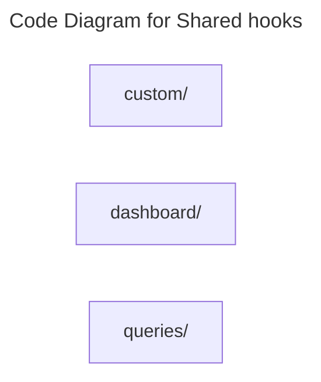

# C4 Code Level: Shared hooks

## Overview

- **Name**: Shared hooks
- **Description**: Shared hooks React hooks and stateful helper logic.
- **Location**: [src/shared/hooks](../../../src/shared/hooks)
- **Language**: Directory aggregator (no direct source files)
- **Purpose**: Share reusable shared hooks interaction and data-fetching behavior across components.

## Code Elements

### Subdirectories

- [src/shared/hooks/custom](./c4-code-src-shared-hooks-custom.md) - Hooks custom React hooks and stateful helper logic.
- [src/shared/hooks/dashboard](./c4-code-src-shared-hooks-dashboard.md) - Hooks dashboard React hooks and stateful helper logic.
- [src/shared/hooks/queries](./c4-code-src-shared-hooks-queries.md) - Hooks queries React hooks and stateful helper logic.

### Functions/Methods

- No direct top-level functions or methods are defined in files at this directory level.

### Classes/Modules

- This directory is primarily an organizational boundary for child directories rather than a direct source module location.

## Dependencies

### Internal Dependencies

- src/shared/hooks/custom (child module boundary)
- src/shared/hooks/dashboard (child module boundary)
- src/shared/hooks/queries (child module boundary)

### External Dependencies

- None captured from direct file imports in this directory.

## Relationships

