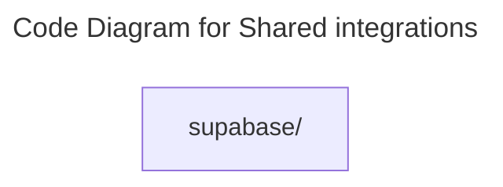

# C4 Code Level: Shared integrations

## Overview

- **Name**: Shared integrations
- **Description**: Shared integrations modules for the TrafficMENA codebase.
- **Location**: [src/shared/integrations](../../../src/shared/integrations)
- **Language**: Directory aggregator (no direct source files)
- **Purpose**: Organize the shared integrations responsibilities used by the application.

## Code Elements

### Subdirectories

- [src/shared/integrations/supabase](./c4-code-src-shared-integrations-supabase.md) - Supabase modules for the TrafficMENA codebase.

### Functions/Methods

- No direct top-level functions or methods are defined in files at this directory level.

### Classes/Modules

- This directory is primarily an organizational boundary for child directories rather than a direct source module location.

## Dependencies

### Internal Dependencies

- src/shared/integrations/supabase (child module boundary)

### External Dependencies

- None captured from direct file imports in this directory.

## Relationships

