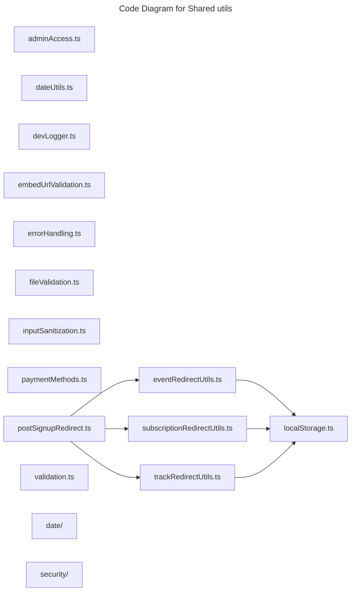

# C4 Code Level: Shared utils

## Overview

- **Name**: Shared utils
- **Description**: Shared utils utility helpers.
- **Location**: [src/shared/utils](../../../src/shared/utils)
- **Language**: TypeScript
- **Purpose**: Provide shared shared utils helpers that keep higher-level modules concise.

## Code Elements

### Subdirectories

- [src/shared/utils/date](./c4-code-src-shared-utils-date.md) - Date utility helpers.
- [src/shared/utils/security](./c4-code-src-shared-utils-security.md) - Security utility helpers.

### Functions/Methods

- `getAdminDashboardPath(role: UserRole): string`
  - Description: Returns admin dashboard path derived from current inputs or state.
  - Location: [src/shared/utils/adminAccess.ts](../../../src/shared/utils/adminAccess.ts) (line 3)
  - Dependencies: @/shared/hooks/custom/useRolePermissions
- `formatMeetupDate(dateString: string): string`
  - Description: Formats meetup date for presentation or transport.
  - Location: [src/shared/utils/dateUtils.ts](../../../src/shared/utils/dateUtils.ts) (line 4)
  - Dependencies: None
- `formatLongDate(dateString: string): string`
  - Description: Formats long date for presentation or transport.
  - Location: [src/shared/utils/dateUtils.ts](../../../src/shared/utils/dateUtils.ts) (line 25)
  - Dependencies: None
- `formatShortDate(dateString: string): string`
  - Description: Formats short date for presentation or transport.
  - Location: [src/shared/utils/dateUtils.ts](../../../src/shared/utils/dateUtils.ts) (line 38)
  - Dependencies: None
- `formatCardDate(dateString: string): string`
  - Description: Formats card date for presentation or transport.
  - Location: [src/shared/utils/dateUtils.ts](../../../src/shared/utils/dateUtils.ts) (line 52)
  - Dependencies: None
- `formatTime(dateString: string): string`
  - Description: Formats time for presentation or transport.
  - Location: [src/shared/utils/dateUtils.ts](../../../src/shared/utils/dateUtils.ts) (line 64)
  - Dependencies: None
- `formatDateWithDay(dateString: string): string`
  - Description: Formats date with day for presentation or transport.
  - Location: [src/shared/utils/dateUtils.ts](../../../src/shared/utils/dateUtils.ts) (line 77)
  - Dependencies: None
- `toCairoDatetimeLocal(input: string | Date | undefined): string`
  - Description: Implements to cairo datetime local behavior for this module.
  - Location: [src/shared/utils/dateUtils.ts](../../../src/shared/utils/dateUtils.ts) (line 92)
  - Dependencies: None
- `getCairoOffsetString(): string`
  - Description: Returns cairo offset string derived from current inputs or state.
  - Location: [src/shared/utils/dateUtils.ts](../../../src/shared/utils/dateUtils.ts) (line 108)
  - Dependencies: None
- `isUpcoming(dateString: string): boolean`
  - Description: Checks whether upcoming.
  - Location: [src/shared/utils/dateUtils.ts](../../../src/shared/utils/dateUtils.ts) (line 119)
  - Dependencies: None
- `createDevLogger(prefix?: string): unknown`
  - Description: Creates dev logger for downstream use.
  - Location: [src/shared/utils/devLogger.ts](../../../src/shared/utils/devLogger.ts) (line 94)
  - Dependencies: None
- `validateEmbedUrl(url: string): EmbedUrlValidationResult`
  - Description: Validates embed url against module rules.
  - Location: [src/shared/utils/embedUrlValidation.ts](../../../src/shared/utils/embedUrlValidation.ts) (line 69)
  - Dependencies: None
- `determineEmbedType(url: URL): EmbedUrlValidationResult['embedType']`
  - Description: Implements determine embed type behavior for this module.
  - Location: [src/shared/utils/embedUrlValidation.ts](../../../src/shared/utils/embedUrlValidation.ts) (line 172)
  - Dependencies: None
- `validateEmbedTypeSpecific(url: URL, embedType: NonNullable<EmbedUrlValidationResult['embedType']>): { errors: string[]; warnings: string[] }`
  - Description: Validates embed type specific against module rules.
  - Location: [src/shared/utils/embedUrlValidation.ts](../../../src/shared/utils/embedUrlValidation.ts) (line 188)
  - Dependencies: None
- `sanitizeEmbedUrl(url: URL, embedType: NonNullable<EmbedUrlValidationResult['embedType']>): string`
  - Description: Implements sanitize embed url behavior for this module.
  - Location: [src/shared/utils/embedUrlValidation.ts](../../../src/shared/utils/embedUrlValidation.ts) (line 253)
  - Dependencies: None
- `getSecureIframeAttributes(url: string, embedType: NonNullable<EmbedUrlValidationResult['embedType']>): Record<string, any>`
  - Description: Returns secure iframe attributes derived from current inputs or state.
  - Location: [src/shared/utils/embedUrlValidation.ts](../../../src/shared/utils/embedUrlValidation.ts) (line 327)
  - Dependencies: None
- `validateMultipleEmbedUrls(urls: string[]): EmbedUrlValidationResult[]`
  - Description: Validates multiple embed urls against module rules.
  - Location: [src/shared/utils/embedUrlValidation.ts](../../../src/shared/utils/embedUrlValidation.ts) (line 379)
  - Dependencies: None
- `isEmbedUrlSafeToRender(url: string): boolean`
  - Description: Checks whether embed url safe to render.
  - Location: [src/shared/utils/embedUrlValidation.ts](../../../src/shared/utils/embedUrlValidation.ts) (line 386)
  - Dependencies: None
- `createAppError(message: string, code?: string, details?: unknown): AppError`
  - Description: Creates app error for downstream use.
  - Location: [src/shared/utils/errorHandling.ts](../../../src/shared/utils/errorHandling.ts) (line 11)
  - Dependencies: @/types, react
- `extractPromiseResult(result: PromiseSettledResult<any>, operationName: string): PromiseResult<T>`
  - Description: Implements extract promise result behavior for this module.
  - Location: [src/shared/utils/errorHandling.ts](../../../src/shared/utils/errorHandling.ts) (line 20)
  - Dependencies: @/types, react
- `handlePromiseResults(results: PromiseSettledResult<any>[], operationNames: string[]): {
  data: Partial<T>;
  errors: string[];
  hasErrors: boolean;
  partialSuccess: boolean;
}`
  - Description: Implements handle promise results behavior for this module.
  - Location: [src/shared/utils/errorHandling.ts](../../../src/shared/utils/errorHandling.ts) (line 51)
  - Dependencies: @/types, react
- `handleSupabaseError(error: unknown): AppError`
  - Description: Implements handle supabase error behavior for this module.
  - Location: [src/shared/utils/errorHandling.ts](../../../src/shared/utils/errorHandling.ts) (line 85)
  - Dependencies: @/types, react
- `getFriendlyErrorMessage(error: AppError): string`
  - Description: Returns friendly error message derived from current inputs or state.
  - Location: [src/shared/utils/errorHandling.ts](../../../src/shared/utils/errorHandling.ts) (line 125)
  - Dependencies: @/types, react
- `useErrorHandler(): unknown`
  - Description: React hook that manages error handler behavior.
  - Location: [src/shared/utils/errorHandling.ts](../../../src/shared/utils/errorHandling.ts) (line 155)
  - Dependencies: @/types, react
- `storePendingEventContext(eventContext: Omit<PendingEventContext, 'timestamp'>): boolean`
  - Description: Implements store pending event context behavior for this module.
  - Location: [src/shared/utils/eventRedirectUtils.ts](../../../src/shared/utils/eventRedirectUtils.ts) (line 23)
  - Dependencies: ./localStorage
- `getPendingEventContext(): PendingEventContext | null`
  - Description: Returns pending event context derived from current inputs or state.
  - Location: [src/shared/utils/eventRedirectUtils.ts](../../../src/shared/utils/eventRedirectUtils.ts) (line 38)
  - Dependencies: ./localStorage
- `clearPendingEventContext(): boolean`
  - Description: Implements clear pending event context behavior for this module.
  - Location: [src/shared/utils/eventRedirectUtils.ts](../../../src/shared/utils/eventRedirectUtils.ts) (line 59)
  - Dependencies: ./localStorage
- `hasPendingEventContext(): boolean`
  - Description: Checks whether the current context has pending event context.
  - Location: [src/shared/utils/eventRedirectUtils.ts](../../../src/shared/utils/eventRedirectUtils.ts) (line 67)
  - Dependencies: ./localStorage
- `generateEventSignupUrl(eventId: string): string`
  - Description: Implements generate event signup url behavior for this module.
  - Location: [src/shared/utils/eventRedirectUtils.ts](../../../src/shared/utils/eventRedirectUtils.ts) (line 74)
  - Dependencies: ./localStorage
- `generateEventRedirectUrl(eventId: string): string`
  - Description: Implements generate event redirect url behavior for this module.
  - Location: [src/shared/utils/eventRedirectUtils.ts](../../../src/shared/utils/eventRedirectUtils.ts) (line 81)
  - Dependencies: ./localStorage
- `parseEventSignupParams(searchParams: URLSearchParams): { isFromEvent: boolean; eventId?: string }`
  - Description: Parses event signup params into a normalized form.
  - Location: [src/shared/utils/eventRedirectUtils.ts](../../../src/shared/utils/eventRedirectUtils.ts) (line 88)
  - Dependencies: ./localStorage
- `validateFile(file: File, options: FileValidationOptions = {}): FileValidationResult`
  - Description: Validates file against module rules.
  - Location: [src/shared/utils/fileValidation.ts](../../../src/shared/utils/fileValidation.ts) (line 90)
  - Dependencies: None
- `validateFiles(files: FileList | File[], options: FileValidationOptions = {}): FileValidationResult`
  - Description: Validates files against module rules.
  - Location: [src/shared/utils/fileValidation.ts](../../../src/shared/utils/fileValidation.ts) (line 173)
  - Dependencies: None
- `async scanFileContent(file: File): Promise<FileValidationResult>`
  - Description: Implements scan file content behavior for this module.
  - Location: [src/shared/utils/fileValidation.ts](../../../src/shared/utils/fileValidation.ts) (line 212)
  - Dependencies: None
- `getFileExtension(filename: string): string`
  - Description: Returns file extension derived from current inputs or state.
  - Location: [src/shared/utils/fileValidation.ts](../../../src/shared/utils/fileValidation.ts) (line 364)
  - Dependencies: None
- `formatFileSize(bytes: number): string`
  - Description: Formats file size for presentation or transport.
  - Location: [src/shared/utils/fileValidation.ts](../../../src/shared/utils/fileValidation.ts) (line 372)
  - Dependencies: None
- `bytesStartWith(bytes: Uint8Array, signature: number[]): boolean`
  - Description: Implements bytes start with behavior for this module.
  - Location: [src/shared/utils/fileValidation.ts](../../../src/shared/utils/fileValidation.ts) (line 388)
  - Dependencies: None
- `sanitizeFilename(filename: string): string`
  - Description: Implements sanitize filename behavior for this module.
  - Location: [src/shared/utils/fileValidation.ts](../../../src/shared/utils/fileValidation.ts) (line 401)
  - Dependencies: None
- `validateAndSanitizeSkillName(input: string): ValidationResult`
  - Description: Validates and sanitize skill name against module rules.
  - Location: [src/shared/utils/inputSanitization.ts](../../../src/shared/utils/inputSanitization.ts) (line 12)
  - Dependencies: None
- `sanitizeText(input: string, maxLength: number = 1000): ValidationResult`
  - Description: Implements sanitize text behavior for this module.
  - Location: [src/shared/utils/inputSanitization.ts](../../../src/shared/utils/inputSanitization.ts) (line 85)
  - Dependencies: None
- `sanitizeSearchQuery(input: string): ValidationResult`
  - Description: Implements sanitize search query behavior for this module.
  - Location: [src/shared/utils/inputSanitization.ts](../../../src/shared/utils/inputSanitization.ts) (line 117)
  - Dependencies: None
- `stripHtmlTags(input: string): string`
  - Description: Implements strip html tags behavior for this module.
  - Location: [src/shared/utils/inputSanitization.ts](../../../src/shared/utils/inputSanitization.ts) (line 186)
  - Dependencies: None
- `isLocalStorageAvailable(): boolean`
  - Description: Checks whether local storage available.
  - Location: [src/shared/utils/localStorage.ts](../../../src/shared/utils/localStorage.ts) (line 16)
  - Dependencies: None
- `setLocalStorageItem(key: string, value: T): StorageResult<void>`
  - Description: Implements set local storage item behavior for this module.
  - Location: [src/shared/utils/localStorage.ts](../../../src/shared/utils/localStorage.ts) (line 30)
  - Dependencies: None
- `getLocalStorageItem(key: string, defaultValue?: T): StorageResult<T>`
  - Description: Returns local storage item derived from current inputs or state.
  - Location: [src/shared/utils/localStorage.ts](../../../src/shared/utils/localStorage.ts) (line 66)
  - Dependencies: None
- `removeLocalStorageItem(key: string): StorageResult<void>`
  - Description: Implements remove local storage item behavior for this module.
  - Location: [src/shared/utils/localStorage.ts](../../../src/shared/utils/localStorage.ts) (line 108)
  - Dependencies: None
- `clearLocalStorage(): StorageResult<void>`
  - Description: Implements clear local storage behavior for this module.
  - Location: [src/shared/utils/localStorage.ts](../../../src/shared/utils/localStorage.ts) (line 136)
  - Dependencies: None
- `normalizePaymentMethodName(value: string | undefined | null): unknown`
  - Description: Implements normalize payment method name behavior for this module.
  - Location: [src/shared/utils/paymentMethods.ts](../../../src/shared/utils/paymentMethods.ts) (line 5)
  - Dependencies: @/app/api/payments
- `isOfflinePaymentMethod(method: PaymentMethod | null | undefined): unknown`
  - Description: Checks whether offline payment method.
  - Location: [src/shared/utils/paymentMethods.ts](../../../src/shared/utils/paymentMethods.ts) (line 8)
  - Dependencies: @/app/api/payments
- `shouldRedirectToGateway(method: PaymentMethod | null | undefined): unknown`
  - Description: Implements should redirect to gateway behavior for this module.
  - Location: [src/shared/utils/paymentMethods.ts](../../../src/shared/utils/paymentMethods.ts) (line 14)
  - Dependencies: @/app/api/payments
- `getPostSignupRedirectUrl(): string`
  - Description: Returns post signup redirect url derived from current inputs or state.
  - Location: [src/shared/utils/postSignupRedirect.ts](../../../src/shared/utils/postSignupRedirect.ts) (line 29)
  - Dependencies: ./eventRedirectUtils, ./subscriptionRedirectUtils, ./trackRedirectUtils
- `storePendingSubscriptionContext(returnUrl: string): boolean`
  - Description: Implements store pending subscription context behavior for this module.
  - Location: [src/shared/utils/subscriptionRedirectUtils.ts](../../../src/shared/utils/subscriptionRedirectUtils.ts) (line 19)
  - Dependencies: ./localStorage
- `getPendingSubscriptionContext(): PendingSubscriptionContext | null`
  - Description: Returns pending subscription context derived from current inputs or state.
  - Location: [src/shared/utils/subscriptionRedirectUtils.ts](../../../src/shared/utils/subscriptionRedirectUtils.ts) (line 32)
  - Dependencies: ./localStorage
- `clearPendingSubscriptionContext(): boolean`
  - Description: Implements clear pending subscription context behavior for this module.
  - Location: [src/shared/utils/subscriptionRedirectUtils.ts](../../../src/shared/utils/subscriptionRedirectUtils.ts) (line 53)
  - Dependencies: ./localStorage
- `hasPendingSubscriptionContext(): boolean`
  - Description: Checks whether the current context has pending subscription context.
  - Location: [src/shared/utils/subscriptionRedirectUtils.ts](../../../src/shared/utils/subscriptionRedirectUtils.ts) (line 61)
  - Dependencies: ./localStorage
- `generateSubscriptionSignupUrl(): string`
  - Description: Implements generate subscription signup url behavior for this module.
  - Location: [src/shared/utils/subscriptionRedirectUtils.ts](../../../src/shared/utils/subscriptionRedirectUtils.ts) (line 68)
  - Dependencies: ./localStorage
- `parseSubscriptionSignupParams(searchParams: URLSearchParams): { isFromSubscription: boolean }`
  - Description: Parses subscription signup params into a normalized form.
  - Location: [src/shared/utils/subscriptionRedirectUtils.ts](../../../src/shared/utils/subscriptionRedirectUtils.ts) (line 75)
  - Dependencies: ./localStorage
- `storePendingTrackContext(trackContext: Omit<PendingTrackContext, 'timestamp'>): boolean`
  - Description: Implements store pending track context behavior for this module.
  - Location: [src/shared/utils/trackRedirectUtils.ts](../../../src/shared/utils/trackRedirectUtils.ts) (line 22)
  - Dependencies: ./localStorage
- `getPendingTrackContext(): PendingTrackContext | null`
  - Description: Returns pending track context derived from current inputs or state.
  - Location: [src/shared/utils/trackRedirectUtils.ts](../../../src/shared/utils/trackRedirectUtils.ts) (line 37)
  - Dependencies: ./localStorage
- `clearPendingTrackContext(): boolean`
  - Description: Implements clear pending track context behavior for this module.
  - Location: [src/shared/utils/trackRedirectUtils.ts](../../../src/shared/utils/trackRedirectUtils.ts) (line 58)
  - Dependencies: ./localStorage
- `hasPendingTrackContext(): boolean`
  - Description: Checks whether the current context has pending track context.
  - Location: [src/shared/utils/trackRedirectUtils.ts](../../../src/shared/utils/trackRedirectUtils.ts) (line 66)
  - Dependencies: ./localStorage
- `generateTrackRedirectUrl(trackId: string): string`
  - Description: Implements generate track redirect url behavior for this module.
  - Location: [src/shared/utils/trackRedirectUtils.ts](../../../src/shared/utils/trackRedirectUtils.ts) (line 73)
  - Dependencies: ./localStorage
- `sanitizeText(input: string): string`
  - Description: Implements sanitize text behavior for this module.
  - Location: [src/shared/utils/validation.ts](../../../src/shared/utils/validation.ts) (line 21)
  - Dependencies: None
- `validateEventData(data: Record<string, unknown>): ValidationResult`
  - Description: Validates event data against module rules.
  - Location: [src/shared/utils/validation.ts](../../../src/shared/utils/validation.ts) (line 43)
  - Dependencies: None
- `validateLibraryAssetData(data: Record<string, unknown>): ValidationResult`
  - Description: Validates library asset data against module rules.
  - Location: [src/shared/utils/validation.ts](../../../src/shared/utils/validation.ts) (line 116)
  - Dependencies: None
- `validateEmail(email: string): boolean`
  - Description: Validates email against module rules.
  - Location: [src/shared/utils/validation.ts](../../../src/shared/utils/validation.ts) (line 153)
  - Dependencies: None
- `validateURL(url: string): boolean`
  - Description: Validates url against module rules.
  - Location: [src/shared/utils/validation.ts](../../../src/shared/utils/validation.ts) (line 161)
  - Dependencies: None

### Classes/Modules

- `DevLogger`
  - Description: Class that encapsulates dev logger behavior and related methods.
  - Location: [src/shared/utils/devLogger.ts](../../../src/shared/utils/devLogger.ts) (line 17)
  - Methods: `log(...args: any[]): unknown`, `warn(...args: any[]): unknown`, `error(...args: any[]): unknown`, `group(label?: string): unknown`, `groupEnd(): unknown`, `table(data: any): unknown`, `time(label: string): unknown`, `timeEnd(label: string): unknown`
  - Dependencies: None

- `adminAccess.ts`
  - Description: Module that implements admin access responsibilities for this directory.
  - Location: [src/shared/utils/adminAccess.ts](../../../src/shared/utils/adminAccess.ts)
  - Contains: 1 function(s)
  - Dependencies: @/shared/hooks/custom/useRolePermissions
- `dateUtils.ts`
  - Description: Module that implements date utils responsibilities for this directory.
  - Location: [src/shared/utils/dateUtils.ts](../../../src/shared/utils/dateUtils.ts)
  - Contains: 9 function(s)
  - Dependencies: None
- `devLogger.ts`
  - Description: Module that implements dev logger responsibilities for this directory.
  - Location: [src/shared/utils/devLogger.ts](../../../src/shared/utils/devLogger.ts)
  - Contains: 1 function(s), 1 class(es)
  - Dependencies: None
- `embedUrlValidation.ts`
  - Description: Module that implements embed url validation responsibilities for this directory.
  - Location: [src/shared/utils/embedUrlValidation.ts](../../../src/shared/utils/embedUrlValidation.ts)
  - Contains: 7 function(s)
  - Dependencies: None
- `errorHandling.ts`
  - Description: Module that implements error handling responsibilities for this directory.
  - Location: [src/shared/utils/errorHandling.ts](../../../src/shared/utils/errorHandling.ts)
  - Contains: 6 function(s)
  - Dependencies: @/types, react
- `eventRedirectUtils.ts`
  - Description: Module that implements event redirect utils responsibilities for this directory.
  - Location: [src/shared/utils/eventRedirectUtils.ts](../../../src/shared/utils/eventRedirectUtils.ts)
  - Contains: 7 function(s)
  - Dependencies: ./localStorage
- `fileValidation.ts`
  - Description: Module that implements file validation responsibilities for this directory.
  - Location: [src/shared/utils/fileValidation.ts](../../../src/shared/utils/fileValidation.ts)
  - Contains: 7 function(s)
  - Dependencies: None
- `inputSanitization.ts`
  - Description: Module that implements input sanitization responsibilities for this directory.
  - Location: [src/shared/utils/inputSanitization.ts](../../../src/shared/utils/inputSanitization.ts)
  - Contains: 4 function(s)
  - Dependencies: None
- `localStorage.ts`
  - Description: Module that implements local storage responsibilities for this directory.
  - Location: [src/shared/utils/localStorage.ts](../../../src/shared/utils/localStorage.ts)
  - Contains: 5 function(s)
  - Dependencies: None
- `paymentMethods.ts`
  - Description: Module that implements payment methods responsibilities for this directory.
  - Location: [src/shared/utils/paymentMethods.ts](../../../src/shared/utils/paymentMethods.ts)
  - Contains: 3 function(s)
  - Dependencies: @/app/api/payments
- `postSignupRedirect.ts`
  - Description: Module that implements post signup redirect responsibilities for this directory.
  - Location: [src/shared/utils/postSignupRedirect.ts](../../../src/shared/utils/postSignupRedirect.ts)
  - Contains: 1 function(s)
  - Dependencies: ./eventRedirectUtils, ./subscriptionRedirectUtils, ./trackRedirectUtils
- `subscriptionRedirectUtils.ts`
  - Description: Module that implements subscription redirect utils responsibilities for this directory.
  - Location: [src/shared/utils/subscriptionRedirectUtils.ts](../../../src/shared/utils/subscriptionRedirectUtils.ts)
  - Contains: 6 function(s)
  - Dependencies: ./localStorage
- `trackRedirectUtils.ts`
  - Description: Module that implements track redirect utils responsibilities for this directory.
  - Location: [src/shared/utils/trackRedirectUtils.ts](../../../src/shared/utils/trackRedirectUtils.ts)
  - Contains: 5 function(s)
  - Dependencies: ./localStorage
- `validation.ts`
  - Description: Module that implements validation responsibilities for this directory.
  - Location: [src/shared/utils/validation.ts](../../../src/shared/utils/validation.ts)
  - Contains: 5 function(s)
  - Dependencies: None

## Dependencies

### Internal Dependencies

- ./eventRedirectUtils
- ./localStorage
- ./subscriptionRedirectUtils
- ./trackRedirectUtils
- @/app/api/payments
- @/shared/hooks/custom/useRolePermissions
- @/types
- src/shared/utils/date (child module boundary)
- src/shared/utils/security (child module boundary)

### External Dependencies

- react

## Relationships

