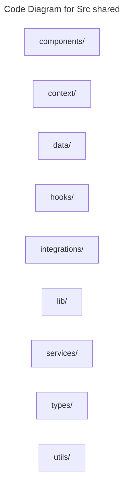

# C4 Code Level: Src shared

## Overview

- **Name**: Src shared
- **Description**: Src shared modules for the TrafficMENA codebase.
- **Location**: [src/shared](../../../src/shared)
- **Language**: Directory aggregator (no direct source files)
- **Purpose**: Organize the src shared responsibilities used by the application.

## Code Elements

### Subdirectories

- [src/shared/components](./c4-code-src-shared-components.md) - Shared components React component modules.
- [src/shared/context](./c4-code-src-shared-context.md) - Cross-cutting React context providers and hooks used throughout the frontend.
- [src/shared/data](./c4-code-src-shared-data.md) - Shared data modules for the TrafficMENA codebase.
- [src/shared/hooks](./c4-code-src-shared-hooks.md) - Shared hooks React hooks and stateful helper logic.
- [src/shared/integrations](./c4-code-src-shared-integrations.md) - Shared integrations modules for the TrafficMENA codebase.
- [src/shared/lib](./c4-code-src-shared-lib.md) - Shared lib modules for the TrafficMENA codebase.
- [src/shared/services](./c4-code-src-shared-services.md) - Shared services service modules and external provider integrations.
- [src/shared/types](./c4-code-src-shared-types.md) - Shared types TypeScript type definitions.
- [src/shared/utils](./c4-code-src-shared-utils.md) - Shared utils utility helpers.

### Functions/Methods

- No direct top-level functions or methods are defined in files at this directory level.

### Classes/Modules

- This directory is primarily an organizational boundary for child directories rather than a direct source module location.

## Dependencies

### Internal Dependencies

- src/shared/components (child module boundary)
- src/shared/context (child module boundary)
- src/shared/data (child module boundary)
- src/shared/hooks (child module boundary)
- src/shared/integrations (child module boundary)
- src/shared/lib (child module boundary)
- src/shared/services (child module boundary)
- src/shared/types (child module boundary)
- src/shared/utils (child module boundary)

### External Dependencies

- None captured from direct file imports in this directory.

## Relationships

