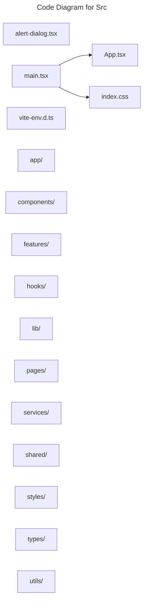

# C4 Code Level: Src

## Overview

- **Name**: Src
- **Description**: Src modules for the TrafficMENA codebase.
- **Location**: [src](../../../src)
- **Language**: CSS/SCSS, TypeScript
- **Purpose**: Organize the src responsibilities used by the application.

## Code Elements

### Subdirectories

- [src/app](./c4-code-src-app.md) - Src app modules for the TrafficMENA codebase.
- [src/components](./c4-code-src-components.md) - Src components React component modules.
- [src/features](./c4-code-src-features.md) - Src features modules for the TrafficMENA codebase.
- [src/hooks](./c4-code-src-hooks.md) - Src hooks React hooks and stateful helper logic.
- [src/lib](./c4-code-src-lib.md) - Src lib modules for the TrafficMENA codebase.
- [src/pages](./c4-code-src-pages.md) - Route-level screens composing the public site, dashboard, signup wizard, payment states, and admin views.
- [src/services](./c4-code-src-services.md) - Src services service modules and external provider integrations.
- [src/shared](./c4-code-src-shared.md) - Src shared modules for the TrafficMENA codebase.
- [src/styles](./c4-code-src-styles.md) - Src styles modules for the TrafficMENA codebase.
- [src/types](./c4-code-src-types.md) - Src types TypeScript type definitions.
- [src/utils](./c4-code-src-utils.md) - Src utils utility helpers.

### Functions/Methods

- `AlertDialogHeader({ className, ...props }: React.HTMLAttributes<HTMLDivElement>): unknown`
  - Description: Implements alert dialog header behavior for this module.
  - Location: [src/alert-dialog.tsx](../../../src/alert-dialog.tsx) (line 45)
  - Dependencies: @/shared/components/ui/button, @/shared/lib/utils, @radix-ui/react-alert-dialog, react
- `AlertDialogFooter({ className, ...props }: React.HTMLAttributes<HTMLDivElement>): unknown`
  - Description: Implements alert dialog footer behavior for this module.
  - Location: [src/alert-dialog.tsx](../../../src/alert-dialog.tsx) (line 50)
  - Dependencies: @/shared/components/ui/button, @/shared/lib/utils, @radix-ui/react-alert-dialog, react
- `App(): unknown`
  - Description: Implements app behavior for this module.
  - Location: [src/App.tsx](../../../src/App.tsx) (line 93)
  - Dependencies: ./pages/Index, ./pages/SignIn, @/features/events/pages/EventDetail, @/features/events/pages/Meetups, @/features/tracks/pages/TrackDetail, @/shared/components/ErrorBoundary, @/shared/components/LoadingSpinner, @/shared/components/layout/AdminProtectedRoute, @/shared/components/layout/ProtectedRoute, @/shared/components/layout/SignUpGuard, @/shared/components/layout/SignUpLayout, @/shared/components/ui/sonner, @/shared/components/ui/toaster, @/shared/components/ui/tooltip, @/shared/context/AuthContext, @tanstack/react-query, react, react-router-dom

### Classes/Modules

- `alert-dialog.tsx`
  - Description: Module that implements alert dialog responsibilities for this directory.
  - Location: [src/alert-dialog.tsx](../../../src/alert-dialog.tsx)
  - Contains: 2 function(s)
  - Dependencies: @/shared/components/ui/button, @/shared/lib/utils, @radix-ui/react-alert-dialog, react
- `App.css`
  - Description: Style module that provides visual rules for sibling components.
  - Location: [src/App.css](../../../src/App.css)
  - Contains: module-level configuration or data
  - Dependencies: None
- `App.tsx`
  - Description: Module that implements app responsibilities for this directory.
  - Location: [src/App.tsx](../../../src/App.tsx)
  - Contains: 1 function(s)
  - Dependencies: ./pages/Index, ./pages/SignIn, @/features/events/pages/EventDetail, @/features/events/pages/Meetups, @/features/tracks/pages/TrackDetail, @/shared/components/ErrorBoundary, @/shared/components/LoadingSpinner, @/shared/components/layout/AdminProtectedRoute, @/shared/components/layout/ProtectedRoute, @/shared/components/layout/SignUpGuard, @/shared/components/layout/SignUpLayout, @/shared/components/ui/sonner, @/shared/components/ui/toaster, @/shared/components/ui/tooltip, @/shared/context/AuthContext, @tanstack/react-query, react, react-router-dom
- `index.css`
  - Description: Style module that provides visual rules for sibling components.
  - Location: [src/index.css](../../../src/index.css)
  - Contains: module-level configuration or data
  - Dependencies: None
- `main.tsx`
  - Description: Module that implements main responsibilities for this directory.
  - Location: [src/main.tsx](../../../src/main.tsx)
  - Contains: module-level configuration or data
  - Dependencies: ./App.tsx, ./index.css, react-dom/client
- `vite-env.d.ts`
  - Description: Module that implements vite env.d responsibilities for this directory.
  - Location: [src/vite-env.d.ts](../../../src/vite-env.d.ts)
  - Contains: module-level configuration or data
  - Dependencies: None

## Dependencies

### Internal Dependencies

- ./App.tsx
- ./index.css
- ./pages/Index
- ./pages/SignIn
- @/features/events/pages/EventDetail
- @/features/events/pages/Meetups
- @/features/tracks/pages/TrackDetail
- @/shared/components/ErrorBoundary
- @/shared/components/LoadingSpinner
- @/shared/components/layout/AdminProtectedRoute
- @/shared/components/layout/ProtectedRoute
- @/shared/components/layout/SignUpGuard
- @/shared/components/layout/SignUpLayout
- @/shared/components/ui/button
- @/shared/components/ui/sonner
- @/shared/components/ui/toaster
- @/shared/components/ui/tooltip
- @/shared/context/AuthContext
- @/shared/lib/utils
- src/app (child module boundary)
- src/components (child module boundary)
- src/features (child module boundary)
- src/hooks (child module boundary)
- src/lib (child module boundary)
- src/pages (child module boundary)
- src/services (child module boundary)
- src/shared (child module boundary)
- src/styles (child module boundary)
- src/types (child module boundary)
- src/utils (child module boundary)

### External Dependencies

- @radix-ui/react-alert-dialog
- @tanstack/react-query
- react
- react-dom/client
- react-router-dom

## Relationships

