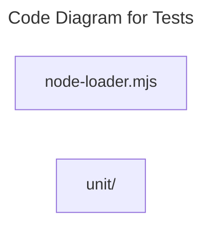

# C4 Code Level: Tests

## Overview

- **Name**: Tests
- **Description**: Tests automated test modules.
- **Location**: [tests](../../../tests)
- **Language**: JavaScript
- **Purpose**: Validate tests behavior and guard against regressions.

## Code Elements

### Subdirectories

- [tests/unit](./c4-code-tests-unit.md) - Node test runner specifications covering backend behavior, business rules, routing, and regression scenarios.

### Functions/Methods

- `isRelativeSpecifier(value): unknown`
  - Description: Checks whether relative specifier.
  - Location: [tests/node-loader.mjs](../../../tests/node-loader.mjs) (line 3)
  - Dependencies: node:path
- `async tryResolve(specifier, context, nextResolve): unknown`
  - Description: Implements try resolve behavior for this module.
  - Location: [tests/node-loader.mjs](../../../tests/node-loader.mjs) (line 6)
  - Dependencies: node:path
- `async resolve(specifier, context, nextResolve): unknown`
  - Description: Implements resolve behavior for this module.
  - Location: [tests/node-loader.mjs](../../../tests/node-loader.mjs) (line 14)
  - Dependencies: node:path

### Classes/Modules

- `node-loader.mjs`
  - Description: Module that implements node loader responsibilities for this directory.
  - Location: [tests/node-loader.mjs](../../../tests/node-loader.mjs)
  - Contains: 3 function(s)
  - Dependencies: node:path

## Dependencies

### Internal Dependencies

- tests/unit (child module boundary)

### External Dependencies

- node:path

## Relationships

