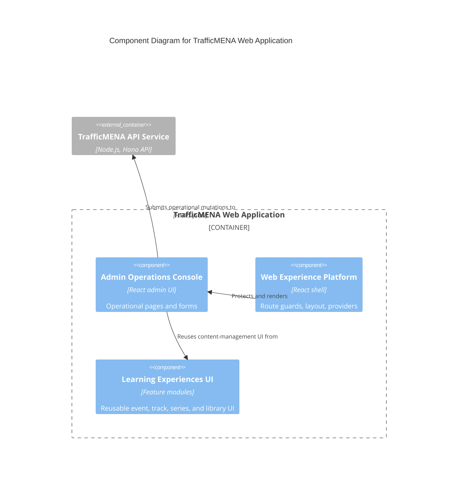

# C4 Component Level: Admin Operations Console

## Overview

- **Name**: Admin Operations Console
- **Description**: The browser-based operational workspace for content, users, invitations, settings, promo codes, and platform metrics.
- **Type**: Application
- **Technology**: React 18, TypeScript, React Router, TanStack Query, Tailwind CSS

## Purpose

This component gives staff a single operational surface for managing the TrafficMENA platform. It combines dashboards, forms, selectors, and protected pages for administering users, content, invites, settings, and promotional campaigns.

## Software Features

- Admin dashboard entrypoints for users, invitations, settings, promo codes, and content library management.
- Event, track, series, and library authoring forms with staff-only route guards.
- Invitation workflows and operational metrics surfaces for launch and curated onboarding.
- Administrative detail pages for reviewing content and platform state.
- Manual track enrollment manager (`TrackManualEnrollmentManager`) on the admin track detail page for enrolling a learner into a published track with a reason, reference, and optional paid amount, and for revoking existing enrollments.
- Subscription grant managers (single, revoke, bulk CSV) and series grant manager (single, revoke, bulk CSV) for provisioning access outside of a purchase flow.
- Subscription settings card (annual price, subscriber discount percent) and premium-content gating controls.

## Code Elements

This component contains the following code-level elements:

- [c4-code-src-pages-admin.md](../code/c4-code-src-pages-admin.md) - Top-level admin routes and admin page composition.
- [c4-code-src-pages-admin-components.md](../code/c4-code-src-pages-admin-components.md) - Reusable settings cards and admin widgets.
- [c4-code-src-pages-admin-invitations.md](../code/c4-code-src-pages-admin-invitations.md) - Invitation dashboard routes.
- [c4-code-src-pages-admin-library.md](../code/c4-code-src-pages-admin-library.md) - Admin library entrypoints.
- [c4-code-src-pages-admin-library-series.md](../code/c4-code-src-pages-admin-library-series.md) - Staff series management pages.
- [c4-code-src-pages-admin-library-tracks.md](../code/c4-code-src-pages-admin-library-tracks.md) - Staff track management pages.
- [c4-code-src-features-events-pages-admin.md](../code/c4-code-src-features-events-pages-admin.md) - Event creation and editing screens.
- [c4-code-src-features-events-pages.md](../code/c4-code-src-features-events-pages.md) - Shared event page modules that also include admin detail views.
- [c4-code-src-features-tracks-pages.md](../code/c4-code-src-features-tracks-pages.md) - Shared track page modules that also include admin detail views.

## Interfaces

### Admin Route Surface

- **Protocol**: Browser navigation
- **Description**: Staff-only pages protected by admin and manager route guards.
- **Operations**:
  - `/admin`, `/admin/users`, `/admin/invitations`
  - `/admin/library`, `/admin/library/:id`
  - `/admin/library/tracks/new`, `/admin/library/tracks/:id`
  - `/admin/library/series/new`, `/admin/library/series/:id`
  - `/admin/settings`, `/admin/promo-codes`

### Operational Form Surface

- **Protocol**: In-process React component API
- **Description**: Staff-facing forms and selectors used to mutate content and platform settings.
- **Operations**:
  - `AdminEventForm`
  - `TrackForm`
  - `SeriesForm`
  - `LibraryAssetForm`
  - `SubscriptionSettingsCard`
  - `TrackManualEnrollmentManager` (`src/features/tracks/components/TrackManualEnrollmentManager.tsx`) + `useTrackEnrollmentManagement` hook + `manualEnrollmentAmount` utility
  - `SubscriptionGrantManager` and CSV bulk counterparts
  - `SeriesAccessManager` / `SeriesGrantManager` (`src/features/series/components/`) for per-series access administration

## Dependencies

### Components Used

- [c4-component-web-experience-platform.md](./c4-component-web-experience-platform.md): Supplies admin route guards, layout primitives, and shared providers.
- [c4-component-learning-experiences-ui.md](./c4-component-learning-experiences-ui.md): Reuses event, track, library, and series feature pieces inside staff screens.
- [c4-component-membership-and-checkout-ui.md](./c4-component-membership-and-checkout-ui.md): Shares price and promo UI where needed.

### External Systems

- TrafficMENA API Service: Receives admin mutations for users, settings, invites, content, uploads, and metrics.

## Component Diagram

