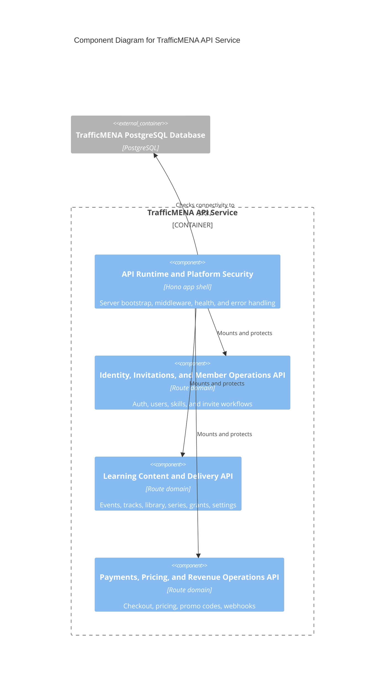

# C4 Component Level: API Runtime and Platform Security

## Overview

- **Name**: API Runtime and Platform Security
- **Description**: The Hono application shell that bootstraps middleware, security headers, health endpoints, payload limits, and route mounting.
- **Type**: Service
- **Technology**: Node.js 20, Hono, TypeScript, Zod

## Purpose

This component turns the backend codebase into a running HTTP service. It owns environment parsing, server startup, CORS and CSP enforcement, CSRF protection, request logging/timing, health checks, and the shared error envelope applied to all API domains.

## Software Features

- Startup-time environment validation and database connectivity checks.
- Secure middleware stack for CSP, CORS, HSTS, request timing, and payload-size enforcement.
- Shared health endpoints for liveness and database reachability.
- Mount point for authenticated `/api` routes and consistent error responses.

## Code Elements

This component contains the following code-level elements:

- [c4-code-server-src.md](../code/c4-code-server-src.md) - Server bootstrap entrypoints and top-level startup behavior.
- [c4-code-server-src-config.md](../code/c4-code-server-src-config.md) - Environment validation and runtime request-limit configuration.
- [c4-code-server-src-routes.md](../code/c4-code-server-src-routes.md) - Health route registration and route grouping into `/api`.
- [c4-code-server-src-utils.md](../code/c4-code-server-src-utils.md) - Shared CSRF, session, booking, invoice-status, and error helpers.

## Interfaces

### Health and Diagnostics Endpoints

- **Protocol**: REST/JSON
- **Description**: Liveness and database connectivity probes exposed by the running Hono service.
- **Operations**:
  - `GET /`
  - `GET /health`
  - `GET /api/health`
  - `GET /db/health`

### Middleware and Routing Surface

- **Protocol**: In-process service API
- **Description**: Server bootstrap functions that construct and expose the HTTP application.
- **Operations**:
  - `createApp(): Hono`
  - `registerHealthRoutes(app: Hono): void`
  - `registerApiRoutes(app: Hono): void`

## Dependencies

### Components Used

- [c4-component-identity-invitations-and-member-operations-api.md](./c4-component-identity-invitations-and-member-operations-api.md): Mounted as one of the domain route groups behind the secure middleware stack.
- [c4-component-learning-content-and-delivery-api.md](./c4-component-learning-content-and-delivery-api.md): Mounted as the core learning/content API domain.
- [c4-component-payments-pricing-and-revenue-operations-api.md](./c4-component-payments-pricing-and-revenue-operations-api.md): Mounted as the commerce and payment route domain.
- [c4-component-persistence-and-background-operations.md](./c4-component-persistence-and-background-operations.md): Supplies database connections and runtime jobs.

### External Systems

- PostgreSQL database: Checked at startup and on `/db/health`.
- Reverse proxy / edge web server: Deployment is inferred from README guidance rather than repository-managed IaC.

## Component Diagram

