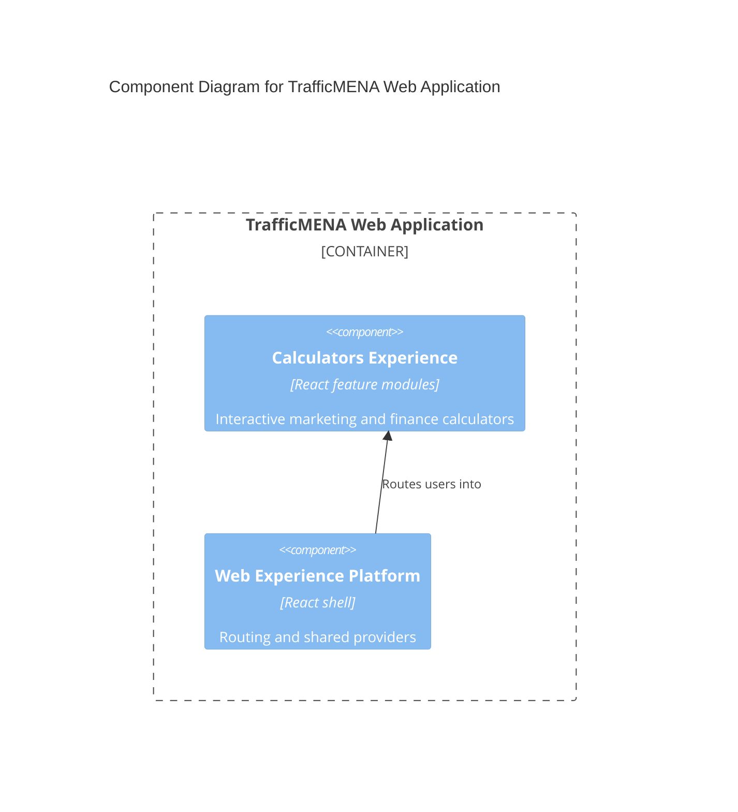

# C4 Component Level: Calculators Experience

## Overview

- **Name**: Calculators Experience
- **Description**: The self-serve calculator module that exposes TrafficMENA's marketing and finance calculation tools.
- **Type**: Application
- **Technology**: React 18, TypeScript, Tailwind CSS

## Purpose

This component packages the platform's calculator catalog into a focused interactive toolset. It provides calculator index/detail pages, feedback helpers, and formula-specific UI modules that help practitioners evaluate marketing performance scenarios.

## Software Features

- Calculator index and detail routing.
- Twenty-plus specialized calculator components for common growth and finance metrics.
- Shared calculator feedback, copy-to-clipboard, and action button helpers.

## Code Elements

This component contains the following code-level elements:

- [c4-code-src-features-calculators.md](../code/c4-code-src-features-calculators.md) - Calculator feature root and composition.
- [c4-code-src-features-calculators-components.md](../code/c4-code-src-features-calculators-components.md) - Individual calculator implementations.
- [c4-code-src-features-calculators-components-shared.md](../code/c4-code-src-features-calculators-components-shared.md) - Shared action buttons and feedback widgets.
- [c4-code-src-features-calculators-pages.md](../code/c4-code-src-features-calculators-pages.md) - Calculator index and detail pages.
- [c4-code-src-features-calculators-utils.md](../code/c4-code-src-features-calculators-utils.md) - Feedback and clipboard helpers.

## Interfaces

### Calculator Navigation Surface

- **Protocol**: Browser navigation
- **Description**: Route-mounted calculator discovery and detail experiences.
- **Operations**:
  - `/calculators`
  - `/calculators/:slug`

### Calculator Component Surface

- **Protocol**: In-process React component API
- **Description**: Formula-specific calculator components that accept local form input and return computed results.
- **Operations**:
  - `ROASCalculator`
  - `MERCalculator`
  - `CACCalculator`
  - `LTVCalculator`

## Dependencies

### Components Used

- [c4-component-web-experience-platform.md](./c4-component-web-experience-platform.md): Provides routing, shared layout, and utility primitives.

### External Systems

- Browser runtime: Executes the calculator-only interactions locally in the client.

## Component Diagram

