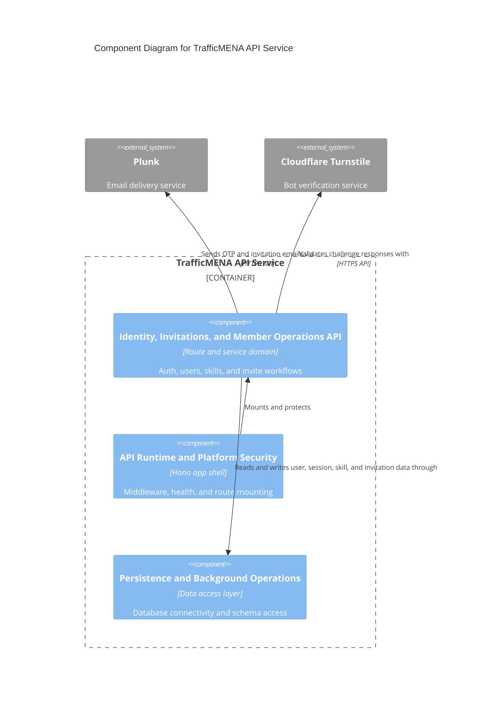

# C4 Component Level: Identity, Invitations, and Member Operations API

## Overview

- **Name**: Identity, Invitations, and Member Operations API
- **Description**: Backend routes and services responsible for authentication, user/session state, invitation onboarding, skills, and member administration.
- **Type**: Service
- **Technology**: Node.js 20, Hono, Better Auth, Zod, Drizzle ORM, Plunk, Cloudflare Turnstile

## Purpose

This component manages who can enter the system, how sessions are issued, and how curated onboarding works. It coordinates Better Auth, invite-session behavior, OTP login, user administration, skills endpoints, invitation emails, CSV invite processing, and related rate-limiting/captcha controls.

## Software Features

- Email OTP request, verification, session lookup, and logout.
- Invite-session plugin integration for invite-only onboarding.
- User listing, self-profile editing, and staff role management.
- Skill catalog and user-skill preference endpoints.
- Single and bulk invitation sending, invitation statistics, acceptance, and activation.

## Code Elements

This component contains the following code-level elements:

- [c4-code-server-src-auth.md](../code/c4-code-server-src-auth.md) - Better Auth configuration and authentication composition.
- [c4-code-server-src-auth-plugins.md](../code/c4-code-server-src-auth-plugins.md) - Invite-session plugin behavior.
- [c4-code-server-src-routes-api.md](../code/c4-code-server-src-routes-api.md) - Contains `auth.ts`, `users.ts`, `skills.ts`, `invitations.ts`, and related helper modules.
- [c4-code-server-src-services.md](../code/c4-code-server-src-services.md) - Contains email, invitation, rate-limit, and Turnstile service integrations used by this component.
- [c4-code-server-src-utils.md](../code/c4-code-server-src-utils.md) - Shared session and error utilities used by auth and invite flows.

## Interfaces

### Authentication Endpoints

- **Protocol**: REST/JSON
- **Description**: Session lifecycle and OTP authentication endpoints exposed under `/api/auth`.
- **Operations**:
  - `POST /api/auth/otp/request`
  - `POST /api/auth/otp/verify`
  - `GET /api/auth/session`
  - `POST /api/auth/logout`

### Member and Invitation Endpoints

- **Protocol**: REST/JSON
- **Description**: Endpoints for user administration, invite-only onboarding, and member skill preferences.
- **Operations**:
  - `GET /api/users`, `GET /api/users/me`, `PUT /api/users/me`
  - `PUT /api/users/{id}`, `DELETE /api/users/{id}`
  - `GET /api/skills`, `POST /api/skills`
  - `GET /api/user/skills`, `POST /api/user/skills`, `DELETE /api/user/skills/{skillId}`
  - `GET /api/invitations`, `GET /api/invitations/stats`
  - `POST /api/invitations/single`, `POST /api/invitations/bulk`
  - `POST /api/invitations/accept`, `POST /api/invitations/activate`

## Dependencies

### Components Used

- [c4-component-api-runtime-and-platform-security.md](./c4-component-api-runtime-and-platform-security.md): Hosts the secure middleware stack and mounts these routes.
- [c4-component-persistence-and-background-operations.md](./c4-component-persistence-and-background-operations.md): Supplies database access and persisted user/invitation state.

### External Systems

- Plunk email delivery: Sends OTP and invitation emails.
- Cloudflare Turnstile: Validates high-risk OTP request flows.

## Component Diagram

