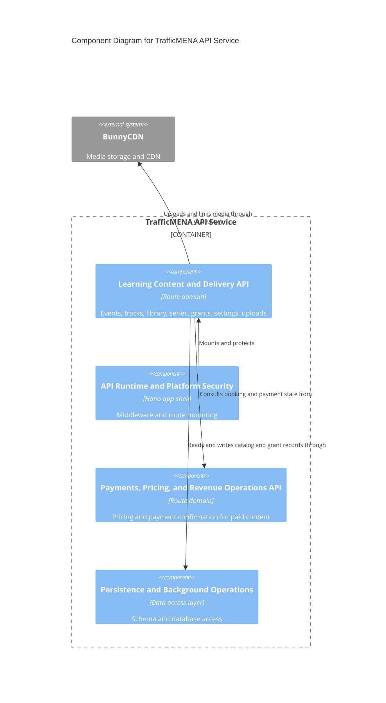

# C4 Component Level: Learning Content and Delivery API

## Overview

- **Name**: Learning Content and Delivery API
- **Description**: Backend domain routes that expose events, tracks, series, library assets, access grants, uploads, settings, and admin metrics.
- **Type**: Service
- **Technology**: Node.js 20, Hono, TypeScript, Zod, Drizzle ORM, BunnyCDN

## Purpose

This component is the primary business API for the education platform. It exposes the content catalog, handles event and track operational mutations, manages library and series relationships, resolves access grants, returns admin metrics, and supports staff uploads.

## Software Features

- Public and authenticated event, track, series, and library retrieval.
- Staff CRUD flows for events, tracks, series, library assets, and ordering within bundles/series.
- Attendee, grant, and publishing-state management for learning access.
- Subscription info/settings and public platform settings endpoints.
- Upload entrypoints and admin metrics overview.

## Code Elements

This component contains the following code-level elements:

- [c4-code-server-src-routes-api.md](../code/c4-code-server-src-routes-api.md) - Contains `events.ts`, `tracks.ts`, `series.ts`, `seriesGrants.ts`, `library.ts`, `subscriptions.ts`, `settings.ts`, `uploads.ts`, and metrics helpers.
- [c4-code-server-src-services.md](../code/c4-code-server-src-services.md) - Contains supporting business services such as promo rules and provider integrations consumed by these routes.
- [c4-code-server-src-utils.md](../code/c4-code-server-src-utils.md) - Shared booking, session, invoice-status, and error helpers used by content routes.

## Interfaces

### Content Catalog Endpoints

- **Protocol**: REST/JSON
- **Description**: Read and write endpoints for the platform's educational catalog.
- **Operations**:
  - `GET /api/events`, `GET /api/events/{id}`, `POST /api/events`, `PUT /api/events/{id}`, `DELETE /api/events/{id}`
  - `GET /api/tracks/public`, `GET /api/tracks/{id}/public`, `GET /api/tracks`, `GET /api/tracks/{id}`
  - `GET /api/series`, `GET /api/series/{id}`, `POST /api/series`, `PUT /api/series/{id}`, `DELETE /api/series/{id}`
  - `GET /api/library`, `GET /api/library/{id}`, `POST /api/library`, `PUT /api/library/{id}`, `DELETE /api/library/{id}`

### Access, Settings, and Operations Endpoints

- **Protocol**: REST/JSON
- **Description**: Supporting endpoints for attendance, grants, uploads, and platform operations.
- **Operations**:
  - `GET /api/events/{id}/attendees`
  - `GET /api/tracks/{id}/attendees`
  - `POST /api/tracks/{id}/events`, `DELETE /api/tracks/{id}/events/{eventId}`, `PUT /api/tracks/{id}/events/reorder`
  - `POST /api/series/{id}/assets`, `DELETE /api/series/{id}/assets/{assetId}`, `PUT /api/series/{id}/assets/reorder`
  - `GET /api/series/{id}/grants`, `POST /api/series/{id}/grants`, `POST /api/series/grants/bulk`
  - `POST /api/subscriptions/grants`, `POST /api/subscriptions/grants/revoke`, `POST /api/subscriptions/grants/bulk`
  - `GET /api/subscriptions/current`, `GET /api/subscriptions/settings`, `PUT /api/subscriptions/settings`, `GET /api/subscriptions/info`
  - `GET /api/settings/public`, `GET /api/admin/settings/general`, `PATCH /api/admin/settings/general`
  - `POST /api/uploads`, `POST /api/uploads/image`
  - `GET /api/admin/metrics/overview`

## Dependencies

### Components Used

- [c4-component-api-runtime-and-platform-security.md](./c4-component-api-runtime-and-platform-security.md): Supplies the middleware, error handling, and mount point for these routes.
- [c4-component-persistence-and-background-operations.md](./c4-component-persistence-and-background-operations.md): Supplies the data model and database access layer.
- [c4-component-payments-pricing-and-revenue-operations-api.md](./c4-component-payments-pricing-and-revenue-operations-api.md): Provides booking-price and payment-status data for paid learning products.

### External Systems

- BunnyCDN storage: Stores uploaded media and documents referenced by library/content records.

## Component Diagram

