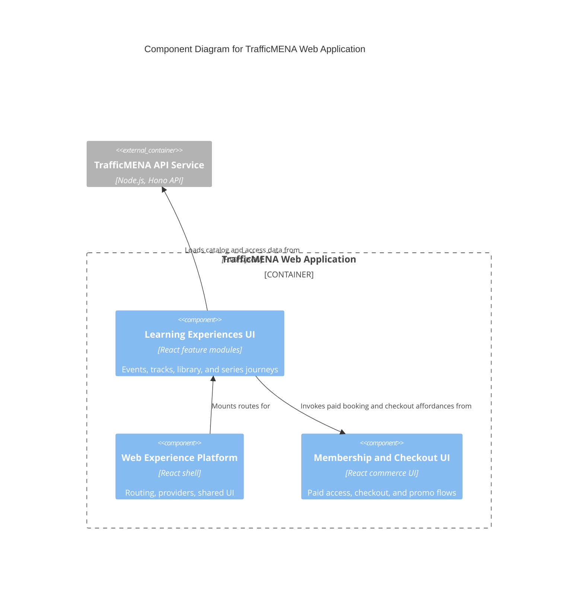

# C4 Component Level: Learning Experiences UI

## Overview

- **Name**: Learning Experiences UI
- **Description**: Feature modules that implement event discovery, track booking, library browsing, series access, and the member learning experience.
- **Type**: Application
- **Technology**: React 18, TypeScript, TanStack Query, Tailwind CSS

## Purpose

This component translates the platform's educational catalog into browser experiences. It owns the public and member-facing journeys for events, tracks, library assets, and series while coordinating entitlement-aware rendering, booking status, and asset navigation.

## Software Features

- Public and member views for event discovery, event detail, and registration-related status. Card impressions, detail views, add-to-calendar interactions, and registration-start events push `dataLayer` events via the analytics layer.
- Track browsing, booking, attendee visibility, and linked-event presentation. Booking hooks call into `trackBookingAnalytics` so free auto-bookings and paid bookings both emit consistent events.
- Library asset grids and asset detail views. Premium library assets and premium series render the shared `PremiumContentGate` from `src/shared/components/PremiumContentGate.tsx` for learners without access.
- Series discovery, asset selection, and staff-facing access management widgets (series grants, bulk CSV).
- Calculator usage tracking via `src/features/calculators/analytics.tsx` and `analytics-shared.ts` (category, inputs, result surfacing).

## Code Elements

This component contains the following code-level elements:

- [c4-code-src-features-events.md](../code/c4-code-src-features-events.md) - Event feature root and module exports.
- [c4-code-src-features-events-components.md](../code/c4-code-src-features-events-components.md) - Event cards, attendee lists, cancellation dialogs, and admin form pieces.
- [c4-code-src-features-events-hooks.md](../code/c4-code-src-features-events-hooks.md) - Event queries, booking hooks, and attendee data hooks.
- [c4-code-src-features-events-pages.md](../code/c4-code-src-features-events-pages.md) - Public, dashboard, and staff event pages.
- [c4-code-src-features-tracks.md](../code/c4-code-src-features-tracks.md) - Track feature root and module exports.
- [c4-code-src-features-tracks-components.md](../code/c4-code-src-features-tracks-components.md) - Track cards, forms, attendee lists, booking controls, and event selection widgets.
- [c4-code-src-features-tracks-hooks.md](../code/c4-code-src-features-tracks-hooks.md) - Track list, booking, and attendee hooks.
- [c4-code-src-features-library.md](../code/c4-code-src-features-library.md) - Library feature root and service organization.
- [c4-code-src-features-library-components.md](../code/c4-code-src-features-library-components.md) - Library grids, cards, and asset forms.
- [c4-code-src-features-series.md](../code/c4-code-src-features-series.md) - Series feature root and related types/hooks/components.

## Interfaces

### Learner Feature Hooks

- **Protocol**: In-process React hook API
- **Description**: Feature hooks that expose query-backed state and mutations to routed pages and UI controls.
- **Operations**:
  - `useEvents()`, `useEventsQuery()`, `useEventBooking()`
  - `useTracks()`, `useTrackBooking()`, `useTrackAttendees()`
  - `useLibrary()`
  - `useSeries()`, `useSeriesGrants()`

### Learner Navigation Surface

- **Protocol**: Browser navigation
- **Description**: Route segments that present catalog content to visitors and members.
- **Operations**:
  - `/meetups`, `/meetups/:id`
  - `/dashboard/meetups`
  - `/dashboard/library`, `/dashboard/library/:id`
  - `/dashboard/library/tracks/:id`, `/dashboard/library/series/:id`

## Dependencies

### Components Used

- [c4-component-web-experience-platform.md](./c4-component-web-experience-platform.md): Supplies routing, auth context, shared UI, and API client primitives.
- [c4-component-membership-and-checkout-ui.md](./c4-component-membership-and-checkout-ui.md): Reuses payment and promo-code widgets for paid events and tracks.

### External Systems

- TrafficMENA API Service: Reads event, track, library, and series data over HTTPS/JSON.

## Component Diagram

