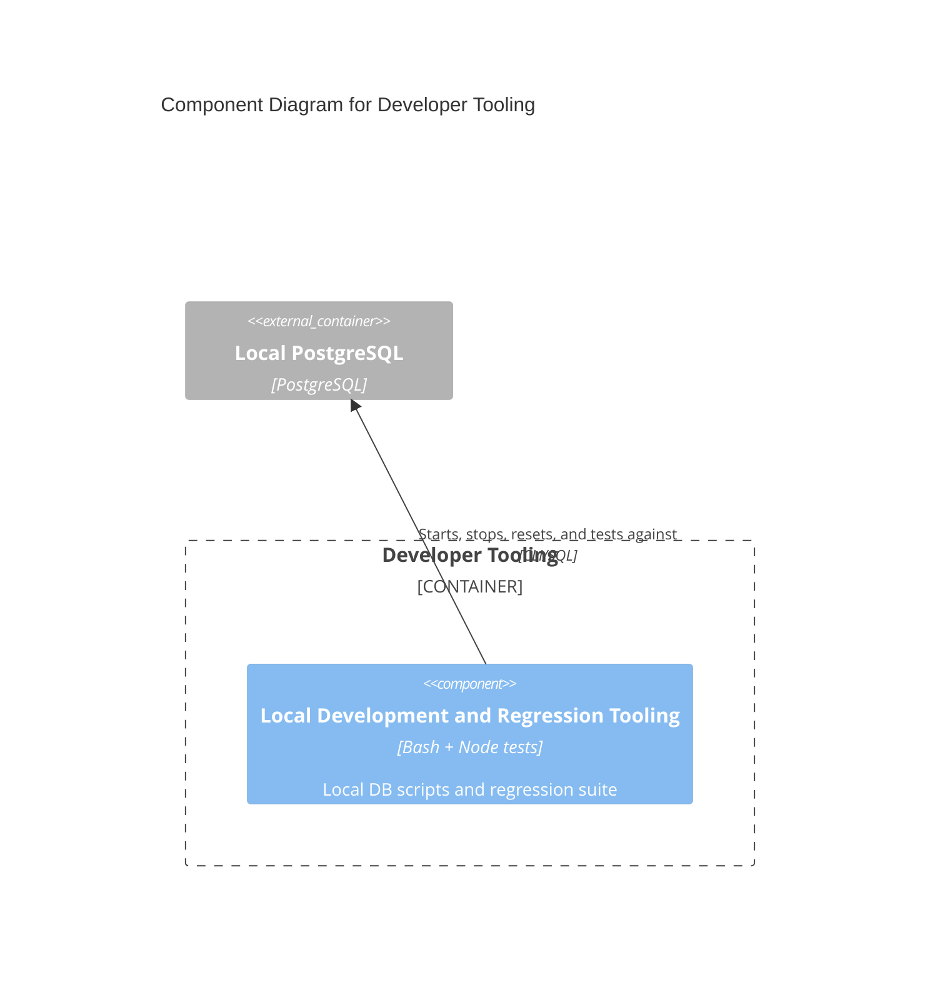

# C4 Component Level: Local Development and Regression Tooling

## Overview

- **Name**: Local Development and Regression Tooling
- **Description**: Local PostgreSQL helper scripts and the Node-based regression suite used to exercise critical platform behavior.
- **Type**: Tooling
- **Technology**: Bash, Node.js test runner, TypeScript

## Purpose

This component supports developer productivity and confidence rather than end-user runtime behavior. It packages the project-scoped PostgreSQL lifecycle scripts together with focused unit tests that protect the platform's high-risk flows.

## Software Features

- Start, stop, inspect, reset, and connect to the local PostgreSQL instance without Docker.
- Focused regression tests for auth flows, payments, invitation logic, grants, and booking edge cases.
- Shared test loader for running TypeScript-based Node tests.

## Code Elements

This component contains the following code-level elements:

- [c4-code-local-postgres-bin.md](../code/c4-code-local-postgres-bin.md) - Local Postgres lifecycle helper scripts.
- [c4-code-tests.md](../code/c4-code-tests.md) - Test-suite entrypoints and loader setup.
- [c4-code-tests-unit.md](../code/c4-code-tests-unit.md) - Focused regression and unit test modules.

## Interfaces

### Developer CLI Surface

- **Protocol**: Command-line interface
- **Description**: Repo-level commands used during development and troubleshooting.
- **Operations**:
  - `npm run db:start`
  - `npm run db:stop`
  - `npm run db:status`
  - `npm run db:reset`
  - `npm run test:unit`

### Regression Test Surface

- **Protocol**: Node test runner
- **Description**: Automated checks for high-risk application workflows.
- **Operations**:
  - Auth/session regression tests
  - Invitation and grant regression tests
  - Payment, booking, and access-control regression tests

## Dependencies

### Components Used

- [c4-component-persistence-and-background-operations.md](./c4-component-persistence-and-background-operations.md): Tests and scripts interact with the same database model and local PostgreSQL process.

### External Systems

- Developer workstation: Runs Node, npm, and local shell tooling.
- Local PostgreSQL installation: Backing process for local development scripts.

## Component Diagram

