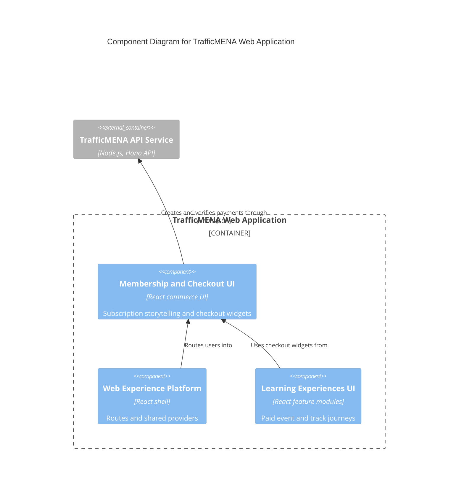

# C4 Component Level: Membership and Checkout UI

## Overview

- **Name**: Membership and Checkout UI
- **Description**: Subscription marketing, payment dialogs, promo-code entry, and invite/payment completion surfaces in the frontend.
- **Type**: Application
- **Technology**: React 18, TypeScript, Tailwind CSS, TanStack Query

## Purpose

This component explains the membership offer (to admins previewing the offer), collects checkout intent for paid events and tracks, and guides users through payment-related and invitation-related completion states. It packages the user-facing commerce touchpoints that sit between content discovery and backend payment processing.

> The learner-facing subscribe landing (`/subscribe`) and the in-dashboard subscribe page (`/dashboard/subscribe`) are currently gated behind `owner`/`admin` roles via `AdminProtectedRoute` in `src/App.tsx`. The public purchase surface is intentionally hidden while subscriptions are provisioned through the admin grant workflow. The landing components are preserved for when the surface is re-opened.

## Software Features

- Subscription landing page sections such as pricing, ROI, comparison, reviews, and FAQ (admin-gated preview only).
- Shared payment widgets for price display, method selection, promo-code entry, and checkout dialogs used by paid event and track journeys.
- Payment result surfaces for success, failure, and pending states. Paid success screens fetch the verified purchase analytics payload from the paid-payment response and push a single `purchase` event to the dataLayer.
- Invite acceptance entrypoints that hand the user into the onboarding flow.
- Shared `PremiumContentGate` component (`src/shared/components/PremiumContentGate.tsx`) rendered by library/series flows when a learner hits premium content without access.

## Code Elements

This component contains the following code-level elements:

- [c4-code-src-features-subscribe.md](../code/c4-code-src-features-subscribe.md) - Subscription feature root and exported content.
- [c4-code-src-features-subscribe-components.md](../code/c4-code-src-features-subscribe-components.md) - Membership landing page sections and pricing presentation.
- [c4-code-src-shared-components-payment.md](../code/c4-code-src-shared-components-payment.md) - Shared checkout widgets, price cards, and payment selectors.
- [c4-code-src-pages-payment.md](../code/c4-code-src-pages-payment.md) - Routed payment success, failure, and pending views.
- [c4-code-src-pages-invitation.md](../code/c4-code-src-pages-invitation.md) - Invitation acceptance page entrypoint.

## Interfaces

### Checkout Interaction Surface

- **Protocol**: In-process React component API
- **Description**: Shared UI widgets that collect payment method choice, promo codes, and checkout confirmation.
- **Operations**:
  - `PaymentCheckoutDialog`
  - `PaymentMethodSelector`
  - `PromoCodeInput`
  - `PriceDisplayCard`

### Commerce Navigation Surface

- **Protocol**: Browser navigation
- **Description**: Route segments that close the loop for invites and payments.
- **Operations**:
  - `/subscribe` — admin/owner gated via `AdminProtectedRoute`; redirects learners to `/`
  - `/dashboard/subscribe` — admin/owner gated via `AdminProtectedRoute`
  - `/invitation/:token`
  - `/payment/success`, `/payment/failed`, `/payment/pending` — success screen triggers the `purchase` dataLayer event with enriched analytics payload

## Dependencies

### Components Used

- [c4-component-web-experience-platform.md](./c4-component-web-experience-platform.md): Provides routing, auth context, and frontend API helpers.
- [c4-component-learning-experiences-ui.md](./c4-component-learning-experiences-ui.md): Invoked from paid event and track journeys.

### External Systems

- TrafficMENA API Service: Creates checkout sessions, verifies invoice status, and resolves invitation state.

## Component Diagram

