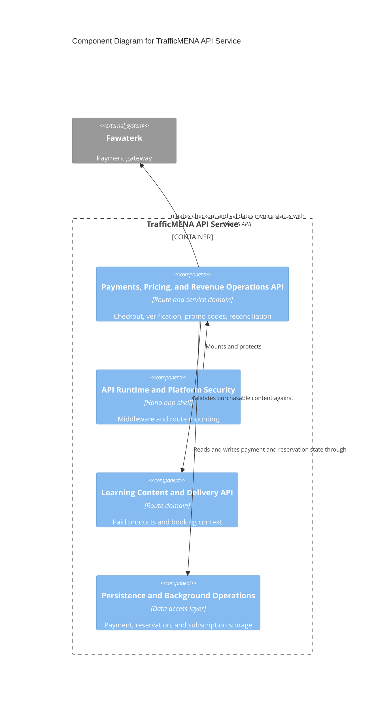

# C4 Component Level: Payments, Pricing, and Revenue Operations API

## Overview

- **Name**: Payments, Pricing, and Revenue Operations API
- **Description**: Backend payment, pricing, promo-code, webhook, and reconciliation logic for event, track, and subscription commerce flows.
- **Type**: Service
- **Technology**: Node.js 20, Hono, TypeScript, Drizzle ORM, Zod, Fawaterk

## Purpose

This component owns the money-moving side of the platform. It calculates prices, initiates checkout sessions, verifies invoice status, processes payment webhooks, applies promo codes and subscriber discounts, and runs the background cleanup/reconciliation needed to keep reservations and invoices consistent.

## Software Features

- Payment-method retrieval and checkout creation for events, tracks, and subscriptions.
- Price preview calculation with promo-code and subscription-discount logic.
- Payment verification polling and invoice lookup; paid responses are enriched with verified purchase analytics (item name, item category, promo code, payment method, discount, and customer-type classification) used to power the frontend GTM `purchase` event.
- Fawaterk webhook ingestion with invoice-key validation.
- Promo-code CRUD and target validation.
- Reservation expiration and payment reconciliation jobs.
- Subscription grants (single, revoke, bulk CSV) via `/api/subscriptions/grants*` and CSV helpers (`subscriptionsGrants.ts`, `subscriptionsGrantsBulk.ts`, `subscriptionsGrantsCsv.ts`, `subscriptionsGrantUtils.ts`, `subscriptionShared.ts`).
- Series grants (single, revoke, bulk CSV) via `/api/series/:id/grants*` (`seriesGrants.ts`, `seriesGrantsBulk.ts`, `seriesGrantsCsv.ts`, `seriesAccess.ts`).
- Manual track enrollment (`trackEnrollments.ts`, `trackBookingShared.ts`) with the same atomic write path as paid track bookings.
- Skill taxonomy and per-user skill selection (`skills.ts`).

## Code Elements

This component contains the following code-level elements:

- [c4-code-server-src-routes-api.md](../code/c4-code-server-src-routes-api.md) - Contains `payments.ts`, `paymentAnalytics.ts`, `paymentAnalyticsHelpers.ts`, `promoCodes.ts`, `subscriptions.ts`, `subscriptionShared.ts`, `subscriptionsGrants.ts`, `subscriptionsGrantsBulk.ts`, `subscriptionsGrantsCsv.ts`, `subscriptionsGrantUtils.ts`, `seriesGrants.ts`, `seriesGrantsBulk.ts`, `seriesGrantsCsv.ts`, `seriesAccess.ts`, `skills.ts`, `trackEnrollments.ts`, `trackBookingShared.ts`, `trackPaidStatus.ts`, and related helpers.
- [c4-code-server-src-services.md](../code/c4-code-server-src-services.md) - Contains `fawaterk.ts`, `promoCodes.ts`, and related integration/service logic.
- [c4-code-server-src-jobs.md](../code/c4-code-server-src-jobs.md) - Payment expiration and reconciliation background modules.
- [c4-code-server-src-utils.md](../code/c4-code-server-src-utils.md) - Shared booking and invoice-status helpers used by checkout flows.

## Interfaces

### Commerce Endpoints

- **Protocol**: REST/JSON
- **Description**: Payment and pricing endpoints used by the web client during checkout.
- **Operations**:
  - `GET /api/payments/methods`
  - `POST /api/payments/checkout`
  - `POST /api/payments/verify`
  - `GET /api/payments/price-preview`
  - `GET /api/payments/{id}`

### Revenue Control Endpoints

- **Protocol**: REST/JSON
- **Description**: Webhook and promotion endpoints used by the platform and staff operations.
- **Operations**:
  - `POST /api/payments/webhook`
  - `POST /api/payments/webhook_json`
  - `GET /api/promo-codes`, `GET /api/promo-codes/{id}`
  - `POST /api/promo-codes`, `PUT /api/promo-codes/{id}`, `DELETE /api/promo-codes/{id}`

### Subscription, Series Grant, and Manual Enrollment Endpoints

- **Protocol**: REST/JSON
- **Description**: Admin-driven access provisioning that complements the paid checkout surface.
- **Operations**:
  - `GET /api/subscriptions/current`, `GET /api/subscriptions/info`
  - `GET /api/subscriptions/settings`, `PUT /api/subscriptions/settings`
  - `POST /api/subscriptions/grants`, `POST /api/subscriptions/grants/revoke`, `POST /api/subscriptions/grants/bulk`
  - `GET /api/series/{id}/grants`, `POST /api/series/{id}/grants`, `POST /api/series/{id}/grants/{userId}/revoke`, `POST /api/series/grants/bulk`
  - `POST /api/tracks/{id}/manual-enrollments`, `POST /api/tracks/{id}/enrollments/{userId}/revoke`
  - `GET /api/skills`, `POST /api/skills`, `GET /api/user/skills`, `POST /api/user/skills`, `DELETE /api/user/skills/{skillId}`

## Dependencies

### Components Used

- [c4-component-api-runtime-and-platform-security.md](./c4-component-api-runtime-and-platform-security.md): Hosts the secure route surface and health/runtime behavior.
- [c4-component-persistence-and-background-operations.md](./c4-component-persistence-and-background-operations.md): Supplies reservation, payment, and subscription persistence.
- [c4-component-learning-content-and-delivery-api.md](./c4-component-learning-content-and-delivery-api.md): Shares booking state and content-product identifiers with paid content flows.

### External Systems

- Fawaterk payment gateway: Provides payment methods, hosted invoice state, and webhook callbacks.

## Component Diagram

