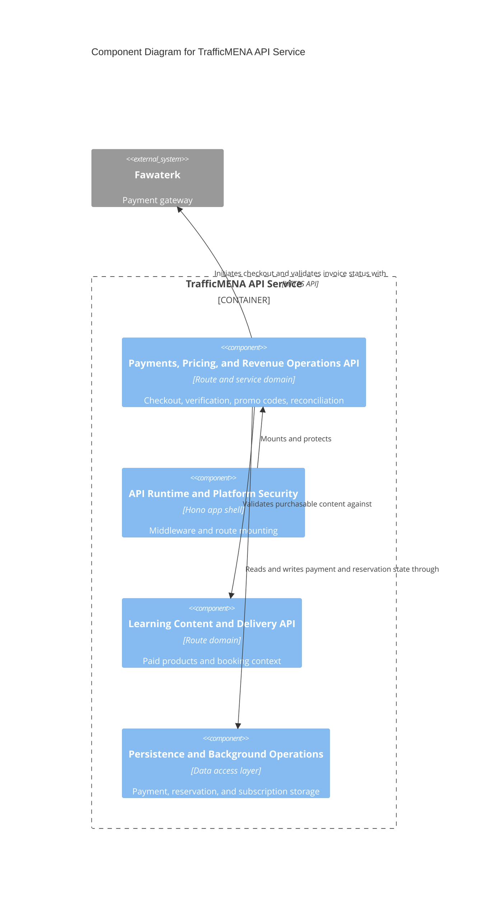

# C4 Component Level: Payments, Pricing, and Revenue Operations API

## Overview

- **Name**: Payments, Pricing, and Revenue Operations API
- **Description**: Backend payment, pricing, promo-code, webhook, and reconciliation logic for event, track, and subscription commerce flows.
- **Type**: Service
- **Technology**: Node.js 20, Hono, TypeScript, Drizzle ORM, Zod, Fawaterk

## Purpose

This component owns the money-moving side of the platform. It calculates prices, initiates checkout sessions, verifies invoice status, processes payment webhooks, applies promo codes and subscriber discounts, and runs the background cleanup/reconciliation needed to keep reservations and invoices consistent.

## Software Features

- Payment-method retrieval and checkout creation for events, tracks, and subscriptions.
- Price preview calculation with promo-code and subscription-discount logic.
- Payment verification polling and invoice lookup.
- Fawaterk webhook ingestion with invoice-key validation.
- Promo-code CRUD and target validation.
- Reservation expiration and payment reconciliation jobs.

## Code Elements

This component contains the following code-level elements:

- [c4-code-server-src-routes-api.md](../code/c4-code-server-src-routes-api.md) - Contains `payments.ts`, `promoCodes.ts`, `subscriptionShared.ts`, `trackPaidStatus.ts`, and related helpers.
- [c4-code-server-src-services.md](../code/c4-code-server-src-services.md) - Contains `fawaterk.ts`, `promoCodes.ts`, and related integration/service logic.
- [c4-code-server-src-jobs.md](../code/c4-code-server-src-jobs.md) - Payment expiration and reconciliation background modules.
- [c4-code-server-src-utils.md](../code/c4-code-server-src-utils.md) - Shared booking and invoice-status helpers used by checkout flows.

## Interfaces

### Commerce Endpoints

- **Protocol**: REST/JSON
- **Description**: Payment and pricing endpoints used by the web client during checkout.
- **Operations**:
  - `GET /api/payments/methods`
  - `POST /api/payments/checkout`
  - `POST /api/payments/verify`
  - `GET /api/payments/price-preview`
  - `GET /api/payments/{id}`

### Revenue Control Endpoints

- **Protocol**: REST/JSON
- **Description**: Webhook and promotion endpoints used by the platform and staff operations.
- **Operations**:
  - `POST /api/payments/webhook`
  - `POST /api/payments/webhook_json`
  - `GET /api/promo-codes`, `GET /api/promo-codes/{id}`
  - `POST /api/promo-codes`, `PUT /api/promo-codes/{id}`, `DELETE /api/promo-codes/{id}`

## Dependencies

### Components Used

- [c4-component-api-runtime-and-platform-security.md](./c4-component-api-runtime-and-platform-security.md): Hosts the secure route surface and health/runtime behavior.
- [c4-component-persistence-and-background-operations.md](./c4-component-persistence-and-background-operations.md): Supplies reservation, payment, and subscription persistence.
- [c4-component-learning-content-and-delivery-api.md](./c4-component-learning-content-and-delivery-api.md): Shares booking state and content-product identifiers with paid content flows.

### External Systems

- Fawaterk payment gateway: Provides payment methods, hosted invoice state, and webhook callbacks.

## Component Diagram

```mermaid
C4Component
    title Component Diagram for TrafficMENA API Service

    Container_Boundary(api, "TrafficMENA API Service") {
        Component(payments, "Payments, Pricing, and Revenue Operations API", "Route and service domain", "Checkout, verification, promo codes, reconciliation")
        Component(runtime, "API Runtime and Platform Security", "Hono app shell", "Middleware and route mounting")
        Component(content, "Learning Content and Delivery API", "Route domain", "Paid products and booking context")
        Component(persistence, "Persistence and Background Operations", "Data access layer", "Payment, reservation, and subscription storage")
    }
    System_Ext(fawaterk, "Fawaterk", "Payment gateway")

    Rel(runtime, payments, "Mounts and protects")
    Rel(payments, content, "Validates purchasable content against")
    Rel(payments, persistence, "Reads and writes payment and reservation state through")
    Rel(payments, fawaterk, "Initiates checkout and validates invoice status with", "HTTPS API")
```
