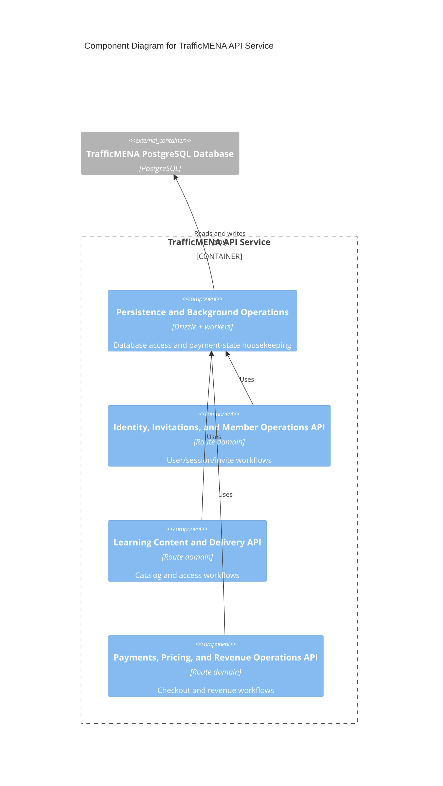

# C4 Component Level: Persistence and Background Operations

## Overview

- **Name**: Persistence and Background Operations
- **Description**: The backend data-access layer and scheduled job modules that keep transactional state durable and consistent.
- **Type**: Service
- **Technology**: PostgreSQL 17, Drizzle ORM, node-postgres, TypeScript

## Purpose

This component provides the persistent model behind the platform and the operational jobs that maintain payment state over time. It owns the Drizzle schema, the connection pool, and the background tasks that expire or reconcile invoices and reservations.

## Software Features

- Database URL resolution, connection-pool construction, and graceful shutdown.
- Drizzle schema definitions for users, profiles, events, tracks, series, library assets, invitations, subscriptions, payments, and reservations.
- Payment expiration worker.
- Payment reconciliation worker.

## Code Elements

This component contains the following code-level elements:

- [c4-code-server-src-db.md](../code/c4-code-server-src-db.md) - Database client wiring and schema entrypoints.
- [c4-code-server-src-db-schema.md](../code/c4-code-server-src-db-schema.md) - Drizzle enum/table/index definitions.
- [c4-code-server-drizzle.md](../code/c4-code-server-drizzle.md) - Ordered SQL migration history, grant changes, and integrity-enforcement DDL.
- [c4-code-server-src-jobs.md](../code/c4-code-server-src-jobs.md) - Background reconciliation and expiration jobs.
- [c4-code-server-scripts.md](../code/c4-code-server-scripts.md) - Manual remediation, backfill, and seed scripts that operate directly on persisted data.

## Interfaces

### Data Access Surface

- **Protocol**: In-process library API
- **Description**: Shared database exports used by route and service modules.
- **Operations**:
  - `db`
  - `connectionPool`
  - `closeDb(): Promise<void>`
  - Drizzle schema exports for tables, enums, and inferred row types

### Background Job Surface

- **Protocol**: In-process worker API
- **Description**: Long-running housekeeping tasks started by the API service at boot.
- **Operations**:
  - `startPaymentExpirationJob()`
  - `startPaymentReconciliationJob()`

### Maintenance Script Surface

- **Protocol**: SQL and CLI maintenance workflow
- **Description**: One-off operational scripts used for schema backfills, seed data, and paid-state reconciliation outside the main request path.
- **Operations**:
  - `tsx server/scripts/reconcile-unpaid-payments.ts [--apply] [--since=<ISO-8601>] [--limit=<n>]`
  - `psql -f server/scripts/backfill_series_published.sql`
  - `psql -f server/scripts/backfill_series_premium_paid_tracks.sql`
  - `psql -f server/scripts/seed_events.sql`

## Dependencies

### Components Used

- [c4-component-api-runtime-and-platform-security.md](./c4-component-api-runtime-and-platform-security.md): Starts the process that uses the connection pool and launches jobs.
- [c4-component-identity-invitations-and-member-operations-api.md](./c4-component-identity-invitations-and-member-operations-api.md): Persists user, session, skill, and invite state through this layer.
- [c4-component-learning-content-and-delivery-api.md](./c4-component-learning-content-and-delivery-api.md): Persists catalog, access, and operational records through this layer.
- [c4-component-payments-pricing-and-revenue-operations-api.md](./c4-component-payments-pricing-and-revenue-operations-api.md): Persists payment, reservation, and subscription state through this layer.

### External Systems

- TrafficMENA PostgreSQL Database: Durable transactional data store for the platform.

## Component Diagram

