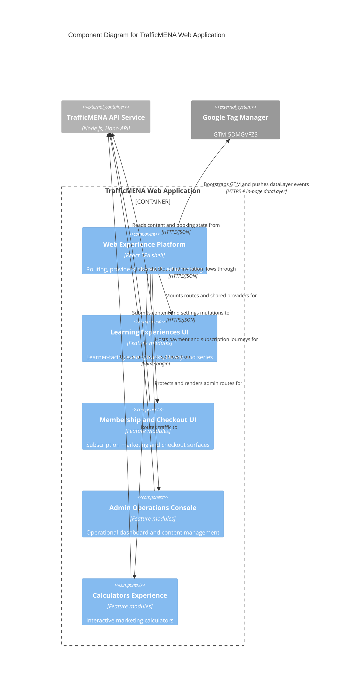

# C4 Component Level: Web Experience Platform

## Overview

- **Name**: Web Experience Platform
- **Description**: The React SPA shell that composes routing, providers, shared layout, reusable UI primitives, and editor tooling for the browser experience.
- **Type**: Application
- **Technology**: React 18, React Router, TanStack Query, TypeScript, Tailwind CSS, shadcn/ui, TipTap

## Purpose

This component provides the browser-side foundation for TrafficMENA. It initializes the app, mounts public and protected route trees, exposes the typed API client, and supplies the reusable UI and editor primitives that every feature module builds on.

## Software Features

- Route composition for public pages, dashboard pages, onboarding steps, invite acceptance, and payment status screens.
- App-wide provider setup for query caching, auth/session state, toasts, tooltips, and error boundaries.
- Shared layout guards for authenticated, admin, and signup-gated experiences, including role-gated access to the subscribe landing pages (`/subscribe`, `/dashboard/subscribe` are currently limited to `owner`/`admin`).
- Shared UI primitives, utility hooks, and TipTap editor controls used by admin and content-authoring flows.
- Shared `PremiumContentGate` surface used by library and series flows to render a consistent paywall prompt for premium content a learner does not yet have access to.
- Auth-scoped TanStack Query key namespacing (`src/app/queryKeys.ts`) to keep per-user cached data isolated across account switches and logout.
- Google Tag Manager bootstrap (`public/gtm-bootstrap.js`) and a typed analytics layer under `src/lib/analytics/` (`gtm`, `events`, `helpers`, `signup`, `contentDiscovery`, `calendar`, `libraryContent`, `profile`, `paymentFlow`, `usePageTracking`) that pushes events to `window.dataLayer` for all learner flows.

## Code Elements

This component contains the following code-level elements:

- [c4-code-src.md](../code/c4-code-src.md) - Root SPA entrypoints such as `App.tsx`, `main.tsx`, and top-level styling.
- [c4-code-src-app.md](../code/c4-code-src-app.md) - App-layer modules for browser API access and provider composition.
- [c4-code-src-app-api.md](../code/c4-code-src-app-api.md) - Typed `fetchJson` wrappers and browser CSRF handling.
- [c4-code-src-pages.md](../code/c4-code-src-pages.md) - Route-level screens mounted by the SPA router.
- [c4-code-src-shared-context.md](../code/c4-code-src-shared-context.md) - Shared auth and theme providers.
- [c4-code-src-shared-components.md](../code/c4-code-src-shared-components.md) - Cross-cutting loading, error, layout, and embed components.
- [c4-code-src-shared-components-ui.md](../code/c4-code-src-shared-components-ui.md) - Reusable UI primitives used across features.
- [c4-code-src-shared-hooks.md](../code/c4-code-src-shared-hooks.md) - Shared React hooks for pagination, role checks, and dashboard state.
- [c4-code-src-shared-utils.md](../code/c4-code-src-shared-utils.md) - Shared frontend utility modules and redirect helpers.
- [c4-code-src-components-tiptap-ui.md](../code/c4-code-src-components-tiptap-ui.md) - TipTap toolbar controls.
- [c4-code-src-components-tiptap-node.md](../code/c4-code-src-components-tiptap-node.md) - TipTap node extensions and node views.
- [c4-code-src-components-tiptap-ui-primitive.md](../code/c4-code-src-components-tiptap-ui-primitive.md) - Low-level editor UI primitives.
- [c4-code-src-lib-analytics.md](../code/c4-code-src-lib-analytics.md) - GTM dataLayer analytics modules used across all SPA features.

## Interfaces

### Browser Route Surface

- **Protocol**: Browser navigation
- **Description**: URL-addressable public, protected, and admin experiences mounted by the React router.
- **Operations**:
  - `/`, `/about`, `/community`, `/signin`
  - `/dashboard/*`, `/profile/edit`
  - `/signup/*`, `/invitation/:token`
  - `/payment/success`, `/payment/failed`, `/payment/pending`

### Frontend API Client

- **Protocol**: HTTPS/JSON
- **Description**: Browser-side typed API boundary used by feature hooks and forms.
- **Operations**:
  - `fetchJson<T>(input: RequestInfo, init?: RequestInit): Promise<T>`
  - `getCsrfHeaders(): Record<string, string>`
  - `ApiError(message: string, status: number, code?: string, extra?: Record<string, unknown>)`

### Analytics DataLayer Interface

- **Protocol**: In-page `window.dataLayer` messaging (consumed by Google Tag Manager)
- **Description**: Single-entry push function guarded by a `try/catch` so analytics never breaks the app. All analytics modules funnel through it; no direct HTTP calls to GTM or third-party analytics servers are made from the SPA.
- **Operations**:
  - `pushToDataLayer(data: Record<string, unknown>): void`
  - Event helpers: `trackLoginStart`, `trackLogin`, `trackSignUpStep`, `trackSignUp`, `trackViewItem*`, `trackAddToCalendar`, `trackBeginCheckout`, `trackPurchase`, `trackLibraryContentView`, `trackProfileUpdate`, `usePageTracking`
  - Calculator analytics: `src/features/calculators/analytics-shared.ts`, `src/features/calculators/analytics.tsx`
  - Track booking analytics: `src/features/tracks/trackBookingAnalytics.ts`

### Auth-Scoped Query Keys

- **Protocol**: In-process (TanStack Query)
- **Description**: Query key factory that namespaces per-user data by session identity, guaranteeing cache isolation across login/logout/account-switch transitions and preventing stale personal data from leaking between sessions.
- **Operations**: `src/app/queryKeys.ts` — `authScopedKey(session, ...parts)` and feature-specific key builders consumed by hooks under `src/app/hooks/` and `src/features/**`.

## Dependencies

### Components Used

- [c4-component-learning-experiences-ui.md](./c4-component-learning-experiences-ui.md): Mounts the learner-facing events, tracks, library, and series flows inside the route tree.
- [c4-component-membership-and-checkout-ui.md](./c4-component-membership-and-checkout-ui.md): Hosts subscription landing and payment status surfaces inside the shell.
- [c4-component-admin-operations-console.md](./c4-component-admin-operations-console.md): Wraps the admin dashboard, guards, and operational pages.
- [c4-component-calculators-experience.md](./c4-component-calculators-experience.md): Exposes calculator routes and shared utility surfaces.

### External Systems

- TrafficMENA API Service: Same-origin JSON API consumed through the shared frontend client.
- Browser runtime: Executes the SPA, stores cookies, and manages navigation history.
- Google Tag Manager (`https://www.googletagmanager.com/gtm.js?id=GTM-5DMGVFZS`): Receives `dataLayer` events pushed from the analytics layer; fans out to downstream marketing and measurement tags.

## Component Diagram

