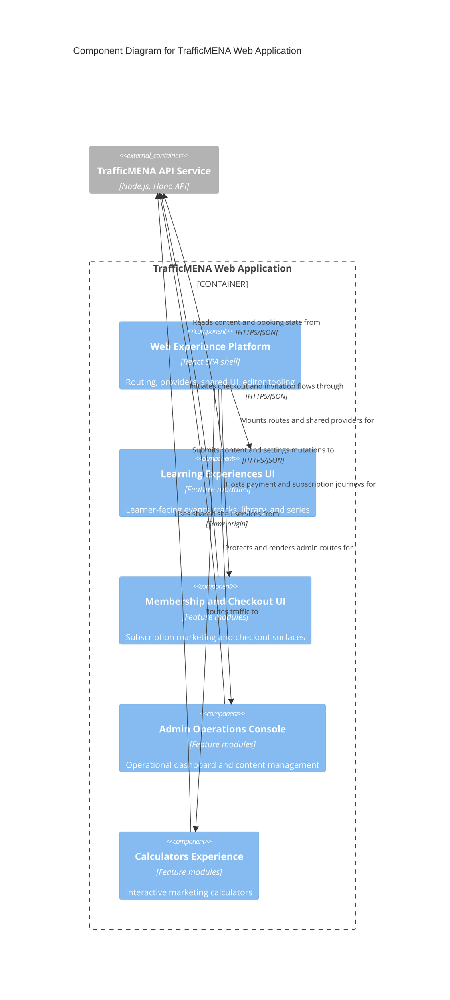

# C4 Component Level: Web Experience Platform

## Overview

- **Name**: Web Experience Platform
- **Description**: The React SPA shell that composes routing, providers, shared layout, reusable UI primitives, and editor tooling for the browser experience.
- **Type**: Application
- **Technology**: React 18, React Router, TanStack Query, TypeScript, Tailwind CSS, shadcn/ui, TipTap

## Purpose

This component provides the browser-side foundation for TrafficMENA. It initializes the app, mounts public and protected route trees, exposes the typed API client, and supplies the reusable UI and editor primitives that every feature module builds on.

## Software Features

- Route composition for public pages, dashboard pages, onboarding steps, invite acceptance, and payment status screens.
- App-wide provider setup for query caching, auth/session state, toasts, tooltips, and error boundaries.
- Shared layout guards for authenticated, admin, and signup-gated experiences.
- Shared UI primitives, utility hooks, and TipTap editor controls used by admin and content-authoring flows.

## Code Elements

This component contains the following code-level elements:

- [c4-code-src.md](../code/c4-code-src.md) - Root SPA entrypoints such as `App.tsx`, `main.tsx`, and top-level styling.
- [c4-code-src-app.md](../code/c4-code-src-app.md) - App-layer modules for browser API access and provider composition.
- [c4-code-src-app-api.md](../code/c4-code-src-app-api.md) - Typed `fetchJson` wrappers and browser CSRF handling.
- [c4-code-src-pages.md](../code/c4-code-src-pages.md) - Route-level screens mounted by the SPA router.
- [c4-code-src-shared-context.md](../code/c4-code-src-shared-context.md) - Shared auth and theme providers.
- [c4-code-src-shared-components.md](../code/c4-code-src-shared-components.md) - Cross-cutting loading, error, layout, and embed components.
- [c4-code-src-shared-components-ui.md](../code/c4-code-src-shared-components-ui.md) - Reusable UI primitives used across features.
- [c4-code-src-shared-hooks.md](../code/c4-code-src-shared-hooks.md) - Shared React hooks for pagination, role checks, and dashboard state.
- [c4-code-src-shared-utils.md](../code/c4-code-src-shared-utils.md) - Shared frontend utility modules and redirect helpers.
- [c4-code-src-components-tiptap-ui.md](../code/c4-code-src-components-tiptap-ui.md) - TipTap toolbar controls.
- [c4-code-src-components-tiptap-node.md](../code/c4-code-src-components-tiptap-node.md) - TipTap node extensions and node views.
- [c4-code-src-components-tiptap-ui-primitive.md](../code/c4-code-src-components-tiptap-ui-primitive.md) - Low-level editor UI primitives.

## Interfaces

### Browser Route Surface

- **Protocol**: Browser navigation
- **Description**: URL-addressable public, protected, and admin experiences mounted by the React router.
- **Operations**:
  - `/`, `/about`, `/community`, `/signin`
  - `/dashboard/*`, `/profile/edit`
  - `/signup/*`, `/invitation/:token`
  - `/payment/success`, `/payment/failed`, `/payment/pending`

### Frontend API Client

- **Protocol**: HTTPS/JSON
- **Description**: Browser-side typed API boundary used by feature hooks and forms.
- **Operations**:
  - `fetchJson<T>(input: RequestInfo, init?: RequestInit): Promise<T>`
  - `getCsrfHeaders(): Record<string, string>`
  - `ApiError(message: string, status: number, code?: string, extra?: Record<string, unknown>)`

## Dependencies

### Components Used

- [c4-component-learning-experiences-ui.md](./c4-component-learning-experiences-ui.md): Mounts the learner-facing events, tracks, library, and series flows inside the route tree.
- [c4-component-membership-and-checkout-ui.md](./c4-component-membership-and-checkout-ui.md): Hosts subscription landing and payment status surfaces inside the shell.
- [c4-component-admin-operations-console.md](./c4-component-admin-operations-console.md): Wraps the admin dashboard, guards, and operational pages.
- [c4-component-calculators-experience.md](./c4-component-calculators-experience.md): Exposes calculator routes and shared utility surfaces.

### External Systems

- TrafficMENA API Service: Same-origin JSON API consumed through the shared frontend client.
- Browser runtime: Executes the SPA, stores cookies, and manages navigation history.

## Component Diagram

```mermaid
C4Component
    title Component Diagram for TrafficMENA Web Application

    Container_Boundary(web, "TrafficMENA Web Application") {
        Component(shell, "Web Experience Platform", "React SPA shell", "Routing, providers, shared UI, editor tooling")
        Component(learning, "Learning Experiences UI", "Feature modules", "Learner-facing events, tracks, library, and series")
        Component(membership, "Membership and Checkout UI", "Feature modules", "Subscription marketing and checkout surfaces")
        Component(admin, "Admin Operations Console", "Feature modules", "Operational dashboard and content management")
        Component(calc, "Calculators Experience", "Feature modules", "Interactive marketing calculators")
    }
    Container_Ext(api, "TrafficMENA API Service", "Node.js, Hono API")

    Rel(shell, learning, "Mounts routes and shared providers for")
    Rel(shell, membership, "Hosts payment and subscription journeys for")
    Rel(shell, admin, "Protects and renders admin routes for")
    Rel(shell, calc, "Routes traffic to")
    Rel(learning, api, "Reads content and booking state from", "HTTPS/JSON")
    Rel(membership, api, "Initiates checkout and invitation flows through", "HTTPS/JSON")
    Rel(admin, api, "Submits content and settings mutations to", "HTTPS/JSON")
    Rel(calc, api, "Uses shared shell services from", "Same origin")
```
