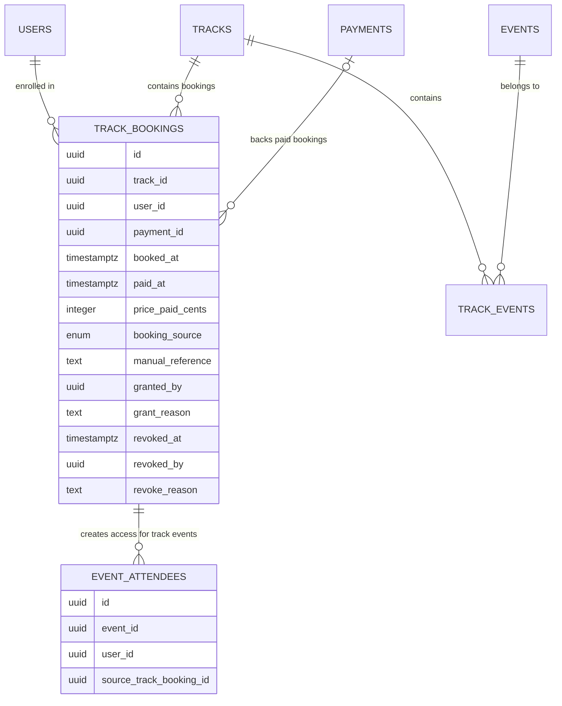

# feat: Add manual track enrollment and revocation

## Overview

Add a manager-facing flow that mirrors the existing premium series access manager, but for tracks. It must support:

- manual enrollment for members who paid outside Fawaterk
- manual revocation for any active track enrollee

The result must be a real track enrollment, not a visual-only grant, so the member gets the same access as a normal enrolled user:

- track-level access on the public track page
- Zoom / location URL access for every event inside the track
- premium series and premium asset access already derived from `track_bookings`

This feature must preserve payment and audit invariants. The system must **not** fake Fawaterk invoice data or create misleading payment records just to make the admin table look complete.

## Problem Statement

Today, the working manual-access pattern exists for premium series:

- Backend grant routes live in `server/src/routes/api/seriesGrants.ts:15-239`
- Admin UI lives in `src/features/series/components/SeriesAccessManager.tsx:50-510`

Track access works differently. A user is considered enrolled when a `track_bookings` row exists:

- Schema: `server/src/db/schema/index.ts:227-250`
- Admin attendees list reads `track_bookings` plus optional joined payment invoice fields: `server/src/routes/api/tracks.ts:783-869`
- Event meeting-link access checks `track_bookings`: `server/src/routes/api/events.ts:320-340`
- Premium series access checks `track_bookings`: `server/src/routes/api/series.ts:189-223`
- Premium library asset access checks `track_bookings`: `server/src/routes/api/library.ts:233-259`, `server/src/routes/api/library.ts:384-410`
- Public track detail reveals `locationUrl` only when `userHasBooked`: `server/src/routes/api/tracks.ts:468-550`

This means a manual track access feature cannot stop at a separate “grant” row unless every downstream access check is also rewritten. That would be a larger, riskier change than needed.

## Recommended Solution

### Decision Summary

Use `track_bookings` as the **canonical enrollment record**, extend it with manual-enrollment and revocation audit metadata, and route both manual enrollments and revocations through shared booking logic so access changes stay consistent across tracks, events, series, and library content.

### Why This Is The Safest Path

1. Existing access checks already trust `track_bookings`.
2. Existing capacity counts already use `track_bookings`.
3. Existing attendee/admin views already read `track_bookings`.
4. Existing paid fulfillment already knows how to create `track_bookings` plus child event attendee rows atomically in `server/src/routes/api/payments.ts:137-256`.
5. Creating a separate track-grant table would force cross-cutting changes to access resolution, attendee lists, and booking logic.

## Strong Recommendation About Invoice Fields

Do **not** reuse or synthesize `payments.fawaterkInvoiceId` or `payments.fawaterkInvoiceKey` for manual enrollments.

### Why Not

- `payments.fawaterkInvoiceId` and `payments.fawaterkInvoiceKey` are part of webhook verification and payment reconciliation semantics: `server/src/routes/api/payments.ts:977-986`
- Fawaterk invoice creation currently uses the real `payment.id` as `invoiceNumber`: `server/src/routes/api/payments.ts:1776-1802`
- Admin metrics treat paid track revenue as rows from `payments` only: `server/src/routes/api/adminMetrics.ts:48-85`
- Faking gateway invoice data would make support, reporting, and future debugging harder, not easier

### What To Use Instead

Keep the existing gateway-verification columns and add generic enrollment metadata beside them:

- `Invoice ID`: keep existing value for gateway-backed rows, `—` for manual/free rows
- `Invoice Number`: keep existing value for gateway-backed rows, `—` for manual/free rows
- `Enrollment Source`: `paid`, `manual`, or `free`
- `Reference`: manager-entered manual reference for manual rows, optional secondary display for paid/free rows if useful

This preserves real invoice meaning for Fawaterk verification while still giving ops a searchable identifier for manual transfers.

## Proposed Data Model

### Track Bookings

Add audit metadata to `track_bookings` in `server/src/db/schema/index.ts`:

- `bookingSource` enum: `paid | free | manual`
- `manualReference` text nullable
- `grantedBy` uuid nullable
- `grantReason` text nullable
- `revokedAt` timestamptz nullable
- `revokedBy` uuid nullable
- `revokeReason` text nullable

Keep using the existing fields:

- `paidAt` to mark the booking as fully settled
- `pricePaidCents` as the amount associated with the enrollment
- `paymentId` only when the booking came from the real checkout/payment flow

Active enrollment means `revokedAt IS NULL`.

### Event Attendee Provenance

Add one nullable provenance field to `event_attendees`:

- `sourceTrackBookingId` uuid nullable

Use it only for attendee rows that were created by track enrollment. Individual event signups keep this field null.

This is required so revoking a track enrollment removes only the event access created by that track booking, without cancelling a separate direct event registration the user may already have.

### Backfill Rule

Migration backfill for existing rows:

- `paid` when `payment_id IS NOT NULL`
- `free` otherwise

Manual rows will be inserted explicitly by the new admin flow.

### ERD



## Proposed API and UI Shape

### Admin UI

Create a dedicated manager card on the admin track detail page:

- New component: `src/features/tracks/components/TrackManualEnrollmentManager.tsx`
- Mounted in: `src/features/tracks/pages/AdminTrackDetail.tsx`

Recommended UI fields:

- member search
- required audit reason
- required manual reference
- optional amount override if the manually paid amount differs from the current track price

Recommended revocation UI in `src/features/tracks/components/TrackAttendeesList.tsx`:

- add a row-level `Revoke` action for any active enrolled user
- require a revoke reason in a confirmation dialog
- after success, remove the user from the active attendees list

Recommended table changes in `src/features/tracks/components/TrackAttendeesList.tsx`:

- keep `Invoice ID`
- keep `Invoice Number`
- add `Source`
- add `Reference`

Update search placeholder and backend search to include manual reference.

### Backend Routes

Add manager-only routes in `server/src/routes/api/tracks.ts` or a dedicated companion module:

- `POST /tracks/:id/manual-enrollments`
- `POST /tracks/:id/enrollments/:userId/revoke`

Recommended request shape for single enrollments:

```json
{
  "userId": "uuid",
  "reason": "Manual wallet transfer confirmed by ops",
  "reference": "instapay-2026-04-13-abc123",
  "amountPaidCents": 150000
}
```

Recommended revoke request shape:

```json
{
  "reason": "Manual access revoked by ops after duplicate signup"
}
```

## Technical Approach

### Phase 1: Extract Canonical Booking Logic

Avoid creating a third track-booking implementation. The repo already has:

- paid helper path in `server/src/routes/api/payments.ts:137-256`
- free inline path in `server/src/routes/api/tracks.ts:1481-1598`

Before adding manual enrollment, consolidate the atomic track-booking logic into one shared helper, for example:

- `server/src/routes/api/trackBookingShared.ts`

That helper should:

- lock track + track events
- validate track capacity
- validate child event capacity
- insert missing `event_attendees`
- insert/update `track_bookings`
- return the `trackBookingId` used for the write

Define two explicit booking predicates and use them intentionally:

- `active track booking`: booking row exists and `revokedAt IS NULL`
- `historical track booking`: any booking row exists, including revoked rows

Use the active predicate for access, active capacity, attendee listing, and repurchase eligibility.
Use the historical predicate for track-structure lock rules that already protect sold tracks from later event-lineup changes.

When it inserts new `event_attendees` rows for track access, it should set `sourceTrackBookingId` to that booking record.

Manual enrollment should call the same helper with:

- `paymentId = null`
- `paidAt = now`
- `pricePaidCents = supplied or defaulted amount`
- new metadata fields populated (`bookingSource=manual`, `manualReference`, `grantedBy`, `grantReason`)

### Phase 2: Manager Enrollment and Revocation Flow

Implement the admin-only creation route with:

- UUID validation
- `requireManager`
- Zod validation for `reason` and `reference`
- duplicate protection using the existing unique `(track_id, user_id)` constraint
- clear API response for:
  - already enrolled
  - track not found
  - user not found
  - track full
  - event full
  - booking window not configured when the shared helper requires it

Implement the admin-only revoke route with:

- UUID validation for `trackId` and `userId`
- `requireManager`
- Zod validation for a required revoke reason
- lookup of the active booking (`revokedAt IS NULL`)
- transaction that:
  - marks the target `track_bookings` row revoked
  - marks any `event_attendees` rows created from that booking as cancelled
  - leaves independently created event registrations untouched

Revocation is an access operation only. It must not edit or delete `payments`, invoice fields, or historical revenue rows.
Revocation also must not remove the track from the historical “has bookings” state used by track edit guards.

### Phase 3: Attendee Serialization Update

Extend `GET /tracks/:id/attendees` to return:

- `source`
- `reference`

Recommended serialization rule:

- `source = 'manual'` and `reference = trackBookings.manualReference` for manual rows
- `source = 'paid'` and `reference = payments.fawaterkInvoiceKey` for gateway-backed rows
- `source = 'free'` and `reference = null` for free rows
- keep `invoiceId = payments.fawaterkInvoiceId` for gateway-backed rows
- keep `invoiceNumber = payments.fawaterkInvoiceKey` for gateway-backed rows
- leave `invoiceId` / `invoiceNumber` null for manual and free rows

Search should include:

- name
- email
- phone
- gateway invoice key / ID
- manual reference

This endpoint should continue to list only active enrollments (`revokedAt IS NULL`).

### Phase 4: Frontend Wiring

Update:

- `src/app/api/tracks.ts`
- `src/features/tracks/hooks/useTrackAttendees.ts`
- `src/features/tracks/components/TrackAttendeesList.tsx`
- `src/features/tracks/pages/AdminTrackDetail.tsx`

The new manager should intentionally resemble `SeriesAccessManager`, but it should not blindly clone it if that would force unsafe batch semantics for payment references.

## System-Wide Impact

### Interaction Graph

`manual enrollment` -> shared booking helper -> active `track_bookings` row exists -> public track detail returns `userHasBooked=true` and reveals `locationUrl` -> event detail treats user as `trackBooked` and reveals meeting link -> series/library checks see active `track_bookings` row and unlock premium content.

`revocation` -> booking row marked revoked -> track-derived `event_attendees` rows cancelled -> public track/event/series/library checks stop resolving access from that booking.

`repurchase after revocation` -> checkout sees no active booking -> normal paid track flow can create a new active booking again.

`track edit after revocation` -> track still counts as historically booked -> event-lineup edit guards remain blocked.

### Error & Failure Propagation

- Capacity and missing-event failures must occur before partial enrollment is committed.
- Any failure after inserting attendee rows but before inserting the track booking must rollback the full transaction.
- Any failure during revocation after cancelling child attendee rows but before revoking the booking must rollback the full transaction.
- API must return real business errors (`TRACK_FULL`, `EVENT_FULL`, `USER_NOT_FOUND`) rather than masking them as generic 500s.

### State Lifecycle Risks

- The biggest risk is partial child-row creation if manual enrollment does not use the same transaction boundary as paid/free booking.
- A second risk is duplicating track-booking logic in a third place and letting paid, free, and manual paths drift.
- A third risk is revoking event attendee rows that were not created by the track booking.

### API Surface Parity

Any manual enrollment change must keep these surfaces in sync:

- `GET /tracks/:id` public detail
- `GET /tracks/:id/attendees`
- `GET /events/:id`
- `GET /series/:id`
- `GET /library`
- `GET /library/:id`

These existing historical guard paths must remain based on historical bookings, not active-only bookings:

- track capacity floor validation
- add event to track
- remove event from track
- any future track structure edit guard

## Acceptance Criteria

### Functional

- [ ] Managers can manually enroll an existing platform user into a track from the admin track detail page.
- [ ] Managers can revoke any active track enrollment from the same admin surface.
- [ ] A manual enrollment creates real track access, not just an admin-side label.
- [ ] A manually enrolled user can see every track event meeting link / location URL exactly like a normal track enrollee.
- [ ] Premium series and premium library assets linked through that track become accessible via the existing `track_bookings` checks.
- [ ] Admin attendees table keeps `Invoice ID` and `Invoice Number`, and adds `Source` and `Reference` alongside them.
- [ ] Admin search can find manual enrollments by the stored manual reference.
- [ ] Revoking a track enrollment removes track-level access and track-derived event access immediately.
- [ ] Revoking a track enrollment does not remove an independent direct event signup if that event access was not created by the track booking.
- [ ] A revoked user can buy the same track again later through the normal checkout flow.
- [ ] Revoking all active enrollments does not unlock track event-lineup editing; sold tracks remain historically locked.

### Safety / Audit

- [ ] No fake Fawaterk invoice IDs or invoice keys are written anywhere.
- [ ] No fake `payments` rows are created for manual enrollments in v1.
- [ ] Each manual enrollment records actor, reason, reference, and timestamp.
- [ ] Each revocation records actor, reason, and timestamp.
- [ ] Manual enrollment uses the same atomic booking semantics as paid/free booking.
- [ ] Revocation does not edit or delete `payments`, invoice fields, or revenue history.

### Quality Gates

- [ ] Add route-level tests for single manual enrollment.
- [ ] Add route-level tests for track enrollment revocation.
- [ ] Add regression tests proving manual track enrollment unlocks event and series/library access through existing checks.
- [ ] Add regression tests proving revocation removes track-derived access and preserves unrelated direct event access.
- [ ] Add regression tests proving revoked users can repurchase the same track later.
- [ ] Add regression tests proving track edit guards still treat revoked bookings as historical bookings.
- [ ] Add tests for attendee serialization/search with manual references.
- [ ] Run `npm run test:unit`.
- [ ] Run `npm run lint`.

## Testing Plan

### New / Updated Tests

- `tests/unit/manual-track-enrollments-api.test.ts`
  - creates manual enrollment for a paid track
  - rejects invalid UUIDs
  - rejects missing reason/reference
  - rejects unknown user
  - respects track/event capacity
- `tests/unit/track-enrollment-revocation-api.test.ts`
  - revokes an active booking
  - rejects unknown booking
  - requires revoke reason
  - cancels only `event_attendees` rows linked through `sourceTrackBookingId`
  - allows the user to purchase the same track again later after revocation
- `tests/unit/series-access.test.ts`
  - extend to show manual track enrollment still satisfies `hasTrackBooking`
  - extend to show revoked track booking no longer satisfies `hasTrackBooking`
- `tests/unit/track-edit-guards.test.ts`
  - revoked bookings still count as historical bookings for track event-lineup edit guards
- `tests/unit/track-attendees-serializer.test.ts`
  - paid row => source/reference from gateway payment
  - manual row => source/reference from track booking metadata
  - free row => source free, reference null

### Manual Smoke Scenarios

1. Manager manually enrolls user on a paid track from `[src/features/tracks/pages/AdminTrackDetail.tsx](/Users/hosnimohamed/Projects/trafficmena/src/features/tracks/pages/AdminTrackDetail.tsx)`.
2. User opens public track page and sees track `locationUrl`.
3. User opens each event inside the track and sees meeting links.
4. User opens linked premium series and premium assets successfully.
5. Admin attendees search finds the manual reference.
6. Manager revokes the same user and the user immediately loses track-derived access.
7. Any separately booked event not created by the track remains accessible after track revocation.

## Implementation Notes

- Prefer new file: `server/src/routes/api/trackBookingShared.ts` rather than leaving booking logic split between `payments.ts` and `tracks.ts`.
- Keep manager UX on the existing admin track detail surface instead of scattering it across the edit form and detail page.
- Reuse the search + validation feel of `SeriesAccessManager`, but favor safer semantics over literal UI cloning.
- Leave track revenue metrics unchanged in v1; manual enrollments and revocations should not create, delete, or mutate payment rows.
- Preserve the current “lock forever after any booking” behavior for track structure changes.

## Sources & References

### Internal References

- Series manual access pattern: `server/src/routes/api/seriesGrants.ts:15-239`
- Series manager UI: `src/features/series/components/SeriesAccessManager.tsx:50-510`
- Track booking schema: `server/src/db/schema/index.ts:227-250`
- Track attendees endpoint: `server/src/routes/api/tracks.ts:783-869`
- Public track entitlement: `server/src/routes/api/tracks.ts:468-550`
- Event meeting-link entitlement: `server/src/routes/api/events.ts:320-340`
- Series entitlement via track booking: `server/src/routes/api/series.ts:189-223`
- Library entitlement via track booking: `server/src/routes/api/library.ts:233-259`, `server/src/routes/api/library.ts:384-410`
- Shared atomic paid booking helper candidate: `server/src/routes/api/payments.ts:137-256`
- Free track booking duplicate logic: `server/src/routes/api/tracks.ts:1481-1598`
- Gateway invoice invariant: `server/src/routes/api/payments.ts:1776-1802`
- Revenue metrics currently keyed from payments: `server/src/routes/api/adminMetrics.ts:48-85`

### Institutional Learnings

- `docs/solutions/database-issues/drizzle-transaction-atomicity.md`
- `docs/solutions/feature-implementations/track-booking-grants-event-access.md`
- `docs/solutions/feature-implementations/track-details-view-admin.md`
- `docs/branch-learnings/codex-legacy-members-fixes-institutional-learnings.md`
