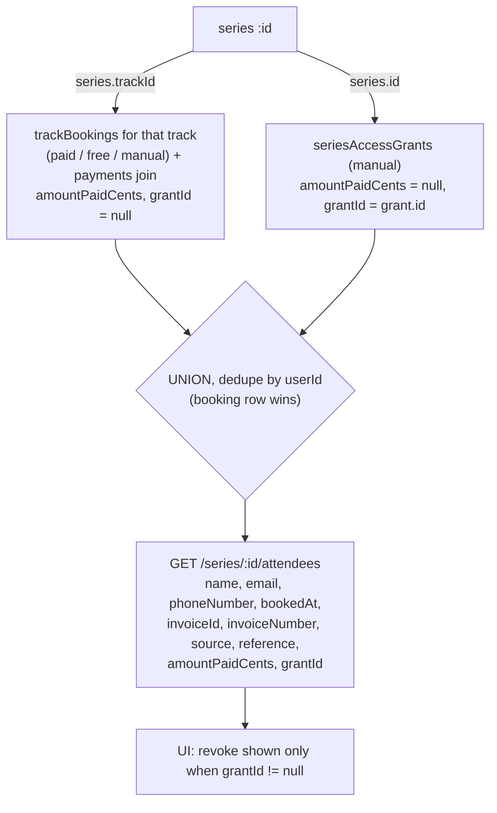

# feat: Six targeted admin/platform improvements (REVISED)

> **This copy supersedes `docs/plans/2026-06-25-001-feat-admin-enrollment-and-platform-fixes-plan.md`.** The original is intentionally left intact for the record. This revision integrates a six-persona review (feasibility, security, coherence, adversarial, design/UX, scope) that was verified against the installed code. The material changes are summarized in **Review Revisions** below.
>
> **Production-safety note:** Every change touches a live system. The plan stays MVP — reuse existing patterns (`/auth/otp/*`, the track→series link, the `isPublished` toggle) over new machinery — but the review forced two approaches to change because the original ones were *infeasible as written*, not merely improvable.

---

## Review Revisions (what changed vs `…001`, and why)

| # | Original (001) | Revised (002) | Driver |
|---|----------------|---------------|--------|
| Timezone (#3) | Manual DST toggle drives save offset; display stays IANA | **Fully automatic, no toggle** — save derives the correct Cairo offset *per entered date* from IANA, the same source display uses. Settings column + toggle UI **removed**. | Two reviewers proved (quantified) that toggle-save + IANA-display are two offset sources → a *guaranteed* 1-hour mismatch for cross-season scheduling. User chose "fully automatic." |
| Email (#4) | Enable Better Auth `emailOTP({changeEmail})`; client `requestEmailChange()` | **Custom REST flow** (`POST /auth/email-change/request` + `/verify`) mirroring the existing `/auth/otp/*` endpoints; reuse `sendOtpEmail` + `otpRateLimiter`; update `users.email` in a transaction. | Verified against installed `better-auth@1.4.14`: that feature is link-to-old-email + `emailVerified`-gated, **no auth handler/client is mounted** (auth is hand-rolled via `auth.api.*`), so the original path is unreachable. |
| Email security | "CSRF + rate-limit already cover it" | Explicit per-user **and** per-destination-email rate limiting, **old-email notification**, **session invalidation** on success. | Email is the *sole* auth factor → email change is a full account-takeover surface. |
| Series list (#1) | Revoke gated on `source === 'manual'` | Revoke gated on a **`grantId` discriminator**; honest label note that subscribers/staff aren't listed. | Manual *track* bookings also carry `source='manual'` → original rule renders dead revoke buttons. The list shows 2 of 5 access sources. |
| Series/amount backend | U1 "reuse exact track query, don't change output" + U2 changes that output | **Extract a shared `buildTrackAttendeesQuery` helper (incl. amount) first**, both routes consume it. | The two units edited the same 100-line block in contradictory ways. |
| Migrations | `default true` (nullable implied) | `notNull().default(...)` to match `tracks`. Corrected route verb to `PATCH /admin/settings/general`. | Nullable + `eq(col,true)` silently hides NULL rows; settings route is PATCH not PUT. |
| Event draft (#5) | Toggle + badge | + a **save-time "Saved as draft — not public" confirmation** so events aren't silently hidden. | Events publish instantly today; a silent draft default can lose a registration window. |
| Phone (#6) | "strip on input/blur" | **Strip on blur**, persistent helper text (not just placeholder), profile field parses E.164 into selector+local. | Strip-on-input causes cursor jank; profile field would mis-normalize the stored `+20…` value. |
| Cut | `utcToCairoLocal` helper; public exposure of the timezone flag | **Removed** (speculative / YAGNI). | Prefill already uses the correct IANA `toCairoDatetimeLocal`. |

Everything in Phases A-amounts, D, and E was confirmed feasible and grounded in copyable patterns; the changes there are clarifications, not redesigns.

---

## Summary

Six independent changes, shippable separately:

1. **Series "Enrolled Users" parity** — show the linked track's buyers (paid/free/manual) **plus** manual series grants, mirroring the track list. (Read-time union; no change to how access is computed.)
2. **Show amount paid** — surface the already-stored `pricePaidCents` as an "Amount Paid" column in event/track/series enrolled lists.
3. **Cairo timezone correctness** — fix a proven, environment-dependent date-corruption bug at save time; convert using the correct per-date Cairo offset automatically (no toggle).
4. **Change email from profile (OTP)** — a custom OTP-to-new-email flow built on the existing OTP infrastructure, with account-takeover defenses.
5. **Event draft/published** — `isPublished` on events (mirrors tracks); new events default to draft with a save-time confirmation.
6. **Phone leading-zero normalization** — Egypt (`+20`): strip the leading `0` and validate Egyptian mobile prefixes for consistent E.164.

---

## Problem Frame

Production digital-marketing education hub. Staff (owner/admin/manager) run events, tracks (event bundles), and series (content collections linked to a track). Operational friction:

- **Visibility gap:** track buyers get series access via a *computed* check (`resolveSeriesAccess`, `server/src/routes/api/seriesAccess.ts`), but the series admin screen only lists materialized manual grants — so staff can't see the track-derived members.
- **Reporting gap:** discounts and promo codes make the paid amount vary, but the UI shows only a paid/free/manual badge, never the figure.
- **Data-integrity bug (#3):** event/track times save with an inconsistent shift. Root cause proven below (environment corruption at write time, *not* DST).
- **Self-service gaps:** users can't change their email; single events publish instantly with no draft state; Egyptian phone entry is inconsistent because of the leading zero.

---

## Scope Boundaries

### In scope
- Series enrolled-users read view at parity with tracks (track buyers ∪ manual grants), honestly labeled.
- Amount-paid column sourced from stored values, gated to staff.
- Root-cause fix for date-entry corruption (automatic per-date Cairo offset).
- Custom OTP email-change flow surfaced in the profile UI, with takeover defenses.
- `isPublished` on events with admin toggle, public filtering, draft default + save-time confirmation.
- Egypt phone leading-zero strip + prefix validation at signup and profile.

### Deferred to Follow-Up Work
- **Remediation of historically corrupted event/track dates.** Track-date corruption *may* be deterministically correctable if the production server's timezone at write time is known and constant; event-date corruption is harder (depended on the saver's browser). Both are out of this scope — handled operationally and gated behind a dry-run (see *Operational Notes*). After the save fix lands, re-saving is **safe** (no fresh corruption), which de-risks manual cleanup.
- **Phone data migration / backfill** (explicitly out — "fix input only").
- **Manual enrollment for single events** (events have no manual-enrollment path; not requested).
- **Requiring an old-email OTP in addition to the new-email OTP** (a stronger takeover defense; baseline ships new-email OTP + old-email notification + session invalidation — see U6).

### Non-goals
- No change to how series access is *computed* (`resolveSeriesAccess` stays the source of truth).
- No change to the payment/pricing engine; we only *read* persisted amounts.
- No multi-currency work (EGP-only by design).
- No manual DST toggle (superseded by the user's "fully automatic" decision; IANA already encodes Egypt's DST).

---

## Requirements Traceability

| R-ID | Requirement | Units |
|------|-------------|-------|
| R1 | Series enrolled list shows track buyers + manual grants (parity) | U2, U3 |
| R2 | Show exact amount paid for paid + manual members | U1, U2, U4 |
| R3 | Cairo timezone correct (automatic, DST-aware) | U5 |
| R4 | Users change their email from profile, confirmed by OTP | U6, U7 |
| R5 | Single events support draft/published; new events default to draft | U8, U9 |
| R6 | Egypt phone forces no-leading-zero (+20) and validates prefixes | U10, U11 |

---

## Key Technical Decisions

**KTD-1 — Series enrolled list is a read-time UNION, not a new materialized table.** The new endpoint unions the linked track's bookings (via a shared track-attendees helper) with the series' manual grants, deduped by user (booking row wins). We do **not** start writing grant rows on purchase — that would duplicate the existing computed-access model. A series with `trackId = null` yields grants only.

**KTD-2 — Amounts are read from stored values, never recomputed.** `eventAttendees.pricePaidCents` / `trackBookings.pricePaidCents` hold the final figure (after discount/promo). The query returns `COALESCE(pricePaidCents, payments.amountCents, 0)` so confirmed-free rows return `0` (UI shows "Free"). Manual *series grants* have no amount → `null` (UI shows "—"). Amounts are **staff-only** and must never appear in any public payload.

**KTD-3 — Timezone: automatic, per-date, environment-independent. No toggle.** The admin types a Cairo wall-clock time; we convert to UTC using the **correct Cairo offset for that specific date**, derived from IANA `Africa/Cairo` (the same source the display already trusts). Because save and display use one offset source, the round-trip is the identity and there is no cross-season class of bug. This replaces the broken `getCairoOffsetString()` (which returned `Cairo − browserOffset`) and the track form's naked-string submit (parsed in the server's timezone). Display formatting in `src/shared/utils/dateUtils.ts` is unchanged (already correct).

**KTD-4 — Email change is a custom OTP flow on existing infrastructure, not Better Auth's native changeEmail.** Verified against installed `better-auth@1.4.14`: native `changeEmail` sends a *link to the old email*, is gated on `emailVerified` (false for most users here), and there is **no mounted Better Auth handler or frontend client** (auth is hand-rolled via `auth.api.*`). We instead add two Hono routes mirroring `/auth/otp/request|verify`: OTP to the **new** email (proving control of it), then a transactional `users.email` update. OTP generation/delivery reuses `sendOtpEmail`; throttling reuses `otpRateLimiter` and the `authVerifications`-count pattern.

**KTD-5 — Email change defends the account-takeover surface.** Because email is the only auth factor, losing `users.email` = total account loss with no recovery. Baseline defenses: (a) per-user **and** per-destination-email rate limits on the request endpoint; (b) a **notification email to the current address** when a change is requested and when completed (out-of-band signal of an attack); (c) **invalidate the user's other sessions** on success. Requiring an old-email OTP too is a documented optional upgrade (Scope: deferred).

**KTD-6 — Event `isPublished` mirrors tracks, plus a no-silent-draft safeguard.** Column `is_published boolean not null default true` (existing events stay visible); the create form defaults *new* events to draft (`false`) — the same split tracks use. Because events publish instantly today and are often created by less-trained staff, the form shows a save-time confirmation ("Saved as draft — not visible publicly. Publish now?") so a hidden event can't silently miss its registration window.

**KTD-7 — Phone fix is forgiving + validating, frontend-first, with a backend guard.** Egypt (`dial === '20'`): strip a single leading `0` from the local part **on blur** (avoids cursor jank), validate prefix ∈ {10,11,12,15} and 10 national digits, with persistent helper text. A backend guard collapses `+200…` → `+20…` so no path persists the double-zero form. No existing-data migration.

---

## High-Level Technical Design

### Timezone root cause (proven) and the automatic fix

Corruption is at **save**, by an amount equal to the saver's UTC offset — which is why it is never a clean one hour.

```mermaid
sequenceDiagram
    participant A as Admin (types "2:30 PM" Cairo)
    participant F as Event/Track form
    participant DB as DB (UTC)
    participant V as Viewer (IANA Cairo display)

    rect rgb(255,235,235)
    Note over F: BEFORE — event form uses getCairoOffsetString()<br/>= Cairo − browserOffset (wrong); track form sends<br/>naked string → server parses in server tz (wrong)
    A->>F: datetime-local "2026-07-15T14:30"
    F->>DB: stored UTC corrupted by ±(device/server offset)
    DB->>V: shows wall ± offset → 1–4h shift
    end

    rect rgb(235,255,235)
    Note over F: AFTER — cairoLocalToUtcIso() derives the offset<br/>for THAT date from IANA Africa/Cairo (same as display)
    A->>F: datetime-local "2026-07-15T14:30"
    F->>DB: 2026-07-15T11:30:00Z (correct, env-independent)
    DB->>V: IANA Africa/Cairo (Jul=+3) → 2:30 PM ✓
    end
```

The proof (ran the actual `getCairoOffsetString` logic and a naked-string parse under `TZ` ∈ {UTC, Africa/Cairo, Asia/Dubai, Europe/London, America/New_York, Asia/Karachi}): the save shift equaled the saver's UTC offset (1–4h), and an offset-qualified ISO (`…+03:00`) parsed to identical UTC under every TZ.

### Series enrolled list = union of two existing sources



---

## Implementation Units

> Tests: `node --test` via `npm run test:unit`, files in `tests/unit/*.test.ts`. Gates: `npm run lint`, `npm --prefix server run build`, `npm run build`. New API fields are **camelCase** in responses (matching `invoiceId`, `source`); the frontend API client maps to snake_case where the existing types do.

### Phase A — Series enrollment parity + amounts (R1, R2)

#### U1. Backend: shared track-attendees helper + amount in event/track routes

**Goal:** Factor the track-attendees query into a reusable helper that includes the amount, and add the amount to the event attendees route — so both routes and the new series route share one tested query shape.
**Requirements:** R2.
**Dependencies:** none. (Do this **before** U2 — U2 consumes the helper.)
**Files:**
- `server/src/routes/api/tracks.ts` (`GET /tracks/:id/attendees`, ~794–895) — extract the select/join/source-CASE/reference-CASE into a shared helper (e.g. `server/src/utils/attendeesQuery.ts` or a function exported near the route); add `amountPaidCents`
- `server/src/routes/api/events.ts` (`GET /events/:id/attendees`, ~375–464) — add `amountPaidCents`
- `server/src/utils/attendeesQuery.ts` — create (the shared track-attendees builder), if extraction is cleaner than in-file
- `tests/unit/attendee-amounts.test.ts` — create
**Approach:** `amountPaidCents = COALESCE(<table>.pricePaidCents, payments.amountCents, 0)` — no new joins (payments already left-joined in both). Keep every existing field byte-for-byte unchanged (additive only); the extraction must preserve the track route's current output exactly. Confirm the `reference`/`source` CASE logic moves intact.
**Patterns to follow:** existing track attendees handler; `activeTrackBookingWhere` in `server/src/utils/booking.ts`.
**Test scenarios:**
- Gateway-paid attendee → discounted `amountPaidCents` (not list price).
- Manually-enrolled track member → captured manual amount.
- Free registration (no payment row) → `0`.
- Null `pricePaidCents` + linked payment → falls back to `payments.amountCents`.
- Track route output is otherwise identical pre/post extraction (regression guard — assert full field set).

#### U2. Backend: `GET /series/:id/attendees` (union, with `grantId` discriminator)

**Goal:** Unified series enrolled list = linked-track bookings ∪ manual series grants.
**Requirements:** R1, R2.
**Dependencies:** U1 (uses the shared helper).
**Files:**
- `server/src/routes/api/seriesGrants.ts` — add the `GET /series/:id/attendees` route here (logically adjacent to grant listing; resolves the 001 "or series.ts" ambiguity)
- `tests/unit/series-attendees.test.ts` — create
**Approach:**
- `requireManager`, Zod `uuid` on `:id` (gotcha: `docs/solutions/feature-implementations/track-details-view-admin.md`).
- Load series; if `trackId` present, build track-booking rows via the U1 helper (each with `amountPaidCents`, `grantId = null`).
- Add active manual grants (`seriesAccessGrants` where `revokedAt IS NULL`) as rows: `source = 'manual'`, `reference = grantReason`, `amountPaidCents = null`, **`grantId = grant.id`**.
- **Dedupe by `userId`** (track-booking row wins).
- `trackId = null` → grants-only (no track join, no crash).
- Return the same field set as the track route plus `amountPaidCents` and `grantId`.
**Test scenarios:**
- Linked track returns paid/free/manual bookers with correct `source` and `grantId = null`.
- Manual grant for a user with no track booking → row with `grantId` set.
- User both a track buyer and granted → appears once (booking row, `grantId = null`).
- `trackId = null` → grants only.
- Revoked grants excluded.
- `amountPaidCents` from booking; `null` for grant-only rows.
- Non-UUID `:id` → 400 before any query. Manager allowed; `user`/anon rejected.
- **Negative assertion:** response is only reachable via the manager-gated route (amount/PII never on a public payload).

#### U3. Frontend: series enrolled list at parity (single source of truth for revoke)

**Goal:** Render the unified "Enrolled Users" table on the series admin page; make it the one place series grants are revoked.
**Requirements:** R1.
**Dependencies:** U2.
**Files:**
- `src/features/series/components/SeriesAttendeesList.tsx` — create (mirror `src/features/tracks/components/TrackAttendeesList.tsx`)
- `src/features/series/hooks/useSeriesAttendees.ts` — create
- `src/app/api/series.ts` — add `fetchSeriesAttendees` + type (incl. `amountPaidCents`, `grantId`)
- `src/pages/admin/library/series/[id].tsx` — render `SeriesAttendeesList` **above** `SeriesAccessManager`, with a clear heading/divider
- `src/features/series/components/SeriesAccessManager.tsx` — keep the add-grant + bulk-CSV controls; **remove its standalone "Active grants" revoke table** (revoke now lives in the enrolled list, avoiding duplicate affordances)
**Approach:**
- Columns mirror `TrackAttendeesList` + "Amount Paid" (U4): Name, Email, Phone, Timestamp, Invoice ID, Invoice Number, Source, Reference, Amount Paid, Actions.
- **Revoke renders only when `grantId != null`** (series-grant rows); empty Actions cell renders **`—`** (matches existing empty-cell convention). Track-buyer rows are read-only by design.
- Revoke calls the existing series-grant revoke endpoint (`DELETE /series/:id/grants/:grantId` — confirm exact path in `seriesGrants.ts`).
- Add a small informational note above the table: *"Subscribers and staff also have access to this series and are not listed here; non-premium series are visible to all members."* (Honest scope of "enrolled.")
- Route guard must include `manager`: `allowedRoles={['owner','admin','manager']}`.
- Reuse name fallback (`name || [firstName,lastName].join(' ') || 'Unknown Member'`) and `keepPreviousData`.
**Patterns to follow:** `TrackAttendeesList.tsx`; `track-details-view-admin.md`.
**Test scenarios:** `Test expectation: light — mirror of a tested component; backend coverage in U2. Verify: track buyers + grants render; revoke appears only on grant rows; empty Actions = "—"; manager can open the page; SeriesAccessManager still adds grants.`

#### U4. Frontend: "Amount Paid" column in all three enrolled lists

**Goal:** Display the amount as formatted EGP with a clear free/null contract.
**Requirements:** R2.
**Dependencies:** U1, U3.
**Files:**
- `src/features/events/components/EventAttendeesList.tsx`, `src/features/tracks/components/TrackAttendeesList.tsx`, `src/features/series/components/SeriesAttendeesList.tsx` — modify
- `src/app/api/events.ts`, `src/app/api/tracks.ts`, `src/app/api/series.ts` — add `amountPaidCents` to attendee types
**Approach:** Format cents→EGP via the existing `formatManualEnrollmentAmountEgp` (`src/features/tracks/utils/manualEnrollmentAmount.ts`). **Contract:** `0` → "Free", `null` → "—", positive → formatted EGP. (Backend guarantees `0` for confirmed-free rows per U1, `null` only for grant-only series rows.)
**Test scenarios:** `Test expectation: none — presentational; formatting util already covered. Verify paid/manual/free/grant rows render Free, amount, and "—" correctly.`

---

### Phase B — Cairo timezone fix (automatic, no toggle) (R3)

#### U5. Frontend: per-date Cairo conversion + form fixes (the bug fix)

**Goal:** Eliminate the environment-dependent save corruption; convert using the correct Cairo offset for the entered date.
**Requirements:** R3.
**Dependencies:** none.
**Execution note:** Start with failing unit tests that reproduce the documented multi-hour shift under several `TZ` values, then implement until green.
**Files:**
- `src/shared/utils/dateUtils.ts` — add `cairoLocalToUtcIso(datetimeLocal)` (derives the IANA `Africa/Cairo` offset for *that date* and returns UTC ISO); **remove the broken `getCairoOffsetString`**
- `src/features/events/components/AdminEventForm.tsx` — replace the `getCairoOffsetString()` append at submit (~line 226) with `cairoLocalToUtcIso(formValues.date)`; edit-prefill stays on `toCairoDatetimeLocal` (IANA, already correct)
- `src/features/tracks/components/TrackForm.tsx` — on submit, convert the four datetime-local fields via `cairoLocalToUtcIso` before `onSubmit`; replace edit-prefill `formatDateForInput` (browser-local) with `toCairoDatetimeLocal` (IANA)
- `tests/unit/timezone-conversion.test.ts` — create
**Approach:**
- `cairoLocalToUtcIso("2026-07-15T14:30")`: compute Cairo's UTC offset for `2026-07-15` from `Africa/Cairo` (via `Intl` — e.g. format the date with `timeZoneName: 'longOffset'` or the format-and-diff technique, done correctly so the *target zone* — not the local zone — determines the offset), append it (`+03:00`), `toISOString()`. Environment-independent because the appended designator is explicit.
- No toggle, no settings dependency. Display functions in `dateUtils.ts` are unchanged.
- Confirm the track API client passes the now-ISO strings straight through; server `z.coerce.date()` parses an offset/`Z`-qualified ISO as UTC correctly.
**Patterns to follow:** the existing explicit-offset *idea* in the event form (the offset *source* was the bug, not the append technique); existing `toCairoDatetimeLocal`.
**Test scenarios** (run under multiple `TZ`):
- `cairoLocalToUtcIso("2026-07-15T14:30")` === `2026-07-15T11:30:00.000Z` (summer, +3) under `TZ` ∈ {UTC, Africa/Cairo, Asia/Dubai, America/New_York} — identical every time.
- `cairoLocalToUtcIso("2026-01-15T14:30")` === `2026-01-15T12:30:00.000Z` (winter, +2) under all TZ.
- **Cross-season consistency:** save a winter date via `cairoLocalToUtcIso`, then prefill via `toCairoDatetimeLocal` → returns the original wall-clock (round-trip identity, the case the old design broke).
- Result no longer equals the old broken output (`wall ± deviceOffset`).
- Empty/invalid input → safe empty value (no throw).

---

### Phase C — Change email from profile via custom OTP (R4)

#### U6. Backend: custom email-change OTP endpoints

**Goal:** OTP to the new email, transactional `users.email` update, with takeover defenses.
**Requirements:** R4.
**Dependencies:** none.
**Execution note:** Mirror `server/src/routes/api/auth.ts` structure. Generate/store the OTP in a small dedicated table to stay fully in control (Better Auth's OTP types are user-bound and its change-email is link-based — do not depend on them here). Do not log the new email or OTP.
**Files:**
- `server/src/db/schema/index.ts` — add `email_change_requests` (`id`, `userId`, `newEmail`, `otpHash`, `expiresAt`, `consumedAt`, `createdAt`) + migration; OR reuse `authVerifications` with an `email-change:${userId}` identifier convention if the team prefers zero new tables (decide in execution)
- `server/src/routes/api/auth.ts` (or a sibling `emailChange.ts` registered in `index.ts`) — add `POST /auth/email-change/request` and `POST /auth/email-change/verify`
- `server/src/services/email.ts` — reuse `sendOtpEmail`; add a plain `sendEmailChangeNotice(oldEmail, …)` (no OTP) for the old-address notification
- `tests/unit/email-change.test.ts` — create
**Approach:**
- **Request:** session required (`getSessionFromRequest`); validate `newEmail` (Zod email; reject if equal to current; reject if already in `users`); rate-limit per-user (`emailchange:user:${userId}`) **and** per-destination (`otp:email:short/daily:${newEmail}`) reusing `otpRateLimiter` + the `authVerifications`/table count pattern; generate a 6-digit OTP, store its hash with a 10-min TTL; `sendOtpEmail({ email: newEmail, otp, ttlMinutes })`; `sendEmailChangeNotice(currentEmail)` ("a change to <masked> was requested").
- **Verify:** session required; rate-limit verify attempts (reuse `otpVerificationRateLimiter` keyed on `userId`); look up the latest unconsumed request for this user+newEmail, check OTP hash + TTL; on success, in `db.transaction()`: re-check `newEmail` uniqueness → `UPDATE users SET email = newEmail, emailVerified = true WHERE id = userId` → mark request consumed → **invalidate the user's other sessions** (delete other rows in the Better Auth session table for this `userId`, keeping the current session) → `sendEmailChangeNotice(oldEmail, 'completed')`.
- Confirm no `accounts` row stores the email separately (OTP-only setup); update it too if present.
- Sessions key on `userId`, so the current session survives the email change.
**Test scenarios:**
- Request to a well-formed, unused email sends an OTP to the **new** address and a notice to the **old** address.
- Verify with the correct OTP updates `users.email`, sets `emailVerified = true`, keeps the current session valid, and invalidates other sessions.
- Wrong/expired OTP does not change the email.
- New email already in use → rejected (checked at request and again inside the transaction).
- Malformed email → rejected before any send.
- Exceeding per-user or per-destination rate limit → 429 (no OTP sent) — proves the email-bombing vector is closed.
- New email == current email → rejected.

#### U7. Frontend: profile change-email flow (state matrix + a11y)

**Goal:** Replace the disabled email field with a guided, accessible two-step flow.
**Requirements:** R4.
**Dependencies:** U6.
**Files:**
- `src/pages/Dashboard.tsx` (email field ~276–282) — modify
- a `ChangeEmailFlow` component (under `src/features` or `src/shared`) — create
- the API client (`src/app/api/users.ts` or a new `src/app/api/auth.ts`) — add `requestEmailChange`/`verifyEmailChange` via `fetchJson` (there is **no** Better Auth client; call the REST endpoints like `AuthContext` does, with `credentials: 'include'` + CSRF headers)
**Approach — explicit state matrix:**
- **Step 1 (new email):** idle / submitting (button disabled + spinner) / error (inline `<p aria-live="assertive">` below the input — *not* a toast, since this is inside the profile form) / sent.
- **Step 2 (OTP):** entry / verifying / error (inline aria-live) / expired (inline message + re-request) / success (collapse flow, show new email in the disabled field, brief inline success).
- **Resend:** 60-second cooldown (matches the short-window rate limit), with visible countdown.
- The rest of the profile form ("Save Changes") excludes `email`; email is changed only through this sub-flow (Dashboard currently submits `email` in `formData` — remove it from that payload).
- **Focus management:** move focus to the OTP input on step change; return focus to the email field on cancel/error; the step heading is an `h3` announcing the step.
- Remove the "Email updates coming soon" note.
**Patterns to follow:** existing sign-in OTP UI (`src/pages/.../CheckEmail.tsx`); `docs/solutions/development-practices/react-form-accessibility-patterns.md`.
**Test scenarios:** `Test expectation: light — exercise the contract via U6 tests; manually verify the two-step UX, resend cooldown, OTP-expiry inline handling, error announcements, focus moves, and that the email field is labeled and keyboard-navigable.`

---

### Phase D — Single event draft/published (R5)

#### U8. Backend: `events.isPublished` + public filtering + draft default

**Goal:** Add the column, hide drafts from non-staff, default new events to draft.
**Requirements:** R5.
**Dependencies:** none.
**Files:**
- `server/src/db/schema/index.ts` (`events`) — add `isPublished boolean('is_published').notNull().default(true)` + an index mirroring `tracks_is_published_idx`
- `server/drizzle/*` — generated migration
- `server/src/routes/api/events.ts` — list (`GET /events`, ~183): non-staff filter adds `eq(events.isPublished, true)` alongside the existing unpublished-track filter; detail (`GET /events/:id`, ~316): 404/403 for non-staff when unpublished; create defaults `isPublished = false` (draft) when omitted; update accepts `isPublished`; staff list/detail SELECT includes `isPublished`
- `tests/unit/event-publish.test.ts` — create
**Approach:** Column default `true` keeps existing events visible (no migration surprise); create defaults new events to draft (mirrors tracks). **Ship the detail + list filters together with the create-default** so a draft can't be reached by direct UUID during the deploy window.
**Test scenarios:**
- Migration leaves existing events `isPublished = true`.
- Non-staff `GET /events` excludes drafts; staff sees them.
- Non-staff `GET /events/:id` on a draft → 404/403; staff → 200.
- Create without `isPublished` → draft (`false`).
- Update flips visibility.
- Existing "hide events in unpublished tracks" filter still applies (regression).

#### U9. Frontend: event publish toggle + badge + no-silent-draft confirmation

**Goal:** Let admins draft/publish and never lose an event to a silent draft.
**Requirements:** R5.
**Dependencies:** U8.
**Files:**
- `src/features/events/components/AdminEventForm.tsx` — add an `isPublished` Switch (mirror `TrackForm.tsx` ~445–467); default new events to draft; include in submit payload; on save-as-draft show a confirmation/toast: *"Saved as draft — not visible publicly. Publish now?"*
- `src/app/api/events.ts` — add `isPublished` to payload + types
- `src/features/events/pages/AdminMeetups.tsx` — Published/Draft `Badge` (reuse the track badge pattern, ~308–309)
**Approach:** Copy the tracks toggle copy. Public cards need no change (backend filters handle visibility). The save-time confirmation is the safeguard for staff used to instant publishing.
**Test scenarios:** `Test expectation: none — mirrors the tracks toggle. Verify: new event saves as draft + shows the confirmation, toggling publishes, badge reflects state, draft hidden on the public list.`

---

### Phase E — Egypt phone leading-zero normalization (R6)

#### U10. Frontend: strip leading zero (on blur) + EG prefix validation

**Goal:** Consistent Egyptian numbers without the leading zero, with a visible rule.
**Requirements:** R6.
**Dependencies:** none.
**Files:**
- `src/pages/signup/Step3.tsx` — Egypt-specific handling
- `src/pages/Dashboard.tsx` (profile phone ~285–292) — same handling; **parse the stored E.164 into country-selector + local-part** (like Step3), not a flat string, so normalization applies to the local portion only
- `src/shared/utils/phone.ts` — create (shared strip/validate so signup + profile match)
- `tests/unit/phone-normalize.test.ts` — create
**Approach:**
- When `dial === '20'`: **on blur**, strip a single leading `0` from the local part; validate prefix ∈ {10,11,12,15} and 10 national digits.
- Persistent helper text (a `<p>`, visible after typing — not just a placeholder): *"Egypt numbers: enter without the leading 0 — e.g. 1012345678."*
- E.164 assembly unchanged → `+201012345678`. Generic behavior (length/digits) for other countries. `inputMode="numeric"`; labels associated; inline validation message.
**Test scenarios** (`tests/unit/phone-normalize.test.ts`):
- `"01012345678"` (EG) → local `"1012345678"` → `+201012345678`.
- `"1012345678"` (EG) → `+201012345678` (unchanged).
- Prefix ∉ {10,11,12,15} → error.
- Wrong length → error.
- Non-Egypt (e.g. `971`) → leading zero **not** stripped.
- Pasted value with spaces/dashes → digit-stripped then normalized.

#### U11. Backend: defensive `+20` leading-zero guard

**Goal:** No path persists `+200…`.
**Requirements:** R6.
**Dependencies:** none.
**Files:**
- `server/src/routes/api/users-phone.ts` (`normalizePhoneNumber`) — modify
- `tests/unit/phone-normalize-backend.test.ts` — create
**Approach:** After stripping separators, collapse `+20` followed by `0` → `+20` (`+2001…` → `+201…`); leave other country codes untouched. Existing E.164 regex remains the gate.
**Test scenarios:**
- `"+2001012345678"` → `"+201012345678"`.
- `"+201012345678"` → unchanged.
- `"+971501234567"` → unchanged.
- Output passes `isE164PhoneNumber`.
- Empty/unchanged cases behave as today (regression vs `validatePhoneNumberUpdate`).

---

## Risks & Dependencies

| Risk | Severity | Mitigation |
|------|----------|------------|
| Email change = account-takeover surface (sole auth factor) | High | New-email OTP + per-user & per-destination rate limits + old-email notification + session invalidation (KTD-5). Optional old-email OTP deferred. |
| Change-email OTP send abused to email-bomb arbitrary addresses | High | Per-destination-email throttle reusing `otp:email:short/daily:${newEmail}`; tested (U6). |
| Custom email-change mutates `users.email` Better-Auth owns | Medium | Transactional update; sessions key on `userId` (current session survives); verify no `accounts` email row; execution note. |
| Timezone fix changes new-date storage; existing dates remain wrong | Medium | Forward-only fix; display unchanged; after fix, re-saving is safe. Remediation deferred + dry-run gated. |
| Existing corrupted dates | Medium | Track dates *may* be deterministically correctable (known server tz) — investigate via dry-run; event dates harder. No blanket auto-migration. |
| Series union mis-dedupes / dead revoke buttons | Medium | Dedupe by `userId` (booking wins); revoke gated on `grantId`; covered by U2/U3 tests. |
| New events silently left as drafts | Medium | Column default `true` keeps existing events live; new-event save-time confirmation (KTD-6). |
| Amount leaks to non-staff | Medium | Amount only on manager-gated routes; explicit negative assertion (U2); never on public payloads. |
| Draft event reachable by direct UUID mid-deploy | Low | Ship detail+list filters together with the create-default (U8). |
| Phone change rejects a real number | Low | EG prefixes {10,11,12,15}; generic fallback for other countries; no data migration. |

**Cross-cutting conventions (all new endpoints/forms):** Zod UUID on params, CSRF via `getCsrfHeaders()` + `credentials: 'include'`, RBAC (`requireManager`/`requireAdmin`/session), DOMPurify on user HTML, no PII (email/OTP) in logs (per `docs/solutions/security-issues/pre-launch-security-hardening.md`).

---

## Operational Notes

- **Migrations:** U6 (`email_change_requests`, if a table is used) and U8 (`events.is_published`) add additive structures; both new booleans/columns are safe on Postgres 17 (constant defaults don't rewrite the table). Generate with `npm --prefix server run db:gen`, review SQL, apply with `npm --prefix server run db:migrate`.
- **Timezone remediation (deferred):** after U5, list upcoming items (`SELECT id, title, date FROM events WHERE date >= now() ORDER BY date;` and the track booking windows). For **track** dates, a deterministic correction may be possible if the production server's timezone at write time is known/constant — implement only behind a dry-run that prints before/after and is reviewed. For **event** dates, prefer manual re-save (now safe — no fresh corruption). Do not run any blanket auto-migration.
- **Deploy ordering:** Phase D — ship U8's detail+list filters together with the create-default. Phases are otherwise independent and can ship as separate PRs.

---

## Sources & Research

- Codebase (verified this session): `src/shared/utils/dateUtils.ts` (`getCairoOffsetString` returns `Cairo − browserOffset`), `src/features/events/components/AdminEventForm.tsx:226`, `src/features/tracks/components/TrackForm.tsx:114-168`, `server/src/routes/api/events.ts:147-243,316`, `server/src/routes/api/tracks.ts` attendees handler, `server/src/routes/api/auth.ts` (hand-rolled OTP via `auth.api.*`, rate limiting, `authVerifications`), `server/src/services/rateLimiter.ts`, `server/src/routes/api/seriesGrants.ts`, `server/src/routes/api/seriesAccess.ts`, `src/shared/data/countries.ts` (EG dial `20`), `src/app/hooks/useSettings.ts`. Installed `better-auth@1.4.14`; no auth handler/client mounted.
- Empirical proof of the timezone root cause: ran `getCairoOffsetString` + naked-string parse under six `TZ` values; save shift equaled the saver's UTC offset (1–4h), and offset-qualified ISO parsed identically everywhere.
- Multi-persona review (this plan, 2026-06-25): feasibility (caught the email-change infeasibility and the migration NULL trap), security (account-takeover + OTP-bombing defenses), adversarial (timezone cross-season mismatch, series "enrolled" scope), coherence (field-name + revoke-discriminator + sequencing), design/UX (email state matrix, phone strip-on-blur, a11y), scope (cut speculative helper + public flag exposure).
- Institutional learnings: `docs/solutions/feature-implementations/track-details-view-admin.md`, `track-booking-grants-event-access.md`, `learning-tracks-and-series-separation.md`, `docs/solutions/payment-gateway/payment-gateway-mvp-compound-analysis.md`, `docs/solutions/database-issues/drizzle-transaction-atomicity.md`, `docs/solutions/security-issues/pre-launch-security-hardening.md`.
