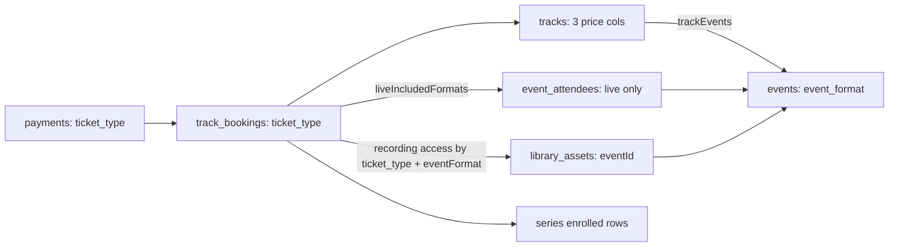
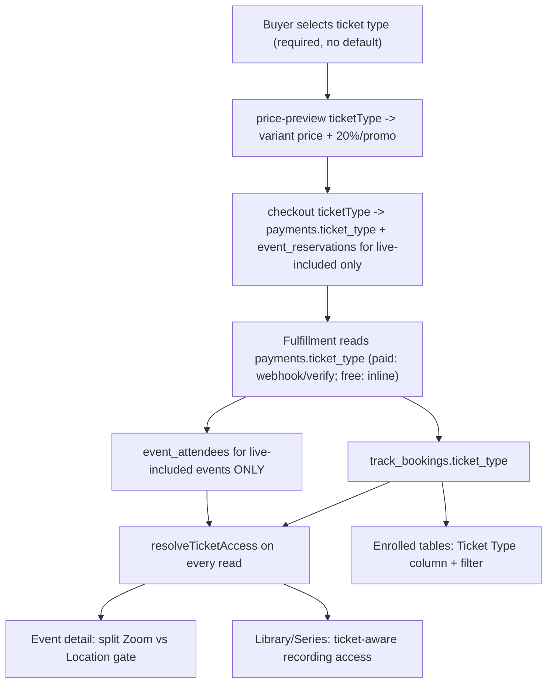

# feat: Hybrid ticket types for tracks

## Summary

Let a buyer choose **how** they consume a hybrid track — **Online Only**, **Online + Offline**, or **Offline Only** — each with its own price, and have that choice correctly drive what they pay, which sessions they're registered for, which physical seats they consume, and which Zoom links / locations / recordings they can access.

The real driver: the production track has 14 sessions (11 online, 3 offline "closing day"). Today, booking a track grants *everything* to *everyone*, and an event's online/offline status is **guessed from the `location` text field**. This plan makes delivery mode and entitlement **explicit data**, not inference, **without breaking the live platform** — a track with no ticket prices configured behaves exactly as it does today.

**Scope this release: tracks only.** Standalone single-event ticket types are deferred, but `event_format` and the entitlement helper are built so they extend to events later with no rework.

> This document supersedes `2026-06-26-001` and `2026-06-26-002`. Where they disagreed, the resolution and its code evidence are recorded inline.

---

## Mental models applied

- **First principles — decompose the conflated concept.** "Booking a track" currently bundles five separable things: *purchase*, *live online attendance*, *live in-person attendance*, *protected-link visibility*, and *recording access*. A ticket type is just a **policy over those five axes**. Model each axis explicitly; stop inferring it from side effects.
- **Single source of truth (the corrected data model).** Fulfillment is driven by the `payments` row, not the reservation (`payments.ts:659`), and the free path creates **no** reservation at all (`payments.ts:1248`). Therefore `ticket_type` lives on **`payments`** (read by both fulfillment paths) — *not* on the reservation, as a prior draft proposed. This is the one decision the code forces.
- **Invariant-preserving migration (characterization-first).** The riskiest change is removing the `meetingLink && !location` inference that decides subscriber pricing. We migrate behind a stated invariant, a characterization test, and a **diff-review + human sign-off gate** — never a blind swap.
- **Entitlement as a pure function.** Every access decision routes through one tested function `resolveTicketAccess(ticketType, eventFormat)`. No matrix is reimplemented inline anywhere (grep-enforced).
- **Second-order thinking — capacity integrity.** An online-only buyer must never consume a physical offline seat — not at fulfillment *and not during the 72-hour hold*. That forces "reserve/register per ticket type," not "reserve everyone then hide links."
- **Strangler-fig back-compat.** Ticket types light up per-track. A track with all three price columns null stays on the legacy single-price path, untouched. Production is never forced through the new code.
- **MVP / YAGNI.** Three fixed types → three nullable price columns + one enum, not a generic pricing engine. Reuse the existing filter pattern (`admin/users.tsx`), reservation TTL, atomic fulfillment, and `payments_unique_pending`.

---

## Problem frame (verified in code)

1. **No delivery-mode field.** `events.eventType` is `Event | Meetup | Mastermind | Retreat` (`schema:20,81`). Online-ness is inferred as `event.meetingLink && !event.location`, and admins overload `location` by typing literal `"online"` text into it (`AdminEventForm.tsx` location placeholder is "Dubai, UAE or Online").
2. **That inference is load-bearing for money, in exactly six sites.** Backend: `payments.ts:355` (subscriber "free online events"), `events.ts:802` (`requiresPayment` on register). Frontend mirrors: `EventDetail.tsx:118` & `:185`, `ThankYouEvent.tsx:44`, `useEventBooking.ts:36`.
3. **Booking a track grants everything.** `executeTrackBookingWrite` inserts an `event_attendees` row for **every** event in the track (`trackBookingShared.ts:295-307`), under `for('update')` locking.
4. **One combined access gate.** Event detail releases *both* `meetingLink` and `locationUrl` behind a single `canAccessMeetingLink = attending || trackBooked || isStaff` (`events.ts:365`). The location **text** is public (spread `...event`); only the **URL** is gated.
5. **One price per track.** `tracks.priceInCents` (`schema:204`) + subscriber 20% + promo. No per-variant pricing. `calculatePrice` reads `track.priceInCents` at `payments.ts:449`.
6. **Recording access is all-or-nothing per track.** `resolveSeriesAssetAccess` short-circuits to `true` on `hasTrackBooking` (`seriesAccess.ts`), and `library.ts:234-261` treats any active booking as access to **all** premium assets in the linked series — regardless of which event each recording belongs to.
7. **Enrolled tables exist.** Tracks (`TrackAttendeesList` → `attendeesQuery.ts`) and series (`SeriesAttendeesList` → `seriesAttendees.ts`, which merges track-bookers + manual grants with `MAX_MERGE_ROWS = 2000` **per source**). A filter-beside-search pattern already exists in `src/pages/admin/users.tsx:364-398`.
8. **The hooks for per-event recordings already exist.** `library_assets.eventId` (nullable FK) links a recording to its session; `event_attendees.sourceTrackBookingId` links a registration to its track booking and drives revoke cascades (`trackBookingShared.ts:367-376`).

**The gap:** every axis the feature controls is currently implicit. The work is to make each explicit and route all reads through one entitlement function — while proving the money-path inference change is behavior-safe.

---

## The `location` overload — migration strategy & safety

This is the highest-risk change, so it gets its own treatment.

**Root cause:** `location` conflates *delivery mode* (online vs offline) with *physical address*. With no mode field, code inferred mode from "is there an address?", and admins reinforced it by typing `"online"` into the address.

**Target:** an explicit `events.event_format` enum (`online | offline`). `location` reverts to **address-only**. (Binary by decision: a hybrid *day* is modeled as separate online + offline sessions — which is already how the production data is shaped.)

**Backfill by intent** (not by the old, partly-buggy inference):

| Existing row shape | New `event_format` | Then `location` |
|---|---|---|
| `location` null/empty, has `meetingLink` | `online` | leave null |
| `location` text is literally `online` (case-insensitive) | `online` | **clear to null** |
| `location` text is literally `offline` | `offline` | clear to null |
| `location` is a real address | `offline` | keep |
| neither link nor location | `online` (default) | null |

**Why "by intent" and not "preserve the old inference exactly":** the old rule `meetingLink && !location` mis-classifies an online event whose admin typed `"online"` into `location` (reads as offline → wrong subscriber price). Preserving that preserves a bug. So we map to intent **and surface the delta**.

**Safety gate (characterization-first):**
1. Pin a **characterization test**: subscriber "free online" price for a set of known online events is identical before vs after the swap.
2. Snapshot the old inference for every event (`meeting_link IS NOT NULL AND (location IS NULL OR location = '')`).
3. Run the backfill, then emit a **diff report**: every event where `event_format='online'` ≠ old inference. These are the only rows whose subscriber pricing *could* change.
4. A human reviews that (small) list and signs off **before go-live**. A deliberate, surfaced correction — never silent.
5. Only after sign-off do we swap the six call sites from the inference to `event_format`.

**Tracks are unaffected:** `tracks.location` stays a real venue address; a track is a bundle, not a session, so it has no delivery mode.

---

## Access entitlement matrix (canonical, binary)

| What the buyer gets | **Online Only** | **Online + Offline** | **Offline Only** |
|---|:---:|:---:|:---:|
| Join ONLINE session live (Zoom link) | ✅ | ✅ | ❌ |
| Recording of ONLINE session | ✅ | ✅ | ❌ |
| Attend OFFLINE day in person (location + map URL) | ❌ | ✅ | ✅ |
| Recording of OFFLINE day (after upload) | ✅ | ✅ | ✅ |
| Registered for / consumes seat in | 11 online | all 14 | 3 offline |

The one cross-format case — **online_only → offline recordings** (they're entitled to the offline recordings but are *not* attendees of the offline sessions) — is served by the **track-booking branch** in recording access (U6), not by an attendee row.

**Pure function** (`server/src/routes/api/ticketAccess.ts`), the single source of truth:

```text
resolveTicketAccess(ticketType, eventFormat) -> { canAttendLive, canAccessRecording }

eventFormat = 'online':
  canAttendLive      = ticketType in { online_only, online_offline }   // Zoom
  canAccessRecording = ticketType in { online_only, online_offline }
eventFormat = 'offline':
  canAttendLive      = ticketType in { online_offline, offline_only }  // venue
  canAccessRecording = true   // all three tickets get offline recordings

liveIncludedFormats(ticketType):   // which events get an attendee/reservation row
  online_only    -> ['online']
  online_offline -> ['online','offline']
  offline_only   -> ['offline']
```

> Directional sketch — the implementer owns exact signatures. **Default for a premium recording with no linked event (`eventId = null`):** follow the offline rule → visible to all three ticket types (it's general track content, not session-specific). **Track-level `locationUrl`:** gated to offline-entitled tickets (online_offline, offline_only) + staff; the location *text* stays public as today.

---

## Key technical decisions

- **KTD-1 — Explicit `event_format` enum on events.** `online | offline`. Replaces the `meetingLink && !location` inference at all six sites. (See migration section.)
- **KTD-2 — Three nullable price columns on `tracks`.** `online_only_price_cents`, `online_offline_price_cents`, `offline_only_price_cents`. **Non-null = that type is offered.** Simpler than a child table for a fixed 3-type product; keeps price reads join-free. **All three null = ticket types not configured → legacy `priceInCents` path, unchanged.**
- **KTD-3 — `ticket_type` lives on `payments` and `track_bookings`. (Corrected from 002.)** `payments.ticket_type` is the **single source read by fulfillment** — the paid path reads the `payments` row (`payments.ts:659`) and the free path persists it on the `payments` row it creates (`payments.ts:1252`). `track_bookings.ticket_type` is the **durable record** for access checks and admin tables. **`track_reservations` needs no column**: the reservation step filters `event_reservations` to live-included events using the in-request ticket type at creation time (U4), so capacity stays honest without persisting type on the reservation.
- **KTD-4 — Keep `tracks.priceInCents` as legacy fallback.** Not dropped in this feature. The price columns are **not** auto-backfilled from `priceInCents` (that would silently enable a ticket type). Ticket types are opt-in per track via the admin form.
- **KTD-5 — `event_attendees` means *live attendance entitlement*.** Track fulfillment inserts attendee rows only for `liveIncludedFormats(ticketType)`. No `ticket_type` column is added to `event_attendees` — recording access is resolved from the track booking, and revoke still cascades by `sourceTrackBookingId`.
- **KTD-6 — Split the event-detail access gate.** `canAccessMeetingLink` (online events) and `canAccessLocationUrl` (offline events) become independent and ticket-aware. **Standalone direct attendees (`sourceTrackBookingId IS NULL`) keep full single-event access** — this protects the deferred standalone-event path from regressing.
- **KTD-7 — Recordings unlock on manual upload.** No scheduler. A recording is a `library_assets` row a manager uploads after the session; access logic only decides *whether* to reveal an already-uploaded URL. This satisfies "after the offline day finishes" naturally.
- **KTD-8 — Subscriber/promo apply to the selected variant price.** The existing 20% subscriber discount and promo validation run against the chosen ticket's price. No subscriber-benefit redesign.
- **KTD-9 — One pending payment per (user, track) stays enforced** by `payments_unique_pending` (`schema:612`). Switching ticket type mid-flight reuses the existing `forceNewCode` path: expire the old pending payment + its reservations, then issue a new code. **`ticket_type` is added to the checkout idempotency cache key** (`payments.ts:131`) so a re-submit with a different type is not served the cached response.
- **KTD-10 — Capacity honest during the hold, not just at fulfillment.** At checkout, `event_reservations` are created only for live-included events (today they're created for *all* events at `payments.ts:1652`). An online_only hold never squats on an offline seat for 72h.
- **KTD-11 — Series ticket-type is derived; manual grants are not tickets.** Booking-derived rows show the booking's ticket type; manual `series_access_grants` rows show "Manual grant". The series filter is applied **per-source before the 2000-row merge** (`seriesAttendees.ts`), or counts go wrong on large series.

---

## Data model changes

```text
events
  + event_format  event_format ENUM('online','offline')  NOT NULL DEFAULT 'offline'
                  -- backfill by intent (see migration table); clear literal online/offline text from location

tracks
  + online_only_price_cents      integer NULL
  + online_offline_price_cents   integer NULL
  + offline_only_price_cents     integer NULL
  (priceInCents kept as legacy fallback; NOT auto-backfilled)

payments
  + ticket_type  ticket_type ENUM('online_only','online_offline','offline_only') NULL
                 -- single source read by fulfillment (paid via payments.ts:659, free via payments.ts:1252)

track_bookings
  + ticket_type  ticket_type NULL
                 -- durable record for access + admin tables; backfill existing rows -> 'online_offline'

-- new enums: event_format, ticket_type
-- track_reservations / event_reservations: NO new column (event_reservations filtered at creation)
-- event_attendees: NO new column (= live attendance only; recording access derived from track booking)
```

ERD of the booking → entitlement relationships (conceptual):



---

## High-level technical design



---

## Scope boundaries

### In scope
- `event_format` field + safe migration off the `location` overload (for the events that belong to tracks; the field is global).
- Per-ticket-type pricing on tracks (3 columns) + admin config in `TrackForm`.
- Required, no-default ticket selector on the public track page, with approved benefit lines and a "filter live view + all-recordings banner" session display.
- price-preview / checkout / pending / free + paid fulfillment / webhook+verify carrying ticket type via `payments`.
- Ticket-aware capacity (reserve & register per ticket type) at checkout **and** fulfillment + manual enrollment.
- Split, ticket-aware Zoom/location visibility in event detail; ticket-aware recording access in library + series.
- Ticket Type column + filter in **both** track and series enrolled tables.

### Deferred to follow-up work
- **Standalone single-event ticket types.** Tracks-first; `event_format` + the entitlement helper are built to extend to events later without rework (would add `ticket_type` to `payments` already-present, plus `event_attendees`/`event_reservations` + event price columns).
- Hybrid (simultaneously online+offline) event mode — model a hybrid day as separate sessions.
- Automatic date-based recording unlock (we use manual upload).
- Dropping legacy `tracks.priceInCents`.
- Per-ticket-type capacity caps separate from per-event `maxAttendees`.
- Post-payment ticket-type upgrade / partial refund on change.
- Analytics/docs vocabulary refresh beyond the `is_online` → `event_format` swap (kept lightweight in U1).

### Non-goals
- New payment gateway, generic pricing engine, hidden default selection, or a broad track-page redesign beyond the selector + session labels.

---

## Implementation units

### Phase A — Foundation

#### U1. `event_format` field + safe migration off the `location` overload
- **Goal:** Make delivery mode explicit and retire the inference at all six sites without unintentionally changing pricing.
- **Requirements:** R1, R10.
- **Dependencies:** none.
- **Execution note:** Characterization-first. Capture the old-inference snapshot + a passing subscriber-free-online price test *before* swapping call sites.
- **Files:**
  - `server/src/db/schema/index.ts` (enum `event_format`; `events.event_format`)
  - `server/drizzle/*.sql`, `server/drizzle/meta/_journal.json` (migration + backfill + diff report)
  - `server/src/routes/api/payments.ts` (`:355` inference → `event_format`)
  - `server/src/routes/api/events.ts` (`:802` inference; create/update Zod accept `eventFormat`)
  - `src/app/api/events.ts` (map `event_format` to/from API type)
  - `src/features/events/components/AdminEventForm.tsx` (Online/Offline selector; `location` = address-only)
  - `src/features/events/pages/EventDetail.tsx` (`:118`, `:185`), `src/pages/ThankYouEvent.tsx` (`:44`), `src/features/events/hooks/useEventBooking.ts` (`:36`), `src/lib/analytics/events.ts` (read `event_format`)
  - `tests/unit/event-format-migration.test.ts`
- **Approach:** Add enum + column (default `offline`, then backfill by the intent table). Clear literal `online`/`offline` text from `location`. Emit the diff report; gate go-live on human sign-off. Swap the six call sites. The admin event form replaces "type online/offline into location" with an explicit selector.
- **Patterns to follow:** existing enum style (`trackBookingSourceEnum`, `schema:35`); migration style in `server/drizzle/`.
- **Test scenarios:**
  - Backfill: null location + meetingLink → `online`; `location='online'` → `online` + text cleared; `location='offline'` → `offline` + cleared; real address → `offline` (kept); neither → `online`.
  - Characterization: subscriber free-online price for known online events is identical before vs after the swap.
  - Diff report lists exactly the events whose format flips relative to the old inference.
  - `event_format` round-trips through create/update API + admin form.
  - Analytics `is_online` derives from `event_format`.
- **Verification:** Migration applies cleanly to fresh + seeded DBs; diff report is empty or human-approved; no pricing outcome changes for un-flagged events.

#### U2. Ticket-type data model (prices + booking type + payment type)
- **Goal:** Durable storage for variant prices and the purchased type, opt-in per track, with the payment row as the fulfillment source of truth.
- **Requirements:** R2, R10.
- **Dependencies:** U1.
- **Files:** `server/src/db/schema/index.ts`, `server/drizzle/*.sql`, `tests/unit/ticket-type-schema.test.ts`
- **Approach:** Add enum `ticket_type`. Add 3 nullable price columns to `tracks`. Add nullable `ticket_type` to **`payments`** and **`track_bookings`**. Backfill existing `track_bookings.ticket_type = 'online_offline'`. Do **not** auto-populate price columns. Tracks with all three null → legacy single-price behavior preserved.
- **Patterns to follow:** existing nullable integer columns on `tracks` (`maxTrackBookings`, `priceInCents`); enum-on-row pattern (`payments.status`, `track_bookings.booking_source`).
- **Test scenarios:**
  - Existing bookings backfill to `online_offline`.
  - A track with null price columns is treated as "ticket types not configured".
  - Setting one price column marks exactly that type enabled.
  - New enums export and are usable by routes.
- **Verification:** Legacy track booking still works end-to-end with no ticket columns set (AE8).

#### U3. Shared entitlement + price helpers
- **Goal:** One tested module every other unit imports.
- **Requirements:** R4, R5, R6.
- **Dependencies:** U1, U2.
- **Files:** `server/src/routes/api/ticketAccess.ts`, `tests/unit/ticket-access.test.ts`
- **Approach:** Implement `resolveTicketAccess(ticketType, eventFormat)`, `liveIncludedFormats(ticketType)`, `getTrackTicketPrice(track, ticketType)`, `isTicketEnabled(track, ticketType)`. Pure functions, no DB. Encode the null-`eventId` default (follow offline rule) as a documented helper or caller convention.
- **Patterns to follow:** pure-helper + unit-test style in `server/src/utils/booking.ts` / `tests/unit/`.
- **Test scenarios:** every cell of the matrix (3 types × 2 formats × {live, recording}); `liveIncludedFormats` returns the 11/14/3 partitions; disabled/missing price → invalid result; offline recording true for all three; online recording false for `offline_only`.
- **Verification:** No access matrix is duplicated inline anywhere else (grep check).

### Phase B — Commerce

#### U4. Pricing + checkout per ticket type
- **Goal:** Make ticket type part of the payment contract end-to-end, and keep capacity honest during the hold.
- **Requirements:** R2, R3, R8, R10.
- **Dependencies:** U2, U3.
- **Files:**
  - `server/src/routes/api/payments.ts` (price-preview ~`:1876`, checkout schemas ~`:1066`, `calculatePrice` ~`:449`, pending handling ~`:1203`, idempotency key `:131`, reservation insert `:1644-1664`, free path `:1248-1305`)
  - `src/app/hooks/usePayments.ts`, `src/app/api/payments.ts` (thread `ticketType`; include in query + idempotency keys)
  - `tests/unit/ticket-checkout.test.ts`
- **Approach:**
  - When a track has ticket types configured, `ticketType` is **required**; missing → `TICKET_TYPE_REQUIRED` (400).
  - Price = the variant column; apply subscriber 20% + promo to it.
  - Persist `ticketType` on the **`payments`** row (both pending-paid creation and the free-path paid row).
  - **Filter `event_reservations` to `liveIncludedFormats(ticketType)`** at creation (KTD-10) — fetch the track's events with `event_format`, reserve only live-included ones.
  - Add `ticketType` to the idempotency cache key (`buildCheckoutIdempotencyCacheKey`, `:131`).
  - Pending switch: if a pending payment for the same track has a different ticket type and the user requests a new code, expire it + its reservations first (reuse `forceNewCode` at `:1228`).
  - Legacy tracks (no ticket columns) keep the current single-price path untouched.
- **Patterns to follow:** existing `calculatePrice`, idempotency cache (`:45/:123`), reservation TTL, `payments_unique_pending`.
- **Test scenarios:**
  - Configured track without `ticketType` → 400.
  - Enabled ticket → variant price; disabled ticket → 400.
  - Promo + subscriber discount apply to the selected variant.
  - `payments.ticket_type` is stored on both the pending-paid path and the free path.
  - `event_reservations` are created only for live-included events (online_only → 11, not 14).
  - Idempotency: same key + different ticket type does **not** return the cached response.
  - Pending with same type resumes; pending with different type triggers expire-then-new.
  - Legacy track (no columns) still checks out on the single price.
- **Verification:** A checkout created as Online Only cannot fulfill as Online + Offline (type is read from the stored `payments` row).

#### U5. Ticket-aware fulfillment + capacity
- **Goal:** Register the buyer only into the sessions their ticket includes; keep capacity honest.
- **Requirements:** R4, R9.
- **Dependencies:** U3, U4.
- **Execution note:** Test-first — this touches atomic, locked writes.
- **Files:**
  - `server/src/routes/api/trackBookingShared.ts` (`executeTrackBookingWrite` takes `ticketType`)
  - `server/src/routes/api/payments.ts` (paid `:753` / verify / webhook + free `:1287` fulfillment passes `payment.ticketType`)
  - manual-enrollment route (`server/src/routes/api/trackEnrollments.ts` or equivalent) passes `ticketType`
  - `tests/unit/track-ticket-fulfillment.test.ts`, `tests/unit/track-manual-enrollment-ticket.test.ts`
- **Approach:** Filter track events to `liveIncludedFormats(ticketType)` **before** the capacity checks and `event_attendees` insert (`:295-307`). Per-event capacity (`:217-231`) is enforced only for live-included events → online_only never consumes an offline seat. Track-level `maxTrackBookings` still counts one per booking. Manual enrollment requires `ticketType`, defaults amount to the variant price (existing override behavior preserved). Revoke cascade is unchanged (by `sourceTrackBookingId`, `:367-376`).
- **Patterns to follow:** existing transaction + `for('update')` locking in `executeTrackBookingWrite`.
- **Test scenarios:**
  - 11 online + 3 offline: online_only → 11 attendee rows; online_offline → 14; offline_only → 3.
  - Offline-event capacity unaffected by online_only buyers.
  - Track max-bookings increments once per buyer regardless of type.
  - Re-enroll after revoke uses the new ticket type's attendee set.
  - Manual enrollment requires type; default amount = variant price; override persists into `pricePaidCents`.
- **Verification:** The offline-day attendee count equals only people with offline live access.

### Phase C — Access

#### U6. Ticket-aware access control (event detail + recordings)
- **Goal:** Enforce the matrix server-side for Zoom links, locations, and recordings.
- **Requirements:** R4, R5, R6, R7.
- **Dependencies:** U3, U5.
- **Files:**
  - `server/src/routes/api/events.ts` (split gate at `:365`: `canAccessMeetingLink` vs `canAccessLocationUrl`; return `viewerTicketType`, `eventFormat`)
  - `server/src/routes/api/tracks.ts` (track detail: gate track-level `locationUrl` to offline-entitled + staff)
  - `server/src/routes/api/library.ts` (recording access ticket-aware, `:234-289`)
  - `server/src/routes/api/series.ts`, `server/src/routes/api/seriesAccess.ts` (asset access ticket-aware)
  - `tests/unit/event-ticket-access.test.ts`, `tests/unit/library-ticket-access.test.ts`
- **Approach:** Resolution order per viewer+event: (1) staff → full; (2) active track booking containing the event → `resolveTicketAccess(booking.ticketType, eventFormat)`; (3) active **direct** attendee (`sourceTrackBookingId IS NULL`) → full (standalone path, unchanged); (4) none. Event detail releases `meetingLink` only for online events the viewer can attend live, `locationUrl` only for offline events the viewer can attend in person. **Replace the `hasTrackBooking → all premium assets` short-circuit** (`seriesAccess.ts`, `library.ts:234-261`) with a per-asset check: a recording linked to event `e` is accessible when `canAccessRecording(booking.ticketType, e.eventFormat)` for any active track booking containing `e` — this is what gives online_only buyers the offline recordings with no attendee row. Premium recording with `eventId = null` → offline rule (all three tickets). Locked assets null out `videoUrl/embedUrl/documentUrl/fileUrl` (`library.ts:280-289`, `series.ts:290-295`). Staff/subscriber/manual-grant access unchanged.
- **Patterns to follow:** existing `useLocationVisibility` policy; current `resolveSeriesAssetAccess` separation; existing URL-nulling.
- **Test scenarios:**
  - Online_only: sees Zoom for online events; **no** location URL for offline events; can open offline recordings.
  - Offline_only: sees location URL for offline events; **no** Zoom; can open offline recordings; **cannot** open online-session recordings via series detail OR direct library URL.
  - Online_offline: sees everything applicable.
  - Staff: full regardless of ticket.
  - Standalone direct attendee (no track booking) keeps full access to that event.
  - Premium asset with null `eventId` is visible to all three ticket holders.
  - Track-level `locationUrl` hidden from online_only; visible to offline_offline/offline_only + staff; location text public for all.
  - Locked recording response contains no playable/document/embed URLs.
- **Verification:** The same entitlement decision holds across event detail, library list, library detail, and series detail (all import `resolveTicketAccess`).

### Phase D — UI & Admin

#### U7. Public track buying page: required selector, benefit lines, session filter + recordings banner
- **Goal:** Make ticket choice obvious, required, and previewable before checkout — without misrepresenting recording entitlement.
- **Requirements:** R3, R4.
- **Dependencies:** U3, U4, U6.
- **Files:**
  - `src/features/tracks/pages/TrackDetail.tsx` (selector above the "Sessions Included" list at `:374`; price wiring; thread `ticketType` to checkout; `TrackEventCard` at `:53-117`)
  - `src/features/tracks/components/TrackTicketSelector.tsx` (new)
  - `src/app/api/tracks.ts` (expose enabled types + variant prices + `event_format` on session cards)
  - payment checkout dialog (`src/shared/components/payment/PaymentCheckoutDialog.tsx`) — accept `ticketType`
- **Approach:** A high-contrast selector (default 2px near-black border; brand-green ring on focus/selected — confirm exact tokens against the existing Tailwind/Shadcn theme) placed **above** the sessions list. **No default value**; the Book CTA stays disabled with a clear "Select a ticket type" message until chosen. Under the selector, show the approved benefit line:
  - **Online Only** → "Online sessions live + recordings of all sessions (offline added after the offline day)"
  - **Online + Offline** → "Online sessions live + offline day in person + recordings of everything"
  - **Offline Only** → "Offline day in person + its recordings (no online sessions)"
  - plus a neutral note: "Recordings appear after the team uploads them."
  - **Session display (the confirmed blend):** selecting a type **filters the live cards** (`online_only` → 11 online; `offline_only` → 3 offline; `online_offline` → all 14) — a pure client-side filter on `event_format`, no backend change — **and** renders a persistent **"all recordings" banner** so a filtered view never hides entitlement (e.g. online_only sees 11 live cards + "✓ You'll also get recordings of the 3 offline sessions after the offline day"). Price preview re-fetches with `ticketType`. Only enabled types render; legacy tracks show the current single-price flow unchanged.
- **Patterns to follow:** Shadcn `Select`; existing sidebar / `PriceDisplayCard` / `PromoCodeInput` layout in `TrackDetail.tsx`; `event.location ?? 'Online'` card label at `:105` (replace with `event_format`).
- **Test scenarios:** `Test expectation: component tests if a frontend harness exists; otherwise manual.` No default; CTA blocked until selection; correct benefit line + recordings banner per choice; price updates per type; live cards filter to match; legacy track unchanged; mobile text doesn't overflow; labels live in the card body, not overlaid on the image.
- **Verification:** A buyer cannot reach checkout without a selected ticket type, and an online_only buyer is never led to believe they lose the offline recordings.

#### U8. Admin: configure ticket types on the track form
- **Goal:** Let managers enable types and set per-type prices, with at least one required.
- **Requirements:** R2.
- **Dependencies:** U2, U3.
- **Files:** `src/features/tracks/components/TrackForm.tsx` (price field `:241-255`), `src/app/api/tracks.ts`, `server/src/routes/api/tracks.ts`, `tests/unit/track-ticket-config-validation.test.ts`
- **Approach:** Three rows (enable checkbox + price). Server-side Zod is authoritative: a track using ticket types must have ≥1 enabled; price 0 = enabled free; null = disabled. Optional publish-time guard: don't sell an offline ticket on a track with no offline-format event (and vice-versa). Keep `priceInCents` editable as the legacy fallback for tracks not using ticket types.
- **Patterns to follow:** existing Zod route schemas + Shadcn form in `TrackForm.tsx`.
- **Test scenarios:** ticket-typed track with 0 enabled → 400; price 0 valid; null disables; offline ticket with no offline event → validation message; round-trips through API mappers.
- **Verification:** A manager can configure the 14-session hybrid track with all three prices and publish without touching legacy `priceInCents`.

#### U9. Enrolled tables: Ticket Type column + filter (tracks + series)
- **Goal:** Let staff see and filter enrolled users by ticket type in both tables.
- **Requirements:** R8.
- **Dependencies:** U2, U5.
- **Files:**
  - `server/src/utils/attendeesQuery.ts` (add `ticketType` to `trackAttendeeSelection`), `server/src/routes/api/tracks.ts` (track attendees: `ticketType` filter param)
  - `server/src/routes/api/seriesGrants.ts`, `server/src/utils/seriesAttendees.ts` (ticket type on booking rows; filter per-source **before** the `MAX_MERGE_ROWS` merge; grants → null/"Manual grant")
  - `src/app/api/tracks.ts`, `src/app/api/series.ts`, `src/features/tracks/hooks/useTrackAttendees.ts`, `src/features/series/hooks/useSeriesAttendees.ts`
  - `src/features/tracks/components/TrackAttendeesList.tsx`, `src/features/series/components/SeriesAttendeesList.tsx`
  - `tests/unit/ticket-type-attendee-filter.test.ts`
- **Approach:** Add a "Ticket Type" column (labels: Online Only / Online + Offline / Offline Only / Manual grant). Add a `Select` filter beside search (All / the three types) mirroring `src/pages/admin/users.tsx:364-398`. Add `ticketType` to the React Query keys (`['track-attendees', …]`, `['series-attendees', …]`) and as a query param; backend filters in SQL. Series filter applies to booking rows only, **before** the 2000-cap merge; "All" includes manual grants.
- **Patterns to follow:** `admin/users.tsx` filter dropdowns (state + `setPage(1)` + query-key); existing search + pagination reset in the attendee hooks.
- **Test scenarios:** track filter returns only matching type; series filter matches only track-booking rows; "All" includes grants; search + filter combine; pagination resets on filter change; series counts correct when source exceeds 2000; labels render readably.
- **Verification:** Staff can isolate Offline Only buyers for the offline day, in both the track and the linked-series table.

---

## System-wide impact

- **Payments:** ticket type persists on `payments` and flows to `track_bookings`; gateway callbacks unchanged; webhook/verify read the stored type.
- **Capacity:** offline seats are consumed only by offline-entitled buyers — at the hold (U4) and at fulfillment (U5). The core correctness win.
- **Access control:** event detail, track detail, library list/detail, and series detail all agree via `resolveTicketAccess`.
- **Admin reporting:** track + series enrolled tables gain ticket-type visibility and filtering.
- **Analytics:** `is_online` moves from location-inference to `event_format` (U1).
- **Back-compat:** tracks without ticket config and standalone-event attendees behave exactly as today.

---

## Risks & mitigations

| Risk | Mitigation |
|---|---|
| Removing the `location` inference silently changes subscriber pricing | Backfill-by-intent + **diff report + human sign-off** before swapping the six call sites (U1); characterization test pins the price |
| Ticket type lost between checkout and async webhook fulfillment | Stored on the **`payments`** row that fulfillment already reads (`:659`); free path persists it on the paid row it creates (`:1252`) |
| Online_only buyers consume offline seats | Reserve per ticket type at checkout (U4, `:1652`) **and** register per ticket type at fulfillment (U5) |
| Offline_only buyer opens an online recording via direct library URL | Ticket-aware access in **both** series and library routes (U6); locked assets null out all content URLs |
| A stray `meetingLink && !location` path survives | Grep-sweep all **six** known sites (2 backend, 4 frontend) in U1; entitlement centralized in U3 |
| Wrong-ticket pending invoice or cached checkout reused | `payments_unique_pending` + expire-then-new on type switch (U4) + `ticketType` in the idempotency key |
| Filtered session view hides recordings online_only is entitled to | Persistent "all recordings" banner alongside the filtered live cards (U7) |
| Standalone single-event access regresses | Resolution order keeps direct attendees (`sourceTrackBookingId IS NULL`) full-access (U6) |
| Series filter undercounts past the 2000-row cap | Filter per-source **before** the merge (U9) |

---

## Acceptance examples

- **AE1** — 14-session track (11 online, 3 offline). Buy **Online Only** → Zoom for the 11 online; recordings for all 14 (offline after upload); **no** offline location URL; **no** offline attendee/seat.
- **AE2** — Same track, **Online + Offline** → all Zoom links, all locations, all recordings, attendee rows for all 14.
- **AE3** — Same track, **Offline Only** → offline location + recordings for the 3 offline sessions; **no** online Zoom or online recordings; attendee rows for the 3 offline only.
- **AE4** — No ticket selected → track CTA does not start checkout; selector shows required state.
- **AE5** — Manager filters the track enrolled list by **Offline Only** → only offline-only bookings appear.
- **AE6** — Manager filters the linked-series enrolled list by **Online Only** → online-only track buyers appear; manual grants appear only under "All".
- **AE7** — Offline_only buyer opens a direct URL for an online recording → server returns metadata with no playable/embed/document URL.
- **AE8** — A track with no ticket prices configured checks out and fulfills exactly as it does today.
- **AE9** — Online_only buyer holds a pending payment for 72h → offline-event reservation count is unchanged (no squatted seat).

---

## Requirements traceability

| ID | Requirement | Units |
|---|---|---|
| R1 | Explicit `event_format` (online/offline); location = address-only; retire 6-site inference | U1 |
| R2 | Per-ticket-type prices; ≥1 required; opt-in per track | U2, U4, U8 |
| R3 | Buyer must select a ticket type; no default | U4, U7 |
| R4 | Ticket type controls live attendance + capacity (hold + fulfillment) | U3, U4, U5, U6 |
| R5 | Ticket-aware split Zoom vs location visibility | U6 |
| R6 | Ticket-aware recording access (incl. online_only → offline recordings) | U3, U6 |
| R7 | Recordings unlock on manual upload (no scheduler) | U6 |
| R8 | Ticket Type column + filter (tracks + series) | U4, U9 |
| R9 | Manual enrollment requires ticket type, defaults to variant price | U5 |
| R10 | Defensive backfill; no breakage for legacy/un-configured tracks | U1, U2, U4 |

---

## Rollout notes

- Verify on staging with one seeded hybrid track (11 online + 3 offline) before enabling sales.
- Run U1's diff report and get human sign-off on any flipped events **before** the production migration.
- Pre-launch checklist: create the track → set each event's delivery mode → configure the three ticket prices → link series/library recordings → run all three checkout paths (incl. the free path) → confirm the offline-day attendee count excludes online-only buyers → confirm an online-only buyer can open an offline recording but not before it's uploaded.
- Update staff docs so managers stop using `location` text as the online/offline signal.

---

## Sources & research (local, code-verified)

- `server/src/db/schema/index.ts` — enums (`:16-35`, `:578-622`); `events` (`:68-94`); `tracks` (`:189-214`); `track_bookings` (`:238-271`); `track_reservations` (`:273-298`); `event_reservations` (`:133-158`); `event_attendees` (`:96-131`, `sourceTrackBookingId :110`); `library_assets` (`:160-187`, `eventId`); series tables (`:301-372`); `payments_unique_pending` (`:612`).
- `server/src/routes/api/payments.ts` — `calculatePrice` (events `:348`, tracks `:449`); subscriber free-online inference (`:355`); idempotency key (`:131-141`, TTL `:45`); pending handling (`:1203-1231`); track checkout reservations (`:1644-1664`); **fulfillment reads `payments` row (`:659`, `executeTrackBookingWrite` call `:753`)**; free path (`:1248-1305`, no reservation).
- `server/src/routes/api/events.ts` — combined access gate (`:365`); register-time inference (`:802`); create/update schema (`:133-145`, `eventType` enum).
- `server/src/routes/api/trackBookingShared.ts` — `executeTrackBookingWrite` (`:74-315`); per-event attendee insert (`:295-307`); capacity (`:176-231`); revoke cascade (`:367-376`).
- `server/src/routes/api/library.ts` (`:234-289`), `series.ts` (`:290-295`), `seriesAccess.ts` (`resolveSeriesAccess` / `resolveSeriesAssetAccess`) — current all-or-nothing premium access + URL nulling.
- `server/src/utils/seriesAttendees.ts` (`MAX_MERGE_ROWS = 2000`), `server/src/utils/attendeesQuery.ts` (`trackAttendeeSelection`) — enrolled-table queries.
- `src/pages/admin/users.tsx` (`:364-398`, query key `:145`) — filter-beside-search pattern.
- `src/features/tracks/pages/TrackDetail.tsx` (sidebar `:402-589`, sessions `:374`, `TrackEventCard :53-117`); `TrackForm.tsx` (`:241-270`); `AdminEventForm.tsx` (`:350-475`).
- Frontend inference mirrors: `EventDetail.tsx:118,185`; `ThankYouEvent.tsx:44`; `useEventBooking.ts:36`; `src/lib/analytics/events.ts`.
- `src/shared/hooks/custom/useLocationVisibility.ts` (`:7-17`) — protected-link visibility helper.
```
