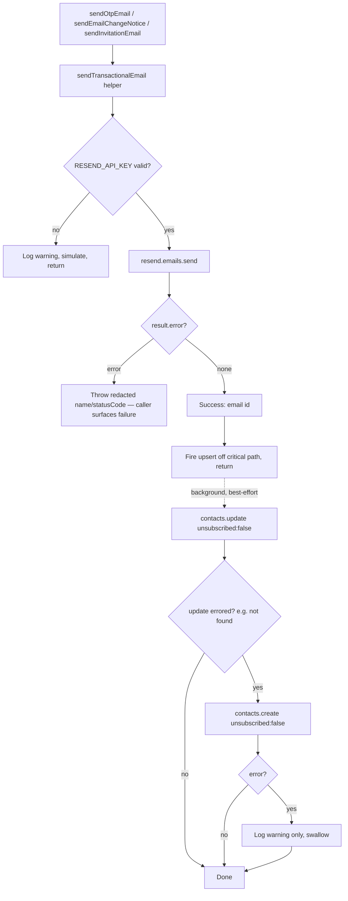

# refactor: Migrate transactional email from Plunk to Resend

## Summary

Replace Plunk with Resend as the transactional email transport for all three backend senders (OTP/login codes, email-change security notices, invitations), using the official `resend` SDK. The three exported functions keep their signatures so the five call sites are untouched. Plunk's `subscribed: true` list-building — which has no automatic Resend equivalent — is preserved with an explicit best-effort global Contacts upsert (`contacts.update` → `contacts.create`, both keyed by email) after each successful send.

---

## Problem Frame

Email currently flows through Plunk's `/v1/send` endpoint via native `fetch` in `server/src/services/email.ts`. The team is moving off Plunk to Resend. This is a provider swap that preserves observable behavior (emails still deliver; recipients still land on the marketing list), but the two providers differ in three ways that shape the work:

1. **Auth/transport:** Resend uses a `re_`-prefixed key against `https://api.resend.com/emails` and rejects requests with no `User-Agent` header (`403`). The official SDK handles both and returns a typed `{ data, error }` instead of throwing.
2. **Marketing list:** Plunk upserts the recipient as a subscribed contact on every `/v1/send` (`subscribed: true`). Resend's transactional send touches no contact — list-building is a separate, explicit Contacts API call (global `contacts.update`/`create`, keyed by email; no audience scoping). This re-subscribe behavior is intentional (see project memory), so it must be carried over, not dropped.
3. **Rate limit:** Resend caps at ~5 req/s per team. Bulk invitations loop sequentially and, with the added contact upsert, make two Resend calls per invite — enough to brush the limit on large CSVs.

---

## Requirements

### Email transport

- R1. All three transactional emails send via Resend's `/emails` API using the official `resend` SDK; the Plunk endpoint and key are fully removed.
- R2. `sendOtpEmail`, `sendEmailChangeNotice`, and `sendInvitationEmail` keep their current names and argument shapes so existing call sites (`server/src/auth.ts`, `server/src/routes/api/emailChange.ts`, `server/src/services/invitations.ts`) need no changes.
- R3. A transactional send failure throws, preserving the current contract that lets Better Auth surface a failed OTP delivery to the user. Existing HTML/text templates and the `TrafficMENA` sender display name are preserved.
- R4. Outside production, when no valid `RESEND_API_KEY` is configured, sends are simulated (logged and skipped), preserving the current dev fallback (production fails fast instead — see R10).

### Marketing-list continuity

- R5. Every successful transactional send re-subscribes the recipient as a global Resend Contact via update-or-create (attempt `contacts.update({ email, unsubscribed: false })`, fall back to `contacts.create({ email, unsubscribed: false })`), so existing and previously-unsubscribed contacts are re-subscribed — matching Plunk's `subscribed: true` re-subscribe-on-every-login behavior.
- R6. The contact upsert is best-effort: any failure is logged and never fails the transactional send. There is no audience configuration in the global Contacts model, so there is no audience-unset gate — the upsert runs after every successful real send, behind the same key guard as the send.

### Resilience and configuration

- R7. Bulk invitation failures surface as specific, actionable reasons (rate-limited, domain-not-verified, quota-exceeded, restricted-key) instead of opaque "Unknown error" rows, and the per-send contact upsert runs off the auth-response path so it never adds latency to or fails a send.
- R8. Env config adds `RESEND_API_KEY` (no `RESEND_AUDIENCE_ID` — global Contacts need no audience id) and removes `PLUNK_API_KEY`; `server/.env.example` and provider references in docs are updated.
- R9. Dead Plunk hosts are removed from the server CSP and the `index.html` CSP meta tag; no Resend `connect-src` entry is added (Resend is called server-side only).
- R10. In production, a missing or malformed `RESEND_API_KEY` fails fast at startup (mirroring the existing `FAWATERK_API_KEY` guard), rather than silently simulating.

---

## Key Technical Decisions

- KTD1 — Use the official `resend` SDK, not raw `fetch`. Resend `403`s requests lacking a `User-Agent` (the SDK sets it), returns a typed `{ data, error }` that doesn't throw, and is Resend's documented default. Aligns with the project rule to use existing libraries rather than hand-roll. Cost: one new dependency.
- KTD2 — Centralize sending in a private `sendTransactionalEmail` helper in `server/src/services/email.ts`; the three exported functions become thin wrappers. The functions share identical transport and contact-upsert logic — one helper avoids triplicating it (the current file repeats the same `fetch` boilerplate three times).
- KTD3 — Preserve list-building with an explicit best-effort update-or-create after each successful send: attempt `contacts.update({ email, unsubscribed: false })`, and on error (e.g. contact not found) fall back to `contacts.create({ email, unsubscribed: false })`. Contacts are **global** in current Resend (keyed by email; no `audienceId`), and Resend transactional sends never touch the contact list, and `contacts.create` does not re-subscribe an already-existing contact — so create-only would silently fail to re-subscribe returning users (the common case) and previously-unsubscribed users. The re-subscribe-on-every-login behavior is intentional (Plunk parity); note it deliberately re-subscribes users who previously opted out. resend-node issue #458 (closed "not planned") reports `unsubscribed: false` may not be honored on create, so the rollout must verify empirically in the Resend dashboard that a test recipient lands subscribed (Operational Notes). The whole update-or-create sequence is wrapped in try/catch and swallowed — it never throws. No audience id and no audience-unset gate exist in the global model; the upsert runs whenever a real `re_` key is present.
- KTD4 — Keep the throw-on-failure contract for the transactional send; make only the contact upsert non-throwing. Callers (Better Auth's `sendVerificationOTP`) rely on the throw to surface delivery failure, but a marketing-list write must never break login.
- KTD5 — Handle bulk rate limits by mapping failures to readable reasons, not by retrying. The bulk loop in `server/src/services/invitations.ts` currently collapses every non-`InvitationError` into an opaque "Unknown error" row; map the Resend error names it will actually hit (`rate_limit_exceeded`, `validation_error` from an unverified domain, `daily_quota_exceeded`/`monthly_quota_exceeded`, `restricted_api_key`) to specific reasons so an admin sees what went wrong. The send helper throws a small `EmailDeliveryError extends Error { code; statusCode }` (house style — mirrors `InvitationError` at `invitations.ts:34`) carrying the Resend `error.name` as `code`; the bulk loop switches on `err.code` and never parses `err.message`. Fire the contact upsert off the auth-response path (kick it off without awaiting on the critical path; still best-effort) so it never adds a Resend round-trip to OTP-login latency. A bounded in-helper retry was considered and dropped: it only catches `rate_limit_exceeded` (not the domain/quota/key failures that cause whole-CSV outages), doesn't cover the upsert, and a retry without an idempotency key can double-send an OTP (both codes valid until TTL). If 429s appear in practice, add a small inter-iteration delay in the bulk loop as a follow-up.
- KTD6 — Keep `RESEND_API_KEY` optional in the schema for the dev simulate path, but add a production boot guard that throws when it is missing or not `re_`-prefixed — mirroring the existing `FAWATERK_API_KEY` guard in `env.ts` (lines 84-87). A missing key in production otherwise causes a silent OTP-login outage (sends just simulate). The key must have Full access so the Contacts update/create writes succeed (a sending-only key returns `restricted_api_key`).

---

## High-Level Technical Design

The shared helper governs every send. The transactional send throws a redacted error on failure; the contact upsert is fired off the critical path and can only log.

---

## Implementation Units

### U1. Add the `resend` dependency and Resend env config

**Goal:** Make the SDK and the new configuration available before any code consumes them.

**Requirements:** R8 (partial), R6 (config side), R10 (production boot guard).

**Dependencies:** none.

**Files:**
- `server/package.json` — add `resend` to `dependencies`.
- `server/src/config/env.ts` — add `RESEND_API_KEY: z.string().optional()`, plus a production boot guard that throws when `RESEND_API_KEY` is missing or not `re_`-prefixed. (No `RESEND_AUDIENCE_ID` — global Contacts need no audience id.)
- `server/.env.example` — add a Resend block (`RESEND_API_KEY`). Leave the Plunk line in place for now; U2 removes it together with the code that reads it.

**Approach:** Mirror the existing optional-secret pattern in `env.ts` (e.g. how `PLUNK_API_KEY`/`TURNSTILE_SECRET_KEY` are declared) for the two new vars, then add a production guard next to the existing `FAWATERK_API_KEY` check (lines 84-87): when `NODE_ENV === 'production'`, throw if `RESEND_API_KEY` is missing or not `re_`-prefixed. Install with the server workspace (`npm --prefix server install resend`).

**Patterns to follow:** optional `z.string().optional()` entries and the production `FAWATERK_API_KEY` throw-guard already in `server/src/config/env.ts`.

**Test scenarios:** The production boot guard is the one behavioral change. Optionally cover it with a focused test that importing `config/env.ts` with `NODE_ENV=production` and a missing/non-`re_` `RESEND_API_KEY` throws, while development with the key absent does not (parallels the existing untested `FAWATERK_API_KEY` guard; uses dynamic `import()` with cache-busting since env parses once at import). The dependency add and the two optional vars have no other behavioral change.

**Verification:** `npm --prefix server install` resolves `resend`; the server still type-checks and boots with the new optional vars absent.

### U2. Rewrite `email.ts` to send via Resend with best-effort contact subscription

**Goal:** Replace the Plunk transport with a shared Resend helper that sends (throwing a redacted error on failure) and fires a best-effort update-or-create contact upsert off the critical path; rewrite the three exported functions as wrappers; map bulk-send failures to readable reasons; update the regression test.

**Requirements:** R1, R2, R3, R4, R5, R6, R7; completes the Plunk-key removal for R8.

**Dependencies:** U1.

**Files:**
- `server/src/services/email.ts` — full rewrite of the transport while preserving the three exported signatures and all template strings.
- `server/src/config/env.ts` — remove `PLUNK_API_KEY` (email.ts is its only consumer).
- `server/.env.example` — remove the Plunk line.
- `server/src/services/invitations.ts` — in `sendBulkInvitations`, map known Resend error names to readable per-row reasons instead of the opaque "Unknown error" fallback.
- `tests/unit/resend-email.test.ts` — renamed from `tests/unit/plunk-subscription.test.ts` (use `trash` for the old path), rewritten for Resend.

**Approach:**
- Construct the `Resend` client lazily, only after the `re_`-prefix guard passes — never call `new Resend()` with an undefined key. The SDK constructor throws `Missing API key` on an undefined key, so a module-level `new Resend(env.RESEND_API_KEY)` would crash on import (email.ts is imported by `auth.ts` at server boot) in any keyless dev/CI/test environment, breaking the simulate path (R4).
- Add a private `sendTransactionalEmail({ to, subject, html, text })`:
  - If `RESEND_API_KEY` is missing or not `re_`-prefixed, log a redacted warning and return (preserves the simulate path; mirrors the current `startsWith` guard, swapped from `sk_` to `re_`).
  - Call `resend.emails.send({ from: 'TrafficMENA <hello@trafficmena.com>', to, subject, html, text })`. The display-name format replaces Plunk's separate `from` + `name` fields.
  - Branch on the returned `{ data, error }`: on `error`, throw an `EmailDeliveryError extends Error { code; statusCode }` carrying only the Resend `error.name` (as `code`) and `statusCode` when present — never the raw SDK error or `error.message` (preserves the throw-on-failure contract); on success, fire `subscribeContact` off the critical path (kick it off without awaiting before returning).
- Add a private `subscribeContact(email)`: attempt `resend.contacts.update({ email, unsubscribed: false })` and, on error (e.g. the contact isn't found), fall back to `resend.contacts.create({ email, unsubscribed: false })` — global Contacts, no `audienceId`. Wrap the whole thing in try/catch that logs and swallows — never throws. There is no audience-unset early return: there is no audience to configure.
- In `server/src/services/invitations.ts` `sendBulkInvitations`, switch on the `EmailDeliveryError.code` (the Resend `error.name`) a failed send can throw (`rate_limit_exceeded`, `validation_error` from an unverified domain, `daily_quota_exceeded`/`monthly_quota_exceeded`, `restricted_api_key`) to build specific per-row reasons — `err instanceof EmailDeliveryError ? mapReason(err.code) : 'Unknown error'` — replacing the bare "Unknown error" fallback for those cases.
- Rewrite `sendOtpEmail`, `sendEmailChangeNotice`, `sendInvitationEmail` to build their existing subject/html/text and delegate to `sendTransactionalEmail`. Keep all current escaping (`escapeHtml`) and template markup unchanged.

**Patterns to follow:** the current `email.ts` structure (per-function subject/text/html construction, redacted warning logging, `isProduction`-gated info logs). Keep the redaction discipline — never log OTP codes or full addresses. Specifically, on a send failure log/throw only the Resend `error.name` and `statusCode`; never the raw SDK error or `error.message`, which can carry the recipient address (this also tightens the current Plunk code, which logs the raw response body).

**Test scenarios** (`tests/unit/resend-email.test.ts`):
- Happy path — `sendOtpEmail` calls Resend's `/emails` endpoint with `from` containing `hello@trafficmena.com`, the recipient in `to`, and a subject/body present. (Covers R1, R3.)
- Marketing continuity — after a successful send, the upsert attempts `contacts.update` with `unsubscribed: false` and falls back to `contacts.create` when the contact isn't found. Assert for all three senders. Because the upsert is fired off the critical path, flush pending microtasks before asserting. (Covers R5.)
- Best-effort upsert — when the upsert rejects, the send still resolves and login is unaffected (the upsert was never on the critical path). (Covers R6.)
- Throw-on-failure — when `emails.send` returns an error, the function rejects with a redacted error that does not contain the recipient address. (Covers R3.)
- Bulk error mapping — a `rate_limit_exceeded`, `validation_error`, quota, or `restricted_api_key` failure during a bulk send surfaces as a specific reason row, not "Unknown error". (Covers R7; may live alongside the invitations tests.)
- Simulate path — with `RESEND_API_KEY` unset or not `re_`-prefixed, no Resend call is made and the function returns without throwing. (Covers R4.)

**Test note:** the existing test stubs `globalThis.fetch`; the SDK calls global fetch under the hood (verified), so the same approach can assert on `https://api.resend.com/emails` and `https://api.resend.com/contacts`. Mocking the `resend` module (via the Node test runner) is the more robust alternative if fetch-stubbing proves brittle. The scenarios need mutually-exclusive env states (key set/unset), but `config/env.ts` parses `process.env` once at import and ESM caches the module — so toggle state via a per-scenario dynamic `import()` with a cache-busting query (or separate test files per permutation), not a single top-level import as the current test does.

**Verification:** `npm run test:unit` passes the rewritten suite; `npm --prefix server run build` type-checks with `PLUNK_API_KEY` gone; the five call sites (`auth.ts:58`; `emailChange.ts:142`, `:157`, `:343`; `invitations.ts:81`) compile unchanged. Confirm the SDK payloads and tests reference no `RESEND_AUDIENCE_ID`, `audienceId`, Segment/Topic, or audience-unset early return — any such reference is a regression against the global Contacts model.

### U3. Remove Plunk from CSP and update provider docs

**Goal:** Drop dead Plunk hosts from both CSP definitions and replace Plunk references in documentation with Resend.

**Requirements:** R9; documentation side of R8.

**Dependencies:** U2 (do after the code swap so docs match reality).

**Files:**
- `server/src/app.ts` — remove `https://next-api.useplunk.com` and `https://*.useplunk.com` from `connectSources`. Add nothing for Resend (server-side calls are not governed by the browser `connect-src` directive).
- `index.html` — remove `https://*.useplunk.com` from the CSP meta `connect-src` (kept in sync with `app.ts` per the comment there).
- `README.md`, `AGENTS.md`, `TECH_STACK.md`, `CLAUDE.md`, `server/README.md`, `GEMINI.md`, `docs/HANDOVER.md`, `docs/c4/c4-context.md`, `docs/c4/c4-component.md`, `docs/c4/c4-container.md` — replace "Plunk" / `PLUNK_API_KEY` provider references with Resend / `RESEND_API_KEY` (no `RESEND_AUDIENCE_ID` — global Contacts need no audience id). The C4 docs use named mermaid nodes and `Rel()` calls (`plunk`, `Plunk`) that need renaming, not just prose replacement. The grep below is canonical — update every current-state file it returns, not only this list.

**Approach:** Grep `plunk`/`Plunk`/`PLUNK` across tracked files and update each current-state provider reference. Leave everything under `plans/` and `docs/reviews/` untouched — those are historical records that accurately described the system at time of writing (e.g. `plans/plunk-api-migration.md`, `plans/payment-gateway-mvp-v2.md`, `docs/reviews/2026-06-25-003-admin-enrollment-round-2-review.md`). Confirm no frontend `src/` code references Plunk (verified during planning and review — only server, docs, and CSP), so the CSP removal is safe.

**Test scenarios:** none — CSP and documentation changes with no behavioral path under unit test. Verified by confirming the app boots and email still sends in a manual smoke (Operational Notes).

**Verification:** `grep -ri plunk` returns only the historical plan; the server boots with the tightened CSP; staging smoke test still delivers email.

---

## Risks & Dependencies

- **Domain verification (already satisfied).** `trafficmena.com` is already verified in Resend (SPF/DKIM/DMARC), so sends from `hello@trafficmena.com` work in every environment and no sandbox sender is needed. Kept as a note only because an unverified domain would return `validation_error`.
- **Rate limit (~5 req/s/team, shared across all sends).** The contact upsert makes every send a 2–3 call sequence (update, maybe create), so a surge of concurrent logins (event mode allows 15 OTPs/10min) — not just bulk CSVs — draws on the shared budget. Firing the upsert off the critical path keeps it out of login latency, and bulk failures surface as readable reasons (KTD5) rather than silent drops. For very large CSVs, request a rate increase or add a bulk inter-iteration delay.
- **API key scope.** The Contacts upsert needs a Full-access key; a sending-only key returns `restricted_api_key` (the upsert is best-effort, so this degrades to "no list-building," not a send failure — but it defeats R5).
- **Missing key in production.** A missing/malformed `RESEND_API_KEY` would make sends silently simulate and break OTP login — now prevented by the production boot guard (R10/KTD6), which fails startup fast instead.
- **Contact subscription not guaranteed by the flag (resend-node #458).** #458 (closed "not planned") reports `unsubscribed: false` may not be honored on create, and `contacts.create` does not re-subscribe an existing contact. Mitigated by update-or-create (KTD3) plus an empirical dashboard check that a test recipient lands subscribed before relying on list-building.

---

## Operational / Rollout Notes

- **Pre-deploy (Resend dashboard):** the sending domain is already verified; generate a Full-access API key (Contacts writes need it — a sending-only key returns `restricted_api_key`). Set `RESEND_API_KEY` in each environment — production will fail to boot without a valid `RESEND_API_KEY` (R10). Rotate the key periodically and on team changes; on compromise, revoke and reissue in the dashboard.
- **Re-subscribe behavior is intentional (product-approved).** Every successful transactional send re-subscribes the recipient (`unsubscribed: false`), including users who previously opted out. This is a deliberate Plunk-parity business decision (project memory `project_plunk_subscription`), not an oversight — keep it visible in code, tests, and docs so it is not re-litigated later.
- **Staging smoke:** send from `hello@trafficmena.com` (domain already verified) to your own account inbox to validate the code path. As part of the smoke, confirm in the Resend dashboard that the test recipient actually appears **subscribed** as a Contact (guards against the #458 quirk) before trusting list-building.
- **Watch rate limits during the smoke (and a small bulk-CSV dry run).** Resend caps at ~5 req/s/team, and the off-path contact upserts share that budget with sends. Monitor logs and bulk-result rows for `rate_limit_exceeded`; only if real 429 pressure appears, add the deferred one-line inter-iteration delay in the bulk loop (Scope Boundaries) — do not pre-build a queue.
- **Existing contacts:** migrating the current Plunk contact list into the new Resend Contacts list is a separate one-time data task (export from Plunk → import via Resend's Contacts import). Out of scope for this code change; track separately if the historical list matters.
- **Rollback:** revert the `email.ts` and `env.ts` changes to the Plunk transport. Keep the Plunk account and `PLUNK_API_KEY` valid until Resend delivery is confirmed in production.

---

## Scope Boundaries

### Deferred to follow-up work

- Migrating existing Plunk contacts into the Resend Contacts list (one-time data task; see Operational Notes).
- `Idempotency-Key` on sends — not needed now that there is no automatic retry; revisit only if send retries or a send queue are introduced later.
- A bulk inter-iteration delay in `invitations.ts` — add only if `rate_limit_exceeded` rows actually appear on large CSVs (KTD5).
- Passing first/last name into the contact upsert (email-only parity with current behavior for now).

### Out of scope

- Resend templates / React Email — the existing inline HTML templates are preserved as-is.
- Broadcasts or marketing campaigns — the global Contact list here exists only to preserve transactional list-building, not to drive campaigns.
- Segments / Topics — the plain global Contact is enough for Plunk's single-list parity; cohort segmentation is not a requirement.

---

## Sources & Research

- Resend API reference (introduction, auth, base URL): https://resend.com/docs/api-reference/introduction
- Send email endpoint (`POST /emails`, field schema, response): https://resend.com/docs/api-reference/emails/send-email
- Errors and status codes: https://resend.com/docs/api-reference/errors
- Rate limits (~5 req/s/team; `ratelimit-*` and `retry-after` headers): https://resend.com/docs/api-reference/rate-limit
- Domain verification (SPF/MX/DKIM/DMARC, `onboarding@resend.dev` sandbox): https://resend.com/docs/dashboard/domains/introduction
- Node SDK (`resend.emails.send`, `{ data, error }` shape, camelCase): https://resend.com/docs/send-with-nodejs
- Contacts API — Contacts are **global** (no `audienceId`); `contacts.create({ email, unsubscribed })`: https://resend.com/docs/api-reference/contacts/create-contact
- Update Contact — global `PATCH /contacts/{id-or-email}`, `contacts.update({ email | id, unsubscribed })`: https://resend.com/docs/api-reference/contacts/update-contact
- New global Contacts experience (SDKs dropped the `audience_id` requirement): https://resend.com/blog/new-contacts-experience
- Current transport and call sites: `server/src/services/email.ts`; callers in `server/src/auth.ts`, `server/src/routes/api/emailChange.ts`, `server/src/services/invitations.ts`
- Existing regression test (subscribe-on-send intent): `tests/unit/plunk-subscription.test.ts`
- Intentional re-subscribe-on-login behavior: project memory `project_plunk_subscription`
