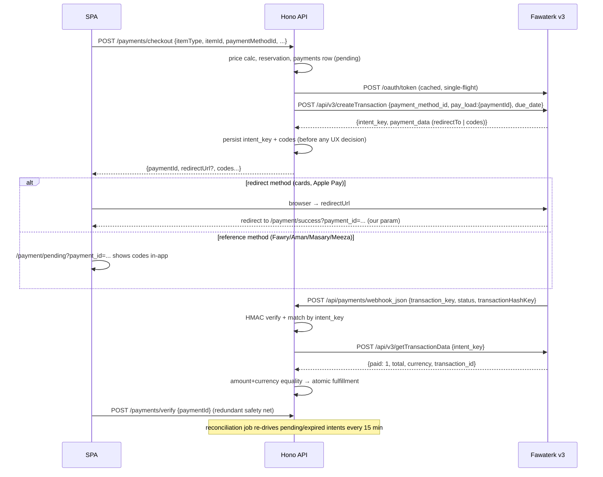
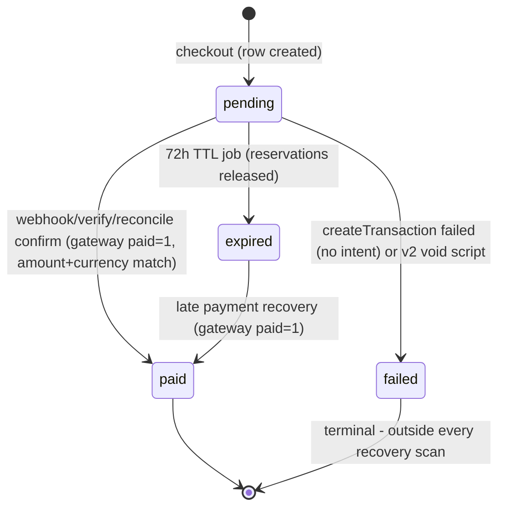

# fix: Hard-cutover migration of the Fawaterk integration to API v3

## Summary

Production payments are failing repeatedly. Fawaterk has replaced its integration surface with API v3 — OAuth client-credentials auth, a transaction-intent model (`intent_key` instead of `invoice_id`/`invoice_key`), renamed fields, and a new TR webhook payload — while our integration is fully v2, which Fawaterk now labels legacy. A second, independent defect compounds it: webhook POSTs to the apex domain `trafficmena.com` are 301-redirected to `www`, dropping delivery. This plan migrates the entire payment path to v3 as a hard cutover (zero v2 code ships), repairs webhook delivery, voids in-flight v2 payments at deploy behind a support protocol, and verifies every enabled payment method — including Apple Pay — on staging and with a live canary before declaring done.

---

## Problem Frame

### Verified findings (2026-07-03)

- The live Fawaterk documentation (`app.fawaterk.com/documentation`, "Fawaterak API 3.0.0") no longer documents the v2 endpoints our code calls (`invoiceInitPay`, `getPaymentmethods`, `getInvoiceData`); their v3 replacements require OAuth client credentials. The vendor API key is described as "Legacy vendor API key used by v2 endpoints" — but remains the HMAC secret for all v3 webhooks.
- v2 still works end-to-end on `staging.fawaterk.com` with our staging key (live-probed: methods 200, real invoice created with the exact shape our Zod expects). Any v2 failure is therefore live-account-specific ("Invalid Token or inactive vendor" is in the live error catalogue) or flow-specific — Phase 0 pins it from production logs.
- Confirmed infrastructure defect: `POST https://trafficmena.com/api/payments/webhook_json` → 301 → `www.trafficmena.com`. The dashboard webhook was registered at the apex (`docs/DEPLOYMENT_CHECKLIST_PAYMENT_GATEWAY.md:89`). Webhook senders do not reliably re-POST across 301s. Production serves at `https://www.trafficmena.com`.
- Our webhook schema (`server/src/routes/api/payments.ts:72`) hard-rejects the v3 TR payload shape with 400, so even delivered TR webhooks cannot confirm payments.
- No recent regressions in payment code (git history clean since the wallet phone-format fix).

### Root-cause hypotheses (Phase 0 discriminates via production logs)

| # | Hypothesis | User-visible symptom | Log discriminator |
|---|---|---|---|
| H1 | Live vendor account migrated to v3 / v2 disabled → `invoiceInitPay`/`getPaymentmethods` fail | Checkout error on every paid attempt / empty method list | `[payments/checkout] Error:` with `Fawaterk ... failed: <status> <body>` |
| H2 | Webhooks lost (apex 301 and/or TR payload → 400) with reconciliation degraded → stuck `pending` after successful payment | "Paid but got nothing", stuck pending rows | No `[payments/webhook] Confirmation processed`; `INVALID_PAYLOAD`; Caddy 301/400 on webhook path |
| H3 | Method-specific breakage (live v2 `payment_data` shape changed) | Only some methods fail | `[fawaterk] Invalid invoiceInitPay response` + `paymentDataSummary` |

All three are durably fixed by this migration. Phase 0 exists to confirm the narrative, know what to tell affected users, and provision OAuth credentials. The confirmed hypothesis also selects the U16 T1 cutover branch: H2/H3 use the machine sweep; H1 uses the manual dashboard-export reconciliation branch.

---

## Cutover Doctrine (owner decision, 2026-07-03)

Hard cutover — zero v2 code ships. No `FAWATERK_API_VERSION` kill switch, no legacy webhook verification branch, no v2 confirm path. At deploy, a one-off script voids all still-pending v2 payments and releases their capacity reservations; anyone paying a pre-cutover kiosk code afterward is handled manually via the support protocol.

**Rollback boundary.** `git revert` + redeploy is a clean rollback only **before** the void script runs and before the first organic v3 checkout. After that point, reverted v2 code cannot see v3 rows at all (v2 reconciliation filters on invoice ids, v2 verify accepts only `invoiceId`, the v2 webhook schema 400s TR payloads), so a post-boundary revert additionally requires manual dashboard reconciliation of every payment with `fawaterk_intent_key` set, and does not restore voided rows. Operators must know the point of no return before starting U16.

Three things remain that are not v2 integration:

- `FAWATERK_API_KEY` stays permanently — v3 signs every webhook with the vendor API key. Removing it would make v3 webhooks unverifiable.
- Historical DB columns and rows (`fawaterk_invoice_id`, `fawaterk_invoice_key`, reference codes on old rows) stay — financial audit data with zero call sites after cutover.
- A log-only tripwire for legacy-shaped webhook payloads (no verification, no DB writes, returns 200) — observability feeding the support protocol, removed after two silent weeks.

---

## v3 API Contract Reference

Extracted from the live OpenAPI 3.1 spec embedded at `app.fawaterk.com/documentation` (title "Fawaterak API", version 3.0.0) on 2026-07-03. This section is the implementation source of truth; do not re-derive shapes from v2 code.

### Base URLs and authentication

| Environment | Base URL |
|---|---|
| Staging | `https://staging.fawaterk.com` |
| Live | `https://app.fawaterk.com` |

- `POST /oauth/token` — body `{grant_type: "client_credentials", client_id, client_secret}` (JSON or form-encoded). 200 → `{token_type: "Bearer", expires_in, access_token}` (`expires_in` example: 31536000 ≈ 1 year). 401 → `{status: "error", message}`. Credentials come from the vendor dashboard → Integrations → OAuth client credentials (per environment).
- All `/api/v3/*` transaction endpoints require `Authorization: Bearer {access_token}`. 401 body: `{status: "error", message: "Unable to resolve vendor from OAuth client"}`.
- Never log `FAWATERK_CLIENT_SECRET`, the raw `/oauth/token` request body, or the bearer `access_token`.

### GET /api/v3/getTrPaymentmethods

Returns methods with "Integration status" enabled in the vendor's Business settings (this per-method dashboard toggle is also the cutover instrument U16 uses to gate unverified methods). 200:

```json
{ "status": "success", "vendorSettingsData": {"custome_iframe_title": null},
  "data": [ { "payment_method_id": 2, "name_en": "Visa-Mastercard", "name_ar": "…", "redirect": "true", "logo": "…" } ] }
```

- Field rename vs v2: `payment_method_id` (was `paymentId`). `redirect` remains the string `"true"`/`"false"`.
- `redirect: "true"` → link mode (hosted checkout URL); `"false"` → direct-dispatch (synchronous provider reference).
- The method list is dynamic per vendor account. The live account currently exposes more methods than staging — Apple Pay among them. Apple Pay has zero dedicated documentation in the v3 spec: it is an account-enabled method that must be handled generically and verified empirically.

### POST /api/v3/createTransaction

Required: `currency`, `customer` (`first_name`, `last_name` required; `email`, `phone`, `address` optional), `cartItems` (each `name` string, `price` number, `quantity` integer ≥ 1), `cartTotal` number. Optional fields we use: `payment_method_id` (integer — direct payment mode), `pay_load` (object, echoed in webhooks as a JSON string), `redirectionUrls` (`successUrl`, `failUrl`, `pendingUrl`, `webhookUrl` — `_json` in the webhook path selects JSON delivery), `due_date` (date-time, defaults to +2 days), `mobileWalletNumber` (provider-specific, e.g. Meeza direct-dispatch). Fields we do not use: `redirectOption` (forces link mode — see R3: v3 drops the v2-era force-redirect), `save_customer`, `sendEmail`, `sendSMS`, `tr_number`, `authAndCapture`, `taxData`, `discountData`, `list_style`, `lang`.

Semantics: creates a TR payment intent. No gateway `transactions` row exists until the customer pays or direct-dispatch runs. 200 response is a `oneOf`:

- Hosted checkout variant (no `payment_method_id`, or link mode applies): `{status, message, data: {intent_key (uuid), url, expires_in}}`
- Direct payment variant: `{status, message, data: {intent_key, expires_in, payment_data}}` where `payment_data` is one of:
  - Card: `{redirectTo: uri}`
  - Fawry: `{fawryCode: string, expireDate: "YYYY-MM-DD HH:mm:ss"}`
  - Mobile wallet: `{meezaReference: integer, meezaQrCode: string}`
  - Aman / Masary / Apple Pay: undocumented in the spec — parse leniently, verify on staging/live.

Errors: 401 (OAuth), 422 `{status: "error", message: string | {field: [msgs]}}` (Laravel validation), 503 `{status: "error", message}` ("Transaction intent cache unavailable" — transient).

Normalization note: our flow sends `payment_method_id` (direct mode) for every method, so redirect-type methods (cards, Apple Pay) return `payment_data.redirectTo`. The client still normalizes `redirectUrl = payment_data.redirectTo ?? data.url` defensively so an unexpected hosted-variant response degrades to the same redirect flow instead of failing.

### POST /api/v3/getTransactionData

Body `{intent_key}`. 200 → `{status: "success", data: TransactionDetail}` where TransactionDetail includes `intent_key`, `transaction_id` (integer, `0` while cache-only), `paid` (0|1), `paid_at`, `status_text`, `total` (number, EGP-converted), `currency` ("EGP"), `payment_method` (localized name), `pay_load`, `due_date`, `transaction_link`, `transaction_history` (array with per-attempt `reference`). 422 → two distinct meanings, discriminated by the `message` shape: a string (invalid/expired/not-found intent) means "not paid, possibly expired"; an object of field errors (Laravel validation) means our request is malformed and must surface as an integration error, never as still-pending. 401 → OAuth.

### Webhooks (all signed with the vendor API key = `FAWATERK_API_KEY`)

| Webhook | Trigger | Content type | Signature field | StringToSign |
|---|---|---|---|---|
| Paid/pending | Payment completes, or async reference created (Fawry/Aman/Masary → `status: "pending"`) | JSON when URL contains `_json`, else form-encoded | `transactionHashKey` | `TransactionId={transaction_id}&TransactionKey={transaction_key}&PaymentMethod={payment_method}` |
| Failed | Card/gateway attempt fails | JSON when URL contains `_json` | `hashKey` | same as paid (TR shape) |
| Cancel | Async reference expires or is canceled (`status`: `EXPIRED`\|`CANCELED`) | always JSON | `hashKey` | `referenceId={referenceId}&PaymentMethod={paymentMethod}` |
| Refund | Refund request approved | always JSON | `hashKey` | `transactionId={transactionId}&amount={amount}&currency={currency}` |

Paid/pending payload (TR shape): `transaction_key` (= `intent_key` from createTransaction), `transaction_id`, `status` (`paid`|`pending`), `payment_method`, `pay_load` (JSON **string** echo of our object), `paidAmount`, `paidCurrency`, `paidAt`, `customerData`, `referenceNumber`, `transactionHashKey`. Legacy invoice payloads may instead carry `invoice_id`/`invoice_key`/`invoice_status`/`hashKey`. Docs: return HTTP 200 promptly; fulfill only when `status` is `paid`. The docs do not document any retry policy per response code — KTD-6's retry assumption is probed at U15 T4.

Cancel payload: `referenceId` (provider reference row id), `status`, `paymentMethod`, `pay_load`, `transactionId`, `transactionKey` (business key = `intent_key` for v3 TRs), `hashKey`.

Failed payload: TR ids + `payment_method`, `pay_load`, `amount`, `paidCurrency`, `errorMessage`, `response`, `hashKey`.

Refund payload: `transactionId`, `amount`, `currency`, `status` (integer), `reason`, `approvedAt`, `hashKey`.

### Test cards (staging)

| Outcome | Brand | Number | Expiry | CSV |
|---|---|---|---|---|
| Success | Mastercard | 5123450000000008 | 12/26 | 100 |
| Success | Visa | 4005550000000001 | 12/26 | 100 |
| Success | Meeza | 5078036246600381 | 12/26 | 100 |
| Fail | Mastercard | 5543474002249996 | 05/26 | 123 |
| Fail | Visa | 4222000006724235 | 12/26 | 123 |
| Fail | Meeza | 5078036242783546 | 12/26 | 123 |

### Out-of-scope v3 surfaces (documented for completeness, not built)

E-invoicing (`/api/v3/createEinvoice`, `/api/v3/invoice/*` — reusable multi-attempt payment links, a different product than our single-attempt checkout), Refund APIs (`/api/v3/refund/*` — refunds stay manual via dashboard), iframe integration (domain-hash auth), tokenization/recurring (v2, unused), `getTransactionsData` (bulk export), e-commerce plugins.

---

## Requirements

### Gateway client (v3-only rewrite of `server/src/services/fawaterk.ts`)

- R1. OAuth token manager: fetch via `POST {base}/oauth/token` using `FAWATERK_CLIENT_ID`/`FAWATERK_CLIENT_SECRET`; cache the token in memory with an expiry margin; single-flight concurrent refreshes; on 401 from any v3 call, invalidate → refresh → retry exactly once. All v3 calls (including the token call) go through the existing timeout (10s AbortController) and circuit-breaker wrappers. Secrets and tokens are never logged.
- R2. `getPaymentMethods()` calls `GET /api/v3/getTrPaymentmethods` and normalizes each item to the existing SPA contract — `paymentId` (from `payment_method_id`), `name_en`, `name_ar`, `redirect` (string `"true"`/`"false"`), `logo` — so `src/app/api/payments.ts` types and both method-heuristic sites (server `requiresPhone` name sniffing, SPA `paymentMethods.ts` keyword matching) keep working unchanged. Keep the 10-minute cache + stale-while-error. Drop the dead `invalidatePaymentMethodsCache` export.
- R3. `createTransaction()`: direct-payment mode (send `payment_method_id`) for **every** method; `cartTotal`/`cartItems[].price` as numbers, `quantity` as integer, `pay_load: {paymentId}`, `redirectionUrls` with per-transaction `_json` webhook URL, `mobileWalletNumber` with the existing `toFawaterkLocalPhone()` conversion for wallet methods, and `due_date` set per R21. **Deliberate UX change from v2:** the v2 code forced link mode (`redirectOption: true`) for reference methods, sending users to Fawaterk's hosted page; v3 forced-link responses carry no `payment_data`, so no reference codes would ever return. Under v3, reference methods run true direct-dispatch and codes render on our own `/payment/pending` page (which already renders all five code types + Meeza QR). Do not send `redirectOption`.
- R4. `createTransaction()` response parsing: strict on `intent_key` (require it; its absence = the call failed), lenient on everything else — accept both `oneOf` variants, normalize `redirectUrl = data.payment_data?.redirectTo ?? data.url`, parse `payment_data` with all fields optional plus passthrough (keep the v2 schema's snake/camel dual-accept and string/number coercion for `fawryCode`/`meezaReference`/`meezaQrCode`/`amanCode`/`masaryCode`; `meezaReference` arrives as an integer in v3). An unrecognized `payment_data` shape must never throw after the intent exists.
- R5. `getTransactionData(intentKey)`: `POST` with `{intent_key}`; map 200 to `{paid (0|1), total, currency, paymentMethod, transactionId, paidAt}`; discriminate 422 by `message` shape — string → typed "unpaid/expired" result (confirm and reconciliation treat as still-pending); object of field errors → throw as an integration error (a silent-degradation guard: a drifted request shape must not masquerade as "still pending"); 401 triggers the R1 retry-once; other failures throw as today.
- R6. Webhook verifiers, all HMAC-SHA256 keyed with `FAWATERK_API_KEY`, all with the existing hygiene trio (hex-format guard, length check before compare, `timingSafeEqual`): `verifyTransactionWebhook` (paid/failed shape: `TransactionId=…&TransactionKey=…&PaymentMethod=…` verifying `transactionHashKey` or failed `hashKey`), `verifyCancelWebhook` (`referenceId=…&PaymentMethod=…`), and `verifyRefundWebhook` (`transactionId=…&amount=…&currency=…`). Do not hard-assume the production hash is 64-hex until a real staging webhook confirms it (AE6).
- R7. Delete `invoiceInitPay`, `getInvoiceData`, v2 `getPaymentmethods`, `verifyFawaterkWebhook`, and every v2-only type/schema — **at the end of Phase 3** (U10 T7), after the last importer is rewritten; deleting earlier breaks the build while `payments.ts` and `server/scripts/reconcile-unpaid-payments.ts` still import them. Merge gate: `grep -rn "invoiceInitPay\|getInvoiceData\|api/v2" server/src server/scripts src` returns zero call sites (historical column names in schema/queries excepted). The gate's path set includes `server/scripts` because the old reconcile script imports `getInvoiceData` and `server/tsconfig.json` does not compile it.

### Data model (additive-only)

- R8. Add nullable `payments.fawaterk_intent_key` (text, unique index) and `payments.fawaterk_transaction_id` (bigint, plain index). Keep all existing columns. No backfill. Generated via `npm --prefix server run db:gen` (next migration after 0020).

### Confirmation, webhooks, verify, jobs

- R9. Rename/rework `confirmGatewayInvoicePayment` → `confirmGatewayTransactionPayment` keyed on `paymentId` (primary) with row lookup by `payments.id`; gateway check via `getTransactionData(payment.fawaterkIntentKey)`. Preserve structurally: **the conditional `userId` ownership scoping on the row lookup (today at `payments.ts:1105-1107` — without it, `/payments/verify` becomes an IDOR: `payment_id` values travel to Fawaterk's hosted pages in redirect URLs and are not secret)**, the already-paid short-circuit, the `paid === 1` check, strict amount equality (`total`×100 === `amountCents`) and currency equality (EGP), expired-row recovery (`allowExpiredRecovery`), the FOR-UPDATE row lock + compare-and-swap in `processSuccessfulPayment`, and the P0 pattern of writing failure status inside the transaction via return-not-throw. Persist `fawaterk_transaction_id` when first seen and include it in the `GET /payments/:id` response (the SPA type gains it). Analytics enrichment uses the v3 `payment_method` string; for rows with `fawaterk_intent_key IS NULL` (crash-window, voided v2, free rows) return the local status with `fawaterkPaid: false` and make no gateway call.
- R10. Paid/pending webhook handler (TR shape only): Zod-validate; verify `transactionHashKey` per R6; match the payment row by `transaction_key` → `fawaterk_intent_key` (a single unguessable UUID column, covered by the HMAC — the v2-era second-factor check is carried by the HMAC plus KTD-5's gateway re-verification, so no separate stored-key equality clause exists or is testable). Response semantics — three cases, three responses: `status: "paid"` with an unknown `transaction_key` → 404 (retry assumption probed at U15 T4; covers the checkout-persist race); `status: "pending"` → 200 acknowledge, no DB write; legacy shape (`invoice_id`/`hashKey`, no `transaction_key`) → log `[payments/webhook] post-cutover legacy webhook, invoice_id=<n> — manual review` and return 200 (no verification, no DB write). Correlation assumption `transaction_key === intent_key` is verified on staging (AE5); the designated fallback if it fails: parse the `pay_load` JSON string, extract `paymentId`, and look up by `payments.id`.
- R11. Cancel webhook handler (new endpoint `POST /api/payments/webhook_cancel`): verify `hashKey` per R6, log a structured line (`transactionKey`, `referenceId`, `status`), return 200, **write nothing in v1**. Rationale: active `pending → expired` + reservation release is a brand-new gateway-driven mutation with no v2 equivalent; log-only is exact v2 parity (the 72h TTL job remains the sole capacity-release mechanism) and the logs give real volume evidence. **Upgrade trigger (Phase 7):** if cancel logs show recurring real cancellations, upgrade the handler to transition `pending → expired` and delete both reservation tables in one transaction (mirroring `jobs/paymentExpiration.ts` semantics — `expired` stays recoverable). The owner may promote this to v1 scope; it is deliberately conservative, not forgotten.
- R12. Failed and refund webhooks are log-only (`POST /api/payments/webhook_failed_json`, `POST /api/payments/webhook_refund`): **unconditionally verify** the `hashKey` per R6 — reject 401 when missing, malformed, or invalid (the contract lists `hashKey` on every failed/refund delivery, so there is no legitimate unsigned case; "verify when present" would let any unauthenticated caller inject forged entries into the triage logs) — then log a structured line and return 200, writing nothing. Rationale for log-only: a `pending → failed` transition is unrecoverable by every confirm/reconcile path (they scan `pending|expired` only) and would strand money when a user retries an intent and pays; refund handling stays manual (KTD-7).
- R13. `/payments/verify` accepts `{paymentId: uuid}` (session-scoped: the payment must belong to the caller — enforced by R9's userId scoping). Remove `invoiceId` acceptance. Behavior for intent-less rows per R9. Rate limiting unchanged.
- R14. Reconciliation job: candidate filter becomes `fawaterk_intent_key IS NOT NULL` (drop the invoice-id filter); confirm via R9; a string-message 422 ("unpaid/expired") counts as `stillPending`, not `errors`, so routine abandoned checkouts don't flood logs; an object-message 422 (validation) surfaces in `errors` at error level per R5.
- R15. `recordPaymentFulfillmentFailure` writes `fawaterk_transaction_id` when available and null `invoiceId` for v3 rows; the dead-letter triage path (runbook SQL) is updated accordingly (R28).
- R16. Webhook route paths `POST /api/payments/webhook` and `/api/payments/webhook_json` remain; the new cancel/failed/refund paths are added to the CSRF-exempt set (`server/src/utils/csrf.ts` — hardcoded) **and wired into the same per-IP `paymentRateLimiter` webhook throttle the paid handler uses** (all four routes are unauthenticated public POSTs; the new three must not ship unthrottled).

### Checkout and response contract

- R17. Checkout rewrite: after price/reservation logic (unchanged), call `createTransaction()`; persist `fawaterk_intent_key` + parsed reference codes before responding; the SPA success payload becomes `{paymentId, redirectUrl?, fawryCode?, meezaReference?, meezaQrCode?, amanCode?, masaryCode?, free?}` — `invoiceId` is dropped everywhere, including the `PENDING_PAYMENT` 409 body and the idempotency response cache. Mark the payment `failed` (and release reservations, restore replaced pending) only when `createTransaction` itself failed (non-2xx or missing `intent_key`) — never because `payment_data` didn't parse (R4).
- R18. Success/fail redirect URLs bake our identifier: `successUrl = {APP_BASE_URL}/payment/success?payment_id={paymentId}` and `failUrl = {APP_BASE_URL}/payment/failed?payment_id={paymentId}` (pendingUrl already carries `payment_id`). Do not depend on any Fawaterk-appended query params (v2 appended `invoice_id`; v3 behavior is undocumented — AE4 verifies survival of our params).
- R19. The wallet guards stay: `PHONE_REQUIRED`/`PHONE_NOT_EGYPTIAN` pre-checks and `toFawaterkLocalPhone` conversion at the gateway boundary (the v2 422-on-E.164 quirk was discovered empirically; assume v3 behaves the same until AE7 proves otherwise).
- R20. Free checkout path is untouched (returns before any gateway call) — pinned by a regression test asserting zero v3 client calls.
- R21. Send `due_date = now + 72h` on `createTransaction` so gateway reference lifetime matches our pending window (v3 default is only +2 days — misalignment renders dead codes as payable). The 72h window lives in **two** constants that must stay synchronized: `RESERVATION_TTL_MS` (`server/src/routes/api/payments.ts:52`) and `PENDING_PAYMENT_EXPIRY_MS` (`server/src/jobs/paymentExpiration.ts:6`). If staging shows the gateway rejects or caps a 72h due date, the fallback is lowering **both** constants together to the gateway window; record the decision here. AE8 also verifies the accepted wire format (ISO 8601 vs `Y-m-d H:i:s`) and that the reflected due date matches wall-clock expectation (timezone skew check).

### Frontend (SPA)

- R22. `paymentId` becomes the sole flow key across all six invoice-id touchpoints: (a) `src/app/api/payments.ts` types (`VerifyPaymentRequest = {paymentId}`, `CheckoutResponse` drops `invoiceId`, `Payment` gains `fawaterkTransactionId?`); (b) `PaymentCheckoutDialog.tsx` — `goToPending` drops `invoice_id`, the `PENDING_PAYMENT` recovery uses `error.extra.paymentId` only, and the `fetchPayment().fawaterkInvoiceId` fallback is deleted; (c) `src/pages/dashboard/Subscribe.tsx` — same changes in its own copy of that logic; (d) `src/pages/payment/pending.tsx` — verify gates on `payment_id`, the poll-for-`fawaterkInvoiceId` effect and the URL-upgrade effect are deleted, success navigation carries `payment_id`; (e) `src/pages/payment/success.tsx` — reads `payment_id`, verifies by it (analytics retry loop included); (f) `src/features/tracks/` resume path — `pending_invoice_id` becomes `pending_payment_id` sourced from the track-detail response.
- R23. Pending page renders by `payment.status`: `paid` → redirect to success; `expired`/`failed` → hide reference codes and show "this payment session is no longer valid — request a new code" (neutral wording — expired card/Apple Pay intents never had a code); `pending` with codes → current code display; **`pending` with no codes and no redirect → distinct copy that prompts action** ("We couldn't set up an automatic payment for this method. Request a new code to try again, or contact support.") instead of the current passive "being verified" text — this is the landing state for undocumented `payment_data` shapes and must not read as "wait for confirmation". The status branch must actually refresh: `useVerifyPayment`'s `onSuccess` invalidates the `['payment', paymentId]` query **unconditionally** (today it invalidates other queries and only on `paid`), so "Check payment status" reflects expired/failed transitions; `usePayment` has no refetch interval and `refetchOnWindowFocus` is globally off, so without this the page shows a stale, apparently-redeemable code forever.
- R24. Dialog and Subscribe fallback: a checkout success with neither `redirectUrl` nor codes routes to the pending page unconditionally — in **both** `PaymentCheckoutDialog.tsx` and `Subscribe.tsx`'s local copy (both currently fall through silently with zero feedback; Subscribe is the highest-value transaction in the product). Webhook/verify complete the flow; covers undocumented method shapes.
- R25. Success page no-param fallback: when `payment_id` is absent (Fawaterk stripped our params — AE4 risk), the no-id branch copy changes from the affirmative "Thank You! Your transaction has been received." to uncertainty-honest copy ("Confirming your payment — this can take a moment. Check your dashboard for the latest status."), since no verification backs the message. Accepted analytics loss in that branch stands.

### Cutover tooling, infrastructure, config, docs

- R26. Void script `server/scripts/void-v2-pending-payments.ts` modeled on `reconcile-unpaid-payments.ts` conventions (dry-run by default, `--apply` flag, console operator table). Selects `status IN ('pending','expired') AND fawaterk_invoice_id IS NOT NULL AND fawaterk_intent_key IS NULL`; sets `status = 'failed'` ('failed' is deliberately outside every recovery scan — voided rows must not resurrect); deletes both reservation tables' rows; operator table (payment id, invoice id, item, amount, created_at) bucketed by "created within the gateway due window — support watch list" vs older (under the H1 branch the watch list widens to the full incident window). Follow the preflight-gate pattern: dry-run report → human signoff → DB backup confirmed → `--apply`. The old `server/scripts/reconcile-unpaid-payments.ts` is retired (`trash`) at U10 T7 — its unpaid-recovery role passes to the v3 reconciliation job; production keeps running the old build (with the old script) until the Phase 6 deploy, so the U16 T1 final sweep is unaffected.
- R27. Webhook delivery repair (independent of v3, shipped first): Fawaterk dashboard (staging + live) **paid** webhook URL set to `https://www.trafficmena.com/api/payments/webhook_json` (staging: `https://staging.trafficmena.com/...`); production `API_BASE_URL` verified/set to `https://www.trafficmena.com`; Caddy exempts `/api/*` from the apex→www redirect (proxy identically) so any URL cached on Fawaterk's side keeps working. **Cancel/failed/refund URLs are deliberately NOT registered in Phase 1** — those endpoints don't exist until Phase 3; registering early makes the gateway POST into 404s for weeks, risking sender-side auto-disable and polluting the diagnostic logs. They are registered on staging at U15 T0 and on live at U16 T2, after the handlers are deployed.
- R28. Env: add `FAWATERK_CLIENT_ID` and `FAWATERK_CLIENT_SECRET` (Zod-validated); production boot guard throws when either is missing (mirror the Resend guard pattern in `server/src/config/env.ts`; validate format if the credentials have a recognizable shape — client_id is a UUID per the spec — otherwise fail closed on presence + minimum length); keep the `FAWATERK_API_KEY` production guard. Add all FAWATERK_* vars to `server/.env.example` (currently absent entirely).
- R29. Admin surfaces gain the v3 reference: attendee queries (`server/src/utils/attendeesQuery.ts`, `server/src/utils/seriesAttendees.ts`) and admin search predicates (`server/src/routes/api/events.ts`, `tracks.ts`, `seriesGrants.ts`) include `fawaterk_transaction_id` (cast to text) alongside the legacy invoice fields; attendee list UIs show the transaction id where they show invoice id today (legacy rows keep showing invoice ids).
- R30. Docs updated in the cleanup phase: `docs/DEPLOYMENT_CHECKLIST_PAYMENT_GATEWAY.md` (v3 endpoints, OAuth setup, www webhook URLs, cutover sequence, support protocol), `docs/fawaterk-setup-snapshot.md` (marked historical), `docs/runbooks/payment-reliability-operations.md` (v3 SQL/log lines), `docs/solutions/payment-gateway/payment-gateway-compound-knowledge.md` (migration learnings), CLAUDE.md payment bullets.
- R31. Support protocol reuses the existing `payment_fulfillment_failures` table and `docs/runbooks/payment-reliability-operations.md` triage flow (no parallel mechanism): tripwire hits and straggler reports → check Fawaterk dashboard → refund there, or grant access via the admin enrollment flow; voided rows remain visible in admin payments views.

---

## Key Technical Decisions

- KTD-1 — Direct-payment mode for every method, reference codes rendered in-app: preserves the in-app method selector and uses the existing `/payment/pending` code/QR rendering as the single reference-method UX. This deliberately changes v2 production behavior, which force-redirected reference methods to Fawaterk's hosted page — v3's forced link mode returns no codes, so the v2 approach cannot carry over. Hosted checkout remains a documented future simplification.
- KTD-2 — Hard cutover with no kill switch: owner decision; v2 is being sunset and a v2 fallback is insurance against the wrong risk. Rollback is `git revert` + redeploy **only up to the rollback boundary** (see Cutover Doctrine); DB changes are additive.
- KTD-3 — `paymentId` (our UUID) as the sole flow key: it exists before the gateway call, so every UX path (pending gate, verify, resume, success) works even in crash windows where gateway identifiers were never persisted. Gateway identifiers become internal correlation data.
- KTD-4 — Strict on `intent_key`, lenient on `payment_data`: once `createTransaction` succeeds the intent is live at the gateway; a parsing surprise after that point must degrade UX (pending page + webhook/verify) rather than mark the payment failed and strand a payable reference.
- KTD-5 — Webhook is a trigger, not a source of truth: on every paid webhook we re-verify via `getTransactionData` and re-check amount + currency equality before fulfillment, preserving the v2 security posture (webhook data alone never fulfills).
- KTD-6 — Paid-webhook response codes: 404 for unknown `transaction_key` on `status: "paid"` (assumed to prompt gateway retry, bridging our persist race — **assumption, not documented**; U15 T4 probes actual retry behavior, and if Fawaterk does not retry, the 15-minute reconciliation job is the bridge and the 404 remains harmless), 200 for `pending` and for legacy-shaped payloads (anything else invites retry storms against the 100/min/IP webhook rate limit).
- KTD-7 — Failed/refund/cancel webhooks are verify-and-log-only in v1: a `pending → failed` transition is unrecoverable by every scan path and strands money when a user retries an intent and then pays; refunds remain manual; cancel's `pending → expired` + early capacity release is a new gateway-driven mutation with no v2 equivalent, so v1 collects volume evidence and Phase 7 upgrades it if the logs justify it (R11). All three verify signatures unconditionally before logging.
- KTD-8 — Align gateway `due_date` to our 72h window rather than shortening the TTL: one request field preserves the documented 72-hour product behavior; the reverse (shortening both TTL constants) changes user-facing semantics across events and tracks and is only the AE8 fallback.
- KTD-9 — Void status is `failed`, not `expired`: `expired` rows are deliberately resurrectable by confirm/reconcile recovery; voided v2 rows must never resurrect through a code path that can no longer verify them.
- KTD-10 — Server-side normalization keeps the SPA method contract stable (`paymentId` et al.): API-contract drift between SPA and server was the most expensive bug class in the original build; one normalization site beats N frontend edits.
- KTD-11 — OAuth token cached in memory with single-flight refresh: consistent with the accepted single-instance in-memory posture of the rate limiter and circuit breaker; no new infrastructure.

---

## High-Level Technical Design

### Payment flow (v3, direct mode)



### Payment status lifecycle (v3)



---

## Implementation Phases, Units, and Tasks

Execution order: Phase 0 → 1 → 2 → 3 → 4 → 5 → 6 → 7. Units within a phase are dependency-ordered. Every task checkbox is an implementer-verifiable action; subtasks are the concrete steps an AI agent executes.

Testing posture (constraint from the existing suite): `tests/unit/` runs `node --test` with no database — its idioms are (1) pure-function tests via direct TS import, (2) source-text assertions on `payments.ts` (the `payment-expiration-atomicity.test.ts` precedent), (3) env-prime + dynamic `import()` + `globalThis.fetch` stub for service modules (`resend-email.test.ts` precedent). DB-state behavior (row transitions, atomic fulfillment) is deliberately delegated to the U15 staging gates. Test scenarios below are phrased in those idioms.

---

## Phase 0 — Preflight: evidence and credentials (no code)

### U1. Pin the production failure and provision OAuth credentials

- Goal: name the exact failing v2 call from production logs, confirm the live account's state, and obtain the v3 credentials without which nothing else can start.
- Requirements: feeds H1/H2/H3 confirmation (selects the U16 T1 branch); prerequisite for R1, R28.
- Dependencies: none. Needs VPS access and Fawaterk dashboard access (owner).
- Files: none (evidence recorded in this plan's Problem Frame when done).
- Tasks:
  - [ ] T1 Collect production evidence
    - [ ] Grep API process logs (pm2/journalctl) for `[payments/checkout] Error`, `Fawaterk`, `[fawaterk] Invalid`, `[payments/webhook]`, `[payment-reconciliation]`; map the first match to H1/H2/H3
    - [ ] SQL: count `payments` by status for the incident window; list `pending` rows older than 1h with `fawaterk_invoice_id IS NOT NULL`
    - [ ] Caddy access log: status codes on `/api/payments/webhook*` (301/400 = H2 confirmation)
    - [ ] Record findings under Problem Frame → Verified findings, and note which U16 T1 branch applies (machine sweep vs H1 manual reconciliation)
  - [ ] T2 Fawaterk dashboard work (staging + live accounts)
    - [ ] Check for migration/deprecation notices and the live account's v2 status
    - [ ] Create OAuth client credentials on staging; store as `FAWATERK_CLIENT_ID`/`FAWATERK_CLIENT_SECRET` in `server/.env`
    - [ ] Create OAuth client credentials on live; store securely for Phase 6 deploy (never in the repo)
    - [ ] Confirm the dashboard vendor API key equals the deployed `FAWATERK_API_KEY` on each environment (HMAC secret parity — a mismatch means every v3 webhook will 401)
    - [ ] Confirm the dashboard supports registering the four webhook URL types (paid/failed/cancel/refund) per environment
    - [ ] Inventory enabled methods on the live account (expect Apple Pay among them) with each method's `redirect` flag; note which are enabled on staging (drives the U16 T2 method-gating list)
    - [ ] Confirm whether staging.trafficmena.com has its own database, fully separate from production (prerequisite for U15 T0)
- Test scenarios: `Test expectation: none — evidence-gathering unit.`
- Verification: hypothesis table updated with the confirmed failure; both credential sets exist; HMAC-secret parity confirmed in writing; staging DB topology answered.

---

## Phase 1 — Webhook delivery repair (infra, independent of v3, ships immediately)

### U2. Fix webhook routing to production

- Goal: paid webhooks reach the API server regardless of which URL variant Fawaterk uses.
- Requirements: R27.
- Dependencies: U1 (dashboard access).
- Files: Caddyfile on the VPS (out of repo); Fawaterk dashboard config; production `.env` (`API_BASE_URL`).
- Tasks:
  - [ ] T1 Dashboard **paid** webhook URL (staging + live): `https://www.trafficmena.com/api/payments/webhook_json` (staging: `https://staging.trafficmena.com/...`). Cancel/failed/refund URLs are NOT registered yet (endpoints don't exist until Phase 3; see R27) — they land at U15 T0 (staging) and U16 T2 (live)
  - [ ] T2 Verify production `API_BASE_URL=https://www.trafficmena.com` on the VPS; fix and restart if wrong
  - [ ] T3 Caddy: exempt `/api/*` on the apex host from the 301 redirect — proxy to the API identically to www
    - [ ] `curl -s -o /dev/null -w "%{http_code}" -X POST https://trafficmena.com/api/payments/webhook_json -H 'Content-Type: application/json' -d '{}'` returns 400 (handler reached), not 301
  - [ ] T4 Re-drive stuck payments once through the existing (still-v2) verify/reconcile path so cutover starts with a clean book
- Test scenarios: `Test expectation: none — infrastructure configuration; verified by the curl probe above.`
- Verification: apex webhook POST reaches the handler; a manual reconciliation pass reports `errors: 0` (if v2 is dead account-wide per H1, record that instead — U16 T1 switches to its manual branch).

---

## Phase 2 — v3 gateway client (`server/src/services/fawaterk.ts` rewrite)

### U3. Contract fixtures and failing repro tests

- Goal: encode the v3 contract as fixtures and prove current code rejects it (repo rule: failing repro test first), so the rewrite flips them green.
- Requirements: R4, R5, R6, R10.
- Dependencies: none (fixtures come from the spec extraction in this plan).
- Files: `tests/unit/fawaterk-v3-contracts.test.ts` (new), `tests/unit/fixtures/fawaterk-v3.ts` (new).
- Approach: fixtures are verbatim spec examples — hosted-checkout response, direct card/fawry/meeza responses, getTransactionData paid/unpaid/422-string/422-object bodies, TR paid webhook (paid + pending variants), cancel webhook (expired + canceled), failed webhook, refund webhook, legacy v2 webhook body. Follow the env-prime + dynamic `import()` + `globalThis.fetch` stub pattern from `tests/unit/resend-email.test.ts` for anything importing `config/env.ts`.
- Tasks:
  - [ ] T1 Write `tests/unit/fixtures/fawaterk-v3.ts` with every fixture above, copied exactly from the v3 API Contract Reference section
  - [ ] T2 Write initially-failing assertions: current `webhookSchema` rejects the TR paid fixture; current invoiceInitPay parser rejects the createTransaction fixtures
  - [ ] T3 Compute expected HMACs for the webhook fixtures with a test key so verifier tests are deterministic
- Test scenarios: covered by the unit itself — the fixtures are the scenarios.
- Verification: `npm run test:unit` shows the new tests failing against current code for the documented reason (shape rejection), nothing else broken.

### U4. OAuth token manager

- Goal: authenticated v3 calls with a cached client-credentials token that survives concurrency, expiry, and revocation.
- Requirements: R1, R28 (env vars consumed here).
- Dependencies: U3.
- Files: `server/src/services/fawaterk.ts`, `server/src/config/env.ts`, `tests/unit/fawaterk-oauth.test.ts` (new).
- Approach: module-level `{token, expiresAt}` + in-flight promise for single-flight; refresh margin (~60s) before `expiresAt`; a `withAuth(fn)` helper wraps every v3 call to implement 401 → invalidate → refresh → retry-once; token fetch itself goes through `fetchWithCircuitBreaker`. No secret/token values in any log line.
- Tasks:
  - [ ] T1 Env schema: add `FAWATERK_CLIENT_ID`, `FAWATERK_CLIENT_SECRET` (optional strings) + production boot guard for both (mirror the Resend guard including its explanatory comment; UUID-shape check for client_id, presence+length for the secret)
  - [ ] T2 Implement token fetch + cache + single-flight + expiry margin
  - [ ] T3 Implement `withAuth` retry-once-on-401 wrapper used by all v3 calls
  - [ ] T4 Tests (fetch-stub pattern):
    - [ ] concurrent first calls → exactly one `/oauth/token` request (single-flight)
    - [ ] cached token reused within expiry; refreshed after expiry margin
    - [ ] v3 call returning 401 once → token invalidated, refetched, call retried once and succeeds
    - [ ] v3 call returning 401 twice → error surfaces (no infinite retry)
    - [ ] token endpoint 401 → clear error mentioning credentials, with no secret material in the message
    - [ ] boot guard: production env without client id/secret throws (dynamic import with cache-busting per the resend-email test recipe)
- Test scenarios: enumerated in T4.
- Verification: unit tests green; no v3 call site fetches the token directly.

### U5. Methods, createTransaction, getTransactionData (added alongside v2)

- Goal: the three v3 API calls with normalization that keeps every downstream contract stable. v2 functions stay in place until U10 T7 (their call sites are rewritten in Phase 3).
- Requirements: R2, R3, R4, R5, R21.
- Dependencies: U4.
- Files: `server/src/services/fawaterk.ts`, `server/src/utils/invoiceStatus.ts` (rename input type only if needed — `paid === 1` semantics identical), `tests/unit/fawaterk-v3-contracts.test.ts`.
- Approach: `getPaymentMethods()` switches to v3 with `payment_method_id → paymentId` normalization and keeps cache + stale-while-error (safe to switch in place — same exported contract); add `createTransaction()` per R3/R4 returning `{intentKey, redirectUrl?, paymentData}`; add `getTransactionData()` per R5 with the discriminated 422 mapping. Keep `summarizePaymentData` logging for unknown shapes. Drop the dead `invalidatePaymentMethodsCache` export.
- Tasks:
  - [ ] T1 `getPaymentMethods()` v3 + normalization + cache; drop `invalidatePaymentMethodsCache`
  - [ ] T2 `createTransaction()` request builder (numbers for price/cartTotal, integer quantity, `pay_load: {paymentId}`, `due_date` = now+72h, `mobileWalletNumber`; no `redirectOption`)
  - [ ] T3 Response parser: strict `intent_key`; `redirectUrl` from `payment_data.redirectTo ?? data.url`; lenient `payment_data` (all-optional, passthrough, dual-case, string/number coercion)
  - [ ] T4 `getTransactionData()` + 422 discrimination (string message → `{paid: 0, expiredOrMissing: true}`; object message → throw integration error)
  - [ ] T5 Flip the U3 repro tests green and extend:
    - [ ] methods: v3 fixture → normalized `paymentId` items; cache serves stale on failure
    - [ ] createTransaction: hosted fixture → `redirectUrl` from `data.url`; card fixture → from `payment_data.redirectTo`; fawry fixture → `fawryCode` (+ ignores `expireDate`); meeza fixture → integer `meezaReference` coerced to string, QR captured; unknown-shape `payment_data` → intentKey still returned, codes empty, summary logged, no throw
    - [ ] createTransaction without `intent_key` in response → throws
    - [ ] getTransactionData: paid fixture → paid mapping with total/currency/transaction_id; 422-string → unpaid result, no throw; 422-object → throws integration error; 401 → retried once via withAuth
- Test scenarios: enumerated in T5.
- Verification: all unit tests green; v2 exports untouched (deletion is U10 T7).

### U6. Webhook verifiers

- Goal: TR, cancel, and refund signature verification with the established hygiene.
- Requirements: R6.
- Dependencies: U3.
- Files: `server/src/services/fawaterk.ts`, `tests/unit/fawaterk-webhook-verify.test.ts` (new).
- Tasks:
  - [ ] T1 `verifyTransactionWebhook({transaction_id, transaction_key, payment_method, hash})` — StringToSign `TransactionId=…&TransactionKey=…&PaymentMethod=…`
  - [ ] T2 `verifyCancelWebhook({referenceId, paymentMethod, hash})` — StringToSign `referenceId=…&PaymentMethod=…`
  - [ ] T3 `verifyRefundWebhook({transactionId, amount, currency, hash})` — StringToSign `transactionId=…&amount=…&currency=…`
  - [ ] T4 Tests, per verifier: valid hash passes; tampered field fails; wrong-length hash fails before compare; non-hex hash fails; missing `FAWATERK_API_KEY` fails closed
- Test scenarios: enumerated in T4.
- Verification: unit tests green; verifiers consumed only by the webhook handlers.

---

## Phase 3 — Server integration

### U7. Schema migration

- Goal: v3 identifier columns exist with the right indexes.
- Requirements: R8.
- Dependencies: none (can land first in this phase).
- Files: `server/src/db/schema/index.ts`, generated `server/drizzle/0021_*.sql`.
- Tasks:
  - [ ] T1 Add `fawaterkIntentKey: text('fawaterk_intent_key')` + `uniqueIndex('payments_fawaterk_intent_key_idx')` and `fawaterkTransactionId: bigint('fawaterk_transaction_id', {mode: 'number'})` + index to the payments table
  - [ ] T2 `npm --prefix server run db:gen`; inspect the SQL is additive-only; `db:migrate` locally (if migrate re-applies an old migration, that's the known journal-drift quirk — bump the tracking row, do not edit migrations)
- Test scenarios: `Test expectation: none — schema-only; exercised by every unit that reads the columns.`
- Verification: migration applies on a fresh local DB (`npm run db:reset` + migrate) and on an existing one.

### U8. Checkout rewrite

- Goal: checkout creates v3 intents, persists identifiers safely, and keeps the SPA contract minus `invoiceId`.
- Requirements: R17, R18, R19, R20, R21.
- Dependencies: U5, U7.
- Files: `server/src/routes/api/payments.ts`, `tests/unit/ticket-checkout.test.ts` (extend), `tests/unit/payment-replacement-safety.test.ts` + `tests/unit/payment-fulfillment-failure.test.ts` (source-text assertions — update in the same change).
- Approach: replace the `invoiceInitPay` block: call `createTransaction`; persist `fawaterk_intent_key` + codes in the existing post-create UPDATE; build `successUrl`/`failUrl` with `payment_id`; response payload and `PENDING_PAYMENT` 409 body drop `invoiceId` (keep codes + `paymentId`); failure path (mark failed, release reservations, restore replaced pending) fires only on createTransaction failure per R17. Remove the `forceRedirect` computation (KTD-1); `requiresPhone` wallet guards stay.
- Tasks:
  - [ ] T1 Swap the gateway call + persist block; keep `console.info('[payments/checkout] Initiating payment', …)` shape with `intentKey` added; remove `forceRedirect`/`redirectOption`
  - [ ] T2 Bake `payment_id` into successUrl/failUrl; keep pendingUrl params
  - [ ] T3 Drop `invoiceId` from `respondCheckoutSuccess`, the 409 body, and the idempotency cache payload type
  - [ ] T4 Free path: no changes; add the regression test asserting the free branch makes zero fawaterk calls (fetch stub records no gateway hits)
  - [ ] T5 Wallet: pass `mobileWalletNumber` (converted local format) for wallet methods; guards unchanged
  - [ ] T6 Tests (suite idioms — see Testing posture):
    - [ ] source-text: intent_key persisted in the post-create UPDATE before `respondCheckoutSuccess`
    - [ ] fetch-stub: createTransaction network failure → payment marked failed + reservations deleted + replaced-pending restored (update the existing source-text safety assertions to v3 identifiers)
    - [ ] fetch-stub: unknown payment_data shape → checkout responds 200 with `{paymentId}` only, payment stays pending
    - [ ] source-text: no `invoiceId` key in checkout/409 payload builders; no `redirectOption` in the request builder
- Test scenarios: enumerated in T6 plus R20's free-path test in T4.
- Verification: unit tests green; manual local checkout against staging creates an intent and persists identifiers.

### U9. Confirm rewrite (verify + fulfillment chokepoint)

- Goal: one confirmation function keyed on our payment row, driven by `getTransactionData`, preserving every fulfillment safety property including ownership scoping.
- Requirements: R9, R13, R14, R15.
- Dependencies: U5, U7.
- Files: `server/src/routes/api/payments.ts`, `server/src/jobs/paymentReconciliation.ts`, `tests/unit/payment-fulfillment-failure.test.ts`, `tests/unit/payment-expiration-atomicity.test.ts`, `tests/unit/invoice-status.test.ts`.
- Approach: `confirmGatewayTransactionPayment({paymentId | intentKey, source, userId?})` — internal lookup supports both keys (webhook matches by intent key, verify/reconcile by payment id); the WHERE clause conditionally includes `eq(payments.userId, userId)` exactly as today (`payments.ts:1105-1107`); structure ports 1:1 including already-paid short-circuit, amount×100/currency equality, `allowExpiredRecovery`, and the inside-transaction failure-status write (return-not-throw). Intent-less rows return local status with `fawaterkPaid: false`. `GET /payments/:id` response gains `fawaterkTransactionId`.
- Tasks:
  - [ ] T1 Port the confirm function (userId scoping preserved); persist `fawaterk_transaction_id` on first sight; enrichment uses v3 `payment_method`
  - [ ] T2 Verify handler: `verifySchema = {paymentId: uuid}`; session-scoped lookup; intent-less behavior per R9
  - [ ] T3 Reconciliation: filter `isNotNull(payments.fawaterkIntentKey)`; 422-string counts as `stillPending`; 422-object counts in `errors` at error level
  - [ ] T4 `recordPaymentFulfillmentFailure`: null invoiceId for v3 rows, write transaction id when known
  - [ ] T5 Add `fawaterkTransactionId` to the `GET /payments/:id` response payload
  - [ ] T6 Tests (suite idioms — pure-function extraction + source-text; DB-state behavior delegated to U15):
    - [ ] extract and directly test the pure decision helpers: amount/currency equality check (match → proceed; mismatch → `INVOICE_AMOUNT_MISMATCH`/`INVOICE_CURRENCY_MISMATCH`), 422 discrimination mapping, gateway-result → confirm-outcome mapping (paid/unpaid/expired-recovery eligibility)
    - [ ] source-text: confirm lookup WHERE includes the conditional `userId` scoping; failure status written inside the transaction via return-not-throw (existing assertion preserved); reconciliation filter references `fawaterk_intent_key`
    - [ ] fetch-stub: verify flow with gateway paid fixture → returns paid result; with 422-string fixture → returns local pending, `fawaterkPaid: false`; intent-less row → zero gateway calls
    - [ ] staging delegation note: fulfillment atomicity, `alreadyProcessed` idempotency, and expired→paid recovery are exercised end-to-end at U15 T2/T5/T11
- Test scenarios: enumerated in T6.
- Verification: unit tests green; the three callers (verify, webhook, reconcile) compile against the new signature and no other call sites exist.

### U10. Webhook handlers (paid TR + tripwire; cancel/failed/refund verify-and-log) and v2 deletion

- Goal: v3 webhook ingestion with correct verification, matching, response codes, and throttling — then the v2 code path is deleted as the phase's closing act.
- Requirements: R7, R10, R11, R12, R16.
- Dependencies: U6, U9.
- Files: `server/src/routes/api/payments.ts`, `server/src/utils/csrf.ts`, `server/src/services/fawaterk.ts` (deletion), `server/scripts/reconcile-unpaid-payments.ts` (retired), `tests/unit/fawaterk-webhook-handlers.test.ts` (new).
- Approach: paid handler keeps the `/webhook` + `/webhook_json` paths and per-IP rate limiting; Zod union discriminates TR shape vs legacy shape; TR → verify `transactionHashKey`, match by `fawaterk_intent_key`, then `confirmGatewayTransactionPayment` (which re-verifies via getTransactionData); response codes per KTD-6. Cancel at `/webhook_cancel`, failed at `/webhook_failed_json`, refund at `/webhook_refund` — all three verify unconditionally (401 on missing/invalid hash) then log-only per KTD-7. All four paths CSRF-exempt and rate-limited.
- Tasks:
  - [ ] T1 TR paid/pending handler with the three-case response semantics (paid+matched → confirm result; paid+unknown → 404; pending → 200 ack)
  - [ ] T2 Legacy tripwire branch: log `invoice_id` only, return 200
  - [ ] T3 Cancel/failed/refund handlers: unconditional signature verification (401 on missing/malformed/invalid), structured log line, 200, no DB writes
  - [ ] T4 Wire all new paths into the CSRF-exempt set and the per-IP `paymentRateLimiter` webhook throttle
  - [ ] T5 Tests (fixtures + computed HMACs; fetch-stub for the confirm re-verification):
    - [ ] valid TR paid webhook → confirm invoked; tampered hash → 401; missing hash → 401
    - [ ] TR paid, unknown transaction_key → 404
    - [ ] TR pending → 200, no confirm invocation
    - [ ] legacy v2 payload → 200 + tripwire log, no verification attempted
    - [ ] cancel fixture: valid hash → 200 + log, zero DB writes; tampered/missing hash → 401
    - [ ] failed + refund fixtures: valid → 200 + log; tampered/missing → 401
    - [ ] malformed body → 400 INVALID_PAYLOAD
    - [ ] source-text: all four webhook paths present in the CSRF-exempt set and rate-limiter wiring
  - [ ] T6 pay_load fallback (AE5 contingency, implemented only if the staging gate proves `transaction_key ≠ intent_key`): parse `pay_load` JSON string → `paymentId` → row lookup
  - [ ] T7 Phase-3 close — delete v2: remove `invoiceInitPay`, `getInvoiceData`, v2 `getPaymentmethods`, `verifyFawaterkWebhook` + their types/schemas from `fawaterk.ts`; `trash server/scripts/reconcile-unpaid-payments.ts`; run the R7 grep gate over `server/src server/scripts src` — zero call sites
- Test scenarios: enumerated in T5.
- Verification: unit tests green; `webhookSchema` v2-only shape gone; grep gate clean; server builds (`npm --prefix server run build`).

---

## Phase 4 — Frontend migration (SPA)

### U11. API types and payment flow key

- Goal: `paymentId` is the sole flow key in the SPA; `invoiceId` remains only as a read-only historical display field.
- Requirements: R22, R25.
- Dependencies: U8, U9 (contracts final).
- Files: `src/app/api/payments.ts`, `src/app/hooks/usePayments.ts`, `src/shared/components/payment/PaymentCheckoutDialog.tsx`, `src/pages/dashboard/Subscribe.tsx`, `src/pages/payment/pending.tsx`, `src/pages/payment/success.tsx`, `src/features/tracks/` resume path (component reading `pending_invoice_id`) + its server source `server/src/routes/api/tracks.ts`.
- Tasks:
  - [ ] T1 Types: `VerifyPaymentRequest = {paymentId: string}`; `CheckoutResponse` drops `invoiceId`; `Payment` keeps `fawaterkInvoiceId` (historical) and gains `fawaterkTransactionId?`
  - [ ] T2 PaymentCheckoutDialog: `goToPending` drops `invoice_id`; 409 recovery uses `paymentId` only; delete the `fetchPayment().fawaterkInvoiceId` fallback
  - [ ] T3 Subscribe.tsx: apply the same three changes to its local copy
  - [ ] T4 Pending page: gate verify + "Check payment status" on `payment_id`; delete the fawaterkInvoiceId poll effect and the URL-upgrade effect; navigate to `/payment/success?payment_id=…`
  - [ ] T5 Success page: read `payment_id`, verify by it (keep the analytics-readiness retry loop and sessionStorage dedup)
  - [ ] T6 Success page no-param branch: replace "Thank You! Your transaction has been received." with the R25 uncertainty-honest copy
  - [ ] T7 Track resume: server returns `pending_payment_id`; component builds the resume URL from it
- Test scenarios: source-assertion tests (`analytics-instrumentation.test.ts` style): no `invoice_id`/`invoiceId` flow usage remains in the five flow files (historical display fields excepted); verify payload shape is `{paymentId}`.
- Verification: `npm run build` clean; grep for `invoice_id`/`invoiceId` in `src/` returns only historical display columns (attendee lists) and the `Payment` type field.

### U12. Pending-page status rendering, refresh wiring, and unknown-method fallback

- Goal: no dead-ends and no stale screens — dead codes aren't presented as payable, action-less pendings prompt action, and the page actually refreshes when the user checks status.
- Requirements: R23, R24.
- Dependencies: U11.
- Files: `src/pages/payment/pending.tsx`, `src/app/hooks/usePayments.ts`, `src/shared/components/payment/PaymentCheckoutDialog.tsx`, `src/pages/dashboard/Subscribe.tsx`.
- Tasks:
  - [ ] T1 Pending page branches on `payment.status`: paid → success redirect; expired/failed → hide codes, show "this payment session is no longer valid — request a new code" (neutral wording per R23); pending with codes → current rendering; pending with neither codes nor redirect → the R23 action-prompting copy (not the passive "being verified" text)
  - [ ] T2 Refresh wiring: `useVerifyPayment.onSuccess` invalidates `['payment', paymentId]` unconditionally so "Check payment status" reflects status transitions (today it never invalidates the payment query and only fires on `paid`)
  - [ ] T3 Dialog fallback: checkout success with neither `redirectUrl` nor any code → `goToPending({paymentId})` unconditionally (replaces the silent no-op fall-through)
  - [ ] T4 Subscribe.tsx: mirror the same unconditional fallback at the end of its success path (its copy has the identical silent fall-through today, on the product's highest-value transaction)
- Test scenarios: source assertions — the status branch exists; the payment-query invalidation is unconditional; both fall-throughs navigate. Behavioral confirmation in U15 T10/T12 walkthroughs.
- Verification: build clean; staging walkthrough shows an expired payment hiding codes after "Check payment status".

---

## Phase 5 — Cutover tooling and config

### U13. Void script for in-flight v2 payments

- Goal: at cutover, no pending row references a v2 invoice that the shipped code can no longer verify.
- Requirements: R26.
- Dependencies: U7 (columns exist so the selector can exclude v3 rows).
- Files: `server/scripts/void-v2-pending-payments.ts` (new), `tests/unit/void-v2-selection.test.ts` (new — selection predicate as a pure function).
- Approach: model on the (pre-retirement) `reconcile-unpaid-payments.ts` conventions (tsx + dotenv, hand-parsed args, dry-run default, `--apply`). Transactionally per payment: set `status='failed'`, delete `eventReservations` + `trackReservations` rows (bulk `forceNewCode` semantics). Operator table bucketed by gateway-due-window age (full incident window under the H1 branch).
- Tasks:
  - [ ] T1 Selection: `status IN ('pending','expired') AND fawaterk_invoice_id IS NOT NULL AND fawaterk_intent_key IS NULL`
  - [ ] T2 Dry-run report: operator table (payment id, invoice id, user id, item type/id, amount, created_at, bucket) + counts; `--apply` performs the transition
  - [ ] T3 Preflight gates printed by the script itself: requires explicit `--apply`, prints "confirm DB backup taken" prompt line, prints the support watch-list bucket
  - [ ] T4 Test: selection predicate includes pending+expired v2 rows, excludes v3 rows (intent key set), excludes paid/failed, excludes free rows (no invoice id)
- Test scenarios: T4.
- Verification: dry run against local seeded DB shows correct buckets; `--apply` on local test rows transitions + deletes reservations atomically.

### U14. Env and docs plumbing

- Goal: configuration is explicit, guarded, and documented; nothing boots half-configured.
- Requirements: R28; R30 partially (checklist updates needed at deploy time; full docs pass is Phase 7).
- Dependencies: U4.
- Files: `server/.env.example`, `docs/DEPLOYMENT_CHECKLIST_PAYMENT_GATEWAY.md`.
- Tasks:
  - [ ] T1 `.env.example`: add `FAWATERK_API_KEY`, `FAWATERK_ENV`, `FAWATERK_CLIENT_ID`, `FAWATERK_CLIENT_SECRET`, `API_BASE_URL` with one-line comments
  - [ ] T2 Deployment checklist: rewrite the webhook section (www URLs, four webhook types with their registration timing), add OAuth credential setup, the cutover sequence (U16) including the rollback boundary, and the support protocol (R31)
- Test scenarios: `Test expectation: none — docs/config only (boot guard tested in U4).`
- Verification: fresh clone + `.env.example` → local boot works in dev without v3 creds (optional in dev), production mode refuses to boot without them.

---

## Phase 6 — Verification and rollout

### U15. Staging E2E gate (blocks deploy)

- Goal: every assumption the spec could not document is proven against the real staging gateway before production sees v3.
- Requirements: AE1–AE8; learnings constraint (staging TR-webhook HMAC gate).
- Dependencies: U8–U14 complete, staging OAuth creds (U1), staging paid webhook URL (U2).
- Files: none in-repo (documented run; screenshots/log excerpts attached to the PR); staging environment deploy.
- Tasks — each is a hard gate; any failure returns to the relevant unit:
  - [ ] T0 Deploy the migration branch to the staging environment (staging.trafficmena.com): run the migration on the **staging DB** (confirmed separate from production at U1 T2 — do not proceed if shared), set staging `FAWATERK_CLIENT_ID`/`FAWATERK_CLIENT_SECRET`, and register the staging cancel/failed/refund webhook URLs (now that the handlers exist)
  - [ ] T1 Methods: staging list renders in the SPA selector; names/flags recorded and compared against the server/SPA keyword heuristics (`fawry|meeza|aman|masary|mobilewallet`); discrepancies fixed in R2 normalization
  - [ ] T2 Card success (test card 4005…0001): redirect → pay → return URL preserves our `payment_id` param (AE4) → verify confirms → fulfillment + analytics purchase event fires
  - [ ] T3 Card failure (4222…4235): failed webhook verified + logged (no state change); user lands on failed page; payment stays pending then expires via TTL job
  - [ ] T4 Webhook correlation + retry probe (AE5): from T2's webhook capture, assert `transaction_key === intent_key` we stored, `transactionHashKey` verifies with the staging vendor key, and hash length/format matches the verifier's guard (AE6). Then return a one-off non-200 to a webhook delivery and record whether Fawaterk redelivers (KTD-6's retry assumption — if no retry, note that the reconciliation job is the only persist-race bridge and update KTD-6)
  - [ ] T5 Fawry direct-dispatch: code renders on OUR pending page (KTD-1 — no hosted-page hop); simulate payment (staging tool if available, else verify pending semantics); paid/pending webhook with `status: "pending"` acknowledged without fulfillment
  - [ ] T6 Wallet (Meeza): `mobileWalletNumber` in local format accepted (AE7 — the v2 E.164 422 quirk re-tested empirically); reference + QR render on the pending page
  - [ ] T7 Aman/Masary if enabled on staging: capture actual `payment_data` field names; extend the lenient parser's known fields if needed
  - [ ] T8 due_date: create an intent with due_date now+72h; `getTransactionData` reflects it with correct wall-clock semantics (AE8 — wire format + timezone); if the gateway caps/rejects it, record and execute the R21 fallback (both TTL constants together)
  - [ ] T9 Cancel webhook: let a reference expire (or cancel via dashboard); handler verifies + logs (no state change in v1); capture what `referenceId`/`transactionKey` actually contain for the Phase 7 upgrade decision
  - [ ] T10 Abandoned checkout: intent never paid → reconciliation run counts it `stillPending` via the 422-string path, zero error-level logs; pending page "Check payment status" reflects eventual expiry (R23 refresh wiring)
  - [ ] T11 Forced reconciliation + verify runs both confirm T2-style payment when the webhook is suppressed (delivery-independence check)
  - [ ] T12 Unknown-shape walkthrough: with a stubbed unknown `payment_data` (local run), dialog and Subscribe both route to the pending page showing the R23 action-prompting copy
- Test scenarios: this unit is the scenario matrix.
- Verification: all gates pass and are recorded in the PR description.

### U16. Production deploy, cutover, and canary

- Goal: v3 live with the smallest possible straggler set and immediate proof on real money.
- Requirements: R26, R27, R31; learnings constraints (void status, preflight gate); the rollback boundary.
- Dependencies: U15 green; live OAuth creds (U1); low-traffic window agreed with the owner.
- Files: production `.env`; deploy per existing VPS process.
- Tasks — strict order:
  - [ ] T1 Final v2 reconcile: **branch by the U1 T1 confirmed hypothesis.** H2/H3 (v2 API alive): run the sweep on the still-running old code, repeat until `errors: 0` — the last machine check ever for v2 invoices. **H1 (v2 dead account-wide): the sweep cannot run** — instead export the transaction list from the Fawaterk dashboard, manually match pending rows (invoice id / amount / created_at), fulfill confirmed-paid rows via the admin enrollment flow, and widen the void script's support watch list to the full incident window
  - [ ] T2 Cutover sequence: set live `FAWATERK_CLIENT_ID`/`FAWATERK_CLIENT_SECRET` (+ confirm `FAWATERK_API_KEY`/`API_BASE_URL`) → **run the migration (additive, safe under the still-running v2 build)** → deploy/restart onto the v3 build → register live cancel/failed/refund webhook URLs → via the dashboard Integration-status toggle, disable any direct-dispatch method not verified on staging (Aman/Masary if absent from staging; keep card + verified methods on)
  - [ ] T3 Smoke: `GET /api/payments/methods` returns the live method list; record each method's `redirect` flag (expect Apple Pay present)
  - [ ] T4 DB backup confirmed → void script dry-run → owner signoff on the operator table → `--apply`; store the table output with the deploy record. **This is the rollback boundary** — from here, rollback requires manual reconciliation, not just revert
  - [ ] T5 Canary purchases on the cheapest item: one card payment end-to-end (webhook + fulfillment + purchase event), and one Apple Pay payment from an Apple device (AE3) — record the redirect flow shape; then one canary per re-enabled direct-dispatch method that staging could not verify (enable → canary → keep on only if it passes); refund all canaries via dashboard afterwards (access revoked manually per R31)
  - [ ] T6 48h monitoring: checkout error rate, `[payments/webhook]` confirmations vs 4xx, reconciliation summaries (`recoveredFromExpired` trending zero), tripwire hits (each one → support protocol), cancel/failed webhook log volume (feeds the R11 Phase 7 upgrade decision)
- Test scenarios: `Test expectation: none — operational run with recorded evidence.`
- Verification: canary payments fulfilled and refunded; monitoring window clean; tripwire hits triaged; every enabled method either staging-verified or live-canaried.

---

## Phase 7 — Post-cutover cleanup

### U17. Docs, runbook, tripwire retirement, and the cancel-upgrade decision

- Goal: institutional record matches reality; temporary scaffolding removed; evidence-based decision on the cancel webhook.
- Requirements: R11 (upgrade trigger), R30, R31; tripwire removal from the Cutover Doctrine.
- Dependencies: U16 + two quiet weeks.
- Files: `docs/DEPLOYMENT_CHECKLIST_PAYMENT_GATEWAY.md`, `docs/fawaterk-setup-snapshot.md`, `docs/runbooks/payment-reliability-operations.md`, `docs/solutions/payment-gateway/payment-gateway-compound-knowledge.md`, `CLAUDE.md`, `server/src/routes/api/payments.ts` (tripwire; cancel handler if upgraded).
- Tasks:
  - [ ] T1 Runbook v3 pass: SQL predicates (`fawaterk_intent_key`), log-line references, dead-letter triage with null invoice ids
  - [ ] T2 Compound-knowledge entry: v3 contract summary, the due-date/TTL decision outcome, per-method staging findings (incl. Apple Pay and Aman/Masary shapes), webhook correlation + retry-probe results
  - [ ] T3 Mark `docs/fawaterk-setup-snapshot.md` historical; update CLAUDE.md payment bullets (v3, OAuth, webhook URLs)
  - [ ] T4 Remove the legacy tripwire branch after 14 consecutive silent days (grep production logs first)
  - [ ] T5 Cancel-webhook upgrade decision: review U16 T6 cancel-log volume with the owner; if real cancellations recur, implement the R11 upgrade (pending → expired + atomic reservation release, mirroring the expiration job's transaction) with its own tests; otherwise record "log-only stands" here
- Test scenarios: `Test expectation: none — docs and dead-code removal (tripwire tests deleted with it); the T5 upgrade, if taken, ships with the R11-specified transactional tests.`
- Verification: docs PR merged; tripwire grep shows zero hits before removal; T5 decision recorded.

---

## Acceptance Examples

- AE1. Given a signed-in user and a paid event, when they pay by card on staging with 4005550000000001, then they return to `/payment/success?payment_id=<uuid>`, verify reports `paid`, the attendee row exists, and exactly one `purchase` dataLayer event fires.
- AE2. Given a Fawry checkout, when the code is created, then our pending page shows it (no hosted-page hop), the paid/pending webhook with `status:"pending"` returns 200 without fulfillment, and upon payment the `status:"paid"` webhook fulfills within seconds without the user's browser involved.
- AE3. Given Apple Pay enabled on the live account, when the canary user selects it, then checkout returns a `redirectUrl` (from `payment_data.redirectTo`, defensively `data.url`), payment completes on an Apple device, and fulfillment matches AE1. Any deviation is recorded and handled generically (no Apple Pay-specific code without evidence).
- AE4. Given our baked `?payment_id=` on successUrl, when Fawaterk redirects back after staging card payment, then our param survives (possibly alongside Fawaterk-appended params). If it does not survive, the success page shows the R25 "confirming your payment" fallback copy and fulfillment still occurs via webhook/reconcile — and the R18 approach is revisited before deploy.
- AE5. Given the staging paid webhook from AE1's flow, when compared with our stored row, then `transaction_key` equals `fawaterk_intent_key` and `transactionHashKey` verifies with the vendor key. If equality fails, the R10 `pay_load` fallback (U10 T6) is implemented before deploy.
- AE6. Given the captured staging webhook, when its hash format/length differs from 64-hex, then the verifier guard is adjusted to the observed format before deploy.
- AE7. Given a wallet checkout with an Egyptian number stored as `+20…`, when `createTransaction` is called with the converted `01…` local format, then it succeeds; an E.164-format probe documents whether v3 still 422s (expected) or now accepts it.
- AE8. Given `due_date = now+72h` on createTransaction, when the intent is inspected via `getTransactionData`, then the due date reflects 72h in wall-clock terms (correct wire format, no timezone skew); otherwise the R21 fallback (lower both TTL constants to the gateway window) is taken and recorded.

---

## Scope Boundaries

### In scope

Everything in Phases 0–7: v3 client, OAuth, webhooks (paid active; cancel/failed/refund verify-and-log with an evidence-gated cancel upgrade), checkout/verify/reconcile/fulfillment on the intent model, SPA flow-key migration and dead-end fixes, cutover tooling, staging gate, per-method canary strategy, docs.

### Deferred to follow-up work

- Hosted-checkout mode (`data.url` without method preselection) as a UX simplification.
- `lang: 'ar'` on createTransaction for Arabic hosted pages (verify current hosted-page language behavior first).
- Fawaterk Refund API integration (`/api/v3/refund/*`) wired to the event-cancellation approval flow; a `refunded` payment status.
- Cancel-webhook state transitions (R11 upgrade — Phase 7 decision, evidence-gated).
- Failed-webhook state transitions (requires failed→paid recovery in confirm + reconciliation scanning `failed`).
- A v3 successor for the retired script's paid-row audit direction (scanning paid rows for gateway-unpaid mismatches) if operational need reappears.
- Splitting `server/src/routes/api/payments.ts` (2423 LOC) into modules — mechanical follow-up, not mixed into the cutover.
- E-invoicing product surface (multi-attempt payment links) — potentially relevant to the Phase-1 paid-products roadmap.

### Accepted costs (explicit, documented for support)

- Stale SPA tabs across the deploy: old JS verifies by `invoiceId` → 400; refresh fixes. Old pending-page URLs for voided payments show the R23 "no longer valid" state.
- Refund webhook log-only: a dashboard refund does not auto-revoke access; R31 protocol covers it manually.
- Card-decline UX: the failed page says no charges were made, but retrying the same item resumes the old pending intent via the 409 recovery (one extra "Request new code" hop) — pre-existing v2 semantics, unchanged.
- Pay-the-old-code-after-`forceNewCode` double-payment remains possible (pre-existing v2 behavior, unchanged by this migration; expired-recovery makes both payable).
- Voided v2 stragglers: anyone paying a pre-cutover kiosk code after deploy is charged by Fawaterk and fulfilled manually via R31 (this is the price of the hard cutover, minimized by U16 T1's sweep/manual-reconcile branch and the low-traffic window).
- Reference-method UX changes deliberately (KTD-1): codes render in-app instead of on Fawaterk's hosted page.

---

## Risks & Dependencies

| Risk | Impact | Mitigation |
|---|---|---|
| Live-account v3 credentials not provisioned / OAuth blocked | Blocks everything | U1 T2 does it first; support ticket to Fawaterk if the dashboard lacks the option |
| `transaction_key ≠ intent_key` in real webhooks | Zero webhook matching | AE5 staging gate + designated `pay_load` fallback (R10/U10 T6) |
| Fawaterk strips our successUrl params | Success page can't verify; analytics lost | AE4 gate + R25 fallback copy; fulfillment unaffected (webhook/reconcile) |
| Undocumented `payment_data` shapes (Apple Pay, Aman, Masary) | Codes missing from response | R4 lenient parsing + R23 action-prompting fallback + U16 T2 method gating with per-method canary re-enable |
| Gateway rejects 72h `due_date` or skews timezone | Codes die before our TTL / silent lifetime skew | AE8 gate (format + wall-clock) + R21 fallback (both constants together) |
| Vendor API key mismatch vs dashboard | Every webhook 401s silently | U1 T2 parity check + AE5 |
| v2 fully dead on live before we ship (H1) | Payments down until cutover; final sweep impossible | Phase 1 ships independently; Phases 2–5 are a single focused push; U16 T1 H1 branch (dashboard-export manual reconciliation) protects the void set |
| Fawaterk does not retry paid webhooks on 404 | Persist-race webhooks lost | U15 T4 retry probe; reconciliation job is the documented bridge either way |
| Staging lacks Apple Pay/Aman/Masary | Those methods unverified pre-deploy | U16 T2 disables unverified direct-dispatch methods at cutover; T5 re-enables each only after its own canary passes |

Dependencies: Fawaterk dashboard access (owner), VPS access for Phases 1/6, a **separate staging database** (confirmed at U1 T2 — U15 T0 blocks on it), a low-traffic deploy window, an Apple device for the Apple Pay canary.

---

## Open Questions

- Which v2 call is failing in production (H1/H2/H3)? — resolved by U1 T1; selects the U16 T1 branch and support messaging.
- What exactly does Fawaterk append to successUrl in v3? — resolved by AE4.
- What do Aman/Masary/Apple Pay return in `payment_data` under v3 direct mode? — resolved by U15 T7 / U16 T5; parser is shape-tolerant either way.
- What does cancel's `referenceId` contain, and does `transactionKey` there equal `intent_key`? — resolved by U15 T9; feeds the Phase 7 upgrade decision.
- What is Fawaterk's webhook retry/disable policy per response code? — probed at U15 T4; KTD-6 and the R27 registration-timing rationale both rest on it.
- Does staging.trafficmena.com run a fully separate database? — resolved at U1 T2; U15 T0 hard-blocks on the answer.
- Does Fawaterk's failUrl redirect fire per failed attempt or per abandoned session? — observed during U15 T3; informs failed-page copy follow-up (deferred).

---

## Sources & Research

- v3 contract: OpenAPI spec embedded at `app.fawaterk.com/documentation` (Fawaterak API 3.0.0), extracted 2026-07-03; includes endpoint schemas, webhook payloads + HMAC recipes, examples, and test cards (reproduced in the Contract Reference section above).
- Live probes (2026-07-03): staging v2 methods/invoiceInitPay 200 with our key; live v2 routes token-validating; apex 301 on webhook POST; `https://www.trafficmena.com/api/health` 200.
- Code anchors: `server/src/services/fawaterk.ts` (v2 client + circuit breaker + HMAC), `server/src/routes/api/payments.ts:72` (webhook schema), `:1099` (confirm chokepoint), `:1105-1107` (userId ownership scoping), `:1525-1559` (method heuristics + wallet guards), `:52` (`RESERVATION_TTL_MS`), `:2029-2103` (checkout gateway block), `server/src/jobs/paymentReconciliation.ts:36` (candidate filter), `server/src/jobs/paymentExpiration.ts:6` (`PENDING_PAYMENT_EXPIRY_MS`), `server/src/utils/csrf.ts` (webhook CSRF exemptions), `server/scripts/reconcile-unpaid-payments.ts:10` (v2 import — retired at U10 T7), `src/pages/payment/pending.tsx:145-171` (invoice poll to delete), `src/app/hooks/usePayments.ts:49-66` (verify invalidation gap), `tests/unit/resend-email.test.ts` (env-prime test pattern), `tests/unit/payment-expiration-atomicity.test.ts` (source-text assertion pattern).
- Institutional learnings: `docs/solutions/payment-gateway/payment-gateway-compound-knowledge.md` (wallet 422 phone quirk 5.2, fulfillment P0 5.1, reservation lifecycle 3.4), `docs/payment-gateway-lessons-learned.md` (invoice-key verification P1 2.4, webhook-URL explicitness 2.6, expiry race 2.3, circuit breaker 2.5, contract-drift 2.1), `docs/payment-gateway-security-patterns.md` (HMAC hygiene, Zod tripwire 013), `docs/runbooks/payment-reliability-operations.md` (dead-letter triage), `docs/runbooks/event-format-0018-migration-preflight.md` (preflight-gate pattern for mutating scripts).
- Document review (2026-07-03, six personas): coherence, feasibility, security-lens, scope-guardian, adversarial, design-lens — 24 findings synthesized into this revision.
