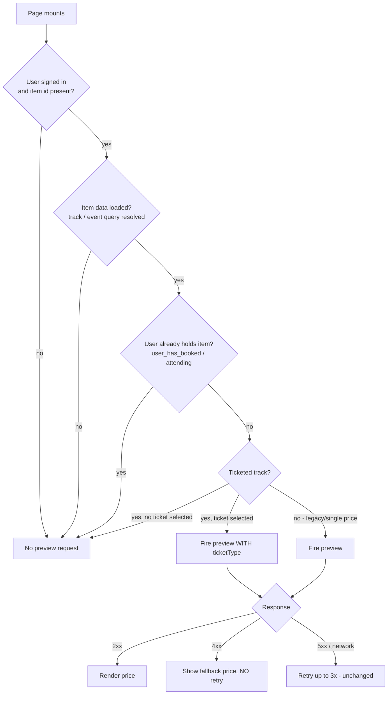
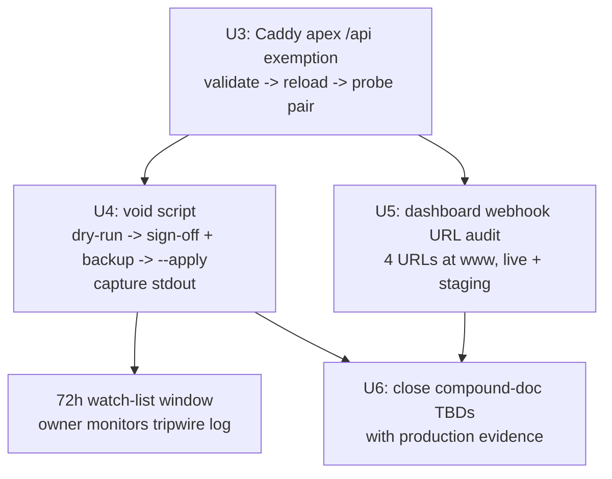

# fix: Close the v3 cutover — price-preview 400 storm, apex webhook exemption, v2 void

## Summary

Fix the three active production issues verified in the 2026-07-06 investigation: gate the SPA price-preview query so it never fires before its parent item loads (and never retries deterministic 4xx), apply the Caddy apex `/api` exemption so webhook POSTs can never be dropped by the apex 301, and finish the v3 cutover (void the 391 stranded v2 payment rows, verify the four dashboard webhook URLs). Prevention is encoded as regression tests plus institutional docs — including the int4-overflow lesson that actually caused the 2026-07-03 outage.

---

## Problem Frame

Production is healthy end-to-end on the v3 gateway (verified live 2026-07-06: 20 paid since cutover, webhooks confirming, reconciliation `errors: 0`, zero 5xx). Three verified defects remain, each with a known first-principles root cause:

1. **Price-preview 400 storm (P1).** Since 2026-07-03: 458 failed vs 306 successful `GET /api/payments/price-preview` calls. Two client-side gates evaluate permissive while the parent query is still loading: `src/features/tracks/pages/TrackDetail.tsx:160` (`ticketSelectionReady` is true while `track` is undefined, so the preview fires without a `ticketType` → `TICKET_TYPE_REQUIRED`) and `src/features/events/pages/EventDetail.tsx:110` (`!event?.trackInfo` is true while `event` is undefined → `INDIVIDUAL_BOOKING_DISABLED`). The global TanStack default `retry: 3` (`src/App.tsx:29`) amplifies every deterministic 400 into 4 requests. Enrolled users add a permanent failure class: `ALREADY_BOOKED` / `ALREADY_REGISTERED` fire on every revisit. Purchases are not blocked, but ~60% of preview traffic fails by design — masking any real regression on the payments surface. The server-side 400s are correct behavior and stay untouched.

2. **Apex webhook 301 (P2).** The apex vhost in the production Caddyfile is a blanket `redir https://www.trafficmena.com{uri} permanent` — the planned `/api*` exemption (R27 of `docs/plans/2026-07-03-001-fix-fawaterk-v3-migration-plan.md`) was never applied. Verified live: `POST https://trafficmena.com/api/payments/webhook_json` → 301. Benign today only because per-transaction webhook URLs point at `www`; any webhook Fawaterk sends to an apex-registered URL dies silently.

3. **Unfinished cutover (P2).** `server/scripts/void-v2-pending-payments.ts` was never run: 391 v2 rows (`fawaterk_invoice_id` set, `fawaterk_intent_key` null, status pending/expired) sit in limbo instead of `failed`. Capacity is already released (TTL job; 0 pending >72h), but the support watch-list step was skipped and these rows are the ones a kiosk-paid old code resurrects confusion around. Cancel/failed/refund dashboard webhook registrations are unverified (zero deliveries observed). Aman/Masary are enabled but have no live paid evidence (owner decision: keep enabled, monitor).

**Root cause of the original outage (context, already cured):** the 2026-07-03 payment failures were not a dead v2 API — production logs show PG error `22003: value "2304130044" is out of range for type integer`. Fawaterk invoice IDs crossed the int32 max (2,147,483,647) and `payments.fawaterk_invoice_id` is `integer`. The v3 migration cured it incidentally (`fawaterk_intent_key` text, `fawaterk_transaction_id` bigint). This lesson is documented nowhere; this plan encodes it.

---

## Requirements

**A. Price-preview race (P1)**

- R1. The price-preview query never fires before its parent item data is loaded (TrackDetail gates on the track being present; EventDetail gates on the event being present).
- R2. The preview never fires for users who already hold the item (`track.user_has_booked` / `event.attending` join the gates — the data is already client-side).
- R3. Deterministic 4xx preview failures are never retried: a retry predicate in `usePricePreview` suppresses retries for any `ApiError` with status 400–499, covering all call sites including `PriceBadge` and the checkout dialog.
- R4. Gating changes are per-call-site only; `Subscribe.tsx` (no itemId) and `PaymentCheckoutDialog` (opens post-selection) keep their current behavior.
- R5. Regression tests reproduce the race and the retry storm before the fix lands (bug-first workflow), via extracted pure predicates runnable under `node --test`.
- R6. Loading semantics keep `isLoading` (not `isPending`) for gated-query consumers so a disabled query can never render an infinite spinner.

**B. Apex webhook delivery (P2)**

- R7. `POST https://trafficmena.com/api/payments/webhook_json` reaches the API (non-301 response) while all non-`/api` apex traffic still 301s to `www`.
- R8. The Caddy change is matcher-scoped, passes `caddy validate` before a graceful `reload` (never `restart`), and is verified with the probe pair in R7 immediately after.
- R9. The final apex config block is recorded in `docs/DEPLOYMENT_CHECKLIST_PAYMENT_GATEWAY.md` §4 — the repo carries no Caddyfile, so the checklist is the only durable record.

**C. Cutover finalization (P2)**

- R10. The 391 stranded v2 rows are voided: dry-run report → operator sign-off + DB backup confirmed → `--apply`, with stdout captured to a file as the audit trail (voided rows are otherwise indistinguishable from genuine failures except via `fawaterk_invoice_id IS NOT NULL AND fawaterk_intent_key IS NULL`).
- R11. The post-void watch-list has a named owner and window (72h after apply), with the R31 manual-fulfilment path and the legacy-tripwire log line documented next to it.
- R12. All four Fawaterk dashboard webhook URLs (paid, cancel, failed, refund) are verified or registered at the `www` host on live (staging mirrors).
- R13. Aman/Masary stay enabled; the runbook gains the monitoring queries that surface their first live paid attempt (or failure) so each method's canary is caught when it happens organically.

**D. Second-order prevention (docs)**

- R14. The int4 lesson gets a canonical solutions doc — external numeric IDs must be `bigint` or `text`, never `int4`, because the external counter's growth is not ours to control — plus a pointer bullet in `docs/solutions/database-safety-patterns.md` and a root-cause sentence in the payment-gateway compound doc.
- R15. The dependent-query lesson gets a solutions doc: gate with `enabled: Boolean(dependency)` and never retry deterministic 4xx.
- R16. The compound doc's open TBDs are closed with production evidence: webhook correlation (`transaction_key === fawaterk_intent_key`) is now production-confirmed by working webhook confirmations; the 391-row count is recorded.

---

## Key Technical Decisions

- **Retry suppression by status class, not error-code list:** the preview endpoint throws at least nine deterministic 4xx codes today and the list will drift; `ApiError.status` (`src/app/api/client.ts`) is already typed, so `status >= 400 && status < 500 → no retry` covers all current and future codes at every call site.
- **Per-call-site gating, never a hook-level `enabled` default:** the subscription preview legitimately runs with no `itemId`, and the checkout dialog is already safe; a hook default that assumes loaded item data would break them.
- **Server 400s are correct and untouched:** `TICKET_TYPE_REQUIRED` and friends are deliberate contract responses (`server/src/routes/api/payments.ts:556-726`). The defect is client firing order only.
- **No post-Caddy gateway sweep:** `server/src/jobs/paymentReconciliation.ts` already polls pending v3 payments every 15 minutes (production-verified: `errors: 0`, webhooks confirming) — it is the lost-webhook bridge, so no one-time sweep script is needed.
- **Matcher-scoped Caddy exemption:** Caddy's default directive order puts `redir` before `reverse_proxy`, so a naive addition leaves the 301 winning silently. The apex block must use explicit `handle` blocks (or an `@api` matcher on the redirect) so `/api*` proxies and everything else redirects.
- **Void keeps `failed` semantics, no schema change:** `failed` is deliberately outside every recovery scan (rollback-boundary design from the migration plan); the audit trail is the captured operator table, not a new column.
- **`fawaterk_invoice_id` stays `integer`:** it is a legacy audit-only column v3 never writes; widening it is churn without benefit. The lesson is encoded in docs and applies to future integrations.
- **Aman/Masary stay enabled (owner decision 2026-07-06):** monitoring-only; the runbook queries make the organic canary observable.

---

## High-Level Technical Design

Preview-request gating after the fix (per call site):

Ops sequence (order is load-bearing; Caddy exemption first per checklist §7):

---

## Implementation Units

### U1. Suppress retries on deterministic preview 4xx

- **Goal:** one premature or invalid preview request costs exactly one request, at every call site.
- **Requirements:** R3, R5.
- **Dependencies:** none.
- **Files:** `src/app/hooks/usePayments.ts`; new pure helper module (e.g. under `src/app/api/`) exporting the retry predicate; `tests/unit/price-preview-retry.test.ts` (new).
- **Approach:** add a `retry` option to the `usePricePreview` query that delegates to a pure exported predicate: retry only when the error is not an `ApiError` with status 400–499 and the failure count is under the global cap. Keep the predicate React-free so `node --test` can import it directly (house pattern: `tests/unit/void-v2-selection.test.ts`, `track-booking-state.test.ts`).
- **Execution note:** bug-first — the predicate test asserting "400 → no retry" is written before the hook wiring.
- **Patterns to follow:** `usePaymentMethods` per-hook retry override (`src/app/hooks/usePayments.ts:31`); `ApiError` shape in `src/app/api/client.ts`.
- **Test scenarios:**
  - `ApiError` status 400 (`TICKET_TYPE_REQUIRED`) → predicate returns false at any failure count.
  - `ApiError` 401, 404, 409 → false (whole 4xx class, not a code list).
  - `ApiError` status 500 → true below the cap, false at the cap.
  - Network `TypeError` (no status) → true below the cap.
  - Non-`ApiError` object → true below the cap (fail open to retrying — 5xx/transient bias).
- **Verification:** unit tests green; grep confirms no other preview call site defines a conflicting `retry`.

### U2. Gate the preview until item data is loaded and the user can buy

- **Goal:** the preview query cannot fire before the track/event has loaded, nor for users who already hold the item.
- **Requirements:** R1, R2, R4, R5, R6.
- **Dependencies:** U1 (shared test file conventions; behavior independent).
- **Files:** `src/features/tracks/pages/TrackDetail.tsx`; `src/features/events/pages/EventDetail.tsx`; new pure predicates (e.g. `src/features/tracks/utils/` and `src/features/events/utils/`, mirroring `trackBookingState.ts`); `tests/unit/price-preview-gating.test.ts` (new).
- **Approach:** extract two pure predicates — one per page — that take the loaded item (or undefined), user presence, booked/attending state, and the selected ticket type, and return whether the preview may fire (and with which `ticketType`). Wire each into the page's `enabled` option. TrackDetail's predicate returns false while `track` is undefined (this alone kills the 338×400 storm) and false when `user_has_booked`. EventDetail's predicate returns false while `event` is undefined, false when `attending`, and keeps the existing `singleBookingStart` presence check (the time-window case still 400s once — covered by U1's no-retry; `allowIndividualBooking` is not exposed on the event-detail response and widening that contract is out of scope).
- **Execution note:** bug-first — the first test asserts the current permissive behavior is rejected: `track: undefined → mayFire: false` fails against a predicate transcribing today's logic.
- **Patterns to follow:** `enabled: Boolean(dependency)` house convention (`docs/solutions/feature-implementations/track-details-view-admin.md`); pure-helper extraction (`src/features/tracks/utils/trackBookingState.ts`).
- **Test scenarios:**
  - Track undefined (loading) → no fire, regardless of user/ticket state (reproduces the production race).
  - Ticketed track loaded, no ticket selected → no fire; ticket selected → fire with that `ticketType`.
  - Legacy single-price track loaded → fire without `ticketType`.
  - `user_has_booked` true → no fire (ticketed and legacy variants).
  - Event undefined (loading) → no fire; standalone event loaded → fire; track-bound event without `singleBookingStart` → no fire; with it → fire.
  - `attending` true → no fire.
  - Signed-out user → no fire (both pages).
- **Verification:** unit tests green; manual spot-check on a ticketed track page shows zero preview requests before track load and none after booking (network tab); `PromoCodeInput` still uses `isLoading` so the gated window shows no spinner.

### U3. Apply the Caddy apex `/api` exemption (ops + checklist)

- **Goal:** apex-addressed webhook POSTs reach the API; every other apex request still redirects to `www`.
- **Requirements:** R7, R8, R9.
- **Dependencies:** none — runs first in the ops sequence (checklist §7 order).
- **Files:** `docs/DEPLOYMENT_CHECKLIST_PAYMENT_GATEWAY.md` (§4 — record the final block verbatim). VPS-only artifact: `/etc/caddy/Caddyfile` apex vhost (not in repo).
- **Approach:** replace the apex block's blanket `redir` with `handle` blocks — `handle /api*` reverse-proxies to `127.0.0.1:3001` identically to the `www` vhost; the fallback `handle` keeps the permanent redirect. Sequence: edit → `caddy validate` → `systemctl reload caddy` → probe pair. Matcher scoping is mandatory: with a bare `redir` + `reverse_proxy` in one block, `redir` wins by directive order and the failure is silent.
- **Test scenarios:** Test expectation: none — infra config; verification is the live probe pair below.
- **Verification:** `POST https://trafficmena.com/api/payments/webhook_json` with an empty JSON body returns 400 (`INVALID_PAYLOAD` — handler reached), not 301; `GET https://trafficmena.com/` still 301s to `https://www.trafficmena.com/`; SPA and API on `www` unaffected; checklist §4 shows the applied block.

### U4. Run the v2 void to completion (ops + runbook)

- **Goal:** the 391 stranded v2 rows become `failed`, the support watch-list is produced and owned, and the audit trail survives.
- **Requirements:** R10, R11.
- **Dependencies:** U3 (ops order).
- **Files:** `docs/runbooks/payment-reliability-operations.md` (§5 — watch-list owner, window, R31 path); `docs/DEPLOYMENT_CHECKLIST_PAYMENT_GATEWAY.md` (§7 — mark the void executed with date + row count). Ops artifact: captured stdout of both runs, stored with the operator.
- **Approach:** run the existing script as designed — dry-run first, capture stdout to a file; operator reviews the table (expect ≈391 rows; investigate any drift); confirm DB backup; re-run with `--apply`, capture stdout again. Rows created within the 72h gateway due window land on the WATCH-LIST bucket: those codes are still payable at kiosks after voiding, so the named owner watches the legacy-tripwire log line (`[payments/webhook] post-cutover legacy webhook, invoice_id=<n>`) for 72h and fulfils manually per the R31 support protocol on any hit. Zero tripwire hits to date (production-verified) — the watch-list is expected to be small or empty.
- **Test scenarios:** Test expectation: none — the selection predicate is already covered by `tests/unit/void-v2-selection.test.ts`; this unit executes an existing tested script.
- **Verification:** post-apply SQL shows 0 rows matching `status IN ('pending','expired') AND fawaterk_invoice_id IS NOT NULL AND fawaterk_intent_key IS NULL`; a voided payment's pending page shows the "no longer valid" banner and its track/event page returns to available (recovery path production-confirmed: `user_has_pending_payment` counts only live reservations); both stdout captures archived.

### U5. Audit dashboard webhook URLs and make the Aman/Masary canary observable

- **Goal:** all four webhook types deliver to `www`, and the first organic Aman/Masary payment (or failure) is noticed, not missed.
- **Requirements:** R12, R13.
- **Dependencies:** U3 (apex fixed first so even a stale apex registration would now deliver).
- **Files:** `docs/runbooks/payment-reliability-operations.md` (monitoring queries); `docs/DEPLOYMENT_CHECKLIST_PAYMENT_GATEWAY.md` (§4 registration status recorded).
- **Approach:** in the Fawaterk dashboard (live + staging): confirm the paid URL is `https://www.trafficmena.com/api/payments/webhook_json` and register cancel/failed/refund at their `www` paths (endpoints deployed and verified live). For Aman/Masary: add two runbook checks — a journal grep for webhook confirmations by method, and the payments-by-method SQL (code-column discriminator: `aman_code` / `masary_code`) — run as part of the existing finance daily verification (§4 of the runbook). First paid Aman/Masary row = organic canary passed; a paid-at-gateway-but-stuck-pending row = triage per runbook §1.
- **Test scenarios:** Test expectation: none — dashboard/ops actions plus doc updates.
- **Verification:** dashboard shows four `www` URLs per environment; the next cancel/failed/refund event (or a staging-triggered one) produces a verified log line instead of silence; runbook §4 contains the two method-canary checks.

### U6. Encode the lessons (institutional docs)

- **Goal:** the int4 root cause and the query-gating discipline outlive this incident; the compound doc's open questions close with production evidence.
- **Requirements:** R14, R15, R16.
- **Dependencies:** U3–U5 outcomes (evidence to record).
- **Files:** `docs/solutions/database-issues/external-id-column-sizing.md` (new, canonical); `docs/solutions/runtime-errors/tanstack-query-enabled-gating-race.md` (new); `docs/solutions/database-safety-patterns.md` (pointer bullet only — it is a pointer stub by convention); `docs/solutions/payment-gateway/payment-gateway-compound-knowledge.md` (root-cause sentence in the v3 section, AE5 closure, 391-row count, changelog line).
- **Approach:** external-ID doc carries the outage narrative (PG `22003`, invoice `2304130044` vs int4 max `2147483647`, v2 API alive, our write failing) and the rule: external numeric IDs are `bigint` or `text` — with the note that `fawaterk_transaction_id` `{ mode: 'number' }` safely caps at 2^53. Gating doc cites the house `enabled: Boolean(dependency)` convention and the 4xx-no-retry predicate, with this incident as the worked example (458 vs 306). Compound doc: record that webhook correlation is production-confirmed (paid webhooks matching by intent key since 2026-07-03), keep hash-format/`due_date` notes as observed-in-production.
- **Test scenarios:** Test expectation: none — documentation.
- **Verification:** both new solution docs carry YAML frontmatter (category, tags, problem_type) matching `docs/solutions/` conventions; the stub gained only a pointer; compound-doc TBD list no longer claims webhook correlation is unverified.

---

## Acceptance Examples

- AE1. **Given** a signed-in user on a slow connection opening the ticketed track page, **when** the track query is still loading, **then** zero price-preview requests are sent; after load, the first preview request is the one carrying the selected `ticketType`.
- AE2. **Given** a user with an active Track Booking revisiting that track, **when** the page renders the enrolled state, **then** no preview request fires.
- AE3. **Given** the applied Caddy exemption, **when** an empty JSON POST hits `https://trafficmena.com/api/payments/webhook_json`, **then** the response is 400 from the handler (not 301), while `GET https://trafficmena.com/` still 301s to `www`.
- AE4. **Given** a voided v2 payment, **when** its holder opens the payment pending page, **then** the "no longer valid" banner shows, and the item's page offers a fresh booking.
- AE5. **Given** the Subscribe page, **when** it renders for an authenticated non-subscriber, **then** the subscription preview still fires exactly as today (no itemId, no gating regression).

---

## Scope Boundaries

**Deferred to Follow-Up Work**

- Exposing `allowIndividualBooking` on the event-detail API response so the SPA gate matches the server's first check exactly (today's date-presence proxy plus no-retry is sufficient; widening the contract is its own change).
- Removing or wiring the dead `PriceBadge` component (`src/shared/components/payment/PriceBadge.tsx` — exported, rendered nowhere). U1's shared retry predicate already covers it if it ever mounts.
- Stale-ticket-type on "Request new code" from a voided row (`src/pages/payment/pending.tsx` forwards the old `ticketType`; a disabled variant yields a toast and the user rebooks from the item page — accepted).
- Phase 7 of the migration plan (cancel-webhook upgrade decision, 14-day tripwire removal) — owns its own evidence gate.

**Out of scope**

- Any monitoring/alerting infrastructure (owner decision 2026-07-06: tests + docs only; log-check commands live in the runbook).
- Widening `payments.fawaterk_invoice_id` (legacy audit-only column, never written by v3).
- Disabling Aman/Masary (owner decision 2026-07-06: keep enabled, monitor).
- The OTP request 404/409 responses (intentional UX contract, not defects).

---

## Risks & Dependencies

- **Silent Caddy misorder:** an unscoped edit leaves the 301 winning with no error anywhere. Mitigated by the mandatory matcher-scoped shape and the immediate probe pair (R8) — the probe is the only honest signal.
- **Paid-after-void support case:** a kiosk payment against a watch-list code lands money with no fulfilment and a "no longer valid" page. Bounded to 72h post-apply, surfaced by the tripwire log line, resolved by the R31 manual path; tripwire hits are zero to date.
- **Preview serialization trade-off:** gating on item load makes the preview sequential after the item fetch on legacy tracks (previously parallel) — subscribers see the base price roughly one round-trip longer before the discounted price swaps in. Accepted; correctness over parallelism.
- **`isPending` migration hazard:** if a future refactor swaps `isLoading` for `isPending` on preview consumers, gated (disabled) queries report pending forever and the promo input spins. R6 pins the semantics; the gating solutions doc records the hazard.
- **Fawaterk dashboard access** is the owner's; U5 cannot be executed by an agent and blocks R12 until done.

---

## Sources & Research

- Live production evidence (2026-07-06 investigation over SSH): journal counts for the 400 storm (458 vs 306; 338×400 on one track), the PG `22003` stack traces from 2026-07-03 01:15 UTC, the apex 301 probe, payment funnel by method since cutover, `SELECT` confirming the 391 stranded rows, reconciliation job cadence.
- `docs/plans/2026-07-03-001-fix-fawaterk-v3-migration-plan.md` — R26 (void), R27 (webhook delivery repair), R31 (support protocol), rollback-boundary design.
- `docs/DEPLOYMENT_CHECKLIST_PAYMENT_GATEWAY.md` §4/§7 — existing Caddy fix procedure, probe, cutover ordering this plan executes rather than re-derives.
- `docs/runbooks/payment-reliability-operations.md` — webhook outage playbook, straggler protocol the watch-list handoff extends.
- `docs/solutions/payment-gateway/payment-gateway-compound-knowledge.md` — v3 contract findings and the open TBD list U6 closes.
- `docs/solutions/feature-implementations/track-details-view-admin.md` — the house `enabled: Boolean(dependency)` convention U2 cites.
- `docs/solutions/development-practices/bug-first-testing-workflow.md` — reproducing-test-first ordering carried into U1/U2 execution notes.
- Code anchors: `src/app/hooks/usePayments.ts:84-106`, `src/App.tsx:29`, `src/features/tracks/pages/TrackDetail.tsx:150-172`, `src/features/events/pages/EventDetail.tsx:110-117`, `server/src/routes/api/payments.ts:556-726` (calculatePrice guards) and `:2330` (preview handler), `server/src/routes/api/ticketAccess.ts:170-184` (`resolveTrackBasePrice`), `server/scripts/void-v2-pending-payments.ts`, `server/src/jobs/paymentReconciliation.ts`.
