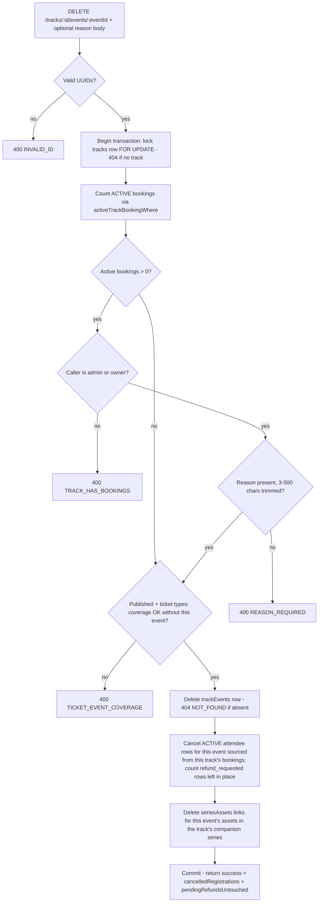

# Track Window Display Removal and Booked-Track Session Removal Override - Plan

## Goal Capsule

- **Objective:** Two independent workstreams, each landable as its own commit. (A) Remove the booking-window date displays from all read-only track surfaces, keeping the fields only in the track edit form. (B) Let owners/admins remove a session (Event) from a Track that has active bookings, with atomic cleanup of the buyers' derived access and a recorded reason; as part of the same change, both session guards (remove and add) are corrected to count only active bookings.
- **Authority:** This plan's Product Contract encodes user-approved decisions (assets unlinked on removal; pending refund requests left untouched; managers stay blocked; no notification emails; no automatic refunds). Do not re-litigate these during implementation. Where the plan is silent, follow repo conventions (CLAUDE.md) and the cited precedents.
- **Stop conditions:** Do not modify payment/checkout flows, `executeTrackBookingWrite` fulfillment logic, event lifecycle routes (`DELETE /events/:id`), or the ticket-coverage rules. If implementation reveals coupling that forces changes there, stop and surface it.
- **Execution profile:** Standard repo gates — lint, unit tests, server + frontend builds (see Verification Contract).
- **Tail ownership:** One commit per workstream (Conventional Commits). No push or PR unless the user asks.

---

## Product Contract

### Summary

Hide the track booking-window dates everywhere except the track edit form, and add a safe owner/admin override to the session-removal endpoint so a cancelled session can be pulled from a booked track: the removal deletes the track-session link, cancels the buyers' materialized registrations for that session, and unlinks the session's assets from the track's series — all in one transaction, with a required reason recorded for audit.

### Problem Frame

A speaker cancelled their session on a production track that already has paid bookings. The removal endpoint is hard-blocked by a `TRACK_HAS_BOOKINGS` guard, so there is no legitimate way to pull the session — and the tempting workaround (deleting the event outright) cascade-destroys attendee and payment-linked records. Booking a track materializes one `eventAttendees` row per session (tagged `sourceTrackBookingId`), so a naive link deletion would leave every buyer still registered for a session that will never happen: it stays in their events, holds a seat, and keeps exposing the meeting link.

Separately, the booking-window dates render on several read-only surfaces where they should no longer appear; the window itself must keep gating when booking opens and closes.

Terminology: "session" in user language = **Event** in the codebase (`CONCEPTS.md`); a track's events render as "sessions" in member-facing UI.

### Requirements

**A. Booking-window display removal**

- R1. The booking-window date displays are removed from: the "Booking Window" card on the public track page (`src/features/tracks/pages/TrackDetail.tsx`), the "Booking opens:"/"Booking closes:" lines on the admin track detail page (`src/features/tracks/pages/AdminTrackDetail.tsx`), and the "Booking opens:" line on the admin tracks list (`src/features/events/pages/AdminMeetups.tsx`).
- R2. Everything functional is unchanged: the edit-form window fields (`TrackForm.tsx`), server-side window validation and enforcement, the disabled Book-button states ("Opens {date}", "Closed" in `TrackBookingButton.tsx`), the `bookingStatus` availability messages on the public track page, and `PublicTrackCard`'s open/closed logic.

**B. Booked-track session removal override**

- R3. When a track has one or more active bookings, an owner or admin can remove a session by supplying a reason (3-500 chars, trimmed); managers remain blocked with `TRACK_HAS_BOOKINGS`. Tracks with zero active bookings keep today's manager-level removal with no reason required.
- R4. Removal is atomic — one transaction that: deletes the `trackEvents` link, cancels the buyers' materialized registrations for that session (R5), and unlinks the session's library assets from the track's companion series (R6).
- R5. Cancellation targets only rows with `status = 'active'` whose `sourceTrackBookingId` belongs to this track's bookings, setting `status = 'cancelled'`, `cancelledAt`, and `adminNote` carrying the acting staff user's id and the reason. Rows in `refund_requested` are left untouched and stay in the admin refund queue; standalone registrations (`sourceTrackBookingId IS NULL`) are never touched.
- R6. The removed session's `seriesAssets` links in the track's companion series are deleted (reverse of the add path). Asset `isPremium` flags are left as-is.
- R7. The `TICKET_EVENT_COVERAGE` guard stays enforced for every role: removing the last online (or offline) session from a published track sold with format-specific tickets is rejected.
- R8. The booking-count guards on session removal and session add count only **active** (non-revoked) bookings, fixing the current behavior where a fully-revoked track is still locked.
- R9. Removal serializes against concurrent booking fulfillment by locking the track row `FOR UPDATE` before the guard count, mirroring `executeTrackBookingWrite`.
- R10. The response reports `cancelledRegistrations` and `pendingRefundsUntouched` counts.
- R11. Admin UI: owners/admins on a booked track get a consequence dialog showing the active-bookings count and requiring a reason; managers on a booked track get the blocked explanation; zero-booking tracks keep the simple confirm. The success toast surfaces the response counts.

### Acceptance Examples

- AE1. **Booked-track removal.** Given a published track with 3 active bookings, when an admin removes a session with reason "Speaker cancelled", then the session leaves the track, each buyer's registration for it becomes `cancelled` with the reason in `adminNote`, buyers keep all other sessions and their booking stays active, and the event's meeting link is no longer exposed to them.
- AE2. **Manager blocked.** Given the same track, when a manager attempts removal, then the API returns `TRACK_HAS_BOOKINGS` and nothing changes.
- AE3. **Revoked-only track (guard bug fix).** Given a track whose only bookings are revoked, when a manager removes a session without a reason, then it succeeds (active count is 0).
- AE4. **Mixed registration states.** Given a session with two `active` sourced rows, one `refund_requested` sourced row, and one standalone registration, when an admin removes it, then exactly the two active sourced rows are cancelled, and the response reports `cancelledRegistrations: 2`, `pendingRefundsUntouched: 1`.
- AE5. **Coverage stays hard.** Given a published track sold with online tickets whose only online session is the target, when an owner attempts removal with a valid reason, then the API returns `TICKET_EVENT_COVERAGE`.
- AE6. **Mid-checkout buyer.** Given a buyer with a pending payment for the track, when the session is removed before the payment settles, then fulfillment materializes the buyer only into the remaining sessions and the orphaned per-event reservation expires on its own.
- AE7. **Add guard counts active bookings.** Given a track whose only bookings are revoked, when a manager adds a session to it, then the add succeeds; with one active booking, adding remains rejected with `TRACK_HAS_BOOKINGS`.

### Scope Boundaries

**Deferred to Follow-Up Work**

- Guard `DELETE /events/:id` (currently unguarded for admin+; cascade-deletes attendee and payment-linked rows — the dangerous bypass this feature exists to make unnecessary).
- Apply the active-only booking count to the `CAPACITY_BELOW_BOOKINGS` check in the track-update route (`server/src/routes/api/tracks.ts:1158`) — same counting flaw, different semantics, untouched here.
- Owner/admin overrides for **adding** or reordering sessions on booked tracks (adding would not grant existing buyers access — a different feature with different risks).
- Notification emails to affected buyers (communications handled manually for now).
- Any automatic refund or price adjustment (track price is a fixed bundle price; compensation is a business decision recorded via the removal reason).
- A backfill mechanism for re-adding a removed session (registrations are only materialized at booking time — removal is one-way for existing buyers).
- Showing mid-checkout reservation counts in the confirmation dialog (`bookings_count` covers settled bookings only).

**Outside this change**

- The cancelled event's own lifecycle (unpublish/cancel/delete) stays a separate manual admin action.

---

## Planning Contract

### Key Technical Decisions

- **KTD1 — Same endpoint, optional JSON body, best-effort parse.** Extend `DELETE /tracks/:id/events/:eventId` to read an optional `{ reason }` body via the existing `extractJsonPayload` helper (`server/src/routes/api/jsonPayload.ts`), parsed best-effort: an absent body or any extraction failure resolves to "no reason supplied" and flows to the guard logic — never surfaced as a parse error. This matters because `fetchJson` tags every request `Content-Type: application/json`, so today's body-less DELETE arrives as an empty JSON body and `extractJsonPayload` would return `INVALID_JSON`; propagating that would break the ordinary unbooked-track removal. Reason is validated only when present, and the required-when-booked and length rules live in the decision helper, so a stale client hitting a booked track fails safe with `TRACK_HAS_BOOKINGS`/`REASON_REQUIRED`, not `INVALID_JSON`. A valid reason from an admin+ caller *is* the override activation — no separate flag. Alternative considered: a separate revoke-style `POST .../remove` (the repo's only reason-carrying precedent uses POST) — rejected because it would duplicate the guard/coverage logic and split one operation across two routes.
- **KTD2 — Cancel, don't delete.** Mirror the `revokeTrackBookingAccess` SET shape (`server/src/routes/api/trackBookingShared.ts:369-385`): `status: 'cancelled'`, `cancelledAt`, `adminNote: 'Event removed from track by <acting staff user id>: <reason>'` — the actor is recorded alongside the reason, matching the forensic intent of revoke's `revokedBy` without a schema change. Payment history and attendee rows survive for audit. Per user decision, only `status = 'active'` rows are transitioned — narrower than revoke's `['active','refund_requested']` set.
- **KTD3 — Targeting join.** Cancel rows where `eventAttendees.eventId = :eventId` AND `sourceTrackBookingId` is in this track's booking IDs (all bookings of the track — rows sourced from since-revoked bookings are already cancelled, so the wider join is a harmless safety net). Use Drizzle `inArray`, never raw `= ANY(...)` (documented pitfall). `NULL`-source rows are structurally excluded, which protects standalone registrations (R5); pre-backfill legacy rows are a known residual risk — see Assumptions.
- **KTD4 — Track-row lock first.** The transaction opens with `SELECT ... FROM tracks WHERE id = :id FOR UPDATE` (also yielding `isPublished` + ticket prices for the coverage check), mirroring `executeTrackBookingWrite`'s lock order. Without it, an in-flight fulfillment is invisible to the guard count under READ COMMITTED: a manager could slip a removal through and the concurrently-materialized registration would survive as orphaned access — the exact state this feature prevents.
- **KTD5 — Active-only guard counts.** Wrap both the removal guard (`tracks.ts:1454`) and the add-events guard (`tracks.ts:1311`) counts with `activeTrackBookingWhere(...)` (`server/src/utils/booking.ts`). This enforces the documented access-control convention (`docs/solutions/feature-implementations/ticket-aware-access-control.md`, prevention rule 1) and aligns the guards with the `bookingsCount` the admin UI already displays, which is active-only (`tracks.ts:842-845`). Behavior change is narrow: tracks whose bookings are all revoked become editable by managers again; adding stays blocked whenever one active booking exists.
- **KTD6 — Role check in-handler.** Keep `requireManager` on the route; inside the booked branch require `getRolePriority(staff.role) >= getRolePriority('admin')` (both exported from `server/src/routes/api/utils.ts`; `requireAdmin` already treats owner as admin). No route split, no extra DB call.
- **KTD7 — Series unlink in the same transaction.** Delete `seriesAssets` rows where the series is the track's companion series and the asset belongs to the removed event — the reverse of the add path (`tracks.ts:1380-1421`). `isPremium` stays untouched: assets may serve other contexts, and premium curation remains manual.
- **KTD8 — Pure-function extraction for tests.** The repo's unit tests import pure functions from source (no DB, no HTTP; see `tests/unit/track-ticket-fulfillment.test.ts`), and `registerTrackRoutes` does not accept injectable deps. Extract the authorization decision into a pure helper (new `server/src/routes/api/trackEventRemoval.ts`) and the dialog-mode decision into a pure frontend util, and unit-test both matrices. Transactional behavior is verified through the dev recipe in the Verification Contract, consistent with `revokeTrackBookingAccess` having no unit test.
- **KTD9 — Workstream A is JSX-only.** Remove display blocks; change no API responses, serializers, or types. A recent production lesson (`docs/solutions/runtime-errors/tanstack-query-enabled-gating-race.md`) warns that dropping response fields can re-trigger dependent-query storms — not a risk pure JSX removal can reach.

### High-Level Technical Design

Decision and transaction flow for the extended removal endpoint:

The cancellation and unlink steps key off `eventId` and the bookings/series joins — not the just-deleted `trackEvents` row — so the delete-then-cleanup order inside the transaction is safe.

### Assumptions

- Production `eventAttendees.sourceTrackBookingId` backfill is complete (the migration ran; `revokeTrackBookingAccess` keeps a legacy fallback only as a safety net). Rows with `NULL` source for track buyers would be missed by this cancellation — the Verification Contract includes a pre-flight query to confirm none exist for the target track before first production use.
- Rejecting a pending refund request after its session was removed returns that registration to `active` for a now-standalone event (existing reject behavior). Accepted consequence of leaving refund rows untouched; admins should approve, not reject, refund requests for removed sessions. Recorded here so support/ops know.

---

## Implementation Units

### U1. Remove booking-window displays from read-only surfaces

- **Goal:** The booking-window dates no longer render outside the track edit form.
- **Requirements:** R1, R2.
- **Dependencies:** None (independent of U2/U3).
- **Files:** `src/features/tracks/pages/TrackDetail.tsx` (the "Booking Window" card, ~lines 683-693), `src/features/tracks/pages/AdminTrackDetail.tsx` (the "Booking opens:"/"Booking closes:" grid items, ~lines 82-93), `src/features/events/pages/AdminMeetups.tsx` (the "Booking opens:" paragraph, ~lines 321-326).
- **Approach:** Delete the three JSX blocks and any imports they alone used (e.g., `CalendarDays`, `format` helpers). Touch nothing else: `TrackForm.tsx` fields, `TrackBookingButton.tsx` "Opens {date}" state, `TrackDetail`'s `bookingStatus` messages (~lines 274-301), and `PublicTrackCard.tsx`'s `isBookingOpen` logic all stay. The `AdminTrackDetail` stats grid drops from 4 items to 2 — acceptable cosmetic change.
- **Patterns to follow:** Pure presentational removal; no API or type changes (KTD9).
- **Test scenarios:** Test expectation: none — presentational removal with no behavioral logic; guarded by lint (unused imports), both builds, and the manual visual check below.
- **Verification:** `npm run lint` passes with no unused-import warnings in the three files; frontend build passes; manual check of the public track page, admin track detail, and admin tracks list shows no window dates, while the edit form still shows the window fields and a not-yet-open track still shows "Opens {date}" on its booking button.

### U2. Server: active-only guards + owner/admin removal override with atomic cleanup

- **Goal:** `DELETE /tracks/:id/events/:eventId` performs the full safe removal on booked tracks for admin+, stays blocked for managers, and both session guards count only active bookings.
- **Requirements:** R3-R10.
- **Dependencies:** None.
- **Files:** `server/src/routes/api/tracks.ts` (removal handler ~1435-1509; add-events guard ~1311-1321), new `server/src/routes/api/trackEventRemoval.ts` (pure decision helper + reason schema), new `tests/unit/track-event-removal.test.ts`, `CLAUDE.md` (one-line endpoint description update).
- **Approach:** Follow the HTD flow. Read the optional body with `extractJsonPayload` best-effort per KTD1 — an absent body or failed extraction means reason is undefined; never return the parse error. Validate the reason inside the decision helper (trimmed, min 3 / max 500, mirroring `revokeEnrollmentSchema`'s bounds at `server/src/routes/api/trackEnrollments.ts:33-35`) rather than with route-level Zod, so the route's error codes never diverge from the unit-tested helper contract. Wrap everything in one `db.transaction` opening with the track-row `FOR UPDATE` lock (KTD4); reuse the locked row's fields for the existing coverage check. Guard counts use `activeTrackBookingWhere` (KTD5) — apply the same one-line change to the add-events guard. Role gate per KTD6. Cancellation UPDATE per KTD2/KTD3 with `.returning()` for the count; a separate count of `refund_requested` sourced rows fills `pendingRefundsUntouched`. Series unlink per KTD7 (look up the track's series by `series.trackId`, delete matching `seriesAssets` by the event's `libraryAssets` IDs). Extract the authorization decision — `evaluateTrackEventRemoval({ role, activeBookingCount, reason })` returning either the allow (+ override flag) or a typed error code — into `trackEventRemoval.ts` so the matrix is unit-testable (KTD8). Keep `TRACK_HAS_BOOKINGS` message shape ("Cannot modify events on track with N active bookings.") so existing toasts stay meaningful.
- **Execution note:** Write the decision-helper tests first (the matrix below), then implement the route against them.
- **Patterns to follow:** `revokeTrackBookingAccess` for the SET shape and transaction discipline (`trackBookingShared.ts:326-435`); `executeTrackBookingWrite` for lock order (`trackBookingShared.ts:83-103`); `docs/solutions/database-issues/drizzle-transaction-atomicity.md`; UUID validation already in the handler stays as-is.
- **Test scenarios** (pure helper matrix, `tests/unit/track-event-removal.test.ts`):
  - Covers AE3. Manager with `activeBookingCount: 0` → allowed, no override, reason not required.
  - Covers AE2. Manager with `activeBookingCount: 2` → `TRACK_HAS_BOOKINGS`.
  - Admin with `activeBookingCount: 2`, no reason → `REASON_REQUIRED`.
  - Admin with reason `"ab"` (min-length fail) and reason of 501 chars (max fail) → `REASON_REQUIRED`.
  - Admin with `activeBookingCount: 2`, reason `"Speaker cancelled"` → allowed with override.
  - Owner treated identically to admin.
  - Reason surrounded by whitespace is trimmed before length validation.
- **Verification:** New tests pass in `npm run test:unit`; server build passes; dev recipe (Verification Contract) demonstrates AE1, AE4, AE5, and AE7 end-to-end, plus: a body-less DELETE (no reason) against a zero-active-booking track still succeeds — the existing client path stays intact.

### U3. Admin UI: consequence dialog, reason capture, and client wiring

- **Goal:** The track edit page walks owner/admin through an informed, reason-backed removal on booked tracks; managers see why they are blocked; success reports what happened.
- **Requirements:** R11 (consumes R3, R10).
- **Dependencies:** U2 (response shape and error codes).
- **Files:** `src/pages/admin/library/tracks/[id].tsx` (`handleRemoveEvent`, ~lines 118-122), new `src/features/tracks/components/RemoveTrackEventDialog.tsx`, new `src/features/tracks/utils/removeEventGate.ts`, new `tests/unit/track-remove-event-gate.test.ts`, `src/app/api/tracks.ts` (`removeEventFromTrack` gains optional `reason` and returns the counts), `src/features/tracks/hooks/useTracks.ts` (`useRemoveEventFromTrack` passes reason, widens invalidation, surfaces counts in the toast).
- **Approach:** Extract a pure `resolveRemoveEventFlow({ canDeleteContent, activeBookingsCount })` → `'simple-confirm' | 'override-dialog' | 'blocked'` into `removeEventGate.ts` (KTD8); the page already has both inputs (`useRolePermissions().canDeleteContent` and `track.bookings_count`, which is active-only — no API change needed). `'simple-confirm'` keeps today's `window.confirm`; `'blocked'` shows the destructive toast explaining only owners/admins can remove sessions from a booked track; `'override-dialog'` opens the new dialog. Model the dialog on the revoke dialog in `src/features/tracks/components/TrackAttendeesList.tsx:249-286` (shadcn `Dialog`, nullable dialog-state object, reason field, client-side min-3 check with the "at least 3 characters for audit" toast): title names the session, body states the consequences — "N active bookings; their registration for this session will be cancelled; this cannot be undone by re-adding the session" — and requires the reason. Carry over the reference dialog's `isPending`-gated spinner/disabled state on the confirm button (double-submits must not fire duplicate DELETEs mid-transaction), and deviate on one point: the reason field starts blank — no boilerplate prefill, so an unedited placeholder can never satisfy the audit check. Client: send `{ reason }` as the DELETE body via `fetchJson` (it forwards `init` including body and CSRF); parse the response counts. Mutation: on success, invalidate the full key set that `invalidateTrackAccessQueries` (`useTrackEnrollmentManagement.ts:5-16`) covers — including `['track-attendees', trackId]` and the public track detail key alongside `['tracks','detail',trackId]`, `['tracks']`, `['events']`, `['series']`, `['library']` — member access changed, not just track shape; toast branches on the counts: when `cancelledRegistrations` is 0, keep today's plain "The event was removed from the track." message (the common unbooked path must not read "0 registrations cancelled"); when nonzero, "Session removed. 3 registrations cancelled.", appending ", 1 pending refund request left in the review queue." only when that count is also nonzero. Keep the `onError` message-passthrough behavior (server messages are instructive per U2).
- **Patterns to follow:** `TrackAttendeesList` revoke dialog and its try/catch + `ApiError` toast handling; `useTrackEnrollmentManagement.ts` invalidation breadth; `tests/unit/track-booking-state.test.ts` for testing a `src` util from the node test runner.
- **Test scenarios** (pure gate util, `tests/unit/track-remove-event-gate.test.ts`):
  - `canDeleteContent: true`, `activeBookingsCount: 3` → `'override-dialog'`.
  - `canDeleteContent: false`, `activeBookingsCount: 3` → `'blocked'`.
  - `canDeleteContent: true`, `activeBookingsCount: 0` → `'simple-confirm'`.
  - `canDeleteContent: false`, `activeBookingsCount: 0` → `'simple-confirm'` (managers keep today's flow on unbooked tracks).
  - Missing/undefined count treated as 0 (defensive default).
- **Verification:** New tests pass; frontend build passes; dev recipe walks all three UI paths (simple confirm, blocked toast as manager, override dialog as admin) and confirms the success toast shows the counts from AE4.

---

## Verification Contract

| Gate | Command | Applies to | Pass signal |
|---|---|---|---|
| Unit tests | `npm run test:unit` | U2, U3 | All pass, including the two new test files |
| Lint | `npm run lint` | U1-U3 | Clean, no unused imports in touched files |
| Server build | `npm --prefix server run build` | U2 | tsc compiles |
| Frontend build | `npm run build` | U1, U3 | Vite build succeeds |

**Dev recipe (transactional behavior — not unit-testable per repo convention):** with `npm run db:start` + both dev servers, seed a published track with 2+ sessions and ticket types; book it with one user (and add one standalone registration to the target session with another user); as admin, remove a session via the dialog and verify AE1/AE4 in the UI and `npm run db:psql` (`eventAttendees` rows: sourced-active → `cancelled` with `adminNote`; standalone untouched); verify AE5 by attempting to remove the only online session; verify AE3 and the add-events guard on a revoked-only track; verify a manager account gets the blocked toast.

**Production pre-flight (ops, before first real use):** confirm no pre-backfill rows would be missed — for the target track, query `eventAttendees` rows for its event IDs where `sourceTrackBookingId IS NULL` and the user holds an active booking on the track; expect only genuine standalone registrations. Also note any `refund_requested` rows on the target session: they will remain in the review queue and should be **approved** (not rejected) after removal.

---

## Definition of Done

- R1-R11 implemented; all four gates in the Verification Contract pass.
- AE1-AE7 hold: AE2/AE3 proven by unit tests, AE1/AE4/AE5/AE7 by the dev recipe, AE6 by design review of the untouched fulfillment path (fulfillment reads current `trackEvents` under lock — no code change).
- `CLAUDE.md` endpoint line for `DELETE /api/tracks/:id/events/:eventId` reflects the new behavior.
- Two commits (U1 | U2+U3), each passing gates independently; no leftover debug code or abandoned experiments.
- The user has been shown the deferred-follow-up list (unguarded `DELETE /events/:id` is the priority item).

---

## System-Wide Impact

- **Refund queue:** pending refund requests on a removed session stay in the queue (user decision); rejecting one re-activates a registration for a now-standalone event — documented in Assumptions, surfaced in the ops pre-flight.
- **Capacity:** cancelled registrations free seats on the event; if it stays published standalone, those seats become bookable.
- **Metrics/lists:** admin attendee lists and counts reflect the cancellations (rows persist as `cancelled`); revenue records are untouched.
- **Revocation flow:** unaffected — `revokeTrackBookingAccess` cancels by booking reference, and its legacy fallback's dependence on current track membership only narrows further for already-removed events (pre-backfill environments only).
- **Bypass risk that remains:** `DELETE /events/:id` still cascade-deletes everything with no guard, reason, or audit trail. Until the follow-up guard lands, the team should treat "remove from track via the new flow, then decide the event's fate separately" as the only sanctioned path.

---

## Sources

Read before implementing: `docs/solutions/feature-implementations/ticket-aware-access-control.md` (access gating conventions), `docs/solutions/feature-implementations/event-cancellation-system.md` (status-transition revocation model), `docs/solutions/database-issues/drizzle-transaction-atomicity.md` (transaction discipline). Key code anchors are cited inline in KTDs and units.
