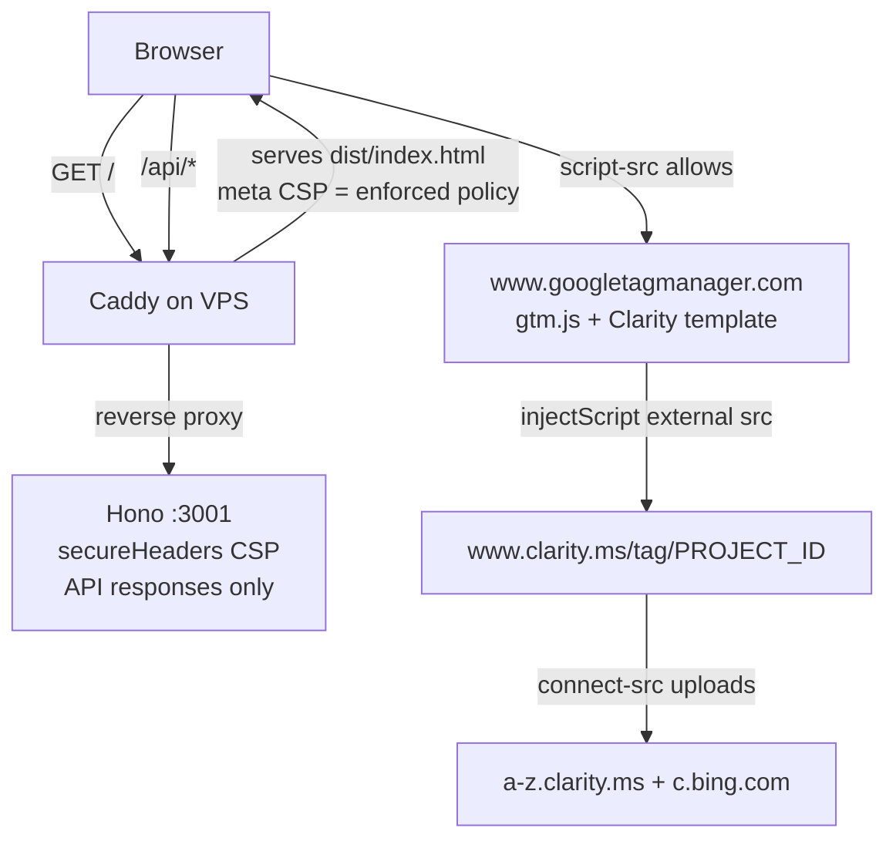

# Clarity CSP Unblock, Contact Us + WhatsApp Widget, Refund Policy - Plan

## Goal Capsule

- **Objective:** Ship three user-facing additions: (1) CSP allowlist changes so Microsoft Clarity (official GTM template) records sessions, (2) a public Contact Us page plus a site-wide floating WhatsApp button, (3) a public Refund Policy page with the 7-day full-refund guarantee.
- **Authority:** This plan > repo conventions (CLAUDE.md, Ultracite rules) > implementer judgment. User-confirmed decisions in Requirements and KTDs are settled; do not re-litigate.
- **Stop conditions:** Stop and surface if (a) the CSP guard test cannot be extended without weakening existing assertions, (b) a third CSP source (server Caddyfile) is found to conflict, (c) any change would require backend/schema work — that is out of scope by user decision, or (d) the pre-publish consent/data-mapping gate (KTD9) finds the Clarity tag consuming PII from the dataLayer, requiring a consent mechanism the site lacks, or requiring a Privacy Policy disclosure — each needs owner/legal direction; neither a CMP nor a Privacy Policy edit is silently added to this plan's scope.
- **Execution profile:** Frontend + static config only. No new dependencies. No backend or schema changes.

---

## Product Contract

### Summary

Unblock Microsoft Clarity by allowlisting its domains in both CSP definitions (the load-bearing `index.html` meta tag and the convention-synced `server/src/app.ts`), extend the existing CSP guard test, and add two public pages (Contact Us, Refund Policy) plus a floating WhatsApp button shown everywhere except `/admin/*` routes. Content-only refund policy centered on a 7-day no-questions full-refund guarantee; no backend changes.

### Problem Frame

Microsoft Clarity was added to GTM (container `GTM-5DMGVFZS`) via the official Clarity template but is blocked: the site's strict CSP — introduced during security hardening — does not allowlist `clarity.ms` hosts, so the injected script and its upload beacons are refused by the browser. Separately, the site has no Contact page (users currently find WhatsApp links only inside the subscribe/premium flows) and no published refund policy, although a manual admin-approved refund workflow already exists for paid events.

### Requirements

**Microsoft Clarity / CSP**

- R1. Clarity, loaded via the official GTM template, records production sessions with zero CSP violations in the browser console.
- R2. Clarity hosts are allowlisted in both CSP definitions — `index.html` meta (load-bearing for the SPA) and `server/src/app.ts` secureHeaders (kept in sync by convention) — without adding `'unsafe-inline'` to `script-src`.
- R3. `tests/unit/gtm-csp-hardening.test.ts` is extended so the Clarity hosts are asserted present in both files, preserving the existing no-`unsafe-inline` assertion.

**Contact Us page**

- R4. A public `/contact` page (no form) presents three actions: email `info@trafficmena.com` (mailto), phone `+201505437979` (tel), and a WhatsApp button opening `https://wa.me/201505437979`. Phone and WhatsApp use the same number.
- R5. The page is linked from the site footer.

**Floating WhatsApp widget**

- R6. A circular WhatsApp button is fixed at bottom-left on every route except those under `/admin`, opening `https://wa.me/201505437979` in a new tab.
- R7. The widget never blocks user actions: it sits above page content but below dialogs and toasts, respects mobile safe-area insets, and does not overlap the toast viewport (top-of-screen on mobile, bottom-right on desktop).
- R8. The widget is accessible: `aria-label`, SVG `<title>`, keyboard-focusable anchor (per Ultracite a11y rules).

**Refund Policy page**

- R9. A public `/refund-policy` page states the headline guarantee prominently: full refund, no questions asked, for requests made at least 7 days before the event start date.
- R10. Track bookings: full refund up to 7 days before the track's first event.
- R11. Precedence clause: individual events may define their own refund terms (published on the event page); where present they override the general policy; where absent, the general policy applies.
- R12. The page directs refund requests to the in-app cancellation flow (for event registrations) and to the contact channels (email/WhatsApp) for everything else, including track bookings, and is linked from the footer Legal section.
- R13. Both new pages are English-only and follow the existing public-page conventions.

### Acceptance Examples

- AE1. **Given** production CSP updated and the Clarity GTM tag published, **when** a user browses any page, **then** DevTools shows no CSP violation naming `clarity.ms` or `c.bing.com` and the Clarity dashboard records the session.
- AE2. **Given** a manager on `/admin/meetups` (or an admin on `/admin/users`), **then** the WhatsApp widget is absent; **when** they navigate to `/dashboard` or `/meetups`, **then** it appears bottom-left.
- AE3. **Given** an event whose page publishes its own refund terms, **then** those terms govern that event; **given** an event with none, **then** the general 7-day policy applies — the policy page states this precedence explicitly.
- AE4. **Given** a track booking and a refund request 8+ days before the track's first event, **then** the policy promises a full refund; at 6 days, the request falls outside the guarantee and is handled per event terms or case-by-case.

### Scope Boundaries

**Deferred to Follow-Up Work**

- Migrate the existing hardcoded `wa.me/201505437979` usages (`src/shared/components/PremiumContentGate.tsx`, `src/pages/dashboard/Subscribe.tsx`) and the `hello@trafficmena.com` mailto in `src/pages/InviteOnly.tsx` to the new shared contact constants.
- Optional copy alignment of `src/features/events/components/CancellationConfirmDialog.tsx` with the published policy (current copy is compatible, not contradictory).
- Structured per-event refund-terms field + admin UI (explicitly rejected for now by user decision — content-only precedence).
- Arabic/RTL versions of the two pages.
- Capture two `docs/solutions/` learnings after shipping: third-party CSP allowlist pattern; floating-widget z-index/exclusion pattern.

**Outside this product's identity (non-goals)**

- Contact form or live-chat integration.
- Automated refund execution through the Fawaterk API (`webhook_refund` stays verify+log; refunds remain manual admin operations).
- Any change to the existing cancellation/refund workflow behavior.

---

## Planning Contract

### Key Technical Decisions

- **KTD1 — The `index.html` meta CSP is the load-bearing policy, and it must move above all scripts.** In production Caddy serves the static Vite build and proxies only `/api` to Hono, so `secureHeaders` in `server/src/app.ts` never reaches the SPA document. Additionally, a meta-delivered CSP does not govern resources that appear before it in the document — today the GTM bootstrap `<script>` (line 9) precedes the meta CSP (line 42), so the initial `gtm.js` load is currently ungoverned. U1 moves the CSP meta directly after `<meta charset>`/viewport, before any script or resource-fetching tag, and the guard test asserts that order. Both CSP copies are still updated (repo convention, enforced by `tests/unit/gtm-csp-hardening.test.ts`), and the stale "browsers intersect both" comments in `index.html`, `app.ts`, and the guard test are rewritten to state the real model: the SPA document receives only the meta policy; the Hono policy covers API responses. An ops step verifies the on-server Caddyfile adds no third, conflicting CSP header (no Caddyfile exists in-repo).
- **KTD2 — Minimal confirmed allowlist now; verify community-reported extras in staging.** Derived per-directive for this repo's explicit-directive policy (Microsoft's own CSP page gives broad `default-src` guidance; the split below follows this repo's directives, the GTM template source, and the Dynamics `child-src` guidance): add `https://www.clarity.ms https://*.clarity.ms` to `script-src`; `https://*.clarity.ms https://c.bing.com` to `connect-src` (uploads are load-balanced across `a-z.clarity.ms`, so the wildcard is required); `https://www.clarity.ms` to `frame-src` and `worker-src` (Dynamics doc adds it to `child-src`, the fallback for both; meta `worker-src` already carries `blob:`). In `app.ts`, hono's secure-headers supports `workerSrc` — add it unconditionally as `'self'`, `blob:`, `https://www.clarity.ms` alongside the `frameSrc` and `scriptSrc`/`connectSrc` additions, so both files carry all four directives and the guard test can assert them symmetrically. `img-src` already allows `https:` and `data:` — no change. Community-reported `font-src data:` (microsoft/clarity#688) is not added upfront; staging verification watches for it.
- **KTD3 — No Clarity bootstrap file and no `'unsafe-inline'`.** The official GTM template calls `injectScript("https://www.clarity.ms/tag/{projectId}?ref=gtm")` — an external script validated against the `script-src` host allowlist. Nothing inline is injected, so domain allowlisting alone fixes the block. (Sources: microsoft/clarity-gtm-template `template.tpl`; learn.microsoft.com Clarity CSP + GTM pages.)
- **KTD4 — Widget mounts globally in `src/App.tsx`, not in a layout.** "All pages except admin" spans multiple layout systems (`Layout` for public pages, `AppLayout` for member + admin dashboards, `SignUpLayout` for the wizard, plus standalone pages like `ThankYou`), so no layout edit covers it. Mount next to `<PageTracker/>` inside `BrowserRouter` and hide via an exact admin-boundary predicate (`pathname === '/admin' || pathname.startsWith('/admin/')`, mirroring the `Header.tsx` boundary pattern).
- **KTD5 — Widget takes the free `z-40` slot, bottom-left, safe-area aware.** Repo layers: header `z-30`, dialogs `z-50`, toasts `z-[100]`. At `z-40` the widget floats above content but under every blocking surface. Bottom-left avoids the desktop toast viewport (bottom-right) and mobile toasts (top). Safe-area insets (`env(safe-area-inset-*)`) keep it tappable on notched devices. Defensive convention for the future: if a page later adds a sticky bottom CTA, that page owns hiding/offsetting the widget — the widget itself stays dumb.
- **KTD6 — New shared contact constants module** (email, phone E.164 + display form, wa.me URL) consumed by the Contact page and the widget, so the number the user specified lives in one place. Existing hardcoded usages are left untouched (deferred).
- **KTD7 — Refund policy is content-only.** Per-event refund terms remain free text on event pages authored by managers; the policy page states precedence. No schema field, no admin UI (user decision).
- **KTD8 — Recommended policy content; two statements need owner confirmation before merge.** Section outline for `/refund-policy`: (1) headline guarantee callout — full refund, no questions asked, ≥7 days before the event start date; (2) track bookings — same guarantee relative to the track's first event, requested via contact channels (tracks have no self-service cancellation); (3) per-event terms precedence clause; (4) how to request — in-app cancellation for event registrations (admin-reviewed; requests within the guarantee window are approved unconditionally), email/WhatsApp for everything else; (5) processing statement — recommended wording: refund to the original payment method within 7–14 business days; **both the method and the window are new operational promises the owner must confirm (or strike) before the PR merges — the page does not ship with unconfirmed numbers**; (6) requests under 7 days — outside the guarantee, handled per event terms or case-by-case; (7) subscriptions — restate only the existing FAQ commitment from `src/features/subscribe/content.ts` (cancel anytime; access continues through the subscription period). Do not add a "no pro-rated refunds" claim — that is not in the FAQ and would be a new commitment needing separate owner approval; (8) last-updated date and contact pointer.
- **KTD9 — Pre-publish consent and data-mapping gate for Clarity (ops, not code).** GTM loads unconditionally with no consent defaults (`public/gtm-bootstrap.js`), and the analytics layer pushes PII — email, phone, names, user id, revenue — into the dataLayer (`src/lib/analytics/helpers.ts`). The Clarity GTM tag's configuration lives outside the repo, so before publishing it the owner must verify in GTM: (a) the Clarity template's optional custom-identifier fields are blank or map only approved pseudonymous values — never dataLayer PII; (b) the Clarity project/tag consent posture is decided (Microsoft requires valid consent signals for EEA/UK/CH traffic and recommends Google Consent Mode); (c) whether the Privacy Policy needs a session-recording disclosure — the gate closes only with a recorded outcome: "disclosure not required," or owner/legal-approved Privacy Policy changes landing before the tag is published. If a consent mechanism or policy edit turns out to be required, stop and get owner/legal direction — building a CMP or editing the Privacy Policy is explicitly outside this plan.

### High-Level Technical Design

Where each CSP actually applies in production — the reason both files change but only one unblocks Clarity:

The widget mount point (inside `BrowserRouter`, alongside `PageTracker`) sees every route change and self-excludes on `/admin/*`; no layout file is touched.

### Sources & Research

- Clarity CSP requirements (official; broad `default-src` guidance — the per-directive split in KTD2 is this repo's derivation): learn.microsoft.com/en-us/clarity/setup-and-installation/clarity-csp
- Clarity consent guidance (consent signals required for EEA/UK/CH; Consent Mode recommended for GTM installs): learn.microsoft.com/en-us/clarity/setup-and-installation/consent-management
- Clarity GTM install (official): learn.microsoft.com/en-us/clarity/third-party-integrations/google-tag-manager
- GTM template source proving external-only injection: github.com/microsoft/clarity-gtm-template (`template.tpl`)
- `child-src` requirement: learn.microsoft.com/en-us/dynamics365/commerce/dev-itpro/set-up-clarity (2026-02-21)
- Community CSP pitfalls: microsoft/clarity issues #688 (`font-src data:`), #293/#913 (transient CORS/503 that are not CSP bugs — do not chase as CSP misconfig)
- Repo anchors: CSP pair `index.html` + `server/src/app.ts` (sync comments in both); guard test `tests/unit/gtm-csp-hardening.test.ts`; page template `src/pages/Privacy.tsx`; presentation model `src/pages/About.tsx`; WhatsApp SVG `src/shared/components/PremiumContentGate.tsx`; global mount pattern `src/App.tsx` (`PageTracker`); refund workflow reality `docs/solutions/feature-implementations/event-cancellation-system.md` — no time-based refund rule exists anywhere in code or docs today; the 7-day guarantee is a new business commitment layered onto the manual approval flow.

---

## Implementation Units

### U1. Clarity CSP allowlist + guard-test extension

- **Goal:** Clarity loads and uploads without CSP violations; the meta CSP actually governs every script; the sync convention stays test-enforced.
- **Requirements:** R1, R2, R3
- **Dependencies:** none
- **Files:** `index.html`, `server/src/app.ts`, `tests/unit/gtm-csp-hardening.test.ts`
- **Approach:** (1) Move the CSP meta tag directly after the charset/viewport metas, before the GTM bootstrap script and every other resource-fetching tag (KTD1 — a meta CSP does not govern what precedes it). (2) Add hosts per KTD2 to the meta CSP (`script-src`, `connect-src`, `frame-src`, `worker-src`) and mirror into `app.ts` (`scriptSrc` array, `connectSources` set, `frameSrc` array, and a new unconditional `workerSrc` — hono's secure-headers supports it). (3) Rewrite the stale "browsers intersect both" comments in all three files to the real model (meta = SPA document, Hono = API responses; keep hosts synced for defense-in-depth and CI). (4) Extend the guard test with directive-scoped assertions (match hosts inside the specific directive, not whole-file) — the existing whole-file style cannot prove placement.
- **Test scenarios:**
  - CSP meta tag appears before the first `<script>` tag in `index.html`.
  - `www.clarity.ms` present inside the `script-src` directive of both `index.html` and `app.ts`.
  - `*.clarity.ms` and `c.bing.com` present inside the `connect-src` directive of both files.
  - `www.clarity.ms` present inside `frame-src` and `worker-src` of both files.
  - `script-src` in both files still contains no `'unsafe-inline'` (existing assertion remains green).
- **Verification:** `npm run test:unit` green. Pre-publish ops gate per KTD9 (Clarity tag identifier fields, consent posture, privacy disclosure). Staging pass (owner involvement): publish the Clarity tag in GTM, browse the site, confirm zero clarity/bing CSP console violations and a live session in the Clarity dashboard; watch for any `font-src data:` violation (KTD2). Ops: confirm the on-server Caddyfile sets no conflicting CSP header.

### U2. Shared contact constants + WhatsApp icon

- **Goal:** One source of truth for contact details and the brand icon consumed by U3/U5.
- **Requirements:** R4, R6 (enablers)
- **Dependencies:** none
- **Files:** `src/shared/constants/contact.ts` (new), `src/shared/components/icons/WhatsAppIcon.tsx` (new)
- **Approach:** Constants: email `info@trafficmena.com`, phone E.164 `+201505437979`, display form, `https://wa.me/201505437979`. Icon: extract the existing SVG path from `PremiumContentGate.tsx` into a reusable `currentColor` component with `<title>WhatsApp</title>`.
- **Test scenarios:** Test expectation: none in this unit — constants/icon scaffolding with no behavior; exact-value contract coverage lands in U6.
- **Verification:** `npm run build` and lint pass; U3/U5 render from these modules.

### U3. Contact Us page + route + footer link

- **Goal:** Public no-form contact page with the three actions, wired into routing, footer, and analytics page-typing.
- **Requirements:** R4, R5, R13
- **Dependencies:** U2
- **Files:** `src/pages/Contact.tsx` (new), `src/App.tsx`, `src/shared/components/layout/Footer.tsx`, `src/lib/analytics/helpers.ts`, `tests/unit/analytics-helpers.test.ts`, `docs/events-tracking-data-model.md`
- **Approach:** `Layout` wrapper; presentation modeled on `About.tsx` (hero + action cards for Email / Phone / WhatsApp). Links: `mailto:`, `tel:+201505437979`, and `wa.me` with `target="_blank" rel="noopener noreferrer"`. Lazy route `/contact` registered above the catch-all `*`. Footer link added to Quick Links. Add `/contact` to the `getPageType()` route map (PageTracker classifies every route; unmapped pages degrade to `other`) and document the new value in the `page_type` table of `docs/events-tracking-data-model.md`.
- **Test scenarios:**
  - `getPageType('/contact')` returns `contact` (extend the existing `tests/unit/analytics-helpers.test.ts` mapping cases).
  - Page rendering/interaction: manual smoke only — repo has no DOM test infrastructure; source-contract coverage lands in U6.
- **Verification:** Dev server: `/contact` renders inside header/footer chrome; all three actions launch mail client / dialer / WhatsApp with the exact address and number; footer link navigates; `dataLayer` page event reports the new page type.

### U4. Refund Policy page + route + footer link

- **Goal:** Public policy page carrying the guarantee and precedence terms, wired into routing, footer, and analytics page-typing.
- **Requirements:** R9, R10, R11, R12, R13
- **Dependencies:** none (links to `/contact` if U3 has landed; plain contact details otherwise)
- **Files:** `src/pages/RefundPolicy.tsx` (new), `src/App.tsx`, `src/shared/components/layout/Footer.tsx`, `src/lib/analytics/helpers.ts`, `tests/unit/analytics-helpers.test.ts`, `docs/events-tracking-data-model.md`
- **Approach:** `Privacy.tsx` template (max-w-3xl sections). Content per KTD8, with the headline guarantee in a visually prominent callout near the top (distinct background/border, not buried in a numbered section). The processing-method/window sentence ships only with owner-confirmed values (KTD8 blocker). Lazy route `/refund-policy` above the catch-all. Footer link in the Legal list beside Privacy/Terms. Add `/refund-policy` to the `getPageType()` route map and document the new value in the `page_type` table of `docs/events-tracking-data-model.md`.
- **Test scenarios:**
  - `getPageType('/refund-policy')` returns `refund_policy` (extend `tests/unit/analytics-helpers.test.ts`).
  - Copy/rendering: manual + PR review per KTD8; source-contract coverage of the headline guarantee lands in U6.
- **Verification:** Dev server: page renders; headline guarantee visible without scrolling on desktop; precedence clause and both request channels present; footer Legal link navigates; owner has confirmed (or struck) the processing statement.

### U5. Floating WhatsApp widget with admin exclusion

- **Goal:** Site-wide bottom-left WhatsApp button that never blocks user actions.
- **Requirements:** R6, R7, R8
- **Dependencies:** U2
- **Files:** `src/shared/components/FloatingWhatsApp.tsx` (new), `src/shared/utils/floatingWhatsApp.ts` (new), `src/App.tsx`
- **Approach:** Anchor styled as a circular button (WhatsApp brand green, white icon), minimum 44×44px touch target (target ~56px), visible `focus-visible` styling. `fixed` bottom-left at `z-40` per KTD5, offset via `calc(<base spacing> + env(safe-area-inset-bottom/left))` — safe-area offsets the position, never pads inside the circle. Visibility decided by a pure predicate `isWidgetHidden(pathname)` living in the JSX-free `src/shared/utils/floatingWhatsApp.ts` module (the node --test loader strips types but does not transform JSX, so U6 cannot import a `.tsx` file), using an exact boundary — `pathname === '/admin' || pathname.startsWith('/admin/')` — so a hypothetical `/administrator` route would not be swallowed (mirrors the `Header.tsx` boundary pattern). The component imports the predicate; mounted once in `App.tsx` beside `<PageTracker/>` (inside `BrowserRouter` — required for `useLocation`). `aria-label` on the anchor, `<title>` in the SVG, `rel="noopener noreferrer" target="_blank"`.
- **Test scenarios:**
  - Visibility predicate (pure, unit-tested in U6): hidden for `/admin` and `/admin/users`; visible for `/`, `/dashboard`, `/contact`, and the `/administrator` boundary case.
  - Rendering/stacking: manual checklist below (no DOM test infra).
- **Verification:** Manual checklist — widget visible on `/`, `/meetups`, an event detail page, `/dashboard`, `/contact`, a `/signup` step, and a standalone page (`/thank-you`); absent on `/admin` and `/admin/users`; opens the correct wa.me URL; on a mobile viewport it does not cover page CTAs (event/track booking cards render at top of content on mobile) and sits clear of toasts; opening a dialog (e.g., cancellation confirm) renders above it; keyboard Tab reaches it, focus ring is visible, and Enter activates.

### U6. Source-contract tests for the new surfaces

- **Goal:** Cheap regression guards for the invariants the user cares about, using the repo's existing node --test source-contract style (no DOM needed).
- **Requirements:** R4, R5, R6, R9, R12
- **Dependencies:** U2, U3, U4, U5
- **Files:** `tests/unit/contact-surfaces.test.ts` (new)
- **Approach:** Direct imports for pure modules; text assertions for wiring (the `gtm-csp-hardening.test.ts` / `event-visibility.test.ts` style).
- **Test scenarios:**
  - Contact constants export the exact user-specified values: `info@trafficmena.com`, `+201505437979`, `https://wa.me/201505437979`.
  - `src/App.tsx` registers both `/contact` and `/refund-policy` routes above the catch-all.
  - `Footer.tsx` links to both new pages.
  - `RefundPolicy.tsx` contains the headline guarantee phrase (7-day full-refund) and the precedence clause keyword — a substring-level guard, not full copy assertion.
  - `isWidgetHidden` predicate: `/admin` → hidden, `/admin/users` → hidden, `/` → visible, `/dashboard` → visible, `/administrator` → visible.
- **Verification:** `npm run test:unit` green.

---

## Verification Contract

| Gate | Command / procedure | Proves |
|---|---|---|
| Unit tests | `npm run test:unit` | U1 CSP assertions, U3/U4 page-type mapping, U6 contracts + no regressions |
| Lint | `npm run lint` | Ultracite rules incl. a11y for U3-U5 |
| Frontend build | `npm run build` | Routes/lazy imports/types compile |
| Server build | `npm --prefix server run build` | `app.ts` CSP edits compile |
| Manual smoke | Dev servers (`npm run dev` + `npm --prefix server run dev`); walk U3/U4/U5 verification checklists | Page and widget behavior |
| Consent/data-mapping gate | KTD9 checklist in GTM before tag publish (owner) | No PII into Clarity; consent posture decided; privacy-disclosure outcome recorded |
| Staging Clarity check | Publish GTM Clarity tag; DevTools console + Clarity dashboard live session | R1 end-to-end (owner involvement) |

## Definition of Done

- All six units landed; all table gates green.
- Zero clarity/bing CSP violations in staging with the Clarity tag published; a live session visible in the Clarity dashboard.
- `/contact` and `/refund-policy` reachable directly and via footer links; contact actions use `info@trafficmena.com` and `+201505437979` exactly.
- Widget verified on public + member-dashboard routes, absent under `/admin`, non-blocking per U5 checklist.
- Owner confirmations obtained BEFORE merge: refund processing method/window wording (KTD8) — the page ships only with confirmed or struck statements.
- Ops handoff notes delivered to owner: GTM tag publish, KTD9 consent/data-mapping checklist, on-server Caddyfile CSP check, confirm the `info@trafficmena.com` mailbox is live (the codebase's only existing mailto uses `hello@`).
- No dead-end/experimental code left in the diff.
