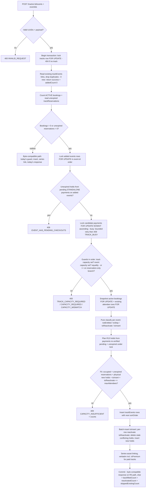

# Booked-Track Late Session Addition - Plan

## Goal Capsule

- **Objective:** Let manager+ add a session (Event) to a Track that already has active bookings — a late-confirmed session, a replacement speaker's session, or a meetup announced after booking opened. Every active booking whose ticket includes the session's format is atomically registered, and every unexpired in-flight checkout receives a matching capacity hold, exactly as if the session had existed at booking time.
- **Authority:** The Product Contract encodes user-approved decisions (capacity must equal track capacity; manager+ with no reason; backfill follows the existing ticket matrix — the user clarified a late-added session is normal track content, not a special gift; no notification emails). Do not re-litigate them during implementation. Where the plan is silent, follow repo conventions (CLAUDE.md) and the cited precedents.
- **Stop conditions:** Do not modify `executeTrackBookingWrite`, the checkout/fulfillment handlers in `payments.ts`, the payment-expiration job, the removal flow's admin+reason gate, or any access-resolution rules (this plan requires zero access-layer changes; in-flight compatibility is achieved by writing reservation holds from the add transaction, not by changing fulfillment). If implementation reveals coupling that forces changes there, stop and surface it.
- **Execution profile:** Standard repo gates — lint, unit tests, server + frontend builds (see Verification Contract).
- **Tail ownership:** One feature commit (Conventional Commits). No push or PR unless the user asks.

---

## Product Contract

### Summary

Unblock `POST /tracks/:id/events` for booked tracks: manager+ adds a session whose capacity equals the track's booking capacity; one locked transaction inserts the track link, backfills a registration for every active booking whose ticket type includes the session's format (legacy no-ticket bookings get every session), creates reservation holds for unexpired in-flight checkouts so their fulfillment still succeeds, and links the session's assets into the track's companion series. No access-resolution changes: backfilled rows are matrix-conforming by construction. Buyers before the add, checkouts in flight during it, and buyers after it all end with identical registrations. No emails.

### Problem Frame

A production track with 97 active bookings needed a session added mid-run, and `POST /tracks/:id/events` hard-blocks with `TRACK_HAS_BOOKINGS` (`server/src/routes/api/tracks.ts:1317`) whenever any active booking exists. The business regularly needs this: a speaker cancels and a replacement is confirmed later, a session is announced only after booking opens, or an offline meetup is scheduled once the cohort exists.

The block exists because booking a track materializes one `eventAttendees` row per included session at booking time (`executeTrackBookingWrite`, `server/src/routes/api/trackBookingShared.ts`): a naive link insert would leave 97 buyers owning the track but not the new session. It would also strand in-flight checkouts: fulfillment requires an attendee row or unexpired reservation for every matrix-included track event (`server/src/routes/api/payments.ts:1012-1022`), so a paid invoice whose track gained a session mid-checkout would fail with `RESERVATION_EXPIRED` after the money moved — and this holds even when the track has no completed bookings yet, since reservations precede bookings. The July 9 removal plan (`docs/plans/2026-07-09-001-feat-track-window-session-removal-plan.md`) built the removal half of this symmetry and explicitly deferred the add half. This plan is that feature: the add must backfill buyers' registrations atomically, per their ticket entitlement, and keep pending checkouts fulfillable, so a late-added session is indistinguishable from one that was in the track all along.

Terminology: "session" in user language = **Event** in the codebase (`CONCEPTS.md`).

### Requirements

**Guards and permissions**

- R1. Manager+ can add sessions to a track with active bookings; no reason or override flag is required. The hard `TRACK_HAS_BOOKINGS` rejection disappears from the add path. (Removal keeps its admin+reason gate unchanged.)
- R2. Booked-track path: every event being added must have `maxAttendees` set and **equal to** `tracks.maxTrackBookings`. A mismatch is rejected with a specific message stating that the event's capacity does not equal the track's capacity, naming both numbers.
- R3. Booked-track path: if the track has no `maxTrackBookings`, the add is rejected with a specific message telling the admin to set the track's booking capacity first. This check runs before the equality check (equality against a null capacity must never fire first).
- R4. Booked-track path: the add is rejected with a specific error naming the counts when the backfill would not fit. Fit is computed per event, after classification, as: current `active` + `refund_requested` attendee rows + unexpired `eventReservations` + new R13 holds (physical rows actually being inserted, not candidates that collide with an existing row) + net-new backfill rows (`toInsert` + `toReactivate`) ≤ the event's `maxAttendees`. Skipped rows are already inside the current-rows term and are never subtracted; net-new users hold no counted row, so nothing is double-counted in either direction. No partial backfill, no capacity overshoot.
- R5. Tracks with **zero active bookings and zero unexpired track reservations** keep today's behavior byte-for-byte: manager+, `maxAttendees >= maxTrackBookings` rule, same error codes, and the exact current response shape `{ success, addedCount }` (also on the deduplicated no-op path). A track with zero bookings but unexpired track reservations takes the reservation-only branch (R13) — today's guards plus hold planning and fit, with no attendee backfill and the same `{ success, addedCount }` response.
- R14. If any added event has an **unresolved standalone event payment** — queried from `payments` by `itemType 'event'` + the added event id, with `status 'pending'`, or `status 'expired'` with a gateway intent (`fawaterkIntentKey` set, since reconciliation can still recover such an invoice to paid: `server/src/jobs/paymentReconciliation.ts:35`, `payments.ts:1320`) — the whole add is rejected with `EVENT_HAS_PENDING_CHECKOUTS` before any write. The payments query is the source of truth, not surviving reservation rows (the expiration job deletes those). A single reservation row (unique per `(eventId,userId)`, one `paymentId`) cannot protect two invoices, and linking the event mid-checkout would also flip standalone fulfillment onto the track's `allowIndividualBooking` rules after money moved. The operator waits for those invoices to become paid or failed, or uses a fresh event.

**Backfill and entitlement**

- R6. The whole add is atomic: one transaction that locks, in order, the track row `FOR UPDATE`, the added `events` rows `FOR UPDATE` (ascending event-id order), the candidate reservation-owning `payments` rows (`FOR UPDATE NOWAIT`, ascending id — see KTD8; lock-busy triggers a bounded whole-transaction retry, then `TRACK_BUSY`), the active `trackBookings` rows `FOR UPDATE`, then the relevant `eventAttendees` rows `FOR UPDATE` — serializing against concurrent fulfillment, removal, booking revocation, payment expiration, standalone registration, and paid event checkout. Any failure rolls back everything.
- R7. Backfill follows the ticket matrix, exactly as booking-time fulfillment would have: each booking active at add time (non-revoked, per `activeTrackBookingWhere`) gets an `eventAttendees` row for each added event whose format its ticket includes (`filterLiveIncludedEvents`; legacy null-ticket bookings include every format). Rows carry `status 'active'`, `sourceTrackBookingId` = the booking id, `registeredAt` = add time, `paidAt`/`pricePaidCents`/`paymentId` copied from that booking. Existing `active`/`refund_requested` rows are left untouched (skipped); existing `cancelled` rows are reactivated with that booking's values (per-row values — see KTD5).
- R8. Timing invariance: a buyer who booked before the add, a checkout in flight during it, and a buyer who books later all end with identical registrations for the added session. For in-flight checkouts this is delivered by R13's reservation holds; fulfillment itself is not modified.
- R9. No access-layer changes. Because backfilled rows are matrix-conforming by construction, existing rules already grant the right access: live links via the ticket matrix, offline recordings to all ticket types, online recordings to online-entitled tickets, library premium shortcuts unchanged. The invariant that every track-sourced attendee row conforms to its booking's ticket matrix is preserved (the library's premium-access shortcuts silently depend on it).
- R13. In-flight checkout compatibility: for every track reservation whose payment is verified **pending and unexpired under the payment-row lock**, the add creates `eventReservations` holds for each added event whose format the payment's ticket includes (legacy null-ticket payments include every format), skipping users who already hold an `active`/`refund_requested` row for that event. Holds mirror checkout's shape (`eventId`, `userId`, `paymentId`, `expiresAt` = the track reservation's `expiresAt`). Conflicting `eventReservations` rows on `(eventId,userId)` that are expired or belong to non-pending payments are deleted before the insert; an unexpired hold is never transferred between payment ids (R14 rejects the only case where that could arise). These holds count in R4's fit and make fulfillment's reservation pre-check (`payments.ts:1012-1022`) pass without touching `payments.ts`.

**API contract and UI**

- R10. On the booked path, the response additionally reports `backfilledCount`, `reactivatedCount`, and `skippedExistingCount` — defined as disjoint **registration-row** counts across all added events (a multi-event add counts rows, not buyers). The quiet, reservation-only, and no-op paths keep the exact current `{ success, addedCount }` shape.
- R11. Admin UI: adding to a track with active bookings asks for confirmation stating that current buyers will be registered per their tickets; the success toast reports registrations from `backfilledCount + reactivatedCount`; new server error codes surface through the existing error-toast passthrough. Unbooked tracks keep today's flow.
- R12. No notification emails; announcements are handled manually.

### Error contract (booked-path guards)

| Code | HTTP | Fires when | Message template |
|---|---|---|---|
| `TRACK_CAPACITY_REQUIRED` | 400 | `maxTrackBookings` is null on a booked track | `Set the track's booking capacity before adding sessions to a booked track.` |
| `CAPACITY_REQUIRED` | 400 | an added event has `maxAttendees` null (existing code, message preserved) | `Event "<title>" must have maxAttendees set.` |
| `CAPACITY_MISMATCH` | 400 | `maxAttendees !== maxTrackBookings` | `Event "<title>" capacity (<eventCap>) does not equal the track capacity (<trackCap>).` |
| `CAPACITY_INSUFFICIENT` | 409 | R4 fit exceeded | `Event "<title>" cannot seat everyone: <occupied> registered + <reserved> reserved + <netNew> to add exceeds capacity <max>.` |
| `EVENT_HAS_PENDING_CHECKOUTS` | 409 | R14: an added event has unresolved standalone event payments (pending, or expired with a gateway intent) | `Event "<title>" has unresolved checkouts. Wait for them to become paid or failed, or use a fresh event.` |
| `TRACK_BUSY` | 409 | payment-row `NOWAIT` lock still busy after bounded retries (KTD8) | `The track is processing payments right now. Try again in a moment.` |

409 for the conflict codes follows the repo's capacity-conflict convention (`TRACK_FULL`/`EVENT_FULL`); the 400s are validation-shaped, matching the existing guards.

### Acceptance Examples

- AE1. **Late offline meetup.** Given a track with `maxTrackBookings: 100` and 97 active bookings (50 `online_offline`, 40 `online_only`, 7 legacy no-ticket), when a manager adds an offline event with `maxAttendees: 100` and confirms, then the event joins the track, exactly 57 registrations are created in one transaction (50 + 7; the 40 `online_only` buyers are not registered, matching what booking-time fulfillment would have done), the response reports `backfilledCount: 57`, an `online_offline` buyer sees `locationUrl`, and an `online_only` buyer does not (their access to this session arrives later as a recording, which offline-session recordings already grant every ticket type).
- AE2. **Capacity mismatch.** Given the same track and an event with `maxAttendees: 50`, when the manager adds it, then the API rejects with `CAPACITY_MISMATCH` naming 50 and 100, and nothing changes.
- AE3. **Existing rows survive and count once.** Given capacity 100, 97 entitled bookings of which 4 buyers already hold active standalone rows on the event, and 7 unrelated standalone attendees: occupied = 11, net-new = 93, fit = 104 > 100 → the add is rejected with `CAPACITY_INSUFFICIENT` naming the counts. With 89 entitled bookings instead (net-new 85, fit 11 + 85 = 96 ≤ 100), the add succeeds: the 4 standalone rows are untouched (skipped), a seeded cancelled row is reactivated carrying its own booking's payment fields, and no unique-constraint error occurs.
- AE4. **In-flight checkout converges — with and without completed bookings.** (a) Given a pending `online_offline` track checkout (unexpired reservation, payment pending) on a track with active bookings, when an offline session is added, the add creates an `eventReservations` hold for the new event tied to that payment; the later webhook fulfillment passes the reservation pre-check and the buyer's registrations match a same-ticket buyer who booked before the add. (b) Given a track with **zero** active bookings and one pending paid checkout, the add takes the reservation-only branch: today's `>=` capacity guard, holds created, no attendee backfill, response exactly `{ success, addedCount }` — and the pending checkout still fulfills. A pending `online_only` checkout gets no hold for an offline event and also fulfills cleanly.
- AE5. **No track capacity set.** Given a booked track with `maxTrackBookings: null`, when a manager adds any event, then the API rejects with `TRACK_CAPACITY_REQUIRED` (not `CAPACITY_MISMATCH`).
- AE6. **Quiet track unchanged.** Given a track with zero active bookings and zero unexpired track reservations (including all-revoked, all-expired), when a manager adds an event with `maxAttendees` ≥ `maxTrackBookings`, then behavior, error codes, and the `{ success, addedCount }` response shape match today's exactly.
- AE7. **Revoked buyers excluded; concurrent writers serialize.** Given a track with 2 active and 1 revoked booking, when a session is added, then exactly the entitled subset of the 2 active bookings is backfilled. A revocation racing the add serializes on the booking-row locks; a standalone registration or paid event checkout racing the add serializes on the `events`-row lock; a fulfillment or expiration racing the add serializes on the payment-row locks (`NOWAIT` + bounded retry on the add side), so the fit decision cannot be overtaken and no hold is written for a payment that just expired.
- AE8. **Refund-requested rows respected.** Given a buyer whose existing row for the event is `refund_requested`, when the add runs, then that row is not modified, it counts inside the occupied-seats term of the fit check, and the response counts it as skipped.
- AE9. **Unresolved standalone checkout blocks the add.** Given an added event with a pending standalone event payment, when a manager adds it to the track, then the API rejects with `EVENT_HAS_PENDING_CHECKOUTS` before any write. The same holds for an **expired** standalone payment that still carries a gateway intent (reconciliation could recover it to paid). After the payment becomes paid or failed, the retry succeeds.

### Scope Boundaries

**Deferred to Follow-Up Work**

- Publish/date validation on adds. A draft event backfills invisibly (buyers 404 until it is published) — kept as a deliberate staging affordance for announce-later sessions; a past-dated event remains admin judgment. Revisit if misused.
- Friendly pre-check for adding an event that already belongs to another track (`track_events_event_unique` currently surfaces as generic `ADD_EVENTS_FAILED`).
- `TrackEventSelector` candidate filtering/hints (capacity, format, publish state, pending checkouts) beyond what exists today.
- Notification emails to backfilled buyers.
- Guarding `DELETE /events/:id` (carried forward from the removal plan — still the dangerous bypass).
- Session reordering on booked tracks.
- Having booking revocation take the track lock (the add-side booking-row locks in R6 already close the orphan-row race; a revocation-side lock would be defense in depth).
- A periodic sweeper for expired `eventReservations` rows not tied to a payment-expiration run (the add cleans conflicting stale rows it encounters; a general sweeper is broader hygiene).

**Outside this change**

- The removal flow (admin+reason, its guards and UI) is untouched.
- Access resolution (`ticketAccess.ts`, `events.ts`, `library.ts`, `seriesAccess.ts`), payment fulfillment (`payments.ts`), and the payment-expiration job are untouched by design (R9, R13).
- Individual refund/cancellation semantics for backfilled sessions follow existing per-registration behavior unchanged — see System-Wide Impact for the exact (pre-existing) consequences.
- Pricing: the late add never changes track price, creates payment records, or affects checkout math.

---

## Planning Contract

### Key Technical Decisions

- **KTD1 — Matrix-consistent backfill; zero access-layer changes.** The backfill applies `filterLiveIncludedEvents` per booking (legacy null-ticket bookings include everything), so a late-added session produces exactly the rows booking-time fulfillment would have produced. This preserves a system invariant the review verified the codebase silently depends on: every track-sourced attendee row conforms to its booking's ticket matrix — `library.ts`'s premium-recording shortcuts credit any active attendee row without a matrix check, which is safe only while that invariant holds. Alternative rejected: registering everyone regardless of ticket ("gift" semantics) — it would require widening live-access resolution in `events.ts` *and* gating the library shortcuts, and the user clarified the real use case is a late-arriving normal session, not a special entitlement.
- **KTD2 — Backfilled rows mirror the booking-time row shape, with its known consequences.** Copy `paidAt`, `pricePaidCents`, `paymentId` from each source `trackBookings` row; `registeredAt` = add time; `status 'active'`; `sourceTrackBookingId` = booking id. The row becomes indistinguishable from one created at booking time, which is the point — and inherits the existing track-derived-row behavior exactly: booking-time rows already carry the full track price on every session row (`trackBookingShared.ts:249`), so a buyer cancelling any one session enters the refund queue showing the full bundle price, approval changes registration status only (no money movement, no track revocation), and an active track booking keeps granting matrix access regardless of one row's status. Those are pre-existing semantics for every track session today; a late-added session simply matches them (accepted — changing refund semantics is out of scope). Revocation cleans up new rows via their `sourceTrackBookingId` link — the primary path; the legacy `paymentId` fallback in `revokeTrackBookingAccess` applies only to null-source rows and is irrelevant here.
- **KTD3 — One transaction; deterministic lock order: track → added events → candidate payments → bookings → attendee rows.** The handler opens `db.transaction`, locks the `tracks` row `FOR UPDATE` (mirroring `executeTrackBookingWrite` at `trackBookingShared.ts:83-88` and removal's KTD4), then the added `events` rows `FOR UPDATE` in ascending event-id order, then the candidate reservation-owning `payments` rows per KTD8, then snapshots the active bookings **with `FOR UPDATE`**, then the existing attendee rows. The track lock serializes against fulfillment and removal; the `events`-row locks serialize against standalone registration (`events.ts:983`) and paid event checkout (`payments.ts:1737`), which lock the event row before counting — without them a concurrent registration could overtake the fit read and overshoot capacity; the payment locks serialize against fulfillment and expiration (KTD8); the booking-row locks serialize against booking revocation, which locks only the `trackBookings` row (`trackBookingShared.ts:347`) — a revoke committing between an unlocked snapshot and the insert would leave the revoked buyer an orphaned active row that no later cascade cleans up. All statements use `tx`, never outer `db` (`docs/solutions/database-issues/drizzle-transaction-atomicity.md`). Today's handler reads the guard count outside the transaction with no locks; that TOCTOU closes here.
- **KTD4 — Booked-path capacity guard: ordered checks, additive fit, pure module.** New `server/src/routes/api/trackEventAddition.ts` (mirror of `trackEventRemoval.ts`) evaluates per added event, in this order: (1) `TRACK_CAPACITY_REQUIRED` — must precede equality (`maxAttendees === null-capacity` would otherwise emit a mismatch naming a null number); (2) `CAPACITY_REQUIRED`; (3) `CAPACITY_MISMATCH` naming both numbers; (4) `CAPACITY_INSUFFICIENT`, computed **after** classification per the R4 formula — all current `active`+`refund_requested` rows + unexpired reservations + physical new holds + `toInsert` + `toReactivate`, with no exclusions or subtractions. The reservation-only branch (R5) keeps today's `>=` rule for checks 2-3-equivalents and still runs the fit check with holds. The byte-compatible branch keeps today's `>=` logic untouched.
- **KTD5 — Entitlement + skip/reactivate/insert classification as a pure function; per-row reactivation writes.** `eventAttendees` has a unique `(eventId, userId)` index, so a blind bulk INSERT aborts the whole transaction the moment one buyer already has a row. A pure classifier in `trackEventAddition.ts` takes the locked active bookings and the events' existing rows and returns, per event: `notEntitled`, `toSkip` (`active`/`refund_requested` row exists), `toReactivate` (`cancelled` row exists), `toInsert` — reusing `filterLiveIncludedEvents`/`liveIncludedFormats` from `ticketAccess.ts` for the entitlement test, mirroring `executeTrackBookingWrite:225-316` keyed one-event-many-users. Because reactivated rows carry **per-booking** payment values, the reactivation write must be per-row: key each UPDATE by attendee id with that row's values (a bounded loop over `toReactivate`, or a single `UPDATE … FROM (VALUES …)`; a single ordinary bulk UPDATE would smear one booking's values across users). Inserts can batch. SQL uses Drizzle `inArray`, never raw `= ANY(...)` (documented pitfall).
- **KTD6 — No new publish/date guards on the add path.** Today's add path has none; adding them would break the staging workflow (add a draft session, publish at announcement time — buyers see nothing until publish). Documented as a scope boundary rather than guarded.
- **KTD7 — Minimal UI: confirm + counts via the existing invalidation helper.** The add is manager-level with no reason, so the removal flow's override dialog machinery is not needed: `window.confirm` when `track.bookings_count > 0`, toast from the response counts, and cache refresh via the existing `invalidateTrackAccessQueries(queryClient, trackId)` (`src/features/tracks/hooks/useTrackEnrollmentManagement.ts:5`) — the mutation changes attendees, track detail, series membership, and library premium state, which is exactly the surface that helper already covers for removal. This refreshes the acting admin's local cache; other clients refetch on their own schedules.
- **KTD8 — In-flight checkouts get reservation holds under payment-row locks, not a fulfillment change.** Fulfillment's pre-check requires an attendee row or unexpired reservation for every matrix-included event (`payments.ts:1012-1022`); a session added mid-checkout would otherwise fail the paid invoice with `RESERVATION_EXPIRED` after the gateway confirmed payment. The add therefore writes `eventReservations` holds per R13. Two hazards shape the mechanics: (a) **deadlock** — fulfillment locks the payment row first, then the track (`payments.ts:793→936`); the add holds the track and its hold-insert FK references the payment, so waiting on a payment lock while holding the track lock can cycle. The add locks the candidate payment rows in ascending id order with `FOR UPDATE NOWAIT`; if any is busy, roll back and retry the whole add transaction (bounded, e.g. 3 attempts with short backoff; retry only on PostgreSQL's lock-not-available error, never on other DB errors), then surface `TRACK_BUSY` — never wait on a payment while holding the track. The shared reference time is created fresh inside each retry attempt. (b) **one-shot expiration** — the expiration job atomically marks a payment expired and deletes its reservations by payment id (`server/src/jobs/paymentExpiration.ts:18`) and never revisits; a hold inserted after that sweep would be orphaned forever and block future checkouts via the `(eventId,userId)` unique index. Under the payment locks the add reloads and keeps only `payments.status = 'pending'` with `expiresAt` in the future against one shared reference time before planning, fitting, and writing holds. Conflicting stale rows (expired, or owned by non-pending payments) are deleted before insert; R14 rejects the pending-standalone-owner case. Alternative rejected: relaxing the fulfillment pre-check to checkout-time events — it modifies the payment flow (stop condition) and weakens the capacity-hold invariant the reservation system exists to provide.

### High-Level Technical Design

Reworked `POST /tracks/:id/events` decision and transaction flow:

### Assumptions

- Production `eventAttendees.sourceTrackBookingId` backfill is complete (carried from the removal plan, which shipped with the same assumption and a pre-flight query).
- `activeBookings ≤ maxTrackBookings` holds structurally (the track-update route blocks lowering capacity below bookings; its active-count flaw is a known deferred item of the removal plan). The R4 fit check is the belt-and-braces guard if it ever doesn't.
- The equality + fit pair can be jointly unsatisfiable for an event that already carries standalone attendees near track capacity. The operator's recovery is to use a fresh event or free seats first; `CAPACITY_INSUFFICIENT` names the counts so this state is diagnosable. Accepted: the primary late-session path (a fresh event) is unaffected.

---

## Implementation Units

### U1. Pure decision module: booked-path capacity guard + backfill and hold classification

- **Goal:** The decisions that make the booked-track add safe — "may these events be added, in what check order?", "which buyers get rows?", "which pending checkouts get holds and which conflicts block the add?", and "does everything fit?" — exist as pure, unit-tested functions with no DB or HTTP dependencies.
- **Requirements:** R2, R3, R4, R7 (classification half), R13/R14 (hold-planning half), R5 (branch selection is the handler's job; the module is branch-agnostic).
- **Dependencies:** None.
- **Files:** new `server/src/routes/api/trackEventAddition.ts`, new `tests/unit/track-event-addition.test.ts`.
- **Approach:** Mirror `trackEventRemoval.ts`'s shape (typed input, discriminated allowed/blocked result, message templates in the module). Three exports: (a) a backfill classifier taking the active bookings (id, userId, ticketType, paidAt, pricePaidCents, paymentId), the added events (id, eventFormat), and the events' existing attendee rows (id, userId, eventId, status), returning per event `{ notEntitled, toSkip, toReactivate, toInsert }` with the R7 value mapping applied and entitlement via `filterLiveIncludedEvents`/`liveIncludedFormats`; (b) a hold planner taking the payment-verified track reservations (userId, paymentId, ticketType, expiresAt — already filtered to pending+unexpired by the handler under lock), the added events, existing-row owners, and existing `eventReservations` rows on the added events (userId, paymentId, expiresAt, owningPaymentStatus, owningPaymentItemType), returning either `{ blocked: 'EVENT_HAS_PENDING_CHECKOUTS', event }` (R14) or `{ staleRowsToDelete, holdsToInsert }` with physical-new-hold counts per event; (c) a capacity evaluator taking `{ maxTrackBookings, mode: 'booked' | 'reservation-only', events: [{ id, title, maxAttendees, occupiedRows, unexpiredReservations, newHolds, netNewRows }] }` and returning allowed or `{ code, message }` per the Error contract table, enforcing the KTD4 check order (equality on the booked branch, today's `>=` on the reservation-only branch).
- **Patterns to follow:** `server/src/routes/api/trackEventRemoval.ts` + `tests/unit/track-event-removal.test.ts` (module and test shape); `trackBookingShared.ts:225-316` (classification semantics being mirrored); `ticketAccess.ts` pure helpers (entitlement source of truth).
- **Test scenarios:**
  - Covers AE5. `maxTrackBookings: null` → `TRACK_CAPACITY_REQUIRED` even when the event's capacity also mismatches (order pinned).
  - Covers AE2. Event capacity 50 vs track 100 → `CAPACITY_MISMATCH`; message contains both numbers; 100 vs 100 → allowed; reservation-only mode: 120 vs 100 → allowed (`>=` rule), 80 vs 100 → blocked.
  - Event with `maxAttendees: null` → `CAPACITY_REQUIRED`.
  - Covers AE3 (fit boundary, exact numbers). Capacity 100: occupied 11 (7 unrelated + 4 owned by backfill users), net-new 93 → 104 → `CAPACITY_INSUFFICIENT` with counts; occupied 11, net-new 85 → 96 → allowed. A `refund_requested` variant of the same boundary.
  - Reservations tip fit: 2 unexpired reservations + 1 physical new hold move a boundary case from allowed to blocked; a candidate hold that collides with an existing unexpired row is NOT counted twice.
  - Covers AE1 (entitlement). Offline event: `online_offline` and legacy null-ticket bookings → toInsert; `online_only` → notEntitled; online event: mirror image; `offline_only` → notEntitled for online events.
  - Classifier value mapping: toInsert carries each booking's own `paidAt`/`pricePaidCents`/`paymentId` and booking id as source; `cancelled` row → toReactivate keyed by attendee id with that booking's values; two cancelled rows from bookings with different payment values map to different reactivation values (pins KTD5's per-row rule); mixed set partitions across all four buckets; zero bookings → all empty.
  - Covers AE4 (hold planning). Pending `online_offline` reservation + offline event → hold with the reservation's paymentId and expiresAt; pending `online_only` reservation + offline event → no hold; reservation whose user already holds an active row → no hold.
  - Covers AE9 (conflict handling). Unresolved standalone payment (pending, or expired with a gateway intent) on an added event → blocked `EVENT_HAS_PENDING_CHECKOUTS`; existing hold owned by a failed or intent-less expired payment → staleRowsToDelete + new hold planned; existing unexpired hold owned by the same track payment → no duplicate hold, no delete.
  - Multiple events classified independently; first failing event named in the evaluator's message.
- **Verification:** New test file passes in `npm run test:unit`; module imports only types and `ticketAccess.ts` pure helpers (stays pure).

### U3. Add-handler rework: locks, ordered guards, backfill, holds, response counts

- **Goal:** `POST /tracks/:id/events` performs the full booked-track add atomically and reports what it did; the quiet-track path is byte-compatible with today.
- **Requirements:** R1, R5, R6, R7, R8, R9, R10, R12, R13, R14.
- **Dependencies:** U1.
- **Files:** `server/src/routes/api/tracks.ts` (POST `/tracks/:id/events` handler, ~lines 1276-1434), new `tests/unit/track-event-addition-wiring.test.ts`, `CLAUDE.md` (endpoint line update).
- **Approach:** Restructure per the HTD flow: keep validation and `requireManager` as-is; wrap the attempt in a bounded retry loop (KTD8: retry only on the `NOWAIT` lock-busy error, max 3 attempts, short backoff, then `TRACK_BUSY`); inside each attempt open `db.transaction`; lock the track row `FOR UPDATE` selecting `maxTrackBookings` + price columns (404 inside the transaction if absent); dedupe against existing `trackEvents` (no-op path returns `{ success, addedCount: 0 }` exactly); count active bookings with `activeTrackBookingWhere` and read unexpired `trackReservations` **inside** the transaction; branch per R5 — neither: today's `>=` guard, insert, series link, and response verbatim; otherwise: lock added `events` rows `FOR UPDATE` ascending (KTD3), apply R14 — query `payments` by `itemType 'event'` + added event ids for unresolved standalone invoices (pending, or expired with `fawaterkIntentKey` set) and throw `EVENT_HAS_PENDING_CHECKOUTS` before any write — then read existing `eventReservations` on the added events joined to their payments (status, itemType) for stale-row cleanup planning, lock candidate payment rows `FOR UPDATE NOWAIT` ascending and re-filter to pending+unexpired against one shared reference time, run guard checks 1-3 (equality on the booked branch; `>=` on the reservation-only branch), snapshot active bookings `.for('update')`, SELECT existing attendee rows for (added events × booking users) `FOR UPDATE`, load per-event occupied counts (`active`+`refund_requested`) and unexpired `eventReservations` counts, classify + plan holds via U1, run U1's evaluator with net-new and physical-hold counts (throw `ApiError` per the Error contract on block); insert `trackEvents` with continuing `sortOrder`; batch-insert `toInsert`; apply `toReactivate` per-row (KTD5; SET mirrors `executeTrackBookingWrite:287-302`: status active, cleared `cancelledAt`/`refundRequestedAt`/`adminNote`, that booking's payment fields, `sourceTrackBookingId`); delete `staleRowsToDelete` then insert R13 holds; run the series-asset linking block verbatim (inside the same transaction for all paths); respond: R5 paths `{ success, addedCount }` exactly, else plus the three counts. Remove the `TRACK_HAS_BOOKINGS` throw from this handler only. No changes to `events.ts`, `ticketAccess.ts`, `library.ts`, `seriesAccess.ts`, `payments.ts`, or `jobs/paymentExpiration.ts` (R9, R13).
- **Execution note:** Implement against U1's already-passing tests; diff the quiet-track branch against `main` to prove R5's byte-compatibility.
- **Patterns to follow:** Removal handler's transaction/lock discipline (`tracks.ts:1437-1606`, KTD4 comment); `executeTrackBookingWrite` for lock order and row values; checkout's reservation-insert shape (`payments.ts` track checkout path); `handleRoute`/`ApiError` conventions already in the handler.
- **Test scenarios** (source-string wiring guard, pattern: `tests/unit/track-manual-enrollment-ticket.test.ts`):
  - Add handler no longer contains a `TRACK_HAS_BOOKINGS` throw (removal handler still does — assert on extracted handler slice, not whole file).
  - `.for('update')` appears in the handler for the track row, the added events rows, and the bookings snapshot; the payment lock uses `NOWAIT`.
  - The handler imports and calls all three U1 exports, classifier and hold planner before the evaluator.
  - The backfill insert sets `sourceTrackBookingId` (guards the R9 matrix-conformance invariant at the value level together with U1's classifier tests).
  - The handler inserts `eventReservations` (R13), deletes stale conflicting rows first, and the series-linking block and `isPremium` update remain present.
- **Verification:** All unit tests pass; server build passes; dev recipe (Verification Contract) demonstrates AE1-AE3, AE5, AE6, AE8, AE9 end-to-end plus AE4's paid-checkout flows and AE7's concurrency probes.

### U4. Admin UI: booked-add confirmation and result toast

- **Goal:** A manager adding sessions to a booked track sees the blast radius before committing and the counts after; unbooked adds look exactly like today.
- **Requirements:** R11.
- **Dependencies:** U3 (response shape).
- **Files:** `src/pages/admin/library/tracks/[id].tsx` (`handleAddEvents`), `src/features/tracks/hooks/useTracks.ts` (`useAddEventsToTrack`), `src/app/api/tracks.ts` (`addEventsToTrack`).
- **Approach:** In `handleAddEvents`, when `track.bookings_count > 0`, gate the mutation behind `window.confirm` stating that current buyers whose tickets include the session will be registered automatically (mirrors the removal flow's simple-confirm tier; no new dialog component per KTD7). In `src/app/api/tracks.ts`, widen the `fetchJson` payload type **and return all three server count fields** — the current wrapper reconstructs `{ addedCount }` and would silently discard them (`src/app/api/tracks.ts:230-244`). In the mutation's `onSuccess`, compute `registrations = (backfilledCount ?? 0) + (reactivatedCount ?? 0)` and `skipped = skippedExistingCount ?? 0`, keep the existing `addedCount > 0` toast guard, and branch: zero registrations keeps today's message; nonzero → "Session added. N registrations created." appending the skipped count only when nonzero (counts are registration rows, not buyers — R10). Replace the mutation's bespoke invalidations with `invalidateTrackAccessQueries(queryClient, trackId)` (KTD7). Keep `onError` passthrough untouched (new 409 codes render their server messages).
- **Patterns to follow:** `handleRemoveEvent` in the same page for the confirm-tier convention; `useTrackEnrollmentManagement.ts` for the invalidation helper.
- **Test scenarios:** Test expectation: none — confirm/toast branching over an API response with no extractable decision logic; guarded by lint, frontend build, and the dev recipe's UI walkthrough (booked add shows confirm + counts; unbooked add shows today's toast).
- **Verification:** Frontend build passes; dev recipe confirms both UI paths and that cancelling the confirm fires no request.

---

## Verification Contract

| Gate | Command | Applies to | Pass signal |
|---|---|---|---|
| Unit tests | `npm run test:unit` | U1, U3 | All pass, including the two new files |
| Lint | `npm run lint` | U1, U3, U4 | Clean |
| Server build | `npm --prefix server run build` | U1, U3 | tsc compiles (server is strict-mode) |
| Frontend build | `npm run build` | U4 | Vite build succeeds |

**Dev recipe (transactional behavior — not unit-testable per repo convention):** with `npm run db:start` and both dev servers:

1. Seed a published track with ticket types, `maxTrackBookings` set, 2+ sessions, and buyers covering: an `online_offline` booking, an `online_only` booking, a legacy null-ticket booking, one user individually registered to the target standalone offline event, and **two buyers with pre-seeded `cancelled` rows on that event whose bookings carry different payment values** (seed these before the first add — an already-linked event short-circuits, so reactivation cannot be exercised on a second run).
2. As manager, add the standalone offline event (capacity == track capacity): confirm fires; response counts match (`online_offline` + legacy backfilled, `online_only` absent, standalone skipped, both cancelled rows reactivated); `npm run db:psql` shows backfilled rows with `sourceTrackBookingId` set and **each reactivated row carrying its own booking's payment fields**; the `online_offline` buyer sees `locationUrl`, the `online_only` buyer does not.
3. Guards: AE2 (capacity 50 → `CAPACITY_MISMATCH` naming both numbers), AE5 (null track capacity → `TRACK_CAPACITY_REQUIRED`), AE3 boundary (seed unrelated standalone attendees until fit exceeds → `CAPACITY_INSUFFICIENT` with counts), AE6 (quiet track unchanged, response exactly `{ success, addedCount }`), AE8 (seeded `refund_requested` row untouched), AE9 (seed a pending standalone event payment → `EVENT_HAS_PENDING_CHECKOUTS`; also verify an expired payment with `fawaterkIntentKey` set still blocks; mark it failed → retry succeeds).
4. AE4 end-to-end, both branches: (a) with active bookings — start a paid track checkout, add a session before paying, verify the new `eventReservations` hold exists for the pending payment, complete payment, confirm fulfillment succeeds and the buyer's rows match a pre-add buyer with the same ticket; (b) zero-booking track with one pending paid checkout — add takes the reservation-only branch, hold created, no attendee rows, response `{ success, addedCount }`, checkout fulfills. Repeat (a) with an `online_only` checkout against an offline add (no hold, still fulfills).
5. Concurrency probes (two psql sessions or scripted): a standalone registration racing the add blocks on the `events` row lock and serializes; a booking revocation racing the add blocks on the booking-row lock; a fulfillment transaction already holding the payment row while the add holds the track → the add's `NOWAIT` fires and the retry succeeds after fulfillment commits (no deadlock, no dead-letter); a payment-expiration run racing the add → no `eventReservations` row remains for an expired payment; a double-submitted add yields one link+backfill and one `{ success, addedCount: 0 }` no-op with no duplicate attendee, reservation, or series rows.

---

## Definition of Done

- R1-R14 implemented; all four Verification Contract gates pass.
- AE1-AE9 hold: entitlement/capacity/classifier/hold/conflict cases by unit tests (U1), transactional behavior including both paid-checkout branches and the concurrency probes by the dev recipe (U3), UI by the dev recipe (U4).
- `CLAUDE.md`'s `POST /api/tracks/:id/events` line reflects the new booked-track behavior.
- One feature commit passing gates; no leftover debug code or abandoned experiments.

---

## System-Wide Impact

- **No entitlement boundary moves.** Access resolution is untouched; the matrix-conformance invariant for track-sourced rows is preserved by construction, which keeps the library's premium-recording shortcuts safe (review-verified: `library.ts` credits any active attendee row without a matrix check).
- **Timing invariance replaces timing asymmetry.** Buyers before the add, in-flight checkouts (via R13 holds on both the booked and reservation-only branches), and later buyers converge on identical registrations — no support-facing edge cases by purchase time.
- **Refund queue (pre-existing semantics, now reachable via late-added sessions):** every track-derived row carries the full track price, so a buyer cancelling one late-added session enters the refund queue showing the full bundle price; approval changes registration status only — it neither moves money nor revokes the track booking, and matrix access via the booking survives. Identical to original track sessions today; support/ops should treat such requests per existing policy.
- **Unresolved standalone checkouts on the added event block the add** (`EVENT_HAS_PENDING_CHECKOUTS`, R14) until they become paid or failed — expiry alone is not terminal, since reconciliation can recover an expired gateway-paid invoice. This also protects those buyers from the track's `allowIndividualBooking` rules flipping their fulfillment after payment. Rare in the primary fresh-event workflow; using a fresh event sidesteps it entirely.
- **Capacity and counts:** with equality enforced, the added event's seats are effectively allocated to entitled track buyers and pending checkouts; standalone public registrations compete for the remainder. Admin attendee lists and `attendeeCount` displays jump by the backfill size; revenue records are untouched.
- **Concurrency:** the add serializes with fulfillment and removal via the track lock, with standalone registration and paid event checkout via the `events`-row locks, with fulfillment and payment expiration via the payment-row `NOWAIT` locks (bounded retry), and with booking revocation via the booking-row locks. Double-submitted adds are idempotent through the in-transaction dedupe.

---

## Sources

Read before implementing: `docs/solutions/feature-implementations/ticket-aware-access-control.md` (access matrix + the matrix-conformance invariant this plan preserves), `docs/solutions/database-issues/drizzle-transaction-atomicity.md`, `docs/solutions/feature-implementations/learning-tracks-and-series-separation.md` (schema + `inArray` pitfall), `docs/solutions/payment-gateway/payment-gateway-compound-knowledge.md` §3.3 (fulfillment lock order and reservation pre-check), `docs/solutions/feature-implementations/event-cancellation-system.md` (attendee status machine), and the mirror plan `docs/plans/2026-07-09-001-feat-track-window-session-removal-plan.md`. Key code anchors are cited inline in KTDs and units.
