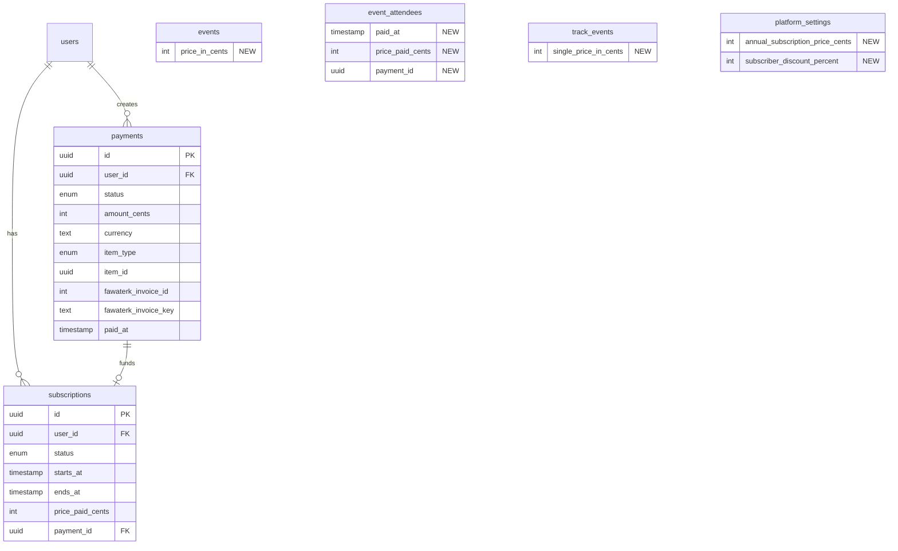

# Payment Gateway MVP Plan v2 (Simplified + Security Hardened)

> This is a refined version of `payment-gateway-mvp.md` incorporating reviewer feedback:
> - **Modern Node.js Reviewer**: APPROVE with minor fixes
> - **Kieran Node.js Reviewer**: Security fixes (HMAC, atomic updates, capacity)
> - **Code Simplicity Reviewer**: 40% complexity reduction

---

## Changes from v1

### Security Fixes Applied

| Issue | Original | Fixed |
|-------|----------|-------|
| Webhook security | IP validation (spoofable) | HMAC signature verification |
| Race conditions | SELECT then UPDATE | Atomic `UPDATE WHERE status='pending'` |
| Capacity check | After payment success | Reserve before payment, verify after |
| Duplicate payments | Application-level check | Database unique partial index |

### Simplifications Applied

| Removed | Reason | Alternative |
|---------|--------|-------------|
| `deliveryModeEnum` | Over-engineering | Derive: `meetingLink && !location` = online |
| Per-item `subscriberPriceInCents` | Complexity | Global `subscriberDiscountPercent` in settings |
| `isPremium` on series/assets | Unused complexity | Access via event/track registration |
| `allowLatePurchase` | Edge case | Handle in future iteration |
| Admin grant/revoke routes | Rare operation | Direct DB update when needed |
| Reminder email system | Phase 2 feature | Add post-MVP |

### Schema Reduction

**Original:** 24 new columns across 7 tables
**Simplified:** 10 new columns across 5 tables

---

## Overview

Implement Fawaterk payment gateway for TrafficMENA Hub:
- One-time purchases for events and tracks
- Yearly subscription (365 days, manual renewal)
- Subscriber discounts via global percentage

---

## Critical Business Rules

### Pricing Logic (Simplified)

| User Type | Event Price | Track Price |
|-----------|-------------|-------------|
| Free User | `priceInCents` | `priceInCents` |
| Subscriber | `priceInCents * (1 - discountPercent/100)` | `priceInCents * (1 - discountPercent/100)` |

**Key simplification:** One global `subscriberDiscountPercent` in `platformSettings` instead of per-item subscriber prices.

### Online Events for Subscribers

Subscribers get **FREE** access to online events. Determined by existing fields:
- `meetingLink` is set AND `location` is null/empty = **online** (FREE for subscribers)
- Otherwise = **offline/hybrid** (discount applies)

**No `deliveryModeEnum` needed** - derive from existing fields.

### Single Booking Window

Uses existing `tracks.singleBookingStart` and `tracks.singleBookingEnd` fields (verified at `schema/index.ts:144-145`). When window is open, users can purchase individual events within a track at `trackEvents.singlePriceInCents`.

### Premium Content Access

User can access library content IF ANY of:
1. `isPublic = true` (asset is public)
2. User has **active subscription** (`subscriptions.status = 'active'` AND `endsAt > now`)
3. User is **registered for the related event** (`eventAttendees` record exists)
4. User has **booked the track** that owns the series (`trackBookings` record exists)

### Subscription Period

- Duration: **365 days** from payment date
- Starts: **Immediately** upon successful payment
- No auto-renewal (manual renewal only for MVP)
- No overlapping subscriptions allowed (reject if active subscription exists)

---

## Pre-Implementation Setup

### Step 0: Create Feature Branch (MANDATORY FIRST STEP)

```bash
git checkout main
git pull origin main
git checkout -b feat/payment-gateway-mvp
```

### Environment Variables

Add to `server/.env`:

```bash
FAWATERK_API_KEY=your_api_key_here
FAWATERK_ENV=staging  # or 'live' for production
# APP_BASE_URL already exists - used for redirect URLs
```

**Note:** No separate webhook secret needed - Fawaterk uses the API Key for HMAC verification.

### Payment Verification Approach (MVP)

**Primary: Polling** (chosen for simplicity)
- When user returns from Fawaterk, call `getInvoiceData(invoiceId)` to verify `paid === 1`
- No webhook infrastructure needed for development

**Future: Webhook** (add for production reliability)
- Webhook serves as backup if user closes browser before returning
- HMAC verification uses API Key (not a separate secret)

---

## Existing Infrastructure Leveraged

| Component | Location | Status | Notes |
|-----------|----------|--------|-------|
| `tracks.priceInCents` | `schema/index.ts:148` | EXISTS | Bundle price - no UI yet |
| `tracks.singleBookingStart` | `schema/index.ts:144` | EXISTS | Single booking window start |
| `tracks.singleBookingEnd` | `schema/index.ts:145` | EXISTS | Single booking window end |
| `trackBookings.paidAt` | `schema/index.ts:190` | EXISTS | Payment timestamp - unused |
| `trackBookings.pricePaidCents` | `schema/index.ts:191` | EXISTS | Payment amount - unused |
| Track booking logic | `routes/api/tracks.ts` | EXISTS | Atomic registration |
| Event registration | `routes/api/events.ts:565-677` | EXISTS | Single booking window enforced |
| Email service | `services/email.ts` | EXISTS | Plunk - extend for receipts |
| Settings table | `schema/index.ts:317-322` | EXISTS | Add subscription config |

---

## Phase 1: Schema (Minimal - 10 columns)

### BE001: Add event pricing field

**File:** `server/src/db/schema/index.ts`

Add to `events` table (lines 61-81):

```typescript
// Add after guestExperts (line 74)
priceInCents: integer('price_in_cents'),  // null = free
```

---

### BE002: Add per-event pricing in tracks

**File:** `server/src/db/schema/index.ts`

Add to `trackEvents` table (lines 158-177):

```typescript
// Add after sortOrder (line 168)
singlePriceInCents: integer('single_price_in_cents'),
```

---

### BE003: Add payment audit to event attendees

**File:** `server/src/db/schema/index.ts`

Add to `eventAttendees` table (lines 83-103):

```typescript
// Add after registeredAt (line 93)
paidAt: timestamp('paid_at', { withTimezone: true }),
pricePaidCents: integer('price_paid_cents'),
paymentId: uuid('payment_id'),  // Reference to payments table
```

---

### BE004: Create payments table

**File:** `server/src/db/schema/index.ts`

Add after `platformSettings`:

```typescript
export const paymentStatusEnum = pgEnum('payment_status', [
  'pending',
  'paid',
  'failed',
  'expired',
]);

export const paymentItemTypeEnum = pgEnum('payment_item_type', [
  'event',
  'track',
  'subscription',
]);

export const payments = pgTable(
  'payments',
  {
    id: uuid('id').primaryKey().defaultRandom(),
    userId: uuid('user_id')
      .references(() => users.id, { onDelete: 'cascade' })
      .notNull(),
    status: paymentStatusEnum('status').default('pending').notNull(),
    amountCents: integer('amount_cents').notNull(),
    currency: text('currency').default('EGP').notNull(),
    itemType: paymentItemTypeEnum('item_type').notNull(),
    itemId: uuid('item_id'),  // eventId, trackId, or null for subscription
    fawaterkInvoiceId: integer('fawaterk_invoice_id'),
    fawaterkInvoiceKey: text('fawaterk_invoice_key'),
    createdAt: timestamp('created_at', { withTimezone: true }).defaultNow().notNull(),
    paidAt: timestamp('paid_at', { withTimezone: true }),
  },
  (table) => ({
    userIdx: index('payments_user_idx').on(table.userId),
    statusIdx: index('payments_status_idx').on(table.status),
    invoiceIdx: index('payments_fawaterk_invoice_idx').on(table.fawaterkInvoiceId),
    // Prevent duplicate pending payments - database-level constraint
    uniquePendingPayment: uniqueIndex('payments_unique_pending')
      .on(table.userId, table.itemType, table.itemId)
      .where(sql`status = 'pending'`),
  }),
);
```

---

### BE005: Create subscriptions table

**File:** `server/src/db/schema/index.ts`

Add after payments table:

```typescript
export const subscriptionStatusEnum = pgEnum('subscription_status', [
  'active',
  'expired',
]);

export const subscriptions = pgTable(
  'subscriptions',
  {
    id: uuid('id').primaryKey().defaultRandom(),
    userId: uuid('user_id')
      .references(() => users.id, { onDelete: 'cascade' })
      .notNull(),
    status: subscriptionStatusEnum('subscription_status').default('active').notNull(),
    startsAt: timestamp('starts_at', { withTimezone: true }).notNull(),
    endsAt: timestamp('ends_at', { withTimezone: true }).notNull(),
    pricePaidCents: integer('price_paid_cents').notNull(),
    paymentId: uuid('payment_id').references(() => payments.id, { onDelete: 'set null' }),
    createdAt: timestamp('created_at', { withTimezone: true }).defaultNow().notNull(),
  },
  (table) => ({
    userIdx: index('subscriptions_user_idx').on(table.userId),
    statusIdx: index('subscriptions_status_idx').on(table.status),
    endsAtIdx: index('subscriptions_ends_at_idx').on(table.endsAt),
  }),
);
```

**Add CHECK constraint in migration SQL:**
```sql
ALTER TABLE subscriptions ADD CONSTRAINT subscriptions_ends_after_starts CHECK (ends_at > starts_at);
```

---

### BE006: Extend platformSettings

**File:** `server/src/db/schema/index.ts`

Add to `platformSettings` table (lines 317-322):

```typescript
// Add after inviteOnlySignup (line 319)
annualSubscriptionPriceCents: integer('annual_subscription_price_cents'),
subscriberDiscountPercent: integer('subscriber_discount_percent').default(20),  // Global discount %
```

---

### BE007: Generate & run migration

```bash
npm --prefix server run db:gen
npm --prefix server run db:migrate
```

---

## Phase 2: Environment & Fawaterk Service

### BE008: Extend environment schema ✅ DONE

**File:** `server/src/config/env.ts`

Add to `envSchema`:

```typescript
FAWATERK_API_KEY: z.string().optional(),
FAWATERK_ENV: z.enum(['staging', 'live']).optional().default('staging'),
```

**Status:** Already implemented during environment setup.

---

### BE009: Create Fawaterk service

**File:** `server/src/services/fawaterk.ts` (NEW FILE)

```typescript
import { env } from '../config/env.js';
import crypto from 'node:crypto';

type FawaterkCustomer = {
  first_name: string;
  last_name: string;
  email: string;
  phone?: string;
  address?: string;
};

type FawaterkCartItem = {
  name: string;
  price: string;
  quantity: string;
};

type FawaterkRedirectionUrls = {
  successUrl: string;
  failUrl: string;
  pendingUrl: string;
  webhookUrl?: string;
};

type InitiatePaymentArgs = {
  paymentMethodId: number;
  cartTotal: number;
  currency: string;
  customer: FawaterkCustomer;
  cartItems: FawaterkCartItem[];
  redirectionUrls: FawaterkRedirectionUrls;
  payload?: Record<string, unknown>;
};

type PaymentMethod = {
  paymentId: number;
  name_en: string;
  name_ar: string;
  redirect: string;
  logo: string;
};

type InvoiceData = {
  invoice_id: number;
  invoice_key: string;
  due_date: string;
  pay_load: unknown;
  customer_email: string;
  payment_method: string;
  currency: string;
  total: number;
  paid: number;
  paid_at: string | null;
  invoice_created_at: string;
};

const getBaseUrl = () =>
  env.FAWATERK_ENV === 'live'
    ? 'https://app.fawaterk.com/api/v2'
    : 'https://staging.fawaterk.com/api/v2';

export async function getPaymentMethods(): Promise<PaymentMethod[]> {
  if (!env.FAWATERK_API_KEY) {
    throw new Error('FAWATERK_API_KEY not configured');
  }

  const response = await fetch(`${getBaseUrl()}/getPaymentmethods`, {
    method: 'GET',
    headers: {
      'Content-Type': 'application/json',
      Authorization: `Bearer ${env.FAWATERK_API_KEY}`,
    },
  });

  if (!response.ok) {
    const detail = await response.text();
    throw new Error(`Fawaterk getPaymentMethods failed: ${response.status} ${detail}`);
  }

  const result = await response.json();
  return result.data as PaymentMethod[];
}

export async function invoiceInitPay(args: InitiatePaymentArgs): Promise<{
  invoiceId: number;
  invoiceKey: string;
  paymentData: {
    redirectTo?: string;
    fawryCode?: string;
    meezaReference?: number;
    amanCode?: string;
    masaryCode?: string;
  };
}> {
  if (!env.FAWATERK_API_KEY) {
    throw new Error('FAWATERK_API_KEY not configured');
  }

  const response = await fetch(`${getBaseUrl()}/invoiceInitPay`, {
    method: 'POST',
    headers: {
      'Content-Type': 'application/json',
      Authorization: `Bearer ${env.FAWATERK_API_KEY}`,
    },
    body: JSON.stringify({
      payment_method_id: args.paymentMethodId,
      cartTotal: args.cartTotal.toString(),
      currency: args.currency,
      customer: args.customer,
      cartItems: args.cartItems,
      redirectionUrls: args.redirectionUrls,
      payLoad: args.payload,
      redirectOption: true,
    }),
  });

  if (!response.ok) {
    const detail = await response.text();
    throw new Error(`Fawaterk invoiceInitPay failed: ${response.status} ${detail}`);
  }

  const result = await response.json();
  return {
    invoiceId: result.data.invoice_id,
    invoiceKey: result.data.invoice_key,
    paymentData: result.data.payment_data,
  };
}

export async function getInvoiceData(invoiceId: number): Promise<InvoiceData> {
  if (!env.FAWATERK_API_KEY) {
    throw new Error('FAWATERK_API_KEY not configured');
  }

  const response = await fetch(`${getBaseUrl()}/getInvoiceData/${invoiceId}`, {
    method: 'GET',
    headers: {
      'Content-Type': 'application/json',
      Authorization: `Bearer ${env.FAWATERK_API_KEY}`,
    },
  });

  if (!response.ok) {
    const detail = await response.text();
    throw new Error(`Fawaterk getInvoiceData failed: ${response.status} ${detail}`);
  }

  const result = await response.json();
  return result.data as InvoiceData;
}

// HMAC signature verification for webhooks (per Fawaterk docs)
// Uses API Key as secret, NOT a separate webhook secret
export function verifyFawaterkWebhook(body: {
  invoice_id: number;
  invoice_key: string;
  payment_method: string;
  hashKey: string;
}): boolean {
  if (!env.FAWATERK_API_KEY) {
    console.error('[webhook] FAWATERK_API_KEY required for verification');
    return false;
  }

  // Per Fawaterk docs: build query string in exact order
  const queryParam = `InvoiceId=${body.invoice_id}&InvoiceKey=${body.invoice_key}&PaymentMethod=${body.payment_method}`;

  // Use API Key as the HMAC secret (per Fawaterk documentation)
  const expectedHash = crypto
    .createHmac('sha256', env.FAWATERK_API_KEY)
    .update(queryParam)
    .digest('hex');

  return body.hashKey === expectedHash;
}
```

---

## Phase 3: Payment Routes (Security-Hardened)

### BE010: Create payments routes

**File:** `server/src/routes/api/payments.ts` (NEW FILE)

**Key Implementation Details:**

#### 1. Price Calculation (using global discount)

```typescript
async function calculatePrice(
  userId: string,
  itemType: 'event' | 'track' | 'subscription',
  itemId: string | null,
  tx: typeof db
): Promise<{ amountCents: number; itemName: string }> {
  // Get subscription status
  const [subscription] = await tx
    .select()
    .from(subscriptions)
    .where(and(
      eq(subscriptions.userId, userId),
      eq(subscriptions.status, 'active'),
      gte(subscriptions.endsAt, new Date())
    ));
  const isSubscriber = !!subscription;

  // Get global discount percentage
  const [settings] = await tx.select().from(platformSettings).limit(1);
  const discountPercent = settings?.subscriberDiscountPercent || 0;

  if (itemType === 'subscription') {
    if (isSubscriber) {
      throw new ApiError('ALREADY_SUBSCRIBED',
        `Active subscription exists until ${subscription.endsAt.toLocaleDateString()}`, 400);
    }
    if (!settings?.annualSubscriptionPriceCents) {
      throw new ApiError('NOT_CONFIGURED', 'Subscription price not set', 400);
    }
    return { amountCents: settings.annualSubscriptionPriceCents, itemName: 'Annual Subscription' };
  }

  if (itemType === 'event' && itemId) {
    const [event] = await tx.select().from(events).where(eq(events.id, itemId));
    if (!event) throw new ApiError('NOT_FOUND', 'Event not found', 404);

    const basePrice = event.priceInCents || 0;

    // Online event = FREE for subscribers (derive from existing fields)
    const isOnline = event.meetingLink && !event.location;
    if (isSubscriber && isOnline) {
      return { amountCents: 0, itemName: event.title };
    }

    // Apply global discount for subscribers on offline/hybrid events
    if (isSubscriber && basePrice > 0) {
      const discounted = Math.round(basePrice * (1 - discountPercent / 100));
      return { amountCents: discounted, itemName: event.title };
    }

    return { amountCents: basePrice, itemName: event.title };
  }

  if (itemType === 'track' && itemId) {
    const [track] = await tx.select().from(tracks).where(eq(tracks.id, itemId));
    if (!track) throw new ApiError('NOT_FOUND', 'Track not found', 404);

    const basePrice = track.priceInCents || 0;

    // Apply global discount for subscribers
    if (isSubscriber && basePrice > 0) {
      const discounted = Math.round(basePrice * (1 - discountPercent / 100));
      return { amountCents: discounted, itemName: track.title };
    }

    return { amountCents: basePrice, itemName: track.title };
  }

  throw new ApiError('INVALID_ITEM', 'Invalid item type', 400);
}
```

#### 2. Atomic Payment Processing (race-condition safe)

```typescript
async function processSuccessfulPayment(paymentId: string) {
  // CRITICAL: Single atomic UPDATE - only succeeds if status is still 'pending'
  // This prevents race conditions between webhook and polling
  const [updated] = await db
    .update(payments)
    .set({ status: 'paid', paidAt: new Date() })
    .where(and(
      eq(payments.id, paymentId),
      eq(payments.status, 'pending')  // Only update if still pending
    ))
    .returning();

  if (!updated) {
    // Either already processed or doesn't exist
    const [existing] = await db.select().from(payments).where(eq(payments.id, paymentId));
    if (existing?.status === 'paid') {
      return { alreadyProcessed: true };
    }
    throw new Error('Payment not found or invalid state');
  }

  // Now process based on item type (payment row is atomically marked 'paid')
  return db.transaction(async (tx) => {
    if (updated.itemType === 'event' && updated.itemId) {
      // Check capacity AFTER payment is marked paid
      const [event] = await tx.select().from(events).where(eq(events.id, updated.itemId));
      if (event.maxAttendees) {
        const [{ count }] = await tx
          .select({ count: sql`count(*)` })
          .from(eventAttendees)
          .where(eq(eventAttendees.eventId, updated.itemId));

        if (Number(count) >= event.maxAttendees) {
          // Mark payment as failed - needs manual refund
          await tx.update(payments)
            .set({ status: 'failed' })
            .where(eq(payments.id, paymentId));
          throw new ApiError('EVENT_FULL', 'Event full. Refund will be processed.', 409);
        }
      }

      await tx.insert(eventAttendees).values({
        eventId: updated.itemId,
        userId: updated.userId,
        paidAt: new Date(),
        pricePaidCents: updated.amountCents,
        paymentId: updated.id,
      });
    }

    if (updated.itemType === 'track' && updated.itemId) {
      // Update existing track booking with payment info
      await tx.update(trackBookings)
        .set({ paidAt: new Date(), pricePaidCents: updated.amountCents })
        .where(and(
          eq(trackBookings.trackId, updated.itemId),
          eq(trackBookings.userId, updated.userId)
        ));
    }

    if (updated.itemType === 'subscription') {
      await tx.insert(subscriptions).values({
        userId: updated.userId,
        status: 'active',
        startsAt: new Date(),
        endsAt: new Date(Date.now() + 365 * 24 * 60 * 60 * 1000), // 365 days
        pricePaidCents: updated.amountCents,
        paymentId: updated.id,
      });
    }

    // Get user for receipt email
    const [user] = await tx.select().from(users).where(eq(users.id, updated.userId));

    // Send receipt email (non-blocking)
    sendPaymentReceiptEmail({
      email: user.email,
      itemName: updated.itemName || 'Purchase',
      amountPaid: updated.amountCents / 100,
      currency: 'EGP',
      invoiceNumber: updated.fawaterkInvoiceId,
    }).catch(err => console.error('[email] Receipt send failed:', err));

    return { success: true };
  });
}
```

#### 3. Webhook with HMAC Verification (for production - optional for MVP)

**Note:** For MVP, we use polling. Webhook is optional backup for production.

```typescript
app.post('/payments/webhook', async (c) => {
  const body = await c.req.json();

  // Fawaterk webhook payload structure:
  // { hashKey, invoice_key, invoice_id, payment_method, invoice_status, pay_load, referenceNumber }

  // SECURITY: Verify HMAC signature using API Key (per Fawaterk docs)
  if (!verifyFawaterkWebhook(body)) {
    console.error('[webhook] Invalid hashKey from IP:', c.req.header('x-forwarded-for'));
    return c.json({ error: 'Invalid signature' }, 401);
  }

  console.log('[webhook] Verified payload:', JSON.stringify(body, null, 2));

  // Extract our payment ID from the payload we sent during checkout
  const paymentId = body.pay_load?.paymentId;
  if (!paymentId) {
    console.error('[webhook] Missing paymentId in pay_load');
    return c.json({ error: 'Missing paymentId' }, 400);
  }

  // Double-check invoice status with Fawaterk API
  if (body.invoice_id) {
    const invoiceData = await getInvoiceData(body.invoice_id);
    if (invoiceData.paid !== 1) {
      console.log('[webhook] Invoice not marked as paid');
      return c.json({ received: true, processed: false });
    }
  }

  try {
    const result = await processSuccessfulPayment(paymentId);
    return c.json({ received: true, processed: true, ...result });
  } catch (error) {
    console.error('[webhook] Processing failed:', error);
    return c.json({ received: true, processed: false, error: error.message }, 500);
  }
});
```

---

### BE011: Register payment routes

**File:** `server/src/routes/api/index.ts`

```typescript
import { registerPaymentRoutes } from './payments.js';

// In the function body, add:
registerPaymentRoutes(app);
```

---

## Phase 4: Update Booking Routes

### BE012: Update event registration

**File:** `server/src/routes/api/events.ts`

Update `POST /events/:id/register` handler (lines 565-677):

```typescript
// After event lookup in transaction:

// 1. Check subscription status
const [subscription] = await tx
  .select()
  .from(subscriptions)
  .where(and(
    eq(subscriptions.userId, userId),
    eq(subscriptions.status, 'active'),
    gte(subscriptions.endsAt, new Date())
  ));
const isSubscriber = !!subscription;

// 2. Get settings for discount
const [settings] = await tx.select().from(platformSettings).limit(1);
const discountPercent = settings?.subscriberDiscountPercent || 0;

// 3. Calculate price
let requiredPrice = event.priceInCents || 0;
const isOnline = event.meetingLink && !event.location;

if (isSubscriber && isOnline) {
  requiredPrice = 0;  // FREE for subscribers on online events
} else if (isSubscriber && requiredPrice > 0) {
  requiredPrice = Math.round(requiredPrice * (1 - discountPercent / 100));
}

// 4. If price > 0, check for payment or return PAYMENT_REQUIRED
if (requiredPrice > 0) {
  const body = await c.req.json().catch(() => ({}));

  if (body.paymentId) {
    // Verify payment
    const [payment] = await tx.select().from(payments)
      .where(and(
        eq(payments.id, body.paymentId),
        eq(payments.userId, userId),
        eq(payments.status, 'paid'),
        eq(payments.itemType, 'event'),
        eq(payments.itemId, eventId)
      ));

    if (!payment) {
      return c.json({ error: { code: 'PAYMENT_NOT_FOUND', message: 'Valid payment required' } }, 400);
    }
    // Payment verified - proceed with registration
  } else {
    // Return payment required response
    return c.json({
      paymentRequired: true,
      price: requiredPrice,
      currency: 'EGP',
      isSubscriberPrice: isSubscriber,
    }, 402);
  }
}

// Continue with registration...
```

---

### BE013: Update track booking

**File:** `server/src/routes/api/tracks.ts`

Similar update to `POST /tracks/:id/book` - check payment before booking.

---

## Phase 5: Subscription Routes

### BE014: Create subscription routes

**File:** `server/src/routes/api/subscriptions.ts` (NEW FILE)

```typescript
// GET /subscriptions/current - Get user's active subscription
// POST /subscriptions/purchase - Start subscription payment flow
// GET /subscriptions/settings (manager+) - Get subscription price & discount
// PUT /subscriptions/settings (admin+) - Update subscription price & discount
```

**Note:** Admin grant/revoke removed per simplification - direct DB update when needed.

---

### BE015: Register subscription routes

**File:** `server/src/routes/api/index.ts`

```typescript
import { registerSubscriptionRoutes } from './subscriptions.js';
registerSubscriptionRoutes(app);
```

---

## Phase 6: Frontend - Admin Forms

### FE001: Add pricing field to event form

**File:** `src/features/events/components/AdminEventForm.tsx`

Add:
- Price (EGP) input field

---

### FE002: Add pricing fields to track form

**File:** `src/features/tracks/components/TrackForm.tsx`

Add:
- Track price input (show existing `priceInCents`)
- Per-event price inputs (for single booking)

---

### FE003: Subscription settings UI

**File:** `src/pages/admin/settings.tsx`

Manager+: View annual subscription price & discount %
Admin+: Edit annual subscription price & discount %

---

## Phase 7: Frontend - User Payment Flow

### FE004: Payment API hooks

**File:** `src/app/api/payments.ts` (NEW FILE)

```typescript
// usePaymentMethods() - fetch available methods
// useCreateCheckout() - create payment and get redirect
// usePaymentStatus() - poll payment status
```

---

### FE005: Payment method selector

**File:** `src/features/payments/components/PaymentMethodSelector.tsx` (NEW FILE)

Show Fawaterk payment method options with logos.

---

### FE006: Payment result pages

**Files:**
- `src/pages/payment/success.tsx`
- `src/pages/payment/failed.tsx`

Handle redirect from Fawaterk, poll for status, show result.

---

### FE007: Update event detail UI

**File:** `src/features/events/components/EventDetail.tsx`

- Show price
- Show subscriber discount if applicable
- Payment CTA for paid events

---

### FE008: Update track detail UI

**File:** `src/features/tracks/components/TrackDetail.tsx`

- Show track price
- Show "Book Track" vs "Book Single Event" based on window
- Subscriber discount

---

### FE009: User subscription status

**Files:** User profile, dashboard header

Show subscription status (active, expires on X).

---

### FE010: Subscription purchase page

**File:** `src/pages/subscription/index.tsx` (NEW FILE)

- Show annual subscription price
- Benefits list
- Payment CTA

---

## Phase 8: Email

### BE016: Add payment receipt email

**File:** `server/src/services/email.ts`

```typescript
type SendPaymentReceiptArgs = {
  email: string;
  itemName: string;
  amountPaid: number;
  currency: string;
  invoiceNumber: number | null;
};

export async function sendPaymentReceiptEmail({
  email,
  itemName,
  amountPaid,
  currency,
  invoiceNumber,
}: SendPaymentReceiptArgs) {
  const subject = 'Your TrafficMENA purchase receipt';
  const formattedAmount = `${currency} ${amountPaid.toFixed(2)}`;

  const htmlBody = `<!doctype html>
<html>
  <head>
    <meta charset="utf-8" />
    <title>Payment Receipt</title>
    <style>
      body { font-family: Arial, sans-serif; background-color: #f4f4f4; padding: 24px; }
      .card { max-width: 480px; margin: 0 auto; background: #ffffff; border-radius: 12px; padding: 32px; box-shadow: 0 12px 24px rgba(16, 16, 16, 0.08); }
      .amount { font-size: 28px; font-weight: 700; color: #05ef62; }
      .item { font-size: 18px; color: #101010; margin-top: 16px; }
      .details { color: #4b5563; margin-top: 24px; line-height: 1.6; }
      .footer { margin-top: 32px; font-size: 14px; color: #6b7280; }
    </style>
  </head>
  <body>
    <div class="card">
      <h1>Payment Successful</h1>
      <p class="amount">${formattedAmount}</p>
      <p class="item">${itemName}</p>
      <div class="details">
        <p>Thank you for your purchase!</p>
        ${invoiceNumber ? `<p>Invoice #: ${invoiceNumber}</p>` : ''}
        <p>Date: ${new Date().toLocaleDateString('en-GB', { dateStyle: 'medium' })}</p>
      </div>
      <p class="footer">Questions? Contact hello@trafficmena.com</p>
    </div>
  </body>
</html>`;

  const textBody = `Payment Successful\n\nAmount: ${formattedAmount}\nItem: ${itemName}\n${invoiceNumber ? `Invoice #: ${invoiceNumber}\n` : ''}Date: ${new Date().toLocaleDateString()}\n\nThank you for your purchase!`;

  // Use existing Plunk sending logic...
}
```

---

## API Routes Summary

| Route | Method | Auth | Purpose |
|-------|--------|------|---------|
| `/api/payments/methods` | GET | User | List payment methods |
| `/api/payments/checkout` | POST | User | Create payment + redirect |
| `/api/payments/:id` | GET | User | Get payment status |
| `/api/payments/verify` | POST | User | **Verify payment via Fawaterk API (polling)** |
| `/api/payments/webhook` | POST | None | Fawaterk webhook (optional for MVP) |
| `/api/subscriptions/current` | GET | User | Current subscription |
| `/api/subscriptions/purchase` | POST | User | Start subscription purchase |
| `/api/subscriptions/settings` | GET | Manager+ | Get subscription settings |
| `/api/subscriptions/settings` | PUT | Admin+ | Update subscription settings |

**MVP Primary Flow:** User returns from Fawaterk → Frontend calls `/api/payments/verify` with `invoiceId` → Backend calls Fawaterk `getInvoiceData` → If `paid === 1`, process payment.

---

## ERD - New/Modified Tables



---

## Security Measures Summary

| Measure | Implementation |
|---------|----------------|
| Webhook HMAC | `verifyFawaterkWebhook()` using `FAWATERK_API_KEY` (per Fawaterk docs) |
| HMAC Format | `InvoiceId=X&InvoiceKey=Y&PaymentMethod=Z` → SHA256 with API Key |
| Idempotency | Atomic `UPDATE ... WHERE status='pending'` - no SELECT-then-UPDATE |
| Duplicate prevention | Unique partial index on pending payments (database-level) |
| Invoice verification | Call `getInvoiceData()` to verify `paid === 1` |
| CHECK constraints | `ends_at > starts_at` on subscriptions table |

---

## Rollback Plan

1. All schema changes are **additive** (no column drops)
2. Add `PAYMENTS_ENABLED=false` env flag to disable payment checks
3. If disabled, all registrations/bookings work as before (free)
4. Fawaterk credentials can be removed to disable integration

---

## Implementation Order

**Week 1:**
- BE001-BE009: Schema + Fawaterk service
- BE010-BE015: Payment & subscription routes
- BE016: Receipt email

**Week 2:**
- FE001-FE010: All frontend work
- Testing with Fawaterk staging

---

## Test Cards (Fawaterk Staging)

**Successful transactions:**
- Card: `5123450000000008`
- Holder: `Fawaterak test`
- Expiry: `12/26`
- CVV: `100`

**Failed transactions:**
- Card: `5543474002249996`
- Holder: `Fawaterak test`
- Expiry: `05/21`
- CVV: `123`

---

## Known Limitations (MVP)

| Limitation | Impact | Future Fix |
|------------|--------|------------|
| No auto-renewal | Users must manually renew | Add recurring payments |
| Manual refunds | Admin processes via Fawaterk dashboard | Add refund API |
| Single currency (EGP) | No multi-currency | Add currency field |
| No promo codes | Cannot apply discounts via codes | Add promo system |

---

## Edge Cases Handled

| Scenario | Behavior |
|----------|----------|
| User already registered | Skip payment, return "already registered" |
| Active subscription exists | Reject new subscription purchase |
| Event becomes full during payment | Mark payment failed, notify user |
| Webhook + polling race | Atomic UPDATE prevents double-processing |
| User abandons payment | Payment stays 'pending' |
| Admin changes price during checkout | User pays original price (captured at checkout) |

---

## Acceptance Criteria

- [ ] Free user can purchase standalone event
- [ ] Free user can purchase track bundle
- [ ] Subscriber gets online events FREE
- [ ] Subscriber gets offline events at discounted price (global %)
- [ ] Single-event booking works within window
- [ ] Receipt email sent on successful payment
- [ ] **Polling verification works** (call `getInvoiceData`, check `paid === 1`)
- [ ] Atomic UPDATE prevents race conditions
- [ ] Duplicate pending payments prevented by DB index
- [ ] (Optional) HMAC webhook verification for production
