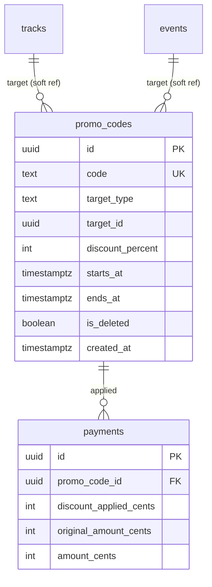

# Promo Code System - Implementation Plan v2.2 (Final)

**Date:** 2026-02-03
**Status:** FINAL - Reviewed by Security, Data Integrity, and Simplicity agents
**Approach:** MVP-first, secure, data-safe

---

## User Decisions Applied

| Decision Point | Choice |
|----------------|--------|
| Error messages | Single generic `PROMO_INVALID` (security) |
| Discount source badge | Show "Subscriber discount" vs "Promo applied" |
| Usage history | Count only (no full history in MVP) |
| Orphan prevention | Defer to post-MVP |

---

## First-Principles Invariants

1. **Server is sole source of truth** for price and discount logic
2. **Payment amount locked at checkout** — fulfillment does NOT re-validate promo
3. **No capacity holds until all validation passes**
4. **One discount source only** — higher of subscriber vs promo wins
5. **Promo codes never apply to free items** (basePrice ≤ 0)

---

## Security Mitigations Applied

| Risk | Mitigation |
|------|------------|
| Information disclosure | Single `PROMO_INVALID` error for all failures |
| Timing attack | Constant-time validation (always query, always check all conditions) |
| Race condition | Validate promo INSIDE payment transaction |
| Input sanitization | Strict regex: `^[A-Z0-9_-]{3,50}$` |
| Enumeration via preview | Rate limit price-preview endpoint (existing pattern) |

---

## Data Model (Drizzle)

**File:** `server/src/db/schema/index.ts`

```typescript
// Use TEXT (not pgEnum) for simpler migrations
export const promoCodes = pgTable(
  'promo_codes',
  {
    id: uuid('id').primaryKey().defaultRandom(),
    code: text('code').notNull(), // Case-sensitive, 3-50 chars, alphanumeric + _-
    targetType: text('target_type').notNull(), // 'track' | 'event'
    targetId: uuid('target_id').notNull(),
    discountPercent: integer('discount_percent').notNull(), // 1-99
    startsAt: timestamp('starts_at', { withTimezone: true }).notNull(),
    endsAt: timestamp('ends_at', { withTimezone: true }).notNull(),
    isDeleted: boolean('is_deleted').default(false).notNull(),
    createdAt: timestamp('created_at', { withTimezone: true }).defaultNow().notNull(),
  },
  (table) => ({
    codeUnique: uniqueIndex('promo_codes_code_unique')
      .on(table.code)
      .where(sql`is_deleted = false`),
    targetIdx: index('promo_codes_target_idx')
      .on(table.targetType, table.targetId),
  }),
);

// Add CHECK constraints in migration SQL:
// CHECK (discount_percent BETWEEN 1 AND 99)
// CHECK (starts_at < ends_at)
// CHECK (target_type IN ('track', 'event'))
```

**Payments table additions:**
```typescript
promoCodeId: uuid('promo_code_id').references(() => promoCodes.id, { onDelete: 'set null' }),
discountAppliedCents: integer('discount_applied_cents'),
originalAmountCents: integer('original_amount_cents'),
```

**Usage count query (no separate table):**
```sql
SELECT COUNT(*) FROM payments
WHERE promo_code_id = $1 AND status = 'paid';
```

---

## API Contracts

### calculatePrice() returns:
```typescript
interface PriceResult {
  amountCents: number;
  originalAmountCents: number;
  discountAppliedCents: number;
  discountSource: 'subscriber' | 'promo' | null;
  promoCodeId: string | null;
}
```

### price-preview response:
```typescript
interface PricePreview {
  amountCents: number;
  amountFormatted: string;
  originalAmountCents: number;
  discountAppliedCents: number;
  discountSource: 'subscriber' | 'promo' | null;
  isSubscriber: boolean;
  isFree: boolean;
  promoError: string | null; // Generic message only
}
```

### Promo validation error:
```typescript
// SINGLE error code for ALL promo failures (security)
throw new ApiError('PROMO_INVALID', 'Invalid or inactive promo code', 400);
```

---

## Backend Tasks (4 tasks)

### B001: Database Migration

**File:** `server/src/db/schema/index.ts`

**Subtasks:**
- [ ] Add `promoCodes` table definition
- [ ] Add promo fields to `payments` table
- [ ] Generate migration: `npm --prefix server run db:gen`
- [ ] Add CHECK constraints in migration SQL
- [ ] Run migration: `npm --prefix server run db:migrate`

---

### B002: Promo Validation Service

**File:** `server/src/services/promoCodes.ts` (NEW)

```typescript
const PROMO_CODE_REGEX = /^[A-Z0-9_-]{3,50}$/;

interface ValidPromoCode {
  id: string;
  discountPercent: number;
}

export async function validatePromoCode(
  code: string,
  targetType: 'track' | 'event',
  targetId: string,
  tx?: DrizzleTransaction // For atomic validation inside payment tx
): Promise<ValidPromoCode> {
  // Input validation (fail fast, but continue to DB for constant-time)
  const isValidFormat = PROMO_CODE_REGEX.test(code);
  const isValidUuid = UUID_REGEX.test(targetId);

  // ALWAYS query DB (constant-time defense against timing attacks)
  const dbClient = tx ?? db;
  const promo = await dbClient.query.promoCodes.findFirst({
    where: and(
      eq(promoCodes.code, code),
      eq(promoCodes.isDeleted, false)
    ),
  });

  // Perform ALL checks regardless of early failures
  const now = new Date();
  const exists = !!promo;
  const targetMatches = promo?.targetType === targetType && promo?.targetId === targetId;
  const dateValid = promo ? (now >= promo.startsAt && now <= promo.endsAt) : false;

  // Single decision point (constant-time)
  if (!isValidFormat || !isValidUuid || !exists || !targetMatches || !dateValid) {
    throw new ApiError('PROMO_INVALID', 'Invalid or inactive promo code', 400);
  }

  return { id: promo.id, discountPercent: promo.discountPercent };
}
```

**Security features:**
- Constant-time validation (always queries, always checks all)
- Strict input regex
- Single generic error message
- Supports transaction context for atomic checkout

---

### B003: Integrate Promo into Payment Flow

**File:** `server/src/routes/api/payments.ts`

**Changes to `calculatePrice()` (line ~201):**
- [ ] Add `promoCode?: string` and `tx?: DrizzleTransaction` parameters
- [ ] If promoCode provided AND basePrice > 0 AND itemType !== 'subscription':
  - Call `validatePromoCode(code, itemType, itemId, tx)`
  - Calculate: `promoDiscountCents = Math.floor(basePrice * discountPercent / 100)`
  - Calculate: `subscriberDiscountCents = isSubscriber ? Math.floor(basePrice * subscriberPercent / 100) : 0`
  - Take HIGHER discount
- [ ] Always return `originalAmountCents`, `discountAppliedCents`, `discountSource`

**Key logic:**
```typescript
// Inside transaction - promo validation is atomic with reservation
const priceResult = await calculatePrice(userId, itemType, itemId, promoCode, tx);

// Discount comparison (higher wins)
if (promoDiscountCents >= subscriberDiscountCents) {
  discountSource = 'promo';
  appliedDiscount = promoDiscountCents;
} else {
  discountSource = 'subscriber';
  appliedDiscount = subscriberDiscountCents;
}
```

**Changes to checkout handler:**
- [ ] Add `promoCode: z.string().regex(/^[A-Z0-9_-]{3,50}$/).optional()` to Zod schema
- [ ] Move promo validation INSIDE the payment transaction
- [ ] Store `promoCodeId`, `discountAppliedCents`, `originalAmountCents` on payment

**Changes to price-preview endpoint:**
- [ ] Accept `promoCode` query param
- [ ] Try/catch promo validation — return `promoError: message` on failure (don't throw)
- [ ] Still return base price even if promo invalid

---

### B004: Admin CRUD Routes

**File:** `server/src/routes/api/promoCodes.ts` (NEW)

**Endpoints:**
| Method | Path | Auth | Description |
|--------|------|------|-------------|
| GET | /promo-codes | Manager+ | List all codes |
| GET | /promo-codes/:id | Manager+ | Single code with usage count |
| POST | /promo-codes | Manager+ | Create code |
| PUT | /promo-codes/:id | Manager+ | Update dates/percent only |
| DELETE | /promo-codes/:id | Admin+ | Soft delete |

**Simplified list (no server-side filtering for MVP):**
```typescript
// Return all non-deleted codes with usage count
// Frontend handles filtering for small dataset
const codes = await db
  .select({
    ...getTableColumns(promoCodes),
    usageCount: sql<number>`(
      SELECT COUNT(*) FROM payments
      WHERE payments.promo_code_id = promo_codes.id
      AND payments.status = 'paid'
    )`,
  })
  .from(promoCodes)
  .where(eq(promoCodes.isDeleted, false))
  .orderBy(desc(promoCodes.createdAt));
```

**Create validation (Zod):**
```typescript
const createSchema = z.object({
  code: z.string().regex(/^[A-Z0-9_-]{3,50}$/, 'Invalid code format'),
  targetType: z.enum(['track', 'event']),
  targetId: z.string().uuid(),
  discountPercent: z.number().int().min(1).max(99),
  startsAt: z.string().datetime(),
  endsAt: z.string().datetime(),
}).refine(data => new Date(data.startsAt) < new Date(data.endsAt), {
  message: 'Start date must be before end date',
});
```

**Target validation:**
- For `track`: verify track exists
- For `event`: verify event exists AND has no row in trackEvents (standalone only)

---

## Frontend Tasks (7 tasks)

### F001: Promo Code API Client

**File:** `src/app/api/promoCodes.ts` (NEW)

```typescript
interface PromoCode {
  id: string;
  code: string;
  target_type: 'track' | 'event';
  target_id: string;
  target_name: string;
  discount_percent: number;
  starts_at: string;
  ends_at: string;
  usage_count: number;
  is_active: boolean; // computed: now between dates AND not deleted
}

export async function fetchPromoCodes(): Promise<PromoCode[]>
export async function fetchPromoCode(id: string): Promise<PromoCode>
export async function createPromoCode(data: CreatePromoCodeRequest): Promise<PromoCode>
export async function updatePromoCode(id: string, data: UpdatePromoCodeRequest): Promise<PromoCode>
export async function deletePromoCode(id: string): Promise<void>
```

---

### F002: Update usePricePreview Hook

**File:** `src/app/hooks/usePayments.ts`

**Changes:**
- [ ] Accept `promoCode?: string` parameter
- [ ] Include `promoCode` in query key (prevents stale cache)
- [ ] Return: `discountSource`, `originalAmountCents`, `promoError`

```typescript
export function usePricePreview(
  itemType: 'event' | 'track',
  itemId: string | undefined,
  promoCode?: string,
  options?: { enabled?: boolean }
) {
  return useQuery({
    queryKey: ['price-preview', itemType, itemId, promoCode],
    queryFn: () => fetchPricePreview(itemType, itemId!, promoCode),
    enabled: !!itemId && (options?.enabled ?? true),
  });
}
```

---

### F003: PromoCodeInput Component

**File:** `src/shared/components/payment/PromoCodeInput.tsx` (NEW)

```typescript
interface PromoCodeInputProps {
  onApply: (code: string) => void;
  onRemove: () => void;
  appliedCode?: string;
  error?: string;
  isLoading?: boolean;
  disabled?: boolean;
}
```

**States:** collapsed → expanded → loading → applied/error

**UI (Stripe-style):**
```
Collapsed:  [Have a promo code?]
                    ↓ click
Expanded:   [______________] [Apply]
                    ↓ submit
Loading:    [SUMMER25_______] [...]
                    ↓ success
Applied:    ✓ SUMMER25 applied  [Remove]
                    ↓ error
Error:      [______________] [Apply]
            Invalid or inactive promo code
```

**Accessibility:**
- Use `useId()` for label association
- Keyboard navigation (Enter to apply)
- Focus management on state changes

---

### F004: Update PriceDisplayCard

**File:** `src/shared/components/payment/PriceDisplayCard.tsx`

**Changes:**
- [ ] Accept `discountSource?: 'subscriber' | 'promo' | null`
- [ ] Accept `originalAmountCents?: number`
- [ ] Show correct badge based on source:
  - `subscriber` → "Subscriber discount"
  - `promo` → "Promo applied"
- [ ] Strikethrough original price when discounted

---

### F005: Update TrackDetail Page

**File:** `src/features/tracks/pages/TrackDetail.tsx`

**Changes:**
- [ ] Add `appliedPromoCode` state
- [ ] Add `PromoCodeInput` after PriceDisplayCard (line ~395)
- [ ] Use `usePricePreview('track', trackId, appliedPromoCode)` to validate
- [ ] Show promo error inline
- [ ] Pass `appliedPromoCode` to `PaymentCheckoutDialog`
- [ ] Disable promo input for guests (show "Sign in to apply promo code")

---

### F006: Update EventDetail Page

**File:** `src/features/events/pages/EventDetail.tsx`

**Changes:**
- [ ] Same as F005
- [ ] Only show for standalone events (`event.trackInfo === null`)

---

### F007: Update PaymentCheckoutDialog

**File:** `src/shared/components/payment/PaymentCheckoutDialog.tsx`

**Changes:**
- [ ] Accept `appliedPromoCode?: string` prop
- [ ] Pass `promoCode` to `usePricePreview` and `createCheckout`
- [ ] Show promo summary: "SUMMER25 applied" with discountSource badge
- [ ] NO promo input in dialog (comes from detail page)

---

### F008: Admin Promo Codes Page

**File:** `src/pages/admin/promo-codes.tsx` (NEW)

**Single page with modal:**

```
┌─────────────────────────────────────────────────────────┐
│ Promo Codes                        [+ Create Code]      │
├─────────────────────────────────────────────────────────┤
│ Filter: [Search: ______] [Status: All ▼]  (client-side) │
├─────────────────────────────────────────────────────────┤
│ Code     │ Target        │ Discount │ Valid      │ Uses │
│ SUMMER25 │ Track: Q1...  │ 20%      │ Jan-Mar    │ 42   │
│ VIP50    │ Event: Web... │ 50%      │ Feb 1-28   │ 8    │
└─────────────────────────────────────────────────────────┘

Modal (Create/Edit):
┌─────────────────────────────────────────┐
│ Create Promo Code              [X]      │
├─────────────────────────────────────────┤
│ Code: [____________] (locked on edit)   │
│ Target: (●) Track  ( ) Event            │
│ Select: [Dropdown_________▼]            │
│ Discount: [__]% (1-99)                  │
│ Valid: [Date____] to [Date____]         │
│                                         │
│             [Cancel] [Save]             │
└─────────────────────────────────────────┘
```

**Features:**
- Client-side search/filter (small dataset)
- Modal for create/edit
- Delete button visible only for admin/owner (`canDeleteContent` from `useRolePermissions`)
- Usage count shown in table (no expansion to history)

**Add route in `src/App.tsx` and sidebar link in `AppLayout.tsx`**

---

## Critical Files Summary

| File | Action |
|------|--------|
| `server/src/db/schema/index.ts` | Add promoCodes table, modify payments |
| `server/src/services/promoCodes.ts` | NEW: constant-time validation |
| `server/src/routes/api/payments.ts` | Modify calculatePrice, checkout, preview |
| `server/src/routes/api/promoCodes.ts` | NEW: admin CRUD |
| `src/app/api/promoCodes.ts` | NEW: API client |
| `src/app/hooks/usePayments.ts` | Update usePricePreview |
| `src/shared/components/payment/PromoCodeInput.tsx` | NEW: user input |
| `src/shared/components/payment/PriceDisplayCard.tsx` | Add discount source badge |
| `src/features/tracks/pages/TrackDetail.tsx` | Add promo input |
| `src/features/events/pages/EventDetail.tsx` | Add promo input |
| `src/shared/components/payment/PaymentCheckoutDialog.tsx` | Accept promo prop |
| `src/pages/admin/promo-codes.tsx` | NEW: admin page |

---

## Verification Steps

### Backend
```bash
# 1. Run migration
npm --prefix server run db:migrate

# 2. Create promo code as admin
curl -X POST localhost:3001/api/promo-codes \
  -H "Cookie: $ADMIN_SESSION" \
  -H "Content-Type: application/json" \
  -d '{"code":"TEST20","targetType":"track","targetId":"<uuid>","discountPercent":20,"startsAt":"2026-01-01T00:00:00Z","endsAt":"2026-12-31T23:59:59Z"}'

# 3. Test price preview with promo
curl "localhost:3001/api/payments/price-preview?itemType=track&itemId=<uuid>&promoCode=TEST20" \
  -H "Cookie: $USER_SESSION"

# 4. Test invalid promo (should return generic error)
curl "localhost:3001/api/payments/price-preview?itemType=track&itemId=<uuid>&promoCode=INVALID"
# Expected: { promoError: "Invalid or inactive promo code" }
```

### Frontend
1. Track detail page → click "Have a promo code?" → enter code → price updates
2. Invalid code → shows "Invalid or inactive promo code"
3. Click "Book Full Track" → dialog shows "Promo applied" badge
4. Complete payment → payment record has promo_code_id

### Admin
1. `/admin/promo-codes` → create code
2. Edit dates/percentage
3. Delete (admin only)
4. Usage count updates after payment

---

## Deferred to Post-MVP

1. ~~Orphan prevention hooks~~ — tracks/events rarely deleted
2. ~~Usage history UI~~ — query payments directly if needed
3. ~~Server-side filtering~~ — small dataset, client-side is fine
4. ~~forceNewCode for promo changes~~ — "Complete existing payment first"
5. ~~Rate limiting on price-preview~~ — use existing patterns when needed

---

## ERD Diagram


