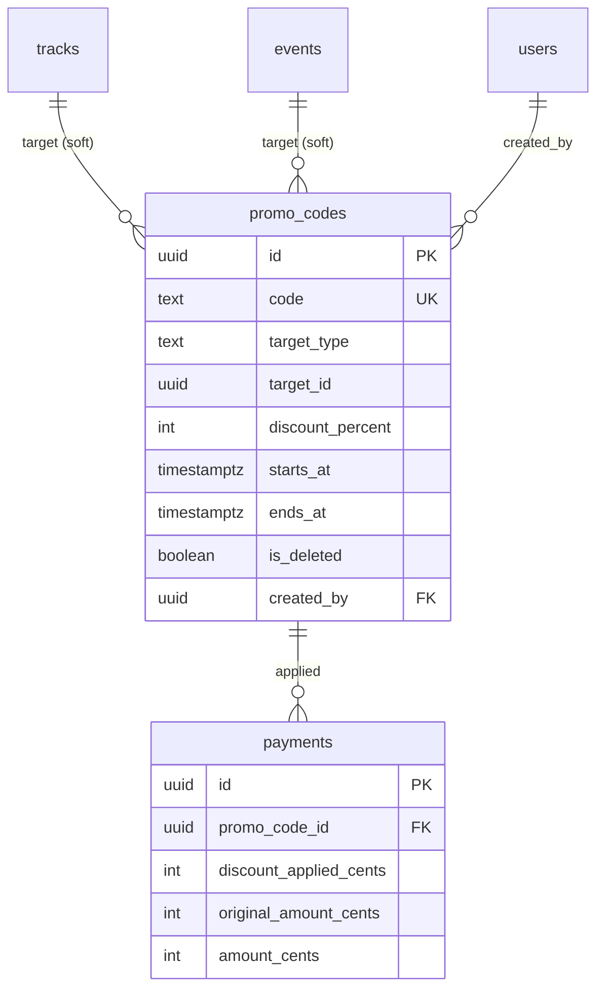

# Promo Code System - Implementation Plan v2

**Date:** 2026-02-03
**Status:** REVISED after multi-agent review
**Approach:** MVP-first, maximum simplicity, zero data corruption risk

---

## Review Feedback Addressed

| Issue | Resolution |
|-------|------------|
| Discount source ambiguity | Add `discountSource` field to price preview/checkout |
| Dual promo input (detail + dialog) | Single input on detail page only, pass to dialog |
| Promo validity timing | Validate at checkout only, NOT at fulfillment |
| Free-flow usage tracking | Skip promo for free items entirely |
| Pending payment + promo change | Use `forceNewCode` pattern for promo changes |
| Missing backend filters | Add status/search params to list endpoint |
| Orphan prevention | Soft-delete promo codes when track/event deleted |
| Date validation | Zod constraint: `startsAt < endsAt` |
| Redundant usage table | REMOVED - derive usage from payments table |
| 4 admin pages | SIMPLIFIED - 1 page with modal |
| Raw SQL migrations | Use Drizzle schema definitions |
| Currency precision | Integer-only math with `Math.floor()` |
| Race conditions | Atomic validation within payment transaction |

---

## Requirements (Unchanged)

| Aspect | Decision |
|--------|----------|
| Code format | Admin-typed, globally unique, case-sensitive |
| Discount | Percentage only (1-99%) |
| Target | One code = one track OR one standalone event |
| Validity | Start date + end date |
| Admin UI | Single page with create/edit modal |
| User UI | Stripe-style input on detail page only |
| Stacking | No — take HIGHER of subscriber OR promo |

---

## Database Schema (Drizzle)

### Single New Table (No separate usage table)

**File:** `server/src/db/schema/index.ts`

```typescript
// Use TEXT with check constraint instead of ENUM (simpler migrations)
export const promoCodes = pgTable(
  'promo_codes',
  {
    id: uuid('id').primaryKey().defaultRandom(),
    code: text('code').notNull(),
    targetType: text('target_type').notNull(), // 'track' | 'event'
    targetId: uuid('target_id').notNull(),
    discountPercent: integer('discount_percent').notNull(),
    startsAt: timestamp('starts_at', { withTimezone: true }).notNull(),
    endsAt: timestamp('ends_at', { withTimezone: true }).notNull(),
    isDeleted: boolean('is_deleted').default(false).notNull(),
    createdBy: uuid('created_by').references(() => users.id, { onDelete: 'set null' }),
    createdAt: timestamp('created_at', { withTimezone: true }).defaultNow().notNull(),
    updatedAt: timestamp('updated_at', { withTimezone: true }).defaultNow().notNull(),
  },
  (table) => ({
    codeUnique: uniqueIndex('promo_codes_code_unique').on(table.code).where(sql`is_deleted = false`),
    targetIdx: index('promo_codes_target_idx').on(table.targetType, table.targetId),
  }),
);
```

### Modify payments table

```typescript
// Add to existing payments table definition
promoCodeId: uuid('promo_code_id').references(() => promoCodes.id, { onDelete: 'set null' }),
discountAppliedCents: integer('discount_applied_cents'),
originalAmountCents: integer('original_amount_cents'),
```

### Usage Tracking = Query payments table

```sql
-- Get usage count for a promo code
SELECT COUNT(*) FROM payments
WHERE promo_code_id = $1 AND status = 'paid';

-- Get usage history
SELECT p.*, u.name, u.email FROM payments p
JOIN users u ON p.user_id = u.id
WHERE p.promo_code_id = $1 AND p.status = 'paid'
ORDER BY p.paid_at DESC;
```

---

## Critical Design Decisions

### 1. Discount Source Resolution

```typescript
// In calculatePrice() - take HIGHER discount
interface PriceResult {
  amountCents: number;
  originalAmountCents: number;
  discountAppliedCents: number;
  discountSource: 'subscriber' | 'promo' | null;
  promoCodeId: string | null;
}

// Logic:
if (promoCode && basePrice > 0) {
  const promo = await validatePromoCode(promoCode, itemType, itemId);
  const promoDiscountCents = Math.floor(basePrice * promo.discountPercent / 100);
  const subscriberDiscountCents = isSubscriber
    ? Math.floor(basePrice * subscriberDiscountPercent / 100)
    : 0;

  if (promoDiscountCents >= subscriberDiscountCents) {
    return {
      amountCents: basePrice - promoDiscountCents,
      originalAmountCents: basePrice,
      discountAppliedCents: promoDiscountCents,
      discountSource: 'promo',
      promoCodeId: promo.id,
    };
  }
  // Fall through to subscriber discount
}
```

### 2. Validity Timing

**Decision:** Validate promo code at CHECKOUT only, not at fulfillment.

**Rationale:**
- Payment amount is locked when invoice created
- Re-validating at webhook would cause "paid but rejected" states
- Matches existing payment flow pattern

### 3. Single Input Location

**Decision:** Promo input on EventDetail/TrackDetail pages ONLY.

**Flow:**
```
Detail Page: [Have a promo code?] → input → Apply
           ↓
Price updates with discount shown
           ↓
Click "Book" → PaymentCheckoutDialog opens with promo pre-applied
           ↓
Dialog shows: "Promo SUMMER25 applied: -20%"
```

### 4. Orphan Prevention

**Decision:** When track/event is soft-deleted, also soft-delete related promo codes.

```typescript
// In track delete handler
await db.transaction(async (tx) => {
  await tx.update(tracks).set({ isDeleted: true }).where(eq(tracks.id, trackId));
  await tx.update(promoCodes)
    .set({ isDeleted: true, updatedAt: new Date() })
    .where(and(
      eq(promoCodes.targetType, 'track'),
      eq(promoCodes.targetId, trackId)
    ));
});
```

### 5. Pending Payment Handling

**Decision:** Use existing `forceNewCode` pattern.

```typescript
// If user has pending payment and applies different promo
// Frontend detects PENDING_PAYMENT error
// Shows: "You have a pending payment. Apply new promo code?"
// If yes, retry with forceNewCode: true
```

---

## Backend Tasks (Simplified: 5 tasks)

### B001: Database Migration

**File:** `server/src/db/schema/index.ts`

**Subtasks:**
- [ ] Add `promoCodes` table definition with Drizzle
- [ ] Add promo fields to `payments` table
- [ ] Generate and run migration
- [ ] Add Zod validation: `startsAt.refine((s, ctx) => s < ctx.parent.endsAt)`

**Constraints:**
- `discountPercent` CHECK: 1-99
- `targetType` CHECK: 'track' OR 'event'

---

### B002: Promo Validation Service

**File:** `server/src/services/promoCodes.ts` (NEW)

```typescript
interface ValidPromoCode {
  id: string;
  code: string;
  discountPercent: number;
}

export async function validatePromoCode(
  code: string,
  targetType: 'track' | 'event',
  targetId: string
): Promise<ValidPromoCode> {
  // Validate UUID format first
  if (!isValidUuid(targetId)) {
    throw new ApiError('VALIDATION_ERROR', 'Invalid target ID', 400);
  }

  const promo = await db.query.promoCodes.findFirst({
    where: and(
      eq(promoCodes.code, code),
      eq(promoCodes.isDeleted, false)
    ),
  });

  if (!promo) {
    throw new ApiError('PROMO_CODE_NOT_FOUND', "Code doesn't exist", 400);
  }

  if (promo.targetType !== targetType || promo.targetId !== targetId) {
    throw new ApiError('PROMO_CODE_INVALID_TARGET',
      `Code not valid for this ${targetType}`, 400);
  }

  const now = new Date();
  if (now < promo.startsAt) {
    throw new ApiError('PROMO_CODE_NOT_STARTED', 'Code not yet active', 400);
  }
  if (now > promo.endsAt) {
    throw new ApiError('PROMO_CODE_EXPIRED', 'Code expired', 400);
  }

  return { id: promo.id, code: promo.code, discountPercent: promo.discountPercent };
}
```

**Learnings Applied:**
- Use existing `ApiError` class
- Validate UUID before DB query
- Clear, specific error messages

---

### B003: Integrate Promo into Payment Flow

**File:** `server/src/routes/api/payments.ts`

**Changes to `calculatePrice()` (line ~201):**
- [ ] Add `promoCode?: string` parameter
- [ ] Call `validatePromoCode()` if provided
- [ ] Use `Math.floor()` for integer-only currency math
- [ ] Return expanded result with `discountSource`, `originalAmountCents`

**Changes to checkout handler:**
- [ ] Add `promoCode` to Zod schema
- [ ] Pass to `calculatePrice()`
- [ ] Store `promoCodeId`, `discountAppliedCents`, `originalAmountCents` on payment
- [ ] Validate promo BEFORE creating reservation

**Changes to price-preview endpoint:**
- [ ] Accept `promoCode` query param
- [ ] Return `promoError` in response (don't throw for preview)
- [ ] Return `discountSource` for UI messaging

**No changes to `processSuccessfulPayment()`** - promo already stored on payment record.

---

### B004: Admin CRUD Routes

**File:** `server/src/routes/api/promoCodes.ts` (NEW)

**Endpoints:**
| Method | Path | Auth | Description |
|--------|------|------|-------------|
| GET | /promo-codes | Manager+ | List with filters |
| GET | /promo-codes/:id | Manager+ | Detail with usage |
| POST | /promo-codes | Manager+ | Create |
| PUT | /promo-codes/:id | Manager+ | Update dates/percent |
| DELETE | /promo-codes/:id | Admin+ | Soft delete |

**List endpoint filters:**
```typescript
// GET /promo-codes?status=active&search=SUMMER&targetType=track
const listSchema = z.object({
  status: z.enum(['active', 'expired', 'all']).optional(),
  search: z.string().max(50).optional(),
  targetType: z.enum(['track', 'event']).optional(),
  page: z.coerce.number().int().positive().default(1),
  pageSize: z.coerce.number().int().min(1).max(100).default(20),
});
```

**Usage count via subquery:**
```typescript
const usageCount = db
  .select({ count: sql<number>`count(*)` })
  .from(payments)
  .where(and(
    eq(payments.promoCodeId, promoCodes.id),
    eq(payments.status, 'paid')
  ));
```

**Validation:**
- Validate target exists (track or standalone event)
- Standalone event = no row in trackEvents
- Use `escapeLikePattern()` for search

---

### B005: Orphan Prevention Hooks

**Files:** `server/src/routes/api/tracks.ts`, `server/src/routes/api/events.ts`

**Subtasks:**
- [ ] In track delete handler: soft-delete related promo codes
- [ ] In event delete handler: soft-delete related promo codes (if standalone)
- [ ] Wrap in transaction for atomicity

---

## Frontend Tasks (Simplified: 8 tasks)

### F001: Promo Code API Client

**File:** `src/app/api/promoCodes.ts` (NEW)

```typescript
// Types
interface PromoCode {
  id: string;
  code: string;
  target_type: 'track' | 'event';
  target_id: string;
  target_name: string; // Joined from track/event
  discount_percent: number;
  starts_at: string;
  ends_at: string;
  usage_count: number;
  is_active: boolean;
}

// Functions
export async function fetchPromoCodes(filters): Promise<PromoCode[]>
export async function fetchPromoCode(id): Promise<PromoCode & { usageHistory: [] }>
export async function createPromoCode(data): Promise<PromoCode>
export async function updatePromoCode(id, data): Promise<PromoCode>
export async function deletePromoCode(id): Promise<void>
```

---

### F002: Update usePricePreview Hook

**File:** `src/app/hooks/usePayments.ts`

**Changes:**
- [ ] Accept `promoCode?: string` parameter
- [ ] Return: `discountSource`, `originalAmountCents`, `promoError`

---

### F003: PromoCodeInput Component

**File:** `src/shared/components/payment/PromoCodeInput.tsx` (NEW)

```typescript
interface PromoCodeInputProps {
  targetType: 'track' | 'event';
  targetId: string;
  onPromoApplied: (code: string, discountPercent: number) => void;
  onPromoRemoved: () => void;
  disabled?: boolean;
}

// States: collapsed → expanded → validating → applied/error
// UI: Stripe-style collapsible input
// Accessibility: useId() for label association
```

---

### F004: Update PriceDisplayCard

**File:** `src/shared/components/payment/PriceDisplayCard.tsx`

**Changes:**
- [ ] Accept `discountSource?: 'subscriber' | 'promo'`
- [ ] Accept `originalAmountCents?: number`
- [ ] Show correct badge: "Subscriber discount" vs "Promo applied"
- [ ] Strikethrough original when discounted

---

### F005: Update TrackDetail Page

**File:** `src/features/tracks/pages/TrackDetail.tsx`

**Changes:**
- [ ] Add `appliedPromoCode` state
- [ ] Add `PromoCodeInput` after PriceDisplayCard
- [ ] Pass promo to `PaymentCheckoutDialog`
- [ ] Update price display when promo applied

---

### F006: Update EventDetail Page

**File:** `src/features/events/pages/EventDetail.tsx`

**Changes:**
- [ ] Same as F005
- [ ] Only show for standalone events (no trackEvents row)

---

### F007: Update PaymentCheckoutDialog

**File:** `src/shared/components/payment/PaymentCheckoutDialog.tsx`

**Changes:**
- [ ] Accept `appliedPromoCode?: string` prop
- [ ] Show promo summary: "SUMMER25 applied: -20%"
- [ ] Pass `promoCode` to checkout mutation
- [ ] NO promo input in dialog (comes from detail page)

---

### F008: Admin Promo Codes Page

**File:** `src/pages/admin/promo-codes.tsx` (NEW)

**Single page with modal (no separate detail/edit pages):**

```
┌─────────────────────────────────────────────────────────┐
│ Promo Codes                        [+ Create Code]      │
├─────────────────────────────────────────────────────────┤
│ Filters: [Status ▼] [Search: ______] [Type ▼]          │
├─────────────────────────────────────────────────────────┤
│ Code     │ Target        │ Discount │ Valid      │ Uses │
│ SUMMER25 │ Track: Q1...  │ 20%      │ Jan-Mar    │ 42   │
│ VIP50    │ Event: Web... │ 50%      │ Feb 1-28   │ 8    │
└─────────────────────────────────────────────────────────┘

Modal (Create/Edit):
┌─────────────────────────────────────────┐
│ Create Promo Code              [X]      │
├─────────────────────────────────────────┤
│ Code: [____________] (locked on edit)   │
│ Target: (●) Track  ( ) Event            │
│ Select: [Dropdown_________▼]            │
│ Discount: [__]%                         │
│ Valid: [Date____] to [Date____]         │
│                                         │
│             [Cancel] [Save]             │
└─────────────────────────────────────────┘
```

**Click row → expand to show usage history inline (no separate page)**

---

## Critical Files Summary

| File | Action |
|------|--------|
| `server/src/db/schema/index.ts` | Add promoCodes table, modify payments |
| `server/src/services/promoCodes.ts` | NEW: validation service |
| `server/src/routes/api/payments.ts` | Modify calculatePrice, checkout, preview |
| `server/src/routes/api/promoCodes.ts` | NEW: admin CRUD |
| `server/src/routes/api/tracks.ts` | Add orphan cleanup on delete |
| `server/src/routes/api/events.ts` | Add orphan cleanup on delete |
| `src/shared/components/payment/PromoCodeInput.tsx` | NEW: user input |
| `src/shared/components/payment/PriceDisplayCard.tsx` | Add discount source |
| `src/features/tracks/pages/TrackDetail.tsx` | Add promo input |
| `src/features/events/pages/EventDetail.tsx` | Add promo input |
| `src/shared/components/payment/PaymentCheckoutDialog.tsx` | Accept promo prop |
| `src/pages/admin/promo-codes.tsx` | NEW: admin page |

---

## Verification Steps

### Backend
```bash
# 1. Run migration
npm --prefix server run db:migrate

# 2. Test promo validation
curl -X POST localhost:3001/api/promo-codes \
  -H "Cookie: $SESSION" \
  -d '{"code":"TEST20","targetType":"track","targetId":"...","discountPercent":20,"startsAt":"...","endsAt":"..."}'

# 3. Test price preview with promo
curl "localhost:3001/api/payments/price-preview?itemType=track&itemId=...&promoCode=TEST20"

# 4. Test checkout with promo
curl -X POST localhost:3001/api/payments/checkout \
  -d '{"itemType":"track","itemId":"...","promoCode":"TEST20","paymentMethodId":1}'
```

### Frontend
1. Navigate to track detail page
2. Click "Have a promo code?"
3. Enter valid code → price updates with strikethrough
4. Enter invalid code → error message shown
5. Click "Book Full Track" → dialog shows promo applied
6. Complete payment → verify payment record has promo_code_id

### Admin
1. Navigate to /admin/promo-codes
2. Create code for a track
3. Edit dates/percentage
4. Delete code (admin only)
5. Verify usage count updates after payment

---

## What Was Removed (YAGNI)

1. ~~Separate `promo_code_usage` table~~ → Query payments
2. ~~4 admin pages~~ → 1 page with modal
3. ~~Stats dashboard~~ → Usage count in table
4. ~~PostgreSQL ENUM~~ → TEXT with CHECK
5. ~~Promo input in PaymentCheckoutDialog~~ → Detail page only
6. ~~Re-validation at fulfillment~~ → Checkout only

---

## ERD Diagram


