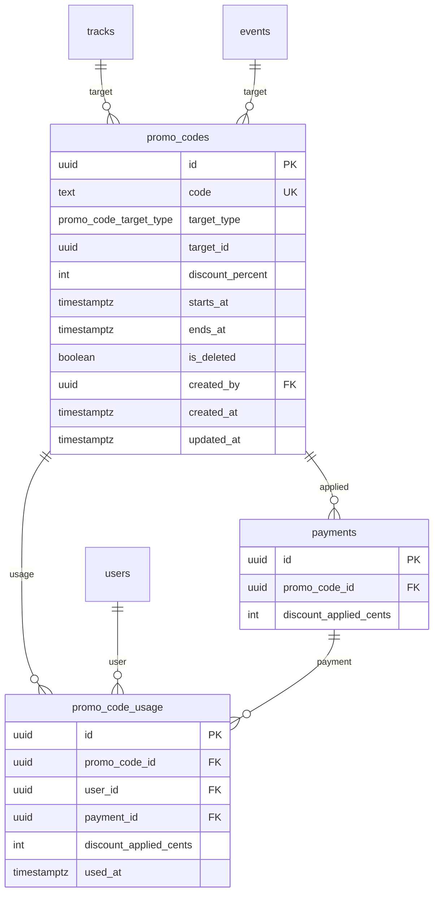

# Promo Code System - Implementation Plan

**Date:** 2026-02-03
**Feature:** Discount codes for tracks and standalone events
**Approach:** MVP-first, no over-engineering, following existing patterns

---

## Requirements Summary

| Aspect | Decision |
|--------|----------|
| Code format | Admin-typed, globally unique, case-sensitive |
| Discount | Percentage only (1-99%, no 100%) |
| Target | One code = one track OR one standalone event |
| Validity | Start date + end date |
| Limits | None — works until expiry |
| Admin UI | Standalone page with table + detail view |
| Roles | Owner/Admin: full CRUD, Manager: no delete |
| User UI | Stripe-style expandable input near price |
| Price display | Original crossed out + new price |
| Stacking | No — one code per purchase |
| Tracking | Store each usage + reference on booking |
| Editing | Code name & target locked after creation |
| Deletion | Soft delete |

---

## Database Schema

### New Tables

```sql
-- Enum for target type
CREATE TYPE promo_code_target_type AS ENUM ('track', 'event');

-- Main promo codes table
CREATE TABLE promo_codes (
  id UUID PRIMARY KEY DEFAULT gen_random_uuid(),
  code TEXT NOT NULL,
  target_type promo_code_target_type NOT NULL,
  target_id UUID NOT NULL,
  discount_percent INTEGER NOT NULL CHECK (discount_percent >= 1 AND discount_percent <= 99),
  starts_at TIMESTAMPTZ NOT NULL,
  ends_at TIMESTAMPTZ NOT NULL,
  is_deleted BOOLEAN NOT NULL DEFAULT FALSE,
  created_by UUID REFERENCES users(id) ON DELETE SET NULL,
  created_at TIMESTAMPTZ NOT NULL DEFAULT NOW(),
  updated_at TIMESTAMPTZ NOT NULL DEFAULT NOW()
);

-- Unique code constraint (only for non-deleted)
CREATE UNIQUE INDEX promo_codes_code_unique ON promo_codes(code) WHERE is_deleted = FALSE;
CREATE INDEX promo_codes_target_idx ON promo_codes(target_type, target_id);
CREATE INDEX promo_codes_active_idx ON promo_codes(starts_at, ends_at);

-- Usage tracking table
CREATE TABLE promo_code_usage (
  id UUID PRIMARY KEY DEFAULT gen_random_uuid(),
  promo_code_id UUID NOT NULL REFERENCES promo_codes(id) ON DELETE CASCADE,
  user_id UUID NOT NULL REFERENCES users(id) ON DELETE CASCADE,
  payment_id UUID REFERENCES payments(id) ON DELETE SET NULL,
  discount_applied_cents INTEGER NOT NULL,
  used_at TIMESTAMPTZ NOT NULL DEFAULT NOW()
);

CREATE INDEX promo_code_usage_code_idx ON promo_code_usage(promo_code_id);
CREATE INDEX promo_code_usage_user_idx ON promo_code_usage(user_id);

-- Add to payments table
ALTER TABLE payments ADD COLUMN promo_code_id UUID REFERENCES promo_codes(id) ON DELETE SET NULL;
ALTER TABLE payments ADD COLUMN discount_applied_cents INTEGER;
```

---

## Backend Tasks

### B0000001: Create Database Migration

**File:** `server/drizzle/XXXX_add_promo_codes.sql`

**Subtasks:**
- [ ] Add `promoCodeTargetTypeEnum` to schema
- [ ] Create `promoCodes` table with indexes
- [ ] Create `promoCodeUsage` table with indexes
- [ ] Alter `payments` table: add `promoCodeId`, `discountAppliedCents`

**Verification:** `npm --prefix server run db:migrate` succeeds

---

### B0000002: Create Promo Code Validation Service

**File:** `server/src/services/promoCodes.ts`

**Subtasks:**
- [ ] `validatePromoCode(code, targetType, targetId)` → returns promo record or throws
  - Error codes: `PROMO_CODE_NOT_FOUND`, `PROMO_CODE_INVALID_TARGET`, `PROMO_CODE_EXPIRED`, `PROMO_CODE_NOT_STARTED`
- [ ] `applyPromoDiscount(basePriceCents, discountPercent)` → returns discounted cents
- [ ] `recordPromoCodeUsage(promoCodeId, userId, paymentId, discountAppliedCents, tx?)` → inserts usage record

**Learnings Applied:**
- Use `tx` param for transaction support (from database-safety-patterns.md)
- Validate UUID format before queries (from uuid-parameter-validation.md)

---

### B0000003: Modify calculatePrice() for Promo Codes

**File:** `server/src/routes/api/payments.ts` (line ~201)

**Subtasks:**
- [ ] Add optional `promoCode?: string` parameter
- [ ] If promo provided AND basePrice > 0:
  - Call `validatePromoCode()`
  - Calculate promo discount
  - **Take HIGHER of subscriber OR promo discount** (not both)
- [ ] Return: `{ amountCents, promoCodeId?, discountAppliedCents?, discountSource? }`

**Key Logic:**
```typescript
if (promoCode && basePrice > 0 && itemType !== 'subscription') {
  const promo = await validatePromoCode(promoCode, itemType, itemId);
  const promoDiscountCents = Math.round(basePrice * (promo.discountPercent / 100));
  const subscriberDiscountCents = isSubscriber ? Math.round(basePrice * (discountPercent / 100)) : 0;

  // Take the HIGHER discount
  if (promoDiscountCents >= subscriberDiscountCents) {
    return {
      amountCents: basePrice - promoDiscountCents,
      promoCodeId: promo.id,
      discountAppliedCents: promoDiscountCents,
      discountSource: 'promo'
    };
  }
}
// Fall through to subscriber discount logic
```

---

### B0000004: Update Checkout Endpoint

**File:** `server/src/routes/api/payments.ts` (checkout handler)

**Subtasks:**
- [ ] Add `promoCode: z.string().max(50).optional()` to `checkoutSchema`
- [ ] Pass `promoCode` to `calculatePrice()`
- [ ] Store `promoCodeId` and `discountAppliedCents` on payment record
- [ ] Validate promo BEFORE creating reservation (fail fast)

**Learnings Applied:**
- Validate before reservation to avoid holding capacity for invalid codes (from payment-gateway-lessons-learned.md)

---

### B0000005: Update processSuccessfulPayment()

**File:** `server/src/routes/api/payments.ts` (line ~379)

**Subtasks:**
- [ ] If `payment.promoCodeId` exists, call `recordPromoCodeUsage()` in transaction
- [ ] Use `tx` context for atomicity

**Learnings Applied:**
- All related operations in `db.transaction()` (from drizzle-transaction-atomicity.md)

---

### B0000006: Update Price Preview Endpoint

**File:** `server/src/routes/api/payments.ts` (GET /payments/price-preview)

**Subtasks:**
- [ ] Add optional `promoCode` query param
- [ ] Return: `promoApplied`, `promoDiscountPercent`, `originalAmountCents`, `promoError?`
- [ ] Don't throw on invalid promo — return error in response for UI preview

---

### B0000007: Create Admin Promo Code Routes

**File:** `server/src/routes/api/promoCodes.ts` (NEW)

**Endpoints:**
| Method | Path | Auth | Description |
|--------|------|------|-------------|
| GET | /promo-codes | Manager+ | List all codes with pagination |
| GET | /promo-codes/:id | Manager+ | Detail with usage history |
| POST | /promo-codes | Manager+ | Create code |
| PUT | /promo-codes/:id | Manager+ | Update (dates/percent only) |
| DELETE | /promo-codes/:id | Admin+ | Soft delete |

**Subtasks:**
- [ ] Create Zod schemas for create/update
- [ ] Validate standalone event (no row in trackEvents)
- [ ] Use `requireManager()` for read/create/update
- [ ] Use `requireAdmin()` for delete
- [ ] Validate UUID params (from uuid-parameter-validation.md)
- [ ] Return usage count in list response

---

### B0000008: Register Promo Code Routes

**File:** `server/src/routes/api/index.ts`

**Subtasks:**
- [ ] Import and register `registerPromoCodeRoutes(api)`

---

## Frontend Tasks

### F0000001: Create Promo Code API Client

**File:** `src/app/api/promoCodes.ts` (NEW)

**Subtasks:**
- [ ] Define types: `PromoCode`, `PromoCodeUsage`, request/response types
- [ ] Implement: `fetchPromoCodes`, `fetchPromoCode`, `createPromoCode`, `updatePromoCode`, `deletePromoCode`
- [ ] Field mapping for camelCase/snake_case (from api-response-field-mapping.md)

---

### F0000002: Create Promo Code Hooks

**File:** `src/app/hooks/usePromoCodes.ts` (NEW)

**Subtasks:**
- [ ] `usePromoCodes(filters)` — TanStack Query for list
- [ ] `usePromoCode(id)` — single code detail
- [ ] `useCreatePromoCode()` — mutation
- [ ] `useUpdatePromoCode()` — mutation
- [ ] `useDeletePromoCode()` — mutation

---

### F0000003: Update usePricePreview Hook

**File:** `src/app/hooks/usePayments.ts`

**Subtasks:**
- [ ] Accept optional `promoCode` parameter
- [ ] Return promo-related fields from API

---

### F0000004: Create PromoCodeInput Component

**File:** `src/shared/components/payment/PromoCodeInput.tsx` (NEW)

**States:** collapsed → expanded → loading → applied/error

**Props:**
```typescript
interface PromoCodeInputProps {
  onApply: (code: string) => void;
  onRemove: () => void;
  appliedCode?: string;
  error?: string;
  isLoading?: boolean;
  disabled?: boolean;
}
```

**UI (Stripe-style):**
```
Collapsed:  [Have a promo code?]
Expanded:   [______________] [Apply]
Loading:    [______________] [...]
Applied:    [SUMMER25] [x Remove]
Error:      [______________] [Apply]
            Code not valid for this track
```

---

### F0000005: Update PriceDisplayCard

**File:** `src/shared/components/payment/PriceDisplayCard.tsx`

**Subtasks:**
- [ ] Accept: `promoApplied?`, `originalAmountCents?`
- [ ] When promo applied: ~~original~~ → discounted price

---

### F0000006: Update PaymentCheckoutDialog

**File:** `src/shared/components/payment/PaymentCheckoutDialog.tsx`

**Subtasks:**
- [ ] Add `appliedPromoCode` state
- [ ] Add `PromoCodeInput` component
- [ ] Re-fetch price preview when promo applied/removed
- [ ] Pass `promoCode` to `createCheckout`

---

### F0000007: Add Promo Input to TrackDetail

**File:** `src/features/tracks/pages/TrackDetail.tsx`

**Location:** After `PriceDisplayCard` (line ~395), before Book button

**Subtasks:**
- [ ] Add promo code state
- [ ] Add `PromoCodeInput` component
- [ ] Validate via price preview endpoint
- [ ] Pass to `PaymentCheckoutDialog`

---

### F0000008: Add Promo Input to EventDetail

**File:** `src/features/events/pages/EventDetail.tsx`

**Location:** After `PriceDisplayCard` (line ~399), before Register button

**Subtasks:**
- [ ] Same as F0000007
- [ ] Only show for standalone events (check trackInfo is null)

---

### F0000009: Create Admin Promo Codes Page

**File:** `src/pages/admin/promo-codes.tsx` (NEW)

**Layout:**
- Header with "Create Promo Code" button
- Stats: total codes, active, expired, total uses
- Filter: status dropdown, search input
- Table columns: Code | Target | Discount | Valid From | Valid Until | Uses | Status | Actions

**Subtasks:**
- [ ] Wrap in `AdminProtectedRoute allowedRoles={['owner', 'admin', 'manager']}`
- [ ] Use `useRolePermissions()` for delete button visibility
- [ ] Follow pattern from `invitations/index.tsx`

---

### F0000010: Create Promo Code Form Pages

**Files:** `src/pages/admin/promo-codes/new.tsx`, `src/pages/admin/promo-codes/edit/[id].tsx`

**Form Fields:**
- Code input (disabled on edit)
- Target type select: Track / Standalone Event (disabled on edit)
- Target select: dropdown (disabled on edit)
- Discount percent: 1-99 input
- Start date picker
- End date picker

---

### F0000011: Create Promo Code Detail Page

**File:** `src/pages/admin/promo-codes/[id].tsx`

**Sections:**
- Code info card
- Usage history table: User | Date | Booking | Discount Applied
- Edit/Delete buttons (role-gated)

---

### F0000012: Add Admin Routes

**File:** Router config

**Routes:**
- `/admin/promo-codes` → list page
- `/admin/promo-codes/new` → create form
- `/admin/promo-codes/:id` → detail page
- `/admin/promo-codes/edit/:id` → edit form

---

### F0000013: Add Sidebar Link

**File:** Admin sidebar component

**Subtasks:**
- [ ] Add "Promo Codes" link with Tag icon
- [ ] Visible for manager+ roles

---

## Critical Files Reference

| File | Changes |
|------|---------|
| `server/src/db/schema/index.ts` | Add promoCodes, promoCodeUsage tables |
| `server/src/routes/api/payments.ts` | Modify calculatePrice(), checkout, fulfillment |
| `server/src/routes/api/promoCodes.ts` | NEW: Admin CRUD routes |
| `server/src/services/promoCodes.ts` | NEW: Validation service |
| `src/shared/components/payment/PromoCodeInput.tsx` | NEW: User input component |
| `src/pages/admin/promo-codes.tsx` | NEW: Admin list page |
| `src/features/tracks/pages/TrackDetail.tsx` | Add promo input |
| `src/features/events/pages/EventDetail.tsx` | Add promo input |

---

## Learnings Applied (Second-Order Thinking)

1. **Transaction atomicity** — All multi-table ops in `db.transaction()`
2. **Validate before reserving** — Check promo before creating capacity hold
3. **Subscriber vs Promo** — Take HIGHER discount, don't stack
4. **Free items** — Skip promo for basePrice === 0
5. **UUID validation** — 400 error before DB query
6. **Field mapping** — Explicit camelCase ↔ snake_case in API client
7. **Soft delete** — Preserve history for booking references

---

## Verification Steps

1. **Backend Unit Tests:**
   - `validatePromoCode()` returns correct errors
   - `calculatePrice()` takes higher of subscriber/promo
   - Checkout stores promo info on payment

2. **Integration Tests:**
   - Full flow: create code → apply on detail page → checkout → payment → usage recorded
   - Error flows: expired, wrong target, non-existent

3. **Manual Testing:**
   - Admin: create, edit, delete codes
   - User: apply code on track, see discount, complete payment
   - Manager: cannot delete codes

---

## ERD Diagram


